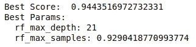
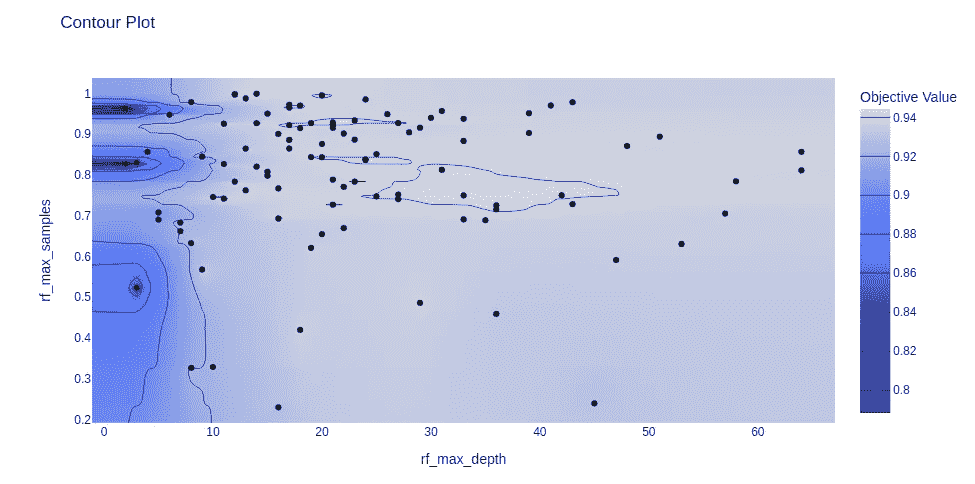
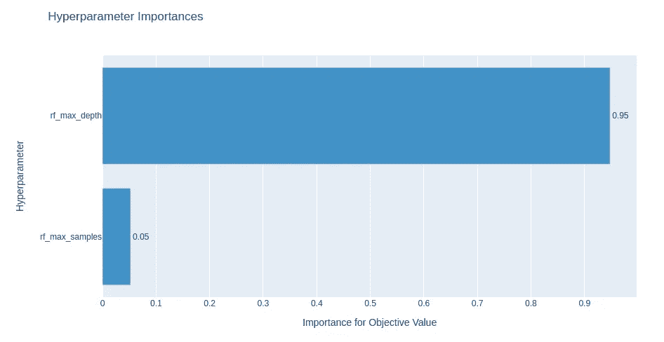
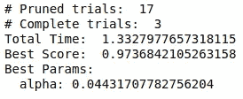
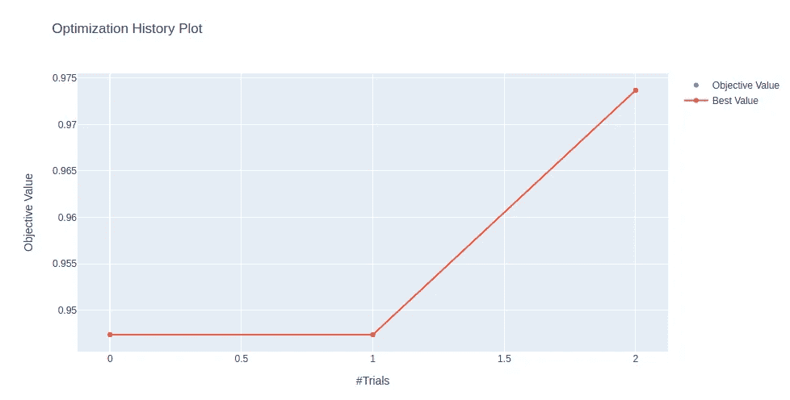
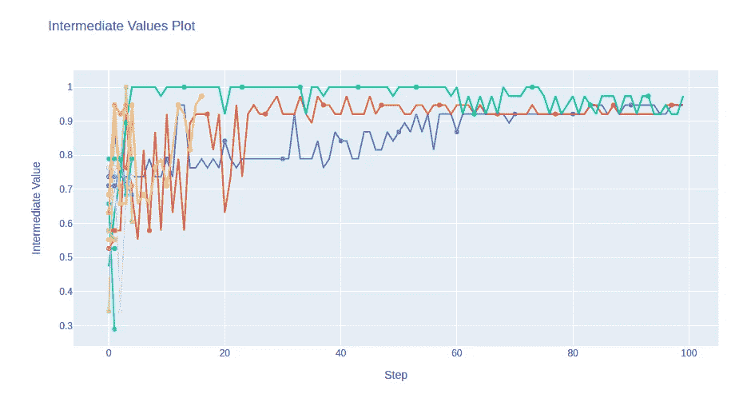

# 用 Optuna 优化最先进的机器学习超参数

> 原文：<https://towardsdatascience.com/state-of-the-art-machine-learning-hyperparameter-optimization-with-optuna-a315d8564de1>

## Optuna 是一个高级的超参数优化框架，具有可视化的可解释性


在 [Unsplash](https://unsplash.com?utm_source=medium&utm_medium=referral) 上拍摄的 [ThisisEngineering RAEng](https://unsplash.com/@thisisengineering?utm_source=medium&utm_medium=referral)

# 介绍

在本文中，我们将讨论 Optuna，这是一个超参数优化软件框架，专门为机器学习管道而设计。Optuna 使用户能够采用最先进的算法对超参数进行采样，并删除没有希望的试验。与 GridSearch 等传统方法相比，这有助于大大加快优化时间和性能。它还允许用户绘制优化历史，以便更好地理解模型。

在我们开始之前，让我们简单回顾一下超参数，并讨论一下传统优化方法和可以在 Optuna 框架中应用的最新、更先进的优化方法之间的区别。

# 超参数概述

超参数是控制机器学习模型学习过程的变量。它们最终决定了模型如何学习输入和预测之间的特定关系。

一个非常简单的例子是，是否“将截距固定到简单的线性回归上”是线性回归模型的超参数。


由[斯潘塞·阿奎迈德斯](https://unsplash.com/@spencerarquimedes?utm_source=medium&utm_medium=referral)在 [Unsplash](https://unsplash.com?utm_source=medium&utm_medium=referral) 拍摄

优化模型的超参数以解决特定问题通常是必要的。以下是一些原因:

*   机器学习超参数**不是万能的**，因为这些模型可能需要不同的约束来概括不同的样本外数据模式和不同的问题。
*   超参数优化允许我们**使用最佳超参数集生成最优模型**。该模型应该能够给出使损失函数最小化的**最优结果。**

# 优化方法概述

优化问题的问题在于，搜索空间通常是不确定的，并且执行这种搜索的预算是受限的(最多 x 次时间或迭代)。因此，为了有效地搜索全局最小值，算法必须实现有效利用预算的方法。

## 传统方法


在 [Unsplash](https://unsplash.com?utm_source=medium&utm_medium=referral) 上 [NeONBRAND](https://unsplash.com/@neonbrand?utm_source=medium&utm_medium=referral) 拍摄的照片

执行超参数优化的传统方式是穷尽的，并且不了解先前的信息。一些例子是:

*   ***网格搜索*** ，穷尽搜索预定义的子集。
*   **随机搜索**从预定义的子集中随机选择。

随着数据量和超参数空间的增长，一些传统的搜索方法迅速退化。他们要么花太多时间，要么甚至找不到最小值。

## 贝叶斯方法


马修·安斯利在 [Unsplash](https://unsplash.com?utm_source=medium&utm_medium=referral) 上的照片

贝叶斯优化方法通过迭代地建立从超参数值到目标函数的函数映射的**概率模型**来搜索**全局优化**。概率模型**捕获关于函数**行为的信念，以形成目标函数的后验分布。

之后，进一步使用后验分布来形成**获取函数**，该函数确定具有**最佳改进概率**的下一点。

然而，当它使用可用的信息来做决定时，一个探索与开发的问题就出现了。

*   **探索**类似于全局搜索；我们有兴趣探索超参数搜索空间，寻找更好的解决方案。
*   **利用**类似于本地搜索；我们希望改进我们当前的解决方案，并尽量避免在不必要的搜索空间上浪费宝贵的资源。

然后提出了多种算法来最佳地平衡勘探-开发的困境。一些例子是:树形结构的 Parzen 估计器(TPE)和高斯过程回归器，例如克里金法。

## 早期停止方法


照片由[安瓦尔·阿里](https://unsplash.com/@cinematicphoto?utm_source=medium&utm_medium=referral)在 [Unsplash](https://unsplash.com?utm_source=medium&utm_medium=referral) 上拍摄

基于早期停止的超参数优化算法使用**统计测试来丢弃表现不佳**且不包含全局最小值的搜索空间。

它的工作原理是**用一组特定的超参数检查模型**的中间分数。例如，在训练神经网络时，假设为网络选择了 16 组不同的超参数。在五个 epoches 之后，我们检查所有的中间分数并丢弃那些表现差的超参数。

两种流行早期停止优化算法是连续减半(SHA)和超带。

然而，对于不产生中间结果的模型，不使用基于提前停止的方法是可行的。

## 进化方法


由 [Johannes Plenio](https://unsplash.com/@jplenio?utm_source=medium&utm_medium=referral) 在 [Unsplash](https://unsplash.com?utm_source=medium&utm_medium=referral) 上拍摄的照片

进化优化方法使用进化算法搜索超参数空间。这种方法受到了查尔斯·达尔文进化论的启发。它通常遵循一个遵循**生物进化概念**的过程:

*   从群体超参数搜索空间中抽取初始样本。
*   使用**适应度函数**和按照相对适应度排序的来评估超参数。
*   **表现最差的**超参数被**丢弃**，通过**交叉**和**变异**生成新的超参数集。
*   进化过程重复进行，直到出现预算限制或性能没有改善。

# 介绍一下，奥普图纳。


照片由[戴恩·托普金](https://unsplash.com/@dtopkin1?utm_source=medium&utm_medium=referral)在 [Unsplash](https://unsplash.com?utm_source=medium&utm_medium=referral) 上拍摄

Optuna 是一个超参数优化软件框架，能够轻松实现不同的最先进的优化方法，以高性能快速执行超参数优化。

默认情况下，Optuna 实现了一个贝叶斯优化算法(TPE ),但它可以很容易地切换到包中的其他现有算法。

# Optuna 中的优化算法

Optuna 将其优化算法分为两个不同的类别，即采样策略和修剪策略。

*   **采样策略:**通过集中在超参数给出更好结果的区域来选择最佳参数组合的算法。
*   **修剪策略:**基于早期停止的优化方法如我们上面讨论的。

我们将简要讨论上一节中讨论的三种算法类型的一个示例背后的直觉，以便我们可以对这些算法如何工作有一个大致的了解。

然而，我们不会太深入，因为这需要一些时间来解释。这些算法都很容易在包中定义，并可用于生产。

## 抽样策略


米兰·塞特勒在 [Unsplash](https://unsplash.com?utm_source=medium&utm_medium=referral) 上拍摄的照片

## TPESampler(树形结构 Parzen 估计器):

一种**贝叶斯**优化算法，即:

1.  首先，随机选择超参数的子集，并根据它们的分数对它们进行排序。
2.  基于一些预定义的分位数，超参数被进一步分成两组。
3.  然后使用 Parzen 估计器(核密度估计器)将这两个组建模为估计的密度l(x1)和 g(x2)。
4.  找到具有最高预期改进的超参数[最低 l(x1)/g(x2)]。
5.  具有最高预期改进的超参数被再次评估、排序和划分。这个过程重复进行，直到预算完成，并返回最佳超参数。

## 非支配排序遗传算法 II

一种多目标函数的**进化**优化算法。

一个个体(A)被称为支配另一个个体(B)，如果

*   A 目标没有比 B 的目标更坏的了
*   至少有一个 A 目标比 b 的目标更好

算法的主要过程:

1.  最初，随机的亲代群体被采样，并且每个被评估的解被分配一个与其非支配水平相等的适合度等级。它首先从种群 P 中选择所有的非支配解并将它们分配到等级 1，然后从剩余的解中选择所有的解并将它们分配到等级 2，依此类推，直到所有的个体都被分配到一个等级。
2.  挑选两个随机试验，较好的一个成为亲本 1。重复该过程一次以选择另一个亲代 2 [ **二元锦标赛选择** ]。
3.  这两个父母重组产生后代，这些后代进入子群体。子进程经历了突变，并改变了它的一些值[ **突变** ]。重复此步骤，直到您拥有两倍的初始群体规模。
4.  再次根据非支配性对种群进行排序。新一代将按排名顺序选出。如果下一代只包括部分特定的等级，将执行拥挤排序来计算解的密度。不太密集的试验被选择到下一代中，直到群体计数再次达到初始群体大小。
5.  新的一代被重复产生并再次被丢弃，直到满足最大数量的代，并且最佳超参数将被返回。

其他一些流行的采样策略: **CMA-ES 采样器，MOTPE 采样器**

## 剪枝策略


[水晶乔](https://unsplash.com/@crystalsjo?utm_source=medium&utm_medium=referral)在 [Unsplash](https://unsplash.com?utm_source=medium&utm_medium=referral) 上拍照

## SuccessiveHalvingPruner(异步连续减半)

1.  随机选择一组初始超参数值。
2.  训练 1 个时期的试验，直到达到定义的最大试验次数。
3.  同时，每当试验的分数在梯级内的前 d 个百分比中时，试验被同时提升到另一个梯级(类似于等级)以训练更多的时期，其中 d 是预定义的除数。

注意，这不同于同步连续减半，在同步连续减半中，算法等待一个梯级中所有定义的试验完成它们的时期，然后才决定哪些试验具有要提升的最高分数，以在另一个梯级中训练更多的时期。

其他一些流行的修剪策略: **MedianPruner，HyperbandPruner**

# 代码实现


由 [Clément Hélardot](https://unsplash.com/@clemhlrdt?utm_source=medium&utm_medium=referral) 在 [Unsplash](https://unsplash.com?utm_source=medium&utm_medium=referral) 上拍摄

## 目标函数

在我们开始用 Optuna 实现优化之前，它要求我们定义一个目标函数。
目标函数将包含常规模型定义、训练和测试过程的全部逻辑。在模型评估之后，它应该返回评估指标，这也是由用户选择的。

## 审判

试用类将用于存储机器学习模型稍后使用的超参数的一个特定组合的信息。

```
import optuna
import sklearn
from sklearn.ensemble import RandomForestClassifier
from sklearn.model_selection import cross_val_scoredef objective(trial):
    digits = sklearn.datasets.load_digits()
    x, y = digits.data, digits.target max_depth = trial.suggest_int("rf_max_depth", 2, 64, log=True)
    max_samples = trial.suggest_float("rf_max_samples", 0.2, 1)

    rf_model = RandomForestClassifier(
        max_depth = max_depth,
        max_samples = max_samples,
        n_estimators = 50,
        random_state = 42)score = cross_val_score(rf_model, x, y,  cv=3).mean()return score
```

## 这项研究

然后可以调用研究对象来优化目标函数，以找到最佳的超参数组合。然后，它将反复运行试验，直到用户定义的最大试验或时间。具有最佳超参数的试验将存储在 study.best_trial 中。

```
study = optuna.create_study(direction = "maximize")
study.optimize(objective, n_trials = 100)trial = study.best_trial
print("Best Score: ", trial.value)
print("Best Params: ")
for key, value in trial.params.items():
    print("  {}: {}".format(key, value))
```



作者输出的代码

之后，我们可以继续在 Optuna 包中绘制一些可视化图形，以理解超参数之间的关系。

```
optuna.visualization.plot_contour(study)
```



作者的等高线图图像

```
optuna.visualization.plot_param_importances(study)
```



作者绘制的超参数重要性图

我们可以看到，影响模型性能的主要超参数是 max_depth。在等高线图中，随着最大深度的增加，无论 max_samples 如何，性能都会提高。

## 实施修剪

在机器学习模型不产生任何中间结果的许多情况下，修剪实现不是很实际。但是，对于存在中间值的情况，如神经网络，修剪是减少计算时间的一种很好的技术。

具有中间结果的模型的一个例子是随机梯度下降。

首先，我们初始化一个目标函数。

```
import optuna
from optuna.pruners import SuccessiveHalvingPruner
from optuna.samplers import TPESampler
from sklearn.model_selection import train_test_split
from sklearn.datasets import load_iris
from sklearn.linear_model import SGDClassifierdef objective(trial):# Loading the data set and splitting into train, test sets
    iris = load_iris()
    classes = list(set(iris.target))
    train_x, valid_x, train_y, valid_y = train_test_split(
        iris.data, iris.target, test_size=0.25
    ) # Prompting Optuna to suggest a hyperparameter value
    alpha = trial.suggest_float("alpha", 1e-5, 1e-1, log=True) sgd = SGDClassifier(alpha = alpha, random_state = 42) # Report the intermediate score for every step
    for step in range(100):
        sgd.partial_fit(train_x, train_y, classes=classes) # Report the intermediate objective value.
        intermediate_value = sgd.score(valid_x, valid_y)
        trial.report(intermediate_value, step) # Prune the intermediate value if neccessary.
        if trial.should_prune():
            raise optuna.TrialPruned() return sgd.score(valid_x, valid_y)
```

之后，我们可以使用 Optuna 创建一个研究，并优化目标函数。

```
study = optuna.create_study(sampler = TPESampler(), 
                            pruner = SuccessiveHalvingPruner(),
                            direction= "maximize")study.optimize(objective, n_trials = 20) pruned_trials = study.get_trials(states=[optuna.trial.TrialState.PRUNED])
complete_trials = study.get_trials(states=[optuna.trial.TrialState.COMPLETE])
print("# Pruned trials: ", len(pruned_trials))
print("# Complete trials: ", len(complete_trials))trial = study.best_trial
print("Best Score: ", trial.value)
print("Best Params: ")
for key, value in trial.params.items():
    print("  {}: {}".format(key, value))
```



作者输出的代码

我们将看到 Optuna 提供的另外两个图。这些图可以帮助我们检查优化历史，并查看哪些试验被删除。

```
optuna.visualization.plot_optimization_history(study)
```



作者的优化历史图

```
optuna.visualization.plot_intermediate_values(study)
```



我们可以看到剪枝器是如何通过停止具有不良中间值的不需要的超参数并专注于训练更好的超参数来工作的。

# 外卖食品

Optuna 允许我们实现最先进的优化算法，以加快机器学习管道中必不可少的超参数调整过程。

然而，我们必须明白，当迭代模型训练过程的成本过于昂贵时，这些高级算法是为了有效地搜索最佳目标而构建的。

*   如果我们只使用少量数据进行训练，同时使用不太复杂的模型，GridSearch 和 RandomSearch 就有可能在速度和性能方面击败这些算法。
*   也就是说，随着数据量越来越大，模型越来越复杂，在没有任何信息的情况下随机训练一组超参数的成本会大大增加，这些先进的算法大大优于传统方法。

非常感谢您花时间阅读这篇文章。


刘汉宁·奈巴霍在 [Unsplash](https://unsplash.com?utm_source=medium&utm_medium=referral) 上的照片

# 参考

**【1】**秋叶 t、佐野 s、柳濑 t、太田 t、小山 m。 [Optuna:下一代超参数优化框架](https://arxiv.org/abs/1907.10902) (2019) *，arXiv* 。

**【2】**l .李，k .贾米森，a .罗斯塔米扎德，e .戈尼娜，m .哈特，b .雷希特，a .塔尔瓦尔卡尔。[大规模并行超参数调优系统](https://arxiv.org/abs/1810.05934) (2018) *，arXiv* 。

j .伯格斯特拉，r .巴登内，y .本吉奥和 b .凯格尔。[超参数优化算法](https://proceedings.neurips.cc/paper/2011/file/86e8f7ab32cfd12577bc2619bc635690-Paper.pdf) (2011)，《第 24 届国际神经信息处理系统会议录》(NIPS'11)。美国纽约州红钩市柯伦联合有限公司，邮编:2546–2554。

**【4】**k . Deb，A. Pratap，S. Agarwal 和 T. Meyarivan，[一种快速的精英多目标遗传算法:NSGA-II](https://ieeexplore.ieee.org/document/996017) (2002)， *IEEE 进化计算汇刊*，第 6 卷，第 2 期，第 182–197 页。doi: 10.1109/4235.996017。