# 用 ANOVA (Stat-11)进行多组间的统计比较

> 原文：<https://towardsdatascience.com/statistical-comparison-among-multiple-groups-with-anova-d4ac27f6e59e>

## 你是否在考虑如何在多个组之间进行比较？别担心！用方差分析就行了


艾萨克·史密斯在 [Unsplash](https://unsplash.com?utm_source=medium&utm_medium=referral) 上拍摄的照片

## 动机

作为一名数据科学爱好者，我总是喜欢在同伴之间传播知识。一个晴朗的早晨，我正在主持一个关于数据科学统计学的会议，主题是假设检验、z 检验、学生 t 检验、p 值等。我的一个学生注意到所有的测试都是为了比较/分析两组而做的。出于好奇，他问我:“你提到的所有测试都可以在两组之间进行比较。但是，如果我有三个或更多的组，我如何在组之间进行比较分析。”我很高兴听到这个问题，因为他的分析能力给我留下了深刻的印象。在那之后，我静静地站了一会儿，同时想到有一个叫 ANOVA 的测试可以解决你的问题。然而，我已经很久没有研究过方差分析测试了。这就是我当时没有回忆 ANOVA 过程的原因。所以，我告诉这位学生，我将在下节课讲授方差分析。现在，我觉得每个数据科学爱好者和从业者都应该对 ANOVA 测试有明确的了解。下面的文章将讨论这个测试。

## 方差分析的简要介绍和使用案例

**ANOVA** 代表**a**分析 **O** F **VA** 方差。根据维基百科—

> **方差分析** ( **ANOVA** )是统计模型及其相关估计程序(如组内和组间的“变异”)的集合，用于分析均值间的差异[1]。

如果我想用更简单的形式来表达方差分析，我可以说它是一个统计测试，通过它我们可以显示两个或多个总体均值是否相等。

在发明 ANOVA 技术之前，拉普拉斯和高斯使用不同的方法来比较多个组。后来，1918 年罗纳德·费雪在他的文章《*孟德尔遗传假设下的亲缘关系》中引入了方差这一术语[2]。*1921 年，罗纳德·费雪发表了 ***方差分析****【3】*并在 1925 年包括他的著作《*研究工作者的统计方法》【1】后盛极一时。***

*大多数时候，我们无法做出决定；我应该在哪里使用哪种统计技术？所以，我会提到一些现实生活中的例子，我们可以使用方差分析测试。一些用法如下—*

1.  *假设你选择三个由 20 名学生组成的小组，并指派三名教师进行统计课。在学期末，你计算每组学生的平均成绩。现在，你可以比较两组的平均结果是否有显著差异。你可以根据测试来决定哪位老师的表现最好。*
2.  *一个大型农场想知道三种不同肥料中哪一种能产生最高的作物产量。他们将每种肥料撒在十块不同的土地上，并在生长季节结束时测量总产量。为了了解这三种肥料的平均产量是否有统计学上的显著差异，研究人员可以进行方差分析测试[4]。*
3.  *一家医药公司为一种特定疾病生产四种药物，并将它们应用于 20 名患者，以了解成功率。方差分析测试可以帮助公司决定哪种药物优于其他药物，这样他们就可以继续生产最好的药物。*
4.  *生物学家想知道不同程度的阳光照射(无阳光、低阳光、中等阳光、高阳光)和浇水频率(每天、每周)如何影响特定植物的生长。在这种情况下，涉及两个因素(阳光照射水平和浇水频率)，因此他们将进行方差分析，以查看任一因素是否显著影响植物生长，以及这两个因素是否彼此相关[4]。*
5.  *一家产品制造公司有三个分支机构，但想要关闭利润较低的分支机构。分析师可以很容易地对月度或年度利润进行方差分析测试，并帮助公司做出正确的决策。*

*除了上面的使用案例，还有很多领域可以使用 ANOVA。*

*让我们来学习如何在现实生活中实现它。*

## *当需要 ANOVA 测试时*

*我们可以使用 z 检验和 t 检验来检验两个样本是否属于同一个总体。但是这两个测试不能回答三个或更多样本的问题。有趣的是，方差分析解决了这个问题，与方差分析相关的分布被称为“F 分布”。*

**如果你想了解 z-test 和 t-test，下面这篇文章也许能帮到你。**

*<https://medium.datadriveninvestor.com/all-you-need-to-know-about-hypothesis-testing-for-data-science-enthusiasts-30cfe1dce028>  

## f 分布

计算 f 分布是为了确定来自同一总体的两个样本是否具有不同的方差。在方差分析中，我们考虑两种类型的方差—

1.  各组之间的差异
2.  组内差异

(在接下来的章节中，您将对这两种差异有清晰的概念)

基本上，F 分布是所有可能的 F 值的组合[5]。 ***F*** 的值可以计算如下。

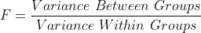

根据方差方程( *S* )，

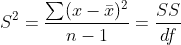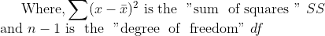

所以，总的公式是，

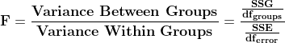

让我们看看 f 分布是什么样的。

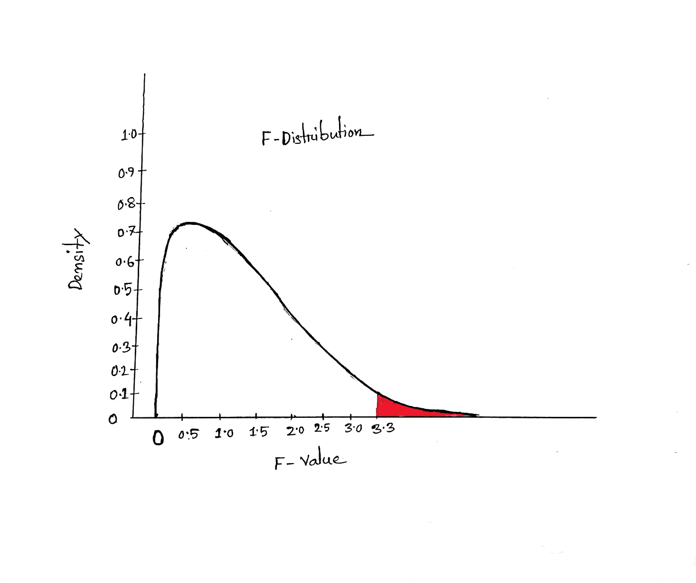

**样本 f 分布(图片由作者提供)**

F 分布是一种右偏分布，包含从 0 [6]开始的密度和 F 值。在 F 分布中，F 的最小值为零，不存在最大值[7]。上图红色阴影区域为拒绝区域(α值或显著水平)，3.3 为 f 的临界值。

到目前为止，我们已经介绍了实现 ANOVA 的所有基础知识。我们继续吧。

## 方差分析的一些预定义假设

方差分析检验[8]应满足以下假设

*   样本中的实验误差呈正态分布。
*   实验组样本相等。
*   观察样本是相互独立的。
*   所有的因变量应该是连续的。

## 方差分析的工作原理

默认情况下，ANOVA 假设所有样本组的平均值都相等。那么我们需要证明这个假设。所以，我们先取*和 ***替代假设*** *。**

****零假设:*** *样本组均值相等。**

****替代假设:*** *一个或多个群体的意思是与其他群体不同。**

*接下来，我们为我们的数据计算 ***F 值*** ，并将其与特定显著水平的标准 ***F 值****(F 的临界值)*进行比较。如果计算的 ***F 值*** 小于 ***F 临界*** ，我们可以说零假设被接受，因为它落在零假设区域内。否则，接受替代假设。*

## *方差分析的类型*

*当我们开始对总体的不同样本进行方差分析检验时，我们需要找到哪种检验适合我们的问题。根据问题的性质，方差分析主要有 ***两种*** 类型。*

****一、单因素方差分析****

****ii。双向方差分析****

*在下一节中，我们将用一个例子来解释这两种方差分析测试。*

## *单向方差分析*

*当我们需要测试一个独立变量的可变性时，我们使用单向 ANOVA。让我们看看下面的例子。*

*一家公司对不同的产品提供百分之一、百分之二和百分之三的折扣。给予折扣的主要目的是让顾客更快付款。现在，我们想使用 ANOVA 测试来检查公司的计划是否卓有成效。*

*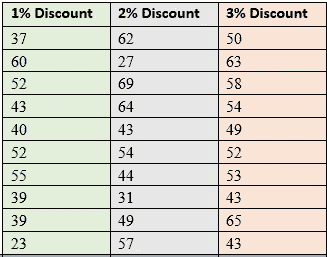*

*作者图片*

*这里， ***1%折扣，*2%折扣**和 ***3%折扣*** 是 3 个自变量。*

*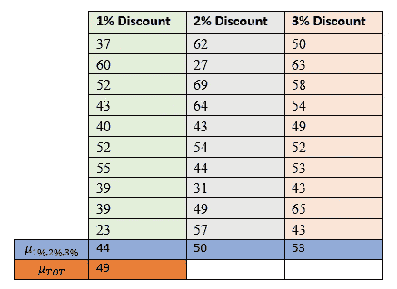*

*作者图片*

****μ*** 代表各变量的均值。 ***μTOT*** 表示所有变量的组合平均值。每个变量是一个单独的样本组。*

*首先，我们为假设设定假设。*

> ****零假设:*** *μ1% = μ2% = μ3%**
> 
> ****备选假设:*** 一个或多个组的均值不同。*

****(SSG 某广场组):****

*(***μ1%—μTOT***)*=(44—49)= 25**

**(****)μ2%—μTOT****)**=(50—49)= 1**

**(****μ3%—μTOT****)=(53—49)= 16**

*总和 *= (25+1+16) = 42。*现在，将项目数乘以总和，得到 *SSG* 。*

****SSG****=(42×10)= 420。**

****自由度组:****

*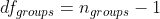*

*对于我们的数据，组数 *= 3* 。所以，自由度是*

****df****groups =(3–1)= 2。**

***误差平方和(SSE):***

*一组中每个值与该组平均值之间的差的总和。我们用上面的数据来论证一下。*

*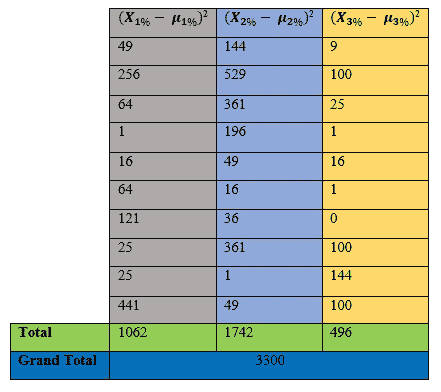*

*作者图片*

*所以， ***上证*** *= 3300。**

***误差的自由度:***

*误差自由度可通过以下公式计算—*

*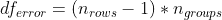*

*根据公式，对于我们的情况，误差的自由度，*

****df*** *误差**=(10–1)x3 = 27**

****F 值为我们的示例数据****

*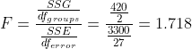*

****寻找 95%置信水平的临界值:****

*对于*95%的置信水平，显著水平***【α】***为 0.05。我们可以从标准的 ***F 分布*** 表中得到***F***的临界值为 0.05 显著水平， ***2*** 组自由度和 27 个误差自由度。*这里* 可以得到完整的 F-分布表 [***。***](http://www.socr.ucla.edu/Applets.dir/F_Table.html)**

**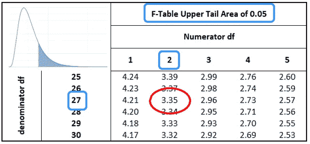**

**作者图片**

**由上表可知，临界 ***F 值*** 为 ***3.35*** 。**

****最终决定:****

****

**作者图片**

**这里 ***F*** 的计算值为**F 的临界值为***3.35******F 值(1.718)<F-临界(3.35)。*** 所以，计算值落在零假设区域，我们无法拒绝零假设。****

**现在，我们可以说公司不会因为提供不同产品的折扣而更快收到货款。**

**到目前为止，我们已经做了一些计算 F 值的烦人工作来证明我们的假设。幸运的是，python 已经提供了一些库，通过这些库，我们可以用几行代码计算 F 值和 F 临界值。**

## ****用 python 实现单向方差分析****

***让我们用 python 创建上面的数据集。***

```
**import pandas as pd
data=[[37,62,50],[60,27,63],[52,69,58],[43,64,54],[40,43,49],[52,54,52],[55,44,53],[39,31,43],[39,49,65],[23,57,43]]
table=pd.DataFrame(data,columns=['1% Discount','2% Discount','3% Discount'])**
```

**它将创建以下数据帧。**

**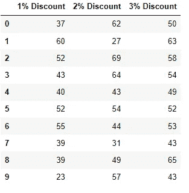**

**作者图片**

***可视化数据以深入了解数据集。***

**它将产生以下输出。**

**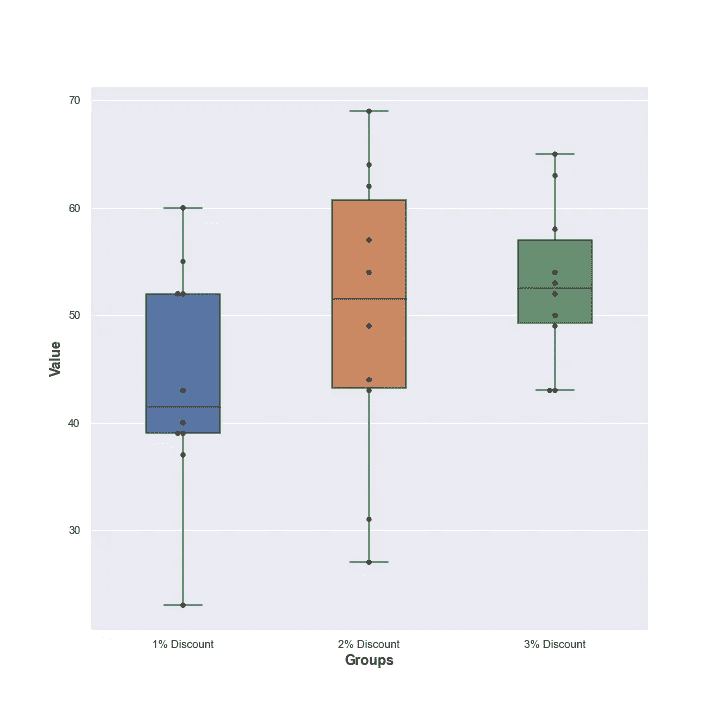**

**作者图片**

**箱线图显示各组平均值之间略有差异。让我们用几行代码找出最终的决定。**

*****结果*****

```
**The initiative of the company is not effective. Because F-value 1.718 is less than the critical value 3.354**
```

## ****双向方差分析****

**双向方差分析与单向方差分析略有不同。在单因素方差分析中，我们看到了一个独立变量之间的比较。但是双向方差分析帮助我们找到两个独立变量之间的比较。方差分析测试有两种类型。**

1.  ***无重复的双向方差分析***
2.  ***重复的双向方差分析***

****无重复方差分析****

**先说个例子。在前面的发票问题中，我们已经看到了如何只对一个自变量 ***折扣进行比较和决策。*** 如果我们想知道他们为哪张发票提供多少折扣，我们需要多加一个自变量， ***发票金额。*** 我们希望显示与我们之前的数据单因素方差分析问题相同的结果。我们的目标是显示提供折扣的举措是否有效。**

**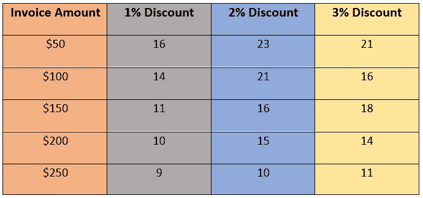**

**作者图片**

**在单因素方差分析中，我们只关心单个样本组的变异性。**

*****我们的假设与单向方差分析相同。*****

**因为我们想找出单个发票的可变性，我们需要考虑每个块(行)和每个样本组。所以，我们计算了每行的平均值和每列的平均值。计算如下所示。**

**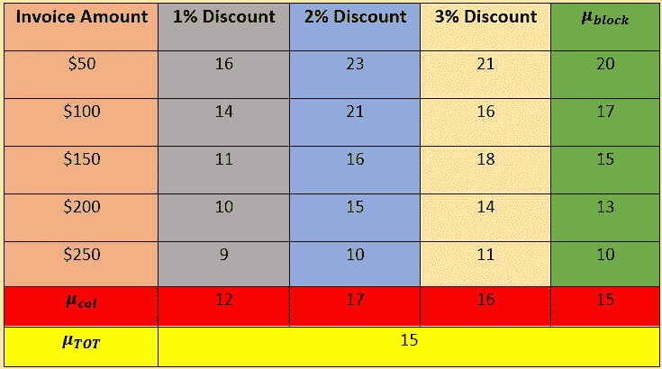**

**作者图片**

****部分方形组****

**它是单个样本组与总体平均值(***μ****TOT*)之差的总和。**

**(***μ****1%—****μ****TOT*)=(12–15)= 9**

**(***μ****1%——****μ****TOT*)=(17–15)= 4**

**(***μ****1%—****μ****TOT*)=(16–15)= 1**

**我们将通过相加并乘以样本大小来获得各组的平方和。**

**所以， ***SSG = (9+4+1) x 5 = 70。*****

*   ****组的自由度****

****

**根据公式，组的自由度=(3–1)= 2。**

**所以，***df****groups = 2。***

*   ****块的平方和(SSB)****

**块的平方和是每个块的平均值与总平均值之差的总和。**

**(***μ****50—****μ***TOT)=(20–15)= 25**

**(***μ****50—****μ****TOT*)=(20–15)= 4**

**(***μ****50—****μ****TOT*)=(20–15)= 0**

**(***μ****50—****μ***TOT)=(20–15)= 4**

**(***μ****50—****μ****TOT*)=(20–15)= 25**

**所以，***SSB****=(25+4+0+4+25)x3 = 174***

*   ****总平方和(SST)****

**总平方和可以计算如下—**

**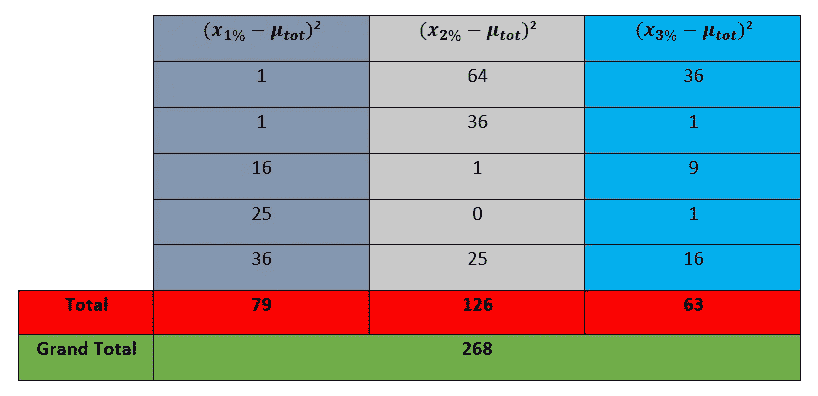**

**作者图片**

**所以， ***SST=268*****

*   ****误差平方和(SSE)****

*****SSE****=****SST****——****SSG****——****SSB****= 268—70—174 = 24***

*   ****自由度误差****

**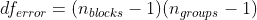**

**所以，对于我们的数据， ***df*** *误差=(5–1)x(3–1)= 8。***

*   ****F 值的计算****

**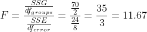**

**我们数据的计算 F 值为 11.67。现在，我们需要找出 F 的临界值来做决定。**

*   ****决定我们的问题****

**为了找到临界值，我们需要查找 F 表。在我们的例子中，我们假设标准置信水平为 95%。所以，显著性水平，**

****α =0.05。**自由度的组或分子**(***df****组*)是 2，自由度的误差或分母( ***df*** *误差*)是 8。如果我们在 F 表中查找 F 的值，我们会发现值是 **4.46** 。****

****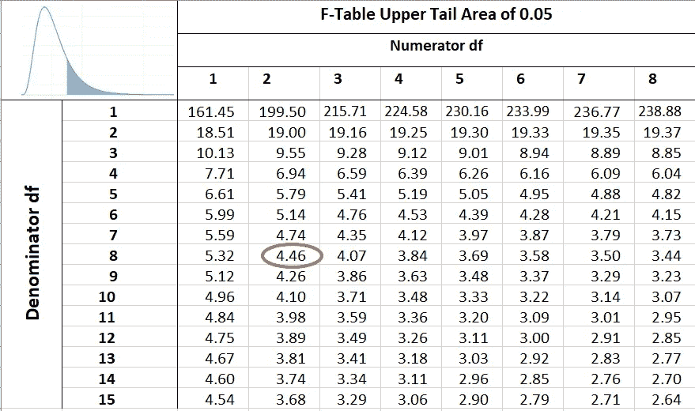****

****作者图片****

****这里，计算的 F 值是 11.67，F 临界是 4.46。****

*******F-临界<F-值*******

****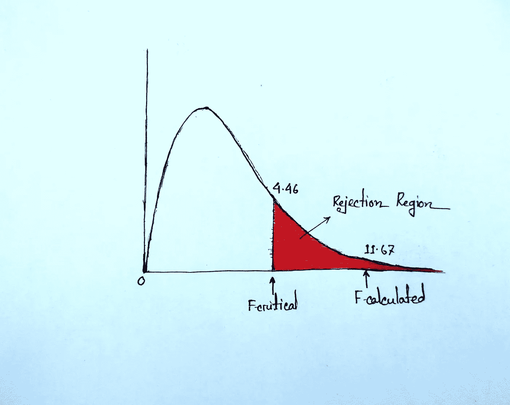****

****作者图片****

****我们计算的 F 值落在剔除区域。所以，我们不能接受零假设。****

*****这就是为什么我们可以说公司做出的决定是卓有成效的，因为不同折扣样本组之间存在差异。*****

## ******用 Python 实现******

****首先，我们将使用 Python 创建数据集。****

```
****import pandas as pd
data=[['$50',16,23,21],['$100',14,21,16],['$150',11,16,18],['$200',10,15,14],['$250',9,10,11]]
table=pd.DataFrame(data,columns=['Invoice Amount','1% Discount','2% Discount','3% Discount'])****
```

****上述代码将生成以下输出。****

****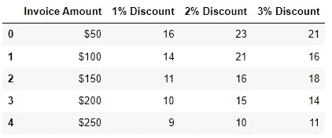****

****作者图片****

****让我们看看不同发票金额的折扣价是如何变化的。我们将画一些箱线图来展示它。****

*******视觉输出*******

****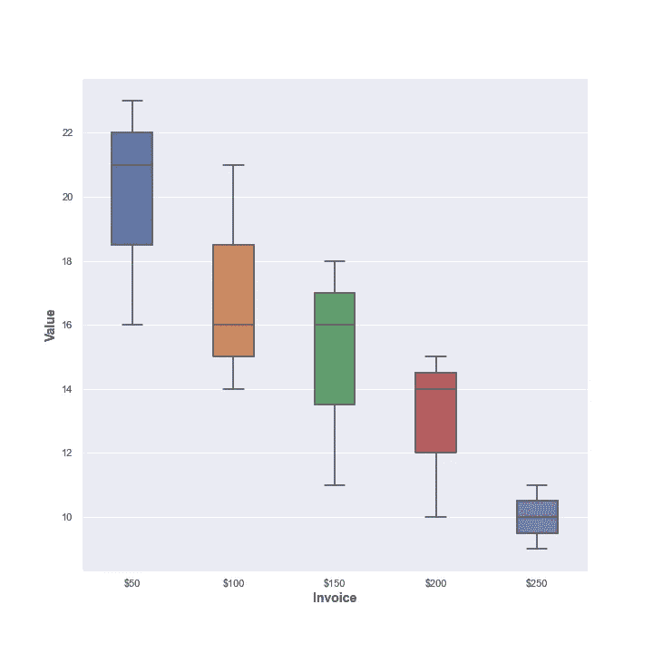****

****作者图片****

****上图显示了行值分布以及平均值。现在，我们将使用箱线图显示列值分布。****

*******输出*******

****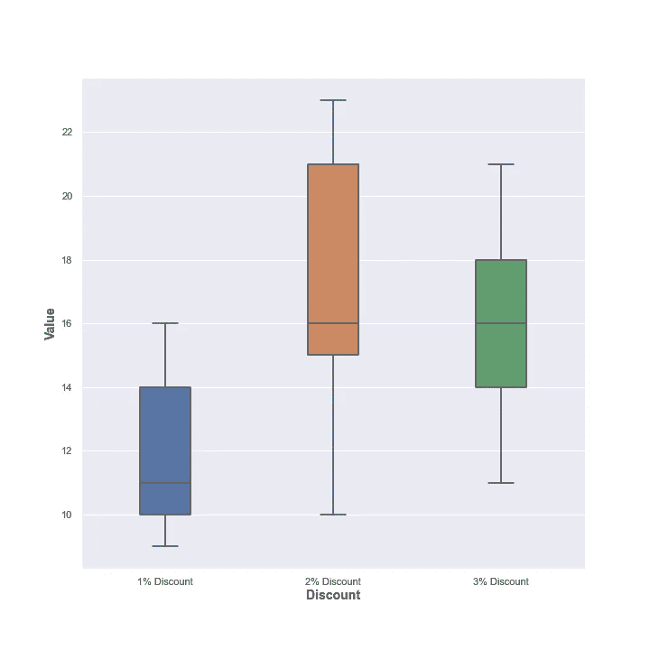****

*   *******最终用 python 实现*******

****格式化数据集以拟合模型。****

*******输出*******

****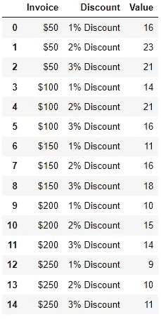****

*   *******拟合值用于计算 F 值。*******

```
****#fitting the model 
model = ols('Value ~ C(Invoice) + C(Discount)', data=final).fit()
f_calculated=sm.stats.anova_lm(model, typ=2)****
```

*******输出*******

****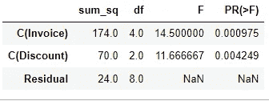****

*******sum _ sq*******C(发票)*******C(贴现)*** 和****SSB、**** **和* ***SSE 的值分别代表******的***df【C(折)*******df****群* ***，残差***表示 ***df*** *误差************

*   ****提取 F 值和 F 临界值****

```
*#finding out the critical value of F
f_critical= stats.f.ppf(1-0.05,dfn=2,dfd=8)print("Critical f-value is {:.3f}.".format(f_critical))
print("Calculated f-value is {:.3f}".format(f_calculated['F'][1]))*
```

****最终结果****

```
*Critical f-value is 4.459.
Calculated f-value is 11.667*
```

## *带复制的双向方差分析*

*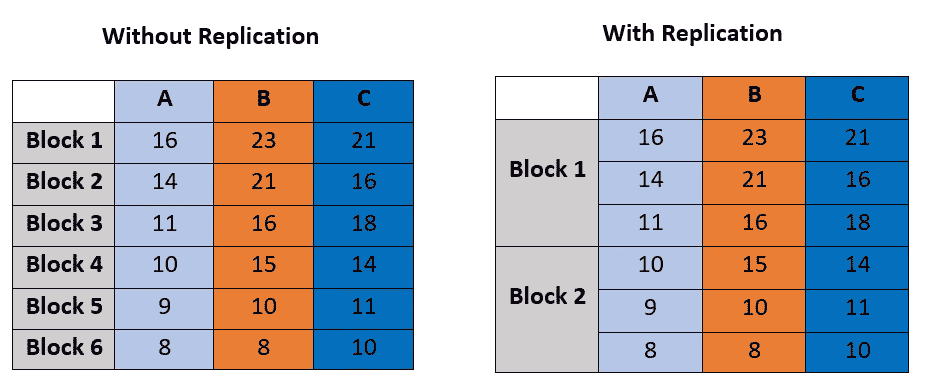*

*作者图片*

*如果我们仔细观察上图，我们可以看到没有复制，没有重复的块。另一方面，对于复制，每个块保存多个样本值。让我们看一个真实的例子。*

> *假设你是一家公司的老板。该公司有两个制造工厂( ***工厂 A*** *和* ***工厂 B)。*** *公司生产三种产品* ***A、B*** *和****C****。现在，公司老板想知道两个工厂的产量是否有显著差异，下面给出了数据。**

*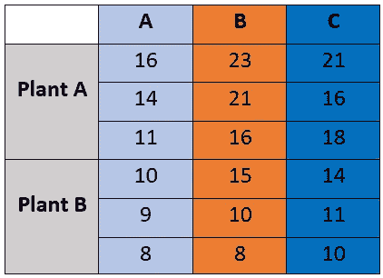*

*作者图片*

*如果我们想计算 F 值，我们必须经历一个令人厌烦的计算。所以，就不展示动手计算了。相反，我们将展示如何找到带有复制的**双向** **方差分析**的 **F 值**。*

## ***Python 实现***

*首先，我们将创建数据集。*

```
*import pandas as pd
data=[['Plant A',13,21,18],['Plant A',14,19,15],['Plant A',12,17,15],['Plant B',16,14,15],['Plant B',18,11,13],['Plant B',17,14,8]]
table=pd.DataFrame(data,columns=['Plant','A','B','C'])*
```

****输出****

*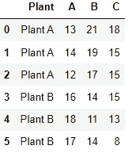*

*现在，我们需要修改数据以适应模型。*

```
*reformation = pd.melt(table,id_vars=['Plant'], value_vars=['A', 'B', 'C'])
reformation.columns=['Plant','Product','Value']
reformation.head(10)*
```

****输出****

*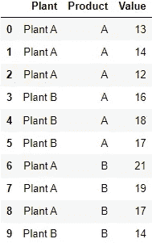*

*让我们想象一下植物和产品之间的相互作用。*

```
*from statsmodels.graphics.factorplots import interaction_plot
import matplotlib.pyplot as plt
fig = interaction_plot(x=reformation['Product'], trace=reformation['Plant'], response=reformation['Value'], colors=['red','black'])
plt.savefig('visualization3.png')
plt.show()*
```

****输出****

*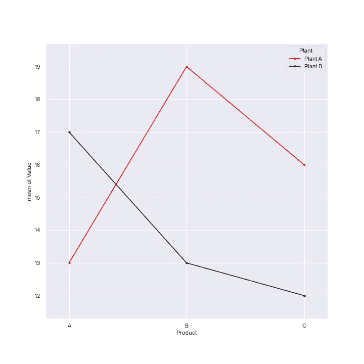*

*作者图片*

*最后，我们将计算 F 值。*

```
*import statsmodels.api as sm
from statsmodels.formula.api import ols
import scipy.stats as stats
model = ols('Value ~ Product + Plant:Product', data=reformation).fit()
f_calculated=sm.stats.anova_lm(model, typ=2)*
```

****输出****

*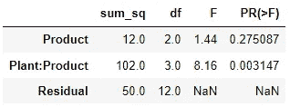*

**看线**

```
*model=ols('Value ~ Product + Plant:Product', data=reformation).fit()*
```

*为了拟合模型，第一个参数应该是一个连续的数值变量，我们需要使用`Repeated_variable: variable`参数来计算有重复的 F 值。因此，与工厂相比，产品的 F 值为 1.44。*

****寻找 F-critical****

*这里，我们假设标准置信水平是 95%。从计算的 F 值中，我们发现群的自由度是 2，误差的自由度是 12。所以，F 的临界值是—*

```
*f_critical= stats.f.ppf(1-0.05,dfn=2,dfd=12)
print('Critical value of F is {:.3f}'.format(f_critical))*
```

****结果****

```
*Critical value of F is 3.885*
```

*由于***F 值< F 临界*** ，所以我们可以说两组之间的产量没有显著差异。** **

*照片由 [Trent Erwin](https://unsplash.com/@tjerwin?utm_source=medium&utm_medium=referral) 在 [Unsplash](https://unsplash.com?utm_source=medium&utm_medium=referral) 上拍摄*

## *结论*

*方差分析测试到此为止。虽然 ANOVA 测试有点混乱和困难，但它在数据科学和数据分析中起着重要的作用。*

**【注意:最后，我要感谢*[*Renesh Bedre*](https://www.reneshbedre.com/about/)*对使用 python 进行 ANOVA 测试的简单说明。特别感谢导师* [*何塞·波尔蒂利亚*](https://www.oreilly.com/pub/au/7412) *，他的讲解让我从内心深处体会到了这场考试。】**

## *参考*

*[1].[https://en.wikipedia.org/wiki/Analysis_of_variance](https://en.wikipedia.org/wiki/Analysis_of_variance)*

*[2].Fisher，R.A. (1918)基于孟德尔遗传假设的亲缘关系。爱丁堡皇家学会会刊，52，339–433。*

*[3].小样本相关系数的“可能误差”。罗纳德·费希尔。密特隆，1:3–32(1921 年)*

*[4].[https://www.statology.org/anova-real-life-examples/](https://www.statology.org/anova-real-life-examples/)*

*[5].Berman h . b .“*F 分布*”，[在线]可从以下网址获得:[https://stat trek . com/probability-distributions/F 分布](https://stattrek.com/probability-distributions/f-distribution)URL[访问日期:2022 年 9 月 1 日]。*

*[6]. [F 分布表(ucla.edu)](http://www.socr.ucla.edu/Applets.dir/F_Table.html)*

*[7].[https://www . statistics show to . com/probability-and-statistics/f-statistic-value-test/](https://www.statisticshowto.com/probability-and-statistics/f-statistic-value-test/)*

*[8].https://www.reneshbedre.com/blog/anova.html*

## *关于数据科学统计学的完整系列文章*

1.  *[*少即是多；采样的‘艺术’(Stat-01)*](/less-is-more-the-art-of-sampling-dda8b59d399?source=your_stories_page-------------------------------------)*
2.  *[*熟悉数据科学最重要的武器~变量(Stat-02)*](/get-familiar-with-the-most-important-weapon-of-data-science-variables-48cc7cd85dc5?source=your_stories_page-------------------------------------)*
3.  *[*要提高数据分析能力，您必须了解频率分布(Stat-03)*](/to-increase-data-analysing-power-you-must-know-frequency-distribution-afa438c3e7a4?source=your_stories_page-------------------------------------)*
4.  *[*通过可视化频率分布找到数据集的模式(Stat-04)*](/find-the-patterns-of-a-dataset-by-visualizing-frequency-distribution-c5718ab1f2c2?source=your_stories_page-------------------------------------)*
5.  *[*比较多个频率分布，从数据集中提取有价值的信息(Stat-05)*](/compare-multiple-frequency-distributions-to-extract-valuable-information-from-a-dataset-10cba801f07b?source=your_stories_page-------------------------------------)*
6.  *[*通过简短的讨论消除你对 Mean 的误解(Stat-06)*](https://medium.datadriveninvestor.com/eliminate-your-misconception-about-mean-with-a-brief-discussion-a9fed67d4b08?source=your_stories_page-------------------------------------)*
7.  *[*通过规范化提高您的数据科学模型效率(Stat-07)*](https://medium.datadriveninvestor.com/increase-your-data-science-model-efficiency-with-normalization-918484b4626f?source=your_stories_page-------------------------------------)*
8.  *[*数据科学的基本概率概念(Stat-08)*](/basic-probability-concepts-for-data-science-eb8e08c9ad92?source=your_stories_page-------------------------------------)*
9.  *[*从朴素贝叶斯定理到朴素贝叶斯分类器的路线图(Stat-09)*](/road-map-from-naive-bayes-theorem-to-naive-bayes-classifier-6395fc6d5d2a?source=your_stories_page-------------------------------------)*
10.  *[*数据科学爱好者需要知道的假设检验(Stat-10)*](https://medium.datadriveninvestor.com/all-you-need-to-know-about-hypothesis-testing-for-data-science-enthusiasts-30cfe1dce028?source=your_stories_page-------------------------------------)*
11.  *[*多组间统计比较用 ANOVA (Stat-11)*](/statistical-comparison-among-multiple-groups-with-anova-d4ac27f6e59e?source=your_stories_page-------------------------------------)*
12.  *[*用卡方检验比较分类变量的相关性(Stat-12)*](/compare-dependency-of-categorical-variables-with-chi-square-test-982baff64e81?source=your_stories_page-------------------------------------)*

*<https://mzh706.medium.com/membership>  <https://mzh706.medium.com/subscribe> *