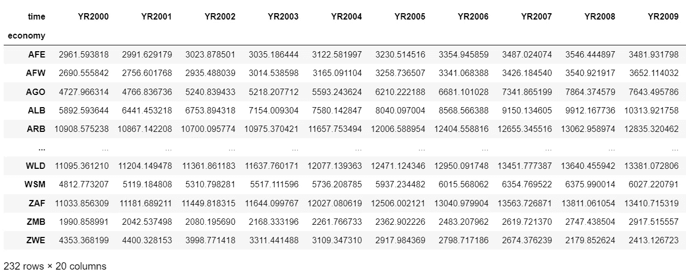
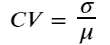
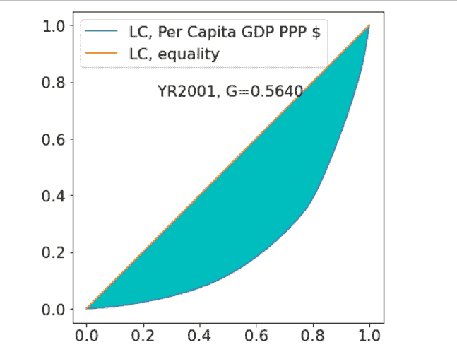
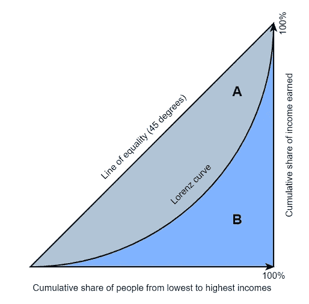
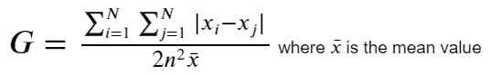
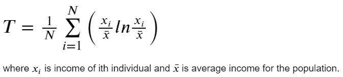
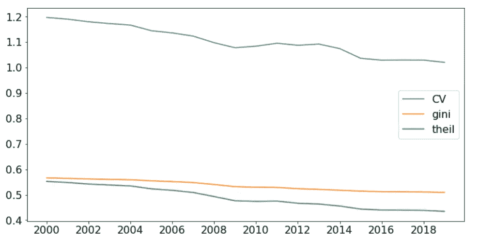

# 衡量经济不平等的统计指数

> 原文：<https://towardsdatascience.com/statistical-indexes-for-measuring-inequality-7f2ca72fd65e>

# 衡量经济不平等的统计指数

## 如何使用 Python 计算不等式指数


[Vinay Darekar](https://unsplash.com/@vinay0903?utm_source=medium&utm_medium=referral) 在 [Unsplash](https://unsplash.com?utm_source=medium&utm_medium=referral) 上的照片

# 1.介绍

不平等是引起经济学家极大兴趣的话题之一。它本质上涉及经济增长利益的分配。高度不平等通常被认为是自我强化的。富人拥有更多的政治权力，用它来促进自己的利益，巩固他们在社会中的相对地位。排斥和缺乏平等机会造成的负面影响是永久性的，从而使更大的不平等永久化。它会引起社会动荡，威胁政治经济的平稳运行。因此，衡量不平等在福利经济学中至关重要。经济学家使用了几个指数来研究增长和不平等之间的联系。一些常见的统计方法包括变异系数、洛伦茨曲线、基尼系数和泰尔指数。每项措施都有其优点和缺点。尽管是经济学中非常常见的指标，但缺乏足够的资源来说明使用 R 和 Python 等通用编程语言来应用它们。这篇文章通过讨论它们在 Python 中的实现以及一个实际的用例，试图填补这个空白。

# 2.数据收集和处理

我们将使用世界银行世界发展指标数据库中的人均国内生产总值(2017 年不变购买力平价美元)。这些数据和大量其他指标可以通过世行的 Python API WB gapi 轻松获得。关于这方面的更多信息，我鼓励你查看 PyPI([https://pypi.org/project/wbgapi/](https://pypi.org/project/wbgapi/))上的文档。

处理后的数据帧如下所示:



已处理的数据帧:作者提供的图像

# 3.统计指标的计算

# 3.1.变异系数

变异系数(CV)是数据序列中数据点围绕平均值的相对离差的统计度量。简单地说，变异系数就是标准偏差和平均值之间的比率。



`Scipy`库提供了一个类来轻松实现这个方法。

```
from scipy import stats
cv = pcgdp_wide.apply(stats.variation, axis = 0)
```

# 3.2.洛伦兹曲线

洛伦兹曲线是由马克斯·洛伦兹在 1905 年提出的。我们可以通过计算低于每个观察值的国家的比例来构建任何给定年份的洛伦茨曲线。为此，我们生成一个累积序列。

*   首先，我们按照人均 GDP 升序对各国进行排序。
*   其次，我们计算低于每个观察值的国家的百分比。
*   第三，我们找出每个国家的收入占所有国家总收入的百分比。
*   第四，我们构建收入百分比的累积和。
*   第五，我们可以通过绘制在步骤 2 和 4 中获得的国家的累积百分比和收入百分比的累积总和来绘制洛伦茨曲线。

在下面的代码块中，我们将生成从 2000 年到 2020 年所有年份的洛伦兹曲线，并使用`screentogif`实用程序将它们合并到一个 gif 文件中。



显示 2000 年至 2019 年洛伦兹曲线的动画:作者图片

# 3.3.基尼系数

基尼系数是由意大利统计学家科拉多·基尼在 1912 年提出的，作为衡量收入不平等的综合指标。它由洛伦兹曲线和完全相等线(45 度线)之间的区域表示。尽管经常使用，但基尼系数因其大规模的累计性质而受到批评，使其在估计不同收入分配水平的不平等性方面较为薄弱。



图片由[本弗兰茨代尔](https://en.wikipedia.org/wiki/User:BenFrantzDale)在[维基百科](https://en.wikipedia.org/wiki/File:Economics_Gini_coefficient.svg)上提供

从数学上来说，基尼系数被定义为任何衡量标准*，如*收入，所有个人对之间绝对差异的平均值。当所有测量值相等时，最小值为 0，对于一组无限大的观测值，理论上的最大值为 1，其中除了一个测量值之外，所有测量值都为 0，这是最大的不等式。



尽管这个公式很可怕，但它的 Python 实现同样很容易。我们可以使用`pysal`或`quantecon`库来计算基尼系数。

```
# Method 1: Using pysal library
from pysal.explore import inequalitygini = pcgdp_wide.apply(inequality.gini.Gini, axis = 0)# Method 2: Using quantecon library
import quantecon as qegini = pcgdp_wide.apply(lambda x: qe.gini_coefficient(x.values), axis = 0)
```

# 3.4.泰尔斯指数

泰尔斯指数是由阿姆斯特丹伊拉斯谟大学的荷兰计量经济学家亨利·泰尔提出的。用简单的英语来说，它是收入份额加权的收入份额对数的平均值。



从概念上讲，你可能会发现这个度量类似于高中物理/化学中的一个术语，叫做熵。没错。它只不过是收入分配的熵，用来衡量收入在人口中的平均分配程度。泰尔斯指数在 PySAL 的不等式模块中可用。

```
# Using pysal
from pysal.explore import inequalitytheil = pcgdp_wide.apply(lambda x: inequality.theil.Theil(x).T, axis=0)
```

# 4.结果

我们将所有三个不平等指数放在一个数据框架中，使用下面的代码片段来观察它们在 20 年时间跨度内的变化。

```
df = pd.DataFrame({'year':range(2000, 2020,1),
              'CV': cv,
             'gini': gini,
             'theil': theil})df.set_index('year').plot();
plt.xticks(range(2000, 2020,2))plt.show()
```



基于人均 GDP 的全球不平等指数随时间的变化:作者图片

我们注意到，随着各国人均收入不平等程度的降低，所有指数都大致呈现出相同的趋势。这表明，就人均国内生产总值而言，富国和穷国之间的差距正在缩小。作为一项练习，尝试通过将国家分为四组来探索不平等趋势——高收入、中上收入、中下收入和低收入。您可以使用本页[第](https://datahelpdesk.worldbank.org/knowledgebase/articles/906519-world-bank-country-and-lending-groups)页给出的世界银行国家分类。总之，我们讨论了一些常用的衡量不平等的统计指标*，即*。CV、洛伦兹曲线、基尼系数和泰尔系数；以及它们的 Python 实现。很少有库可以通过调用一行函数就能轻松计算出这些指数的值。

# 在我们结束之前，

我邀请你和我一起参与这个激动人心的数据科学旅程。关注我的[中页](https://skantbksc.medium.com)，探索更多关于数据科学的精彩内容。

*免责声明:观点是个人的。*

# 参考

1.  [https://python.quantecon.org/wealth_dynamics.html](https://python.quantecon.org/wealth_dynamics.html)
2.  [https://towards data science . com/measuring-statistical-dispersion-with-the-Gini-coefficient-22e4e 63463 af](/measuring-statistical-dispersion-with-the-gini-coefficient-22e4e63463af)
3.  [https://geographic data . science/book/notebooks/09 _ spatial _ inequality . html](https://geographicdata.science/book/notebooks/09_spatial_inequality.html)
4.  [https://www . stats direct . com/help/nonparameter _ methods/Gini _ coefficient . htm](https://www.statsdirect.com/help/nonparametric_methods/gini_coefficient.htm)
5.  [https://blogs . world bank . org/open data/introducing-WB gapi-new-python-package-access-world-bank-data](https://blogs.worldbank.org/opendata/introducing-wbgapi-new-python-package-accessing-world-bank-data)
6.  [https://pypi.org/project/wbgapi/](https://pypi.org/project/wbgapi/)
7.  [https://voxeu.org/content/why-inequality-matters](https://voxeu.org/content/why-inequality-matters)