# 统计学习理论

> 原文：<https://towardsdatascience.com/statistical-learning-theory-26753bdee66e>

## 

## **神经网络的基础**

****

**照片由[豪伊·梅普森](https://unsplash.com/@howiehowei)在 [Unsplash](https://unsplash.com/?utm_source=medium&utm_medium=referral) 拍摄**

**本文是《3ʳᵈ》系列**中关于词语嵌入的一本入门书:** 1。[word 2 vec 后面有什么](https://medium.com/@jongim/a-primer-on-word-embeddings-95e3326a833a) | 2。[单词成向量](https://medium.com/@jongim/words-into-vectors-a7ba23acaf3d) |
3。**统计学习理论** | 4。[word 2 vec 分类器](https://medium.com/@jongim/the-word2vec-classifier-5656b04143da) |
5。[word 2 vec 超参数](https://medium.com/@jongim/the-word2vec-hyperparameters-e7b3be0d0c74) | 6。[单词嵌入的特征](https://medium.com/@jongim/characteristics-of-word-embeddings-59d8978b5c02)**

**在本文中，我们将回顾线性统计模型如何工作，如何将其推广到分类模型中，以及如何使用使用简单神经网络的机器学习来确定这些模型的系数。**

**在上一篇文章 [**单词成向量**](https://medium.com/@jongim/words-into-vectors-a7ba23acaf3d) 中，我们看到了如何将语料库的单词分布数据制成表格，重新加权以增加为特定应用程序提供的信息的价值，并减少维度以缩短单词向量长度。我们还研究了距离度量来比较单词向量。**

**Johnson 将这些基于计数的方法称为 NLP 中的“统计革命”(Johnson，2009)。但是统计革命并没有就此结束。随着机器学习和人工智能技术的发展和计算能力的增长，将统计学习概念应用于 NLP 的机会增加了。**

**在我们在本系列的下一篇文章[**Word2vec 分类器**](https://medium.com/@jongim/the-word2vec-classifier-5656b04143da) 中介绍 word 2 vec 使用的机器学习方法之前，我们将首先检查统计学如何应用于机器学习，并建立机器学习的命名法。机器学习基于统计学习理论(Stewart，2019)，但机器学习的术语可能与统计学的术语有很大不同。**

# **统计学和机器学习**

**统计学是对数据的数学研究。使用统计学，可以创建一个可解释的统计模型来描述数据，然后可以使用该模型来推断有关数据的一些信息，甚至预测用于创建模型的样本数据中不存在的值。预测的“准确性”不是统计学的重点。**

**另一方面，机器学习是关于结果的。它主要利用数据和统计数学的预测能力。在机器学习中，结果比模型的可解释性更受关注。通常，只要预测结果是有用的，基本的统计模型就被认为是不相关的(即“黑箱”)。正如多明戈斯(2012)所说，“机器学习系统自动从数据中学习程序。”**

**由于机器学习能够对数据进行建模，因此面临的挑战是避免过度拟合(Rojas，1996)。该模型应该足够好地运行，以产生准确的预测，而不是特别适合于采样数据，以至于该模型对新数据的预测很差。**

**为了避免使用机器学习方法过度拟合数据，实际上在统计学中经常会通过分离出一部分数据来测试观察到的数据集(称为*测试* *集*)，以确认由大多数数据建立的模型的强度(称为*训练集*)。通常，训练集中的*验证集*用于在测试数据集上确认之前确定预测模型的有效性。**

**Stewart 很好地总结了机器学习和统计学采用的不同方法，如下所示:**

> **“应该清楚的是，这两种方法的目标是不同的，尽管使用了相似的手段来实现目标。机器学习算法的评估使用测试集来验证其准确性。而对于统计模型，通过置信区间、显著性检验和其他检验对回归参数的分析可用于评估模型的合法性。” *(* [*斯图尔特，2019*](/the-actual-difference-between-statistics-and-machine-learning-64b49f07ea3) *)***

**Word2vec 的浅层神经网络和特定的学习算法将在本系列的第四篇文章中讨论，[**word 2 vec 分类器**](https://medium.com/@jongim/the-word2vec-classifier-5656b04143da) 。为了从统计学家的角度理解机器学习和神经网络的概念和术语，我们将回顾如何使用机器学习执行线性回归，以及如何使用神经网络将该过程应用于逻辑回归。**

# **统计学中的线性回归**

**对于有多个预测因子的统计数据的线性回归，我们先用一个线性方程来表示 **y=** ( *yᵢ* )和 **X** =( *xᵢⱼ* )之间的关系:**

**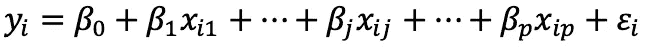**

**其中 *yᵢ* 为因变量， *xᵢⱼ* 为每个自变量 *j* 的观测值，其中每个统计单元 *i* 有 *p* ，其中有 *n* 。错误术语是 *εᵢ* 。预测器有 *βⱼ* ，其中有 *p* +1。**

**这是当有一个预测变量( *p* =1)时线性数据的视图。**

**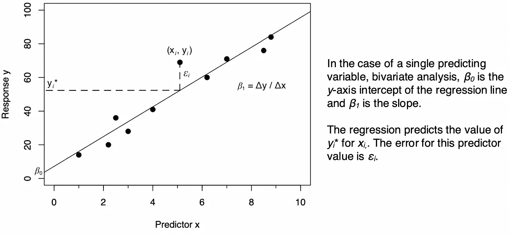**

****二元线性回归**(图片由作者提供)**

**我们也可以用向量和矩阵来表示线性方程。向量 **y** = ( *y* ₁,…， *yᵢ* ，…， *yₙ* )⊤代表响应变量取的值。维度**x**n×(*p*+1)是 *xᵢⱼ* 预测值的矩阵，第一列定义为常数，意味着 *xᵢ* ₀ ≔ 1。**

**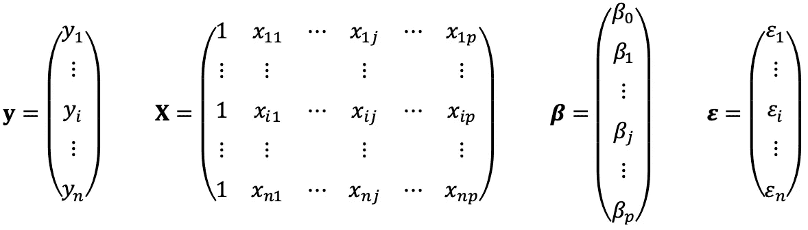**

**用向量和矩阵表示线性方程可以得出:**

****

**对于误差向量为 ***ε*** 的 **y** 对 **X** 的线性回归，系数向量 ***β*** 是通过最小化残差或误差的平方和得到的:**

**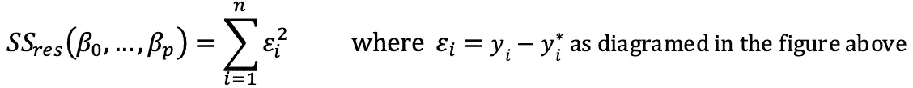**

**或者以向量和矩阵的形式:**

**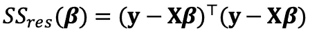**

**对向量 ***β*** 求偏导数，然后设它等于零，得出*β的最小值，我们将它命名为***【β^***【ₒₗₛ*，因为我们使用的是*普通最小二乘法* (OLS)来推导****

****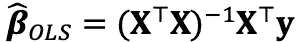****

****在这个值上， ***β*** 是一个真正的最小值，因为二阶导数的 Hessian 矩阵是正定的。****

****从 ***β^*** ₒₗₛ，我们可以预测 **y** ， **ŷ** ，使用下面的等式:****

********

****统计学家在研究线性*统计模型*时使用上述几何推导，该模型在用于预测之前经过测试。一个基本模型的例子是(Tillé，2019):****

****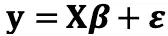****

****其中该模型被形式化如下:****

*   ******y** 是 *n* 观察结果的常数向量****
*   ******X** 是一个 *n* ×( *p* +1)的非随机常数满秩矩阵，包含观察到的独立数据 *xᵢⱼ* ，增加了第一列 1****
*   *******β*** 是ℝ未知系数(即估计量)的向量**⁽***ᵖ***⁺****⁾******
*   *******ε*** 是一个大小为 *n* 的向量，包含未知的随机变量，或者误差项， *εᵢ*****

****模型的典型*假设*如下:****

*   ****矩阵 **X** 不是随机的，是满秩的。如果矩阵 **X** 不是满秩的，那么矩阵的至少一列(即协变量的列)可以写成其他列的线性组合，建议重新考虑数据****
*   ****误差项的期望值为零:𝔼( ***ε*** ) = 0****
*   ****误差项的方差是恒定的:Var( *εᵢ* ) = σ对于所有的 *i* ，即同方差****
*   ****误差项的协方差为零:对于所有的*I*≦*j*，Cov( *εᵢ* ， *εⱼ* ) = 0****

****高斯-马尔可夫定理指出，对于这个具有正态分布误差项的模型，**的普通最小二乘推导估计量是最好的线性无偏估计量。所以我们得到:******

*****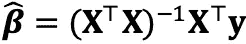*****

*****然后可以对一组新的独立变量 **x** *ₖ* 进行预测:*****

****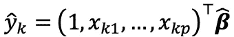****

****在测试以确保模型符合数据之后，统计理论接着定义其他重要值，例如估计量方差的置信区间和模型预测的预测区间。****

# ****统计学中的逻辑回归****

****我们可以通过数学变换将上述线性统计模型推广为统计学中的广义线性模型(GLM ),使用正态(高斯)误差项，允许回归、估计量测试和分析给定 **X** 的 **y** 的条件分布的指数族，如二项式、多项式、指数、伽玛和泊松。****

****使用*最大似然*方法估计参数。对于逻辑回归，当存在二项式响应时， *y* ∈ {0，1}，*逻辑函数*定义成功结果的概率，𝜋=*p*(*y*= 1 |**x**，其中 **x** 为观察到的预测变量的向量，其中有 *p* 。如果 ***β*** 是未知预测量的向量，其中有 *p* +1，用*z*=**x*β***，则(Matei，2019):****

****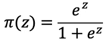********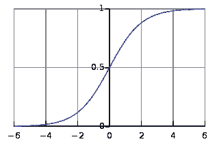****

******后勤职能**
( [Qef](https://commons.wikimedia.org/wiki/File:Logistic-curve.svg) ，公共领域，经由维基共享)****

****我们可以通过 log-odds 或 *logit* 将此函数应用于线性模型，如下所示:****

****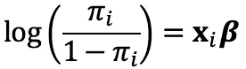****

****其中𝜋*ᵢ*=*p*(*yᵢ*= 1 |**x**t45】ᵢ)和 **x** *ᵢ* 是第 *i* 个观察结果，其中有 *n* 。上面的逻辑函数允许我们将线性回归背后的理论应用于预测成功结果的 0 到 1 之间的概率。统计测试和数据测量，如偏差，拟合优度测量，沃尔德测试，皮尔逊𝜒统计，可以使用这个模型。****

****机器学习对这些方程有自己的术语，我们将在下一节看到。****

# ****使用机器学习的线性回归****

****从机器学习的角度来看，预测模型被认为太复杂或计算量太大，无法用数学方法解决。取而代之的是，对数据的一部分采取非常小的步骤，并反复循环以得到解决方案。****

****在我们继续之前，我们将使用机器学习来浏览线性回归的解决方案，但是，重要的是首先要理解在机器学习中，要求解的函数通常不是预定义的。在我们的情况下，我们已经知道我们只想执行线性回归，但通常在机器学习中，数据的各种模型(或函数)会进行比较，直到根据经验找到过于笼统和不精确与过度拟合数据之间的最佳折衷。****

****在使用机器学习求解线性回归的情况下，我们希望找到完整数据集上的回归系数，因此我们从上一节中线性回归模型中定义的相同观察数据 **X** 和 **y** 开始。****

****要最小化的目标函数是残差的普通最小二乘，我们将在机器学习算法中将其用作*损失函数*、 *L* ，更一般地称为*成本函数*、 *J* ( *θ* ，其中 *θ* 表示正在优化的参数值。对于线性回归，参数值 *θ* 是向量 ***β*** 的值。****

****请注意，在机器学习中，为了帮助标准化和比较模型，通常会最小化*均方误差*，它是我们在上一节中得出的均方误差值之和的 1/ *n* 。对于我们的线性回归情况，我们将继续误差值的平方和，注意常数 1/ *n* 不会影响预测的*系数值，因此可以忽略不计(Aggarwal，2018):*****

*****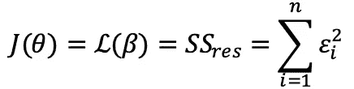*****

*****对损失函数进行求导并将其设置为 0 会产生系数值，但我们将逐步执行计算，每个训练实例进行一次计算，因为机器学习算法将多次遍历数据。*****

*****为了找到逐步更新的方向，我们将对损失函数求导，并使用该方向将我们的学习向最小值移动一步:*****

*****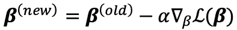*****

*****这个过程被称为*梯度下降*，𝛼定义了小步长的长度，也就是*学习率*。*****

****在机器学习中，我们考虑成对训练( **x** ₁，*y*₁)…(**x**t38】ₙ， *yₙ* )，并且在优化 *θ* 时，我们多次循环更新每一对。让我们看看每个训练实例的平方误差的导数:****

****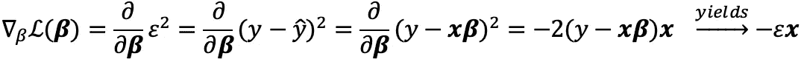****

****该等式为我们提供了将 *β* 值(也称为*权重*)移向最小值的方向。常数 2 通常被忽略，因为它不影响*【Ng，2018】的最佳值。所以在我们的例子中，对于每个第 *m* 个训练实例，**β**更新如下:*****

********

****我们通过为*的每个权重值建立随机值来开始学习过程，并开始算法。学习率𝛼应该被设置成使得朝向损失函数的最小值的进展足够快，而不会超调并且使得最小值不可能达到。经常实施动态学习率，其中𝛼随着函数接近其最小值而减小。*****

*****假设支持良好的学习速率，该机器学习算法将根据需要精确地计算系数***【β】***的值，达到在上面部分中数学推导的相同值。*****

# ****神经网络逻辑回归****

****神经网络的想法来自于神经元在活体动物中如何工作的概念:神经信号被信号通过的每个神经元放大或衰减，它是串联和并联的多个神经元的总和，每个神经元过滤多个输入，并将信号馈送给其他神经元，最终提供所需的输出。前馈神经网络是神经网络的最简单形式，其中计算仅在从输入到输出的正向进行。****

****神经网络允许使用多层神经元，其中每层提供特定的功能。然而，简单的线性回归神经网络可以用线性操作的单层神经元来构建。****

****下图显示了提供逻辑回归的简单前馈神经网络的框架:****

****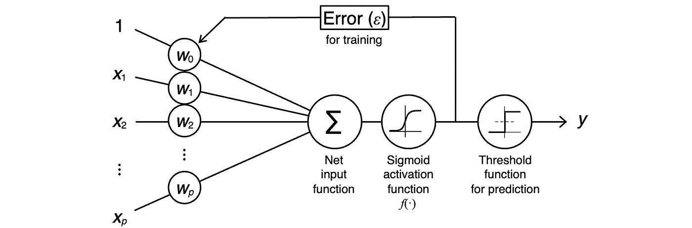****

******二项式分类器的神经网络框架**
(图片由作者提供，灵感来自 Raschka，2020)****

****在用于分类的简单前馈神经网络中，*权重**和“偏差”项 *w* ₀表示来自线性回归方法的 ***β*** 的系数，并由网络使用如图所示的*误差* ( *ε* )进行训练。*****

****一般神经网络函数采用以下形式(Bishop，2006 年):****

****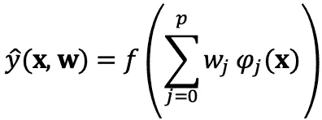****

****其中 *f* ()为非线性*激活函数*， *φⱼ* ( **x** )为*基函数*。在确定权重 **w** 之前，基函数可以变换输入 **x** 。在逻辑回归的情况下，基函数被设置为 1，以便输入保持线性。****

****对于线性回归，激活函数 *f* ()也被设置为 1。然而，对于逻辑回归，需要特定的激活函数来将线性确定的权重的输出转换为二项式响应的预测概率 0 或 1。激活函数是 *sigmoid* 函数，相当于为统计用逻辑回归定义的*逻辑函数*。与逻辑函数𝜋( *z* 相反，sigmoid 函数在数学上转换为只有一个指数，以简化编程，如下式所示:****

****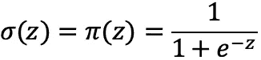****

****其中*z*=**x*β*。sigmoid 激活函数提供了预测的概率。******

****然而，在更普遍的机器学习中，当我们不需要得到预测的线性概率时，使用非线性函数。在这种情况下，可以测试各种激活功能。****

****为了进行训练以建立每一步的权重 **w** ，神经网络算法计算误差值，误差值是计算的预测与实际结果之间的差异。使用*反向传播*，根据学习率更新权重。****

****我们将在本系列的下一篇文章中更详细地讨论反向传播。****

# ****多项式逻辑回归****

****之前，我们使用统计学中的广义线性模型将线性回归扩展为二项响应的逻辑回归。对于响应是多项的情况，即多类，我们可以进行类似的变换。关键区别在于，使用 softmax 函数，而不是使用 sigmoid 激活函数来为预测提供概率。****

****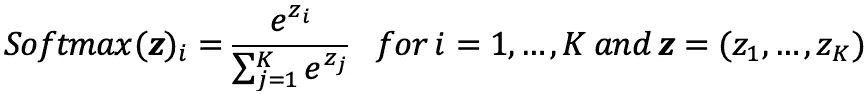****

****其中*z*=**x*β***和 *K* 为类数。****

****多项式逻辑回归的神经网络模型与二元逻辑回归的工作方式类似。softmax 函数比 sigmoid 函数计算量更大。****

# ****神经网络的非线性应用****

****如前所述，统计学中的广义线性模型(GLM)允许对二项式和多项式分布的指数族进行回归，提供预测置信区间和其他基于理论的统计测试。****

****但是，当神经网络被推广到非线性预测时，我们如何获得预测和其他统计数据的置信区间？在这种情况下，可以应用包括*自举*、*刀切*和*交叉验证*的计算方法(Rojas，1996)。****

# ****摘要****

****在本文中，我们了解了如何推广线性回归来预测二元或多元响应，以及如何使用机器学习来提供预测参数(以浅层神经网络为例)。****

****我们还了解到，机器学习更普遍地用于自动找到预测输出的最佳函数(通常是非线性的)，而统计通常试图验证数据的模型(通常更简单),并使用该模型进行预测。****

****在下一篇文章中，[**Word2vec 分类器**](https://medium.com/@jongim/the-word2vec-classifier-5656b04143da) ，我们将看看 word 2 vec 如何利用这些概念来训练它的单词嵌入。****

****这篇文章是 3ʳᵈ系列文章**中关于单词嵌入的初级读本:** 1。[word 2 vec 背后有什么](https://medium.com/@jongim/a-primer-on-word-embeddings-95e3326a833a) | 2。[单词成向量](https://medium.com/@jongim/words-into-vectors-a7ba23acaf3d) |
3。统计学习理论| 4。[word 2 vec 分类器](https://medium.com/@jongim/the-word2vec-classifier-5656b04143da) |
5。[word 2 vec 超参数](https://medium.com/@jongim/the-word2vec-hyperparameters-e7b3be0d0c74) | 6。[单词嵌入的特征](https://medium.com/@jongim/characteristics-of-word-embeddings-59d8978b5c02)****

******关于这个主题的更多信息:**我推荐的一个了解机器学习的构建模块的资源是斯坦福大学的这个在线计算机科学课程:ng，A. (2018)。 [*CS229 机器学习*](http://cs229.stanford.edu/syllabus-autumn2018.html) 。****

# ****参考****

****阿加瓦尔，C. (2018)。*神经网络和深度学习:一本教科书*。瑞士查姆:施普林格国际出版公司。****

****主教，C. (2006 年)。*模式识别与机器学习*。纽约，纽约:斯普林格科学+商业媒体。****

****多明戈斯，P. (2012 年)。关于机器学习需要知道的一些有用的事情。*ACM 的通信*，55(10):78–87。****

****约翰逊博士(2009 年)。统计革命如何改变(计算)语言学。计算语言学协会 2009 年欧洲分会关于语言学和计算语言学之间的相互作用研讨会的会议录:良性、恶性还是空洞？，第 3–11 页。 [PDF](https://www.aclweb.org/anthology/W09-0103/) 。****

****Matei，A. (2019)。*广义线性模型*。统计学课程。瑞士纳沙泰尔:纳沙泰尔大学。****

****Ng，A. (2018)。 [*CS229 机器学习*](http://cs229.stanford.edu/syllabus-autumn2018.html) ，在线计算机科学课程。加州斯坦福:斯坦福大学。****

****拉什卡，瑞典(未注明)。[逻辑回归和神经网络有什么关系，什么时候用哪个？](https://sebastianraschka.com/faq/docs/logisticregr-neuralnet.html)塞巴斯蒂安·拉什卡。****

****罗哈斯，R. (1996 年)。*神经网络:系统介绍*。德国柏林:施普林格出版社。****

****斯图尔特，M. (2019)。[统计学和机器学习的实际区别](/the-actual-difference-between-statistics-and-machine-learning-64b49f07ea3)。*走向数据科学*。****

****蒂莱，Y. (2019)。*高级回归方法*。统计学课程。瑞士纳沙泰尔:纳沙泰尔大学。****

*****除非另有说明，数字和图像均由作者提供。****