# Julia 的统计绘图:牛虻. jl

> 原文：<https://towardsdatascience.com/statistical-plotting-with-julia-gadfly-jl-39582f91d7cc>


安妮·尼加德在 [Unsplash](https://unsplash.com/s/photos/gadfly?utm_source=unsplash&utm_medium=referral&utm_content=creditCopyText) 拍摄的照片

## 如何使用牛虻. jl 包创建统计图

这是我比较不同的 Julia 图形包来创建统计图表的几篇文章中的第一篇。我从牛虻包开始这个系列。

在本系列的介绍中([图形的语法或者如何在 Julia](/the-grammar-of-graphics-or-how-to-do-ggplot-style-plotting-in-julia-1b0ac2162c82) 中进行 ggplot 风格的绘图)，我已经解释了图形的语法(GoG ),它是这些图形包的概念基础。在那篇文章中，我还介绍了将用于绘图示例的数据。

# 牛虻

牛虻是一个非常完整的图形语法的实现。它的原作者是 Daniel C. Jones，但是这个包目前在 GitHub 上有 100 多个贡献者。首批版本出现在 2014 年。同时，它是一个非常成熟的软件包，每年只有几个新版本。

它完全是用 Julia 编写的，并且与 Julia 生态系统的其他部分配合得很好。例如，它与 *DataFrames.jl* 紧密集成，并通过 *IJulia* 包直接用于 *Jupyter* 笔记本电脑。

对于出版物质量图形的渲染，它能够开箱即用地渲染 SVG，使用 *Cairo.jl* 和 *Fontconfig.jl* 它还可以生成 PNG、PDF、PS 和 PGF 等格式。

牛虻制作的情节提供了一些交互性，如平移、缩放和切换。

# 示例图

为了进行比较，我将使用数据科学中常用的几种图表类型(或 GoG 称之为*几何图形*),即:

*   条形图
*   散点图
*   直方图
*   箱线图
*   小提琴情节

牛虻当然提供了更多的种类，正如你在这个[画廊](http://gadflyjl.org/stable/gallery/geometries/)中看到的。但是为了获得所有包之间 1:1 的比较，我坚持使用上面列出的类型。

示例中的数据假设在本系列的介绍文章中给出的数据帧结构`countries`、`subregions_cum`和`regions_cum`中已经准备好。

大多数绘图首先以基本版本呈现，使用图形包的默认设置，然后使用定制属性(标签、背景颜色等)进行优化。).

# 条形图

## 各地区人口

我们从一个简单的条形图开始，它按地区显示了人口规模(2019 年)。这是通过使用下面的`plot`-命令将数据映射到美学，并使用我们在关于图形语法的介绍文章中了解到的条形几何图形来完成的:

```
plot(regions_cum, 
        x = :Region, y = :Pop2019, color = :Region, 
        Geom.bar)
```

…产生以下条形图:

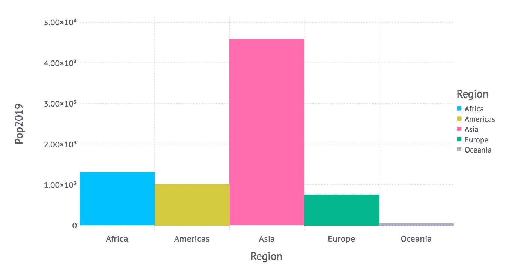

按人口划分的地区(1)[图片由作者提供]

在第二个版本中，我们不依赖默认值，而是手动设置轴标签、标题和背景颜色。除此之外，我们不希望 y 轴上的数字采用科学的格式，并且条形之间应该有一些空间(以符合条形图的定义)。这导致了下面的代码，其中`Guide`-元素用于标签，一个`Scale`用于更改 y 轴上的数字，一个`Theme`用于一般属性，如背景颜色或条间距。

…创建以下经过美化的条形图:

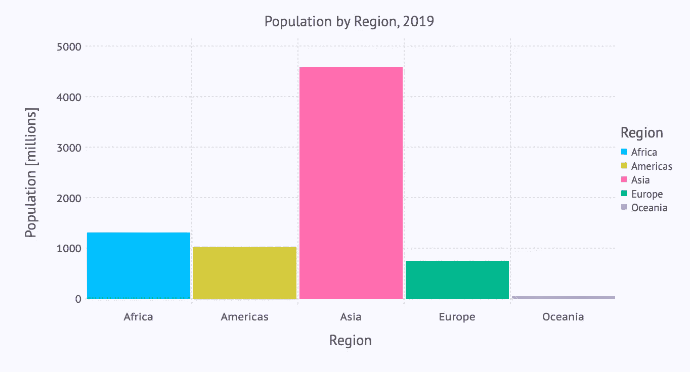

按人口划分的地区(2)[图片由作者提供]

## 分区域人口

下一个柱状图使用下面的`plot`命令描述了分区域的人口:

```
plot(subregions_cum, 
        x = :Subregion, y = :Pop2019, color = :Region, 
        Geom.bar)
```

…产生以下条形图:

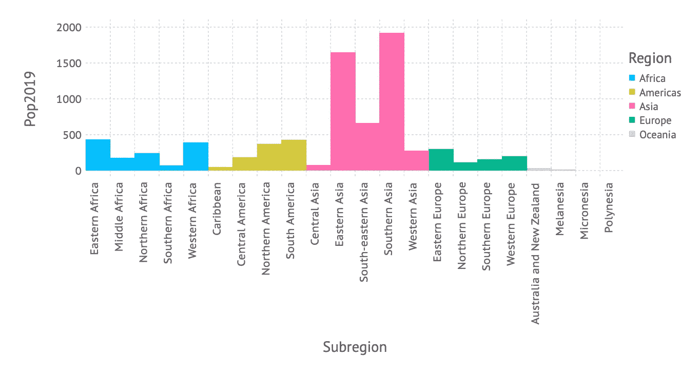

分区域人口(1)[图片由作者提供]

我们可以看到有改进的余地:由于有相当多的次区域，而且它们的名称相对较长，一个水平条形图可能更易读。除此之外，我们再次适应标签，标题，背景颜色等。导致下面的代码，其中我们使用 bar 几何上的参数`orientation`切换到水平布局:

…最终形成可读性更强的条形图:


分区域人口(2)[图片由作者提供]

如果我们在使用下面的命令呈现图表之前，按照人口数量(`Pop2019)`对子区域`subregions_cum`进行排序，可读性会更好:

```
subregions_cum_sorted = sort(subregions_cum, :Pop2019)
```

如果我们将上面的`plot`命令应用于排序后的数据`subregions_cum_sorted`，我们最终会得到:

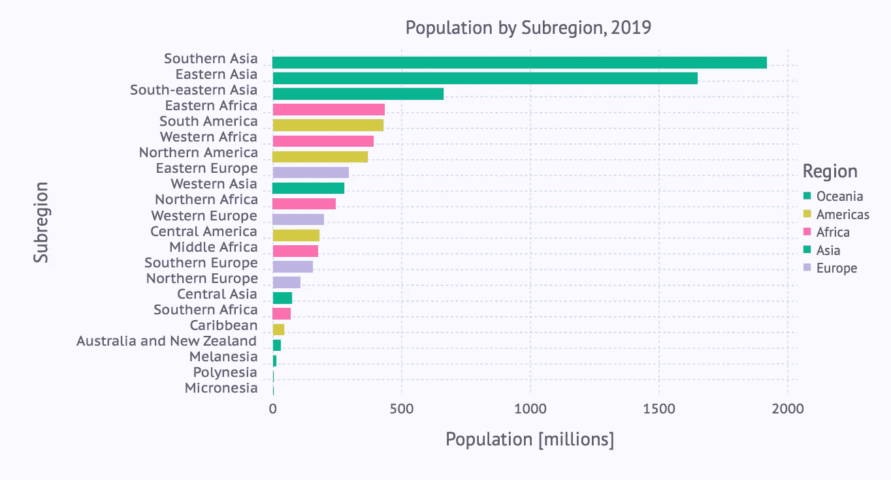

分区域人口(3)[图片由作者提供]

# 散点图

在下一步中，我们来看看国家一级的人口与增长率的关系。散点图是可视化这种关系的好方法。我们使用点几何得到一个，如下所示:

```
plot(countries,
        x = :Pop2019, y = :PopChangePct, color = :Region,
        Geom.point)
```

…产生了这个散点图:

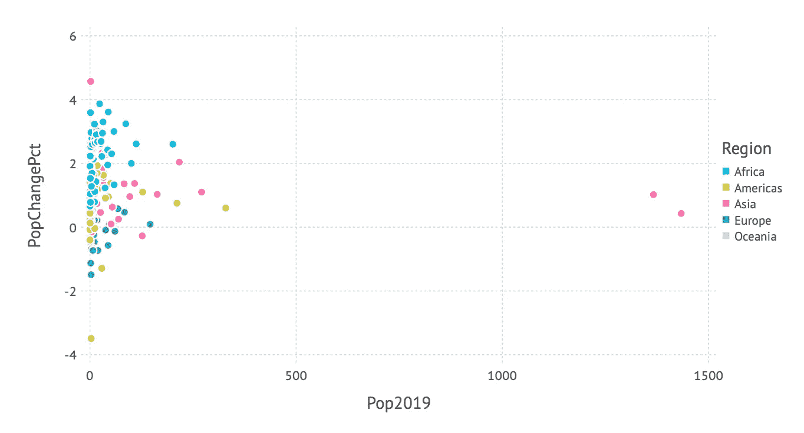

人口与增长率的关系(1)[图片由作者提供]

由于我们也将区域映射到颜色美学，所以我们得到了一个更有差别的图片，它还包含了区域信息。

但是数据的分布是相当不均衡的——大多数国家的人口不到 2 亿。因此，x 轴上的对数刻度可能会更好地洞察数据。再次，我们添加一些标签，背景颜色等。导致以下代码:

…为我们提供了以下改进的散点图:

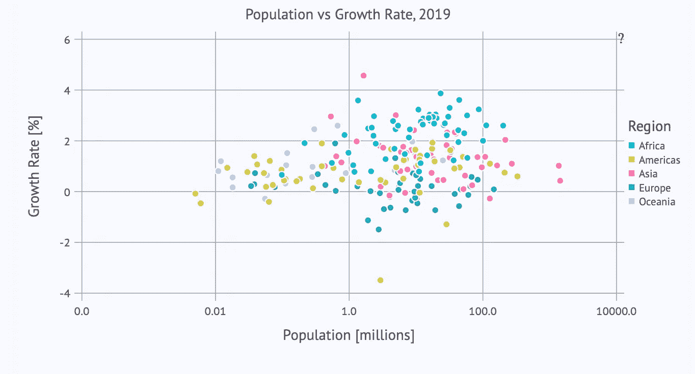

人口与增长率的关系(2)[图片由作者提供]

对数标度的`labels`-参数需要一点解释:如果没有这个规范，我们将得到 x 轴上的对数(以 10 为底)，这对许多人来说是难以理解的。相反，我们只需要人口数量(例如，100.0 而不是 2)。因此，我们将一个函数传递给`labels`,它计算“正确”的标签。对数值`x`被转换成 10^x 以得到一个“可读”的数字，然后四舍五入到两位数，最后转换成一个字符串(这是标签的预期类型)。

# 直方图

条形图和直方图具有相同的几何结构(在“图形语法”的意义上)。但是为了获得 x 轴上的分类数据，用于直方图的数据必须在一个称为“宁滨”的过程中映射到(人工)类别。在 GoG 中，这是使用所谓的 *bin 统计完成的。*

牛虻在这个地方没有遵循(或者至少没有表现出)这个理论。相反，它为直方图引入了一个单独的几何图形(这对于日常使用可能更实用)。

因此，我们使用下面的`plot`-命令得到一个直方图，显示不同国家的人均 GDP 分布，命令使用直方图几何:

```
plot(countries, x = :GDPperCapita, Geom.histogram)
```

…产生了这个直方图:

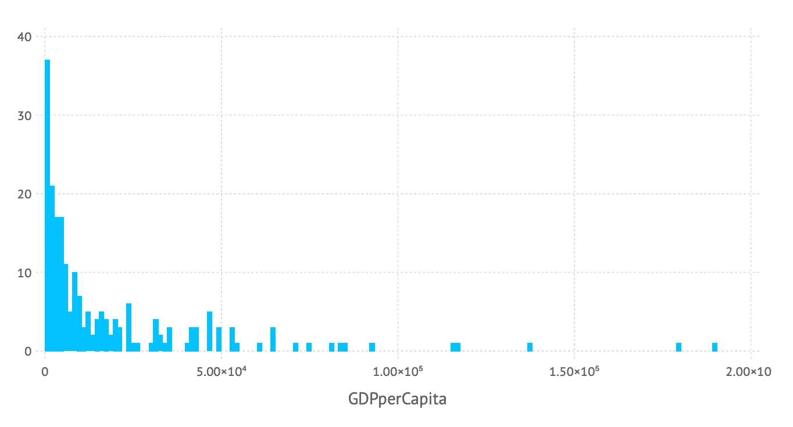

人均 GDP 分布(1)[图片由作者提供]

使用的仓数量可由直方图几何图形的`bincount`参数控制。同样，我们可以添加标签等。产生以下代码:

…产生以下改进的直方图:

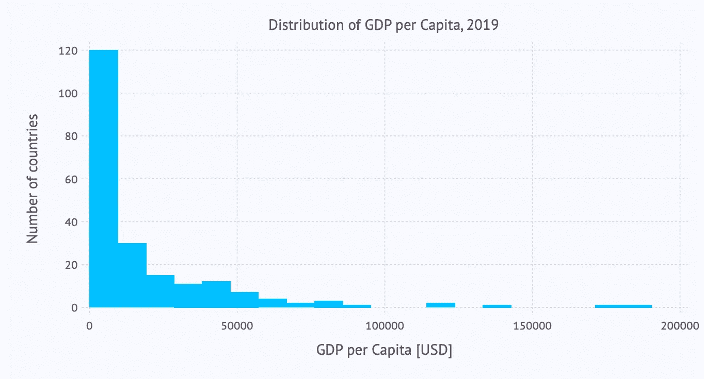

人均国内生产总值的分布(2)[图片由作者提供]

# 盒子情节和小提琴情节

为了深入了解一些数值数据的分布，通常使用箱线图或小提琴图。每种图表类型都有其独特的优点。让我们用这些图来看一下每个地区的人均 GDP 的分布。

## 箱形图

让我们立即使用使用`boxplot`-几何图形的“美化”版本:

…为我们提供了以下箱线图:

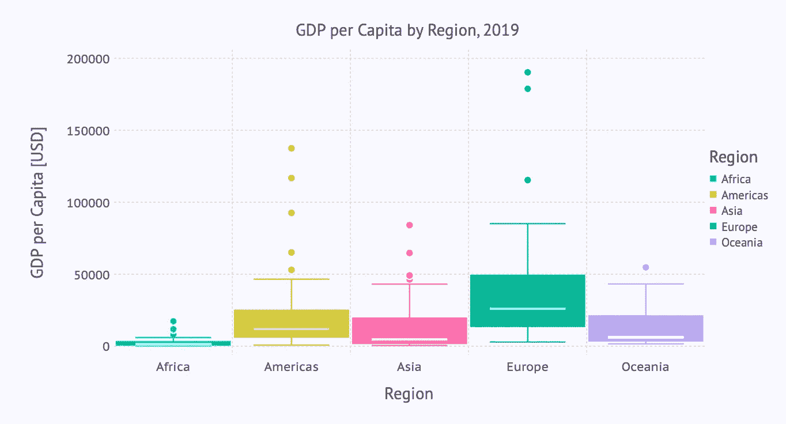

各地区人均 GDP 分布(1)[图片由作者提供]

## 小提琴情节

这个可视化的小提琴图的代码看起来非常相似。唯一的区别是使用了`violin`-几何形状(而不是`boxplot`):

…引出下面的小提琴情节:

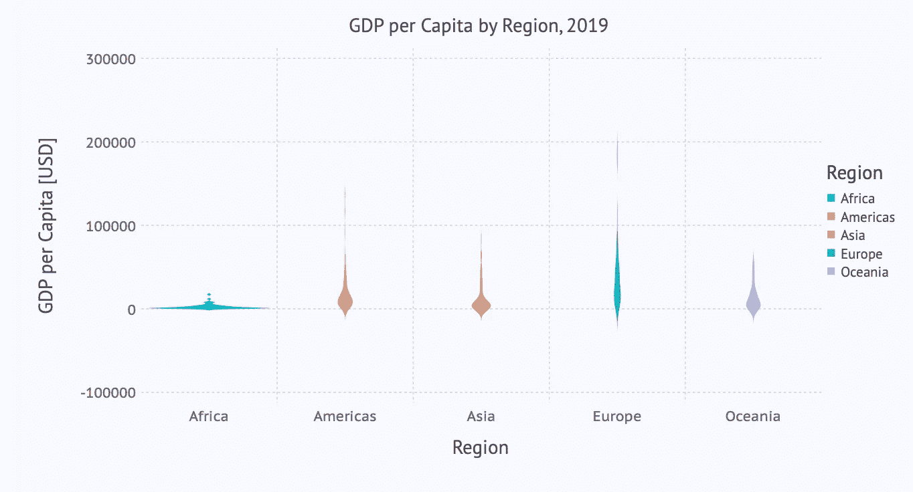

各地区人均 GDP 分布情况(2)[图片由作者提供]

这里我们注意到 y 轴缩放的默认设置不如盒状图那样好。除此之外，分布中真正有趣的部分在 0 到 100，000 的范围内。因此，我们希望将图限制在 y 轴上的范围内，进行放大。

## 放大

这可以通过在`plot`-参数列表中添加以下行来轻松实现:

```
Coord.cartesian(ymin = 0, ymax = 100000),
```

…导致以下小提琴图:

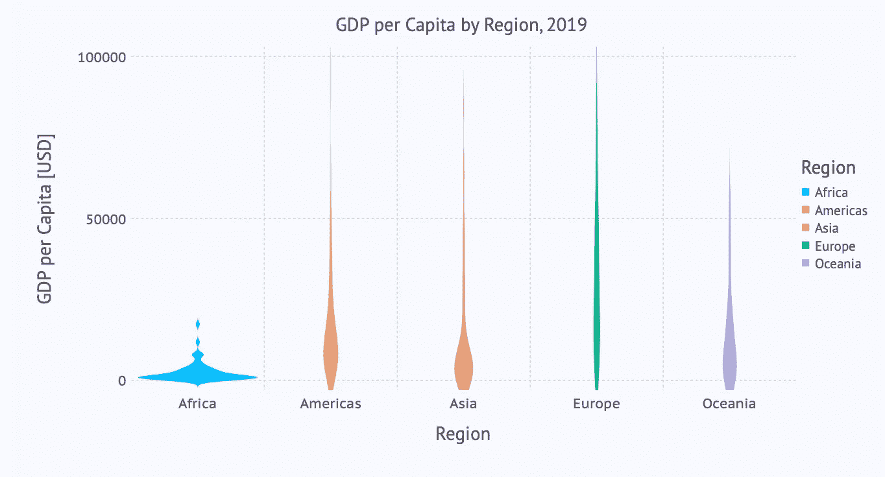

各地区人均 GDP 分布情况(3)[图片由作者提供]

对 y 轴的相同限制可以应用于箱线图:

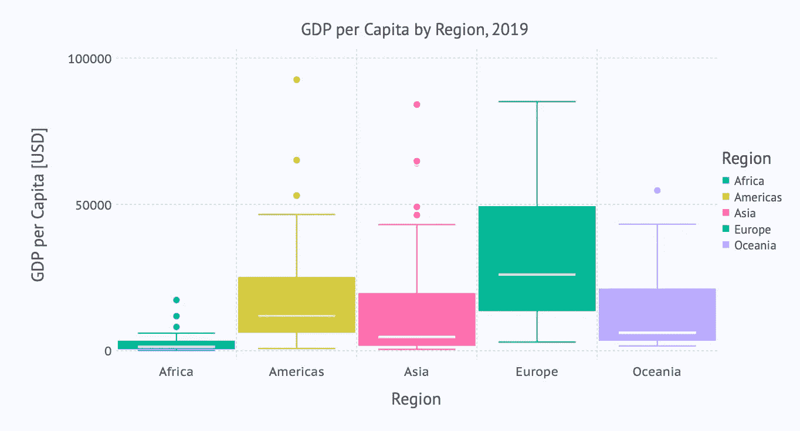

各地区人均 GDP 分布(4)[图片由作者提供]

当然，这些图的读者应该被告知应用于 y 轴的限制，以便正确地解释该图。

# 结论

正如我们所看到的，牛虻大部分时间都非常紧密地遵循图形语法的概念。这就是为什么情节规范如此一致(同样的事情总是以同样的方式被指定，与上下文无关)并且容易学习和记忆的原因之一。

当涉及到边缘情况时，你只能达到一些极限。例如，如果您指定一个散点图，其中只有到 x 轴的映射，而没有到 y 轴的映射。根据 GoG，你应该得到分布在一条线上的点(x 轴)。这对牛虻不起作用。并且例如没有实现极坐标系统(但是将来可以实现)。

但是，如果您的可视化需求集中在牛虻中实现的(大量)几何图形列表上，并且您不需要对这些图表进行非常奇特的定制，那么您将会对牛虻非常满意。

如果你想自己尝试这些例子，你可以从我的 GitHub 库中得到一个[冥王星笔记本](https://raw.githubusercontent.com/roland-KA/StatisticalPlotsWithJulia/868da23610483e50d7c1b470a4d3b1c8f4f18da8/notebooks/DV-Basics-Gadfly.jl)，它是这篇文章的一个可执行变体。