# Julia 的统计绘图:VegaLite.jl

> 原文：<https://towardsdatascience.com/statistical-plotting-with-julia-vegalite-jl-ad6fda253215>


布莱恩·戈夫在 [Unsplash](https://unsplash.com/s/photos/vega-star?utm_source=unsplash&utm_medium=referral&utm_content=creditCopyText) 上的照片

## 如何使用 VegaLite.jl 包创建统计图

这是几篇文章中的第二篇，我在这里比较了不同的 Julia 图形包来创建统计图表。我已经从牛虻包( [*用 Julia 进行统计绘图:牛虻. jl*](https://medium.com/towards-data-science/statistical-plotting-with-julia-gadfly-jl-39582f91d7cc) ，【SPJ02】)开始，并在这里用 [VegaLite 包](https://www.queryverse.org/VegaLite.jl/stable/)继续这个系列。

VegaLite(以及牛虻)的概念基础是图形的语法(GoG)，我已经在[*Julia*](/the-grammar-of-graphics-or-how-to-do-ggplot-style-plotting-in-julia-1b0ac2162c82)*(*【spj 01】)的《图形的语法或者如何做 ggplot 风格的绘图》中介绍过。在这里，我还介绍了将用于绘图示例的数据(此处和[SPJ02])。

本文(以及本系列后面的文章)的目标是使用完全相同的数据再现[SPJ02]中的可视化效果，但是每次都使用另一个图形包，以便实现所有包的 1:1 比较。《走向数据科学》的出版指南不允许重复这些可视化的描述。因此，请查看[SPJ02]以了解更多信息，或者在 Julia Forem 阅读这篇文章的更独立版本。

# VegaLite

就像牛虻一样，jl 也是图形语法(GoG)的一个非常完整的实现，我们将在下面的例子中看到。它是由大卫·安托夫教授(伯克利大学)领导的一个由 20 多名撰稿人组成的小组撰写的。VegaLite 是一个更大的数据科学包生态系统(称为 [Queryverse](https://www.queryverse.org) )的一部分，其中包括查询语言(Query.jl)、文件 IO 工具和 UI 工具(ElectronDisplay.jl)。

从技术上来说，VegaLite 采用了一种完全不同的方法:虽然牛虻完全是用 Julia 编写的，但 VegaLite 更像是一个用于 [*Vega-Lite*](https://vega.github.io/vega-lite/) 图形包的语言接口(注意它的名字中的破折号，与表示 Julia 包的 *VegaLite* 形成对比)。Vega-Lite 将 JSON 格式的可视化的*规范*作为输入，Vega-Lite 编译器将其转换为相应的可视化。

Vega-Lite 完全独立于 Julia 生态系统，除了 VegaLite 之外，还存在其他语言的接口，如 JavaScript、Python、R 或 Scala(完整列表见“ [Vega-Lite 生态系统](https://vega.github.io/vega-lite/ecosystem.html)”)。

由于 Vega-Lite 使用 JSON 作为其输入格式，这些规范具有相当强的声明性。VegaLite 试图用`@vlplot`-宏模仿这种格式，这是所有可视化的基础，我们将在下面的例子中看到。这使得它比例如牛虻更少朱利安，但另一方面具有优势，即熟悉 Vega-Lite 的人将容易地学习如何使用 VegaLite。如果 VegaLite 文档中缺少什么，通常很容易在 Vega-Lite 文档中找到相应的部分。

Vega-Lite(以及 VegaLite)的一个显著特征是它的交互性。它的规范不仅描述了可视化，还描述了事件、兴趣点以及如何对这些事件做出反应的规则。但是这个特性超出了本文的范围。对于对这方面感兴趣的读者，我推荐看一下 [Vega-Lite 主页](https://vega.github.io/vega-lite/)或者论文“ [Vega-Lite:一个交互图形的语法](https://ieeexplore.ieee.org/document/7539624)”。

# 示例图

我将使用与前一篇文章中相同的图表类型(或 GoG 称之为*几何图形*)进行比较:

*   条形图
*   散点图
*   直方图
*   箱线图
*   小提琴情节

在[画廊](https://vega.github.io/vega-lite/examples/)可以找到 VegaLite 产品的完整列表。

如在[SPJ02]中，我们假设示例的数据在数据帧结构`countries`、`subregions_cum`和`regions_cum`中可用。

与[SPJ02]中一样，大多数图首先以基本版本呈现，使用图形包的默认设置，然后使用定制属性进行优化。

# 条形图

## **各地区人口**

第一个图是一个条形图，显示了各地区的人口规模(2019 年)。在 VegaLite 中，所有的图都是使用`@vlplot`-命令创建的。在下面的代码中使用了 Julia 的管道语法(`|>`)来指定`regions_cum` -DataFrame 作为`@vlplot`的输入。

```
regions_cum |>
    @vlplot(
         width = 600, height = 300,
         :bar,
         x = :Region, y = :Pop2019, color = :Region
     )
```

这会产生以下条形图:

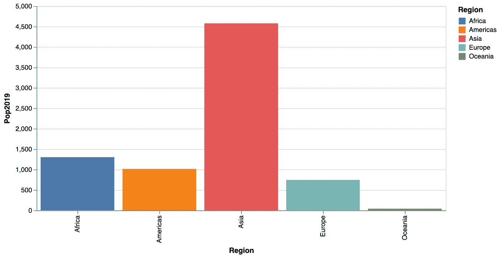

按人口划分的地区(1)[图片由作者提供]

现在，我们手动设置轴标签、标题和背景颜色，并将 x 轴上的条形标签更改为水平方向，以获得更好的可读性。在 VegaLite `title`中，属性用于标签和图标题，一个`axis`属性用于改变条形标签的方向，一个`config`属性用于一般属性，如背景颜色(对应于牛虻中的`Theme`)。

…创建以下条形图:

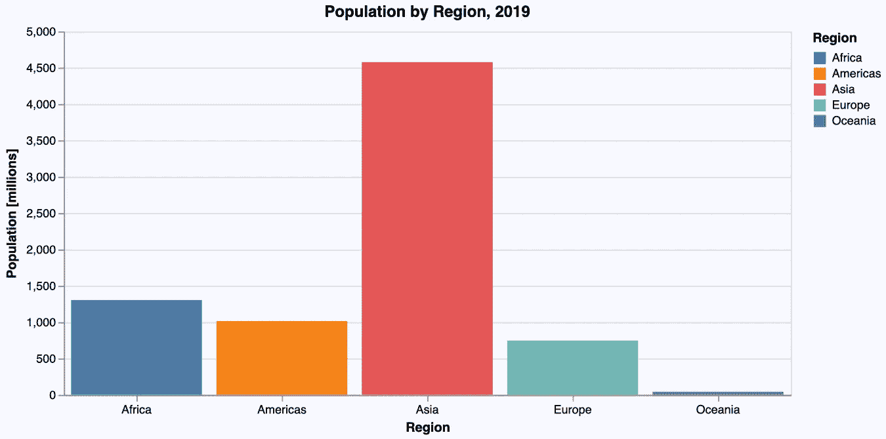

按人口划分的地区(2)[图片由作者提供]

## 分区域人口

下一个柱状图描述了分区域的人口情况(同样使用`@vlplot`):

```
subregions_cum |>
    @vlplot(
        width = 600, height = 300,
        :bar,
        x = :Subregion, y = :Pop2019, color = :Region
    )
```

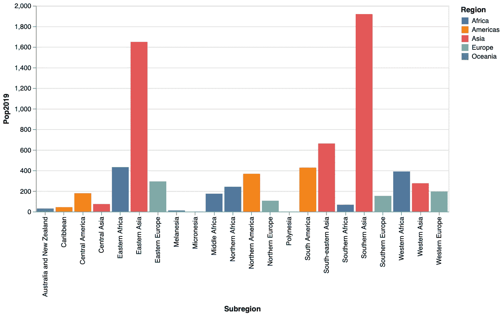

分区域人口(1)[图片由作者提供]

下一步，我们切换到水平条形图，再次手动调整标签、标题和背景颜色。我们只需翻转 x 轴和 y 轴的数据属性，就可以得到 VegaLite 中的水平布局:

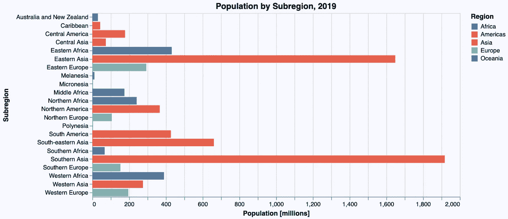

分区域人口(2)[图片由作者提供]

现在，我们希望在绘制图表之前按照人口规模对子区域进行排序。为此，我们可以使用 Julia 对`subregions_cum` -DataFrame 进行排序(正如我们在牛虻示例中所做的那样)，但是 VegaLite 提供了使用`sort`-属性对图形引擎中的数据进行排序的可能性。

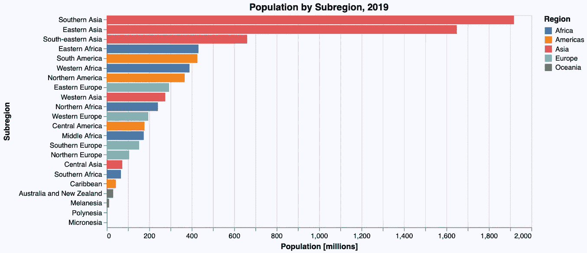

分区域人口(3)[图片由作者提供]

在这一点上需要注意的是:虽然可以在图形引擎中对数据进行排序，但我不建议对较大的数据集进行排序，因为这比直接使用 Julia 进行排序要慢得多。

# 散点图

下图是一个散点图(使用一个*点*几何图形),描绘了与增长率相关的国家级人口:

```
countries |>
    @vlplot(
        width = 600, height = 300,
        :point,
        x = :Pop2019, y = :PopChangePct, color = :Region
    )
```

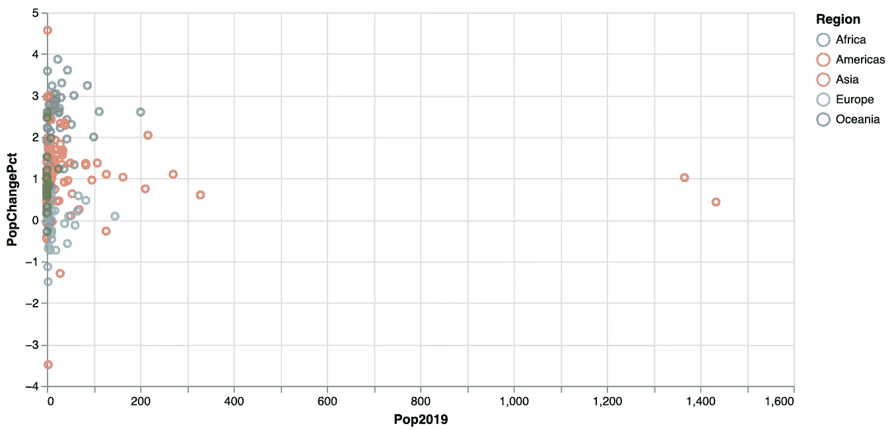

人口与增长率的关系(1)[图片由作者提供]

现在我们将对数标度应用于 x 轴。再次，我们添加一些标签，背景颜色等。：

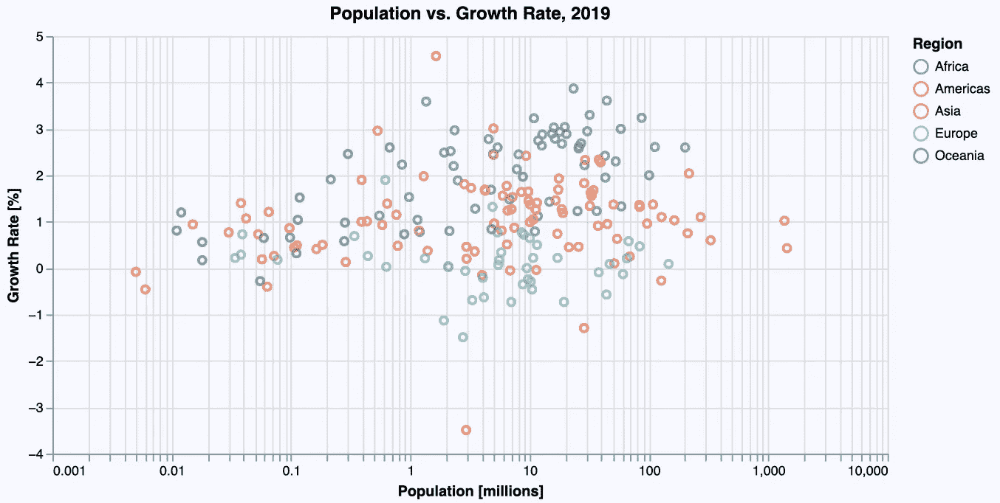

人口与增长率的关系(2)[图片由作者提供]

# 直方图

对于绘制直方图，VegaLite 严格遵循 GoG，因为它使用与条形图相同的几何图形(唯一的区别是，x 轴上的数据在一个称为宁滨的过程中被映射到人工类别)。下面的代码使用下面的`@vlplot`-命令创建了一个直方图，显示了不同国家的人均 GDP 分布，命令使用了一个 *bar* 几何图形，参数`bin`设置为`true`:

```
countries |>
    @vlplot(
        width = 600, height = 300,
        :bar,
        x = {:GDPperCapita, bin = true}, y = “count()”
    )
```

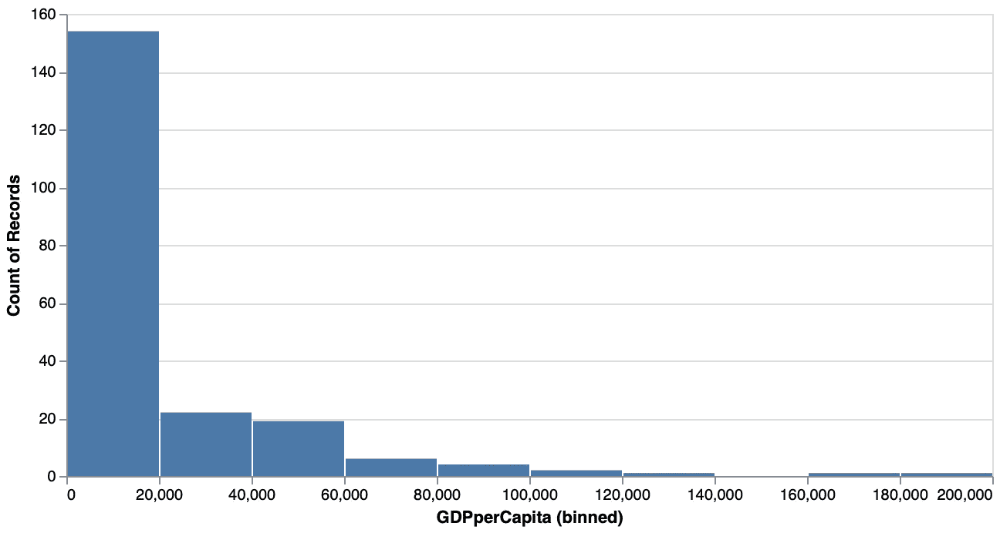

人均 GDP 分布(1)[图片由作者提供]

默认情况下已经选择了一个合理的 bin 大小(牛虻不是这样的)。

在下一步中，我们再次添加标签等。为了获得与牛虻示例中完全相同的箱数，我们使用以下代码将其显式设置为 20:

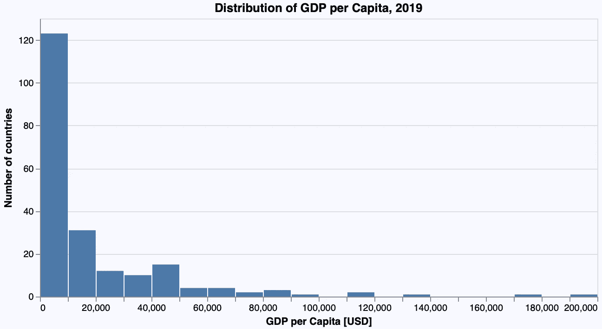

人均国内生产总值的分布(2)[图片由作者提供]

# 盒子情节和小提琴情节

接下来的图表显示了每个地区的人均国内生产总值的分布，首先使用了箱线图，然后使用了小提琴图。

## 箱形图

我们跳过使用默认值的版本，直接进入基于`boxplot`几何图形的“美化”版本:

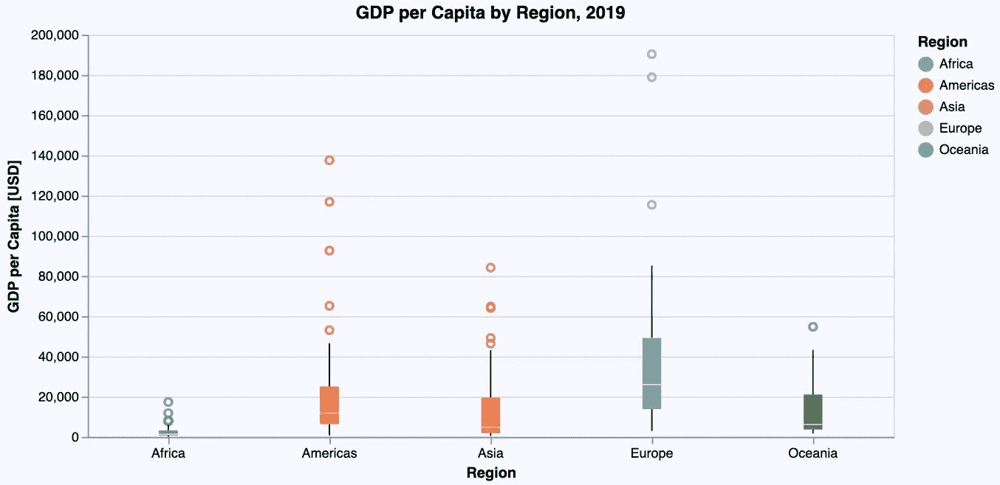

各地区人均 GDP 分布(1)[图片由作者提供]

## 小提琴情节

由于 VegaLite 本身并不支持小提琴图作为一种几何图形，它们必须使用水平排列的*密度图*(每个区域一个)来构建。这导致了以下相当复杂的规范:

用于创建密度图的基本几何图形是一个*区域*几何图形。然后将数据按区域分组，并计算每组的密度。这是使用`transform`操作完成的。将密度指定给 x 轴会产生垂直密度图。在下一步中，使用`column-`属性水平排列所有五个密度图。

最后一行中的`width`和`spacing`属性定义每列(即每个密度图)的水平宽度为 120 像素，并且在这些图之间不留任何空间。

于是我们终于得到了如下的小提琴情节:

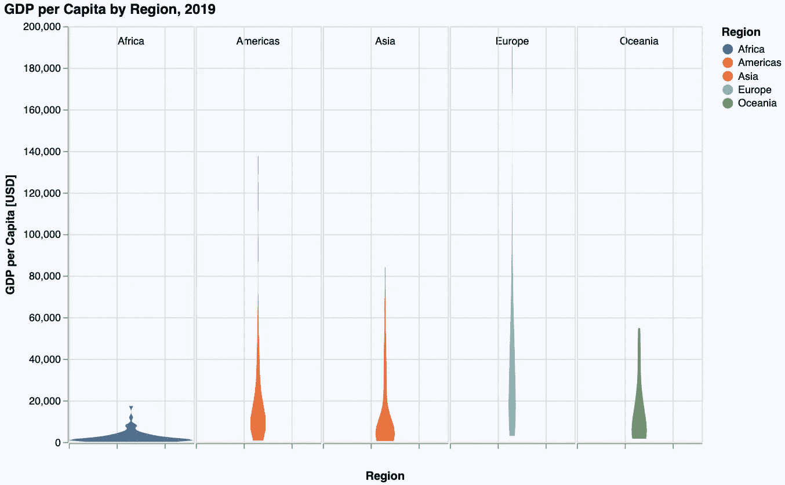

各地区人均 GDP 分布情况(2)[图片由作者提供]

# 放大

在牛虻的例子中，我们注意到，分布中真正有趣的部分在 0 到 100，000 美元之间。因此，我们希望将图限制在 y 轴上的范围内，进行放大。

在牛虻的例子中，我们将 y 轴上的值限制在这个范围内，以达到预期的效果。这种限制也可以在 VegaLite 中使用`scale = {domain = [0, 100000]}`指定。不幸的是，这并没有给出我们想要的结果:图表将在此范围内绘制，但图表本身仍然使用高达 200，000 美元的整个范围，因此部分绘制在图表之外:

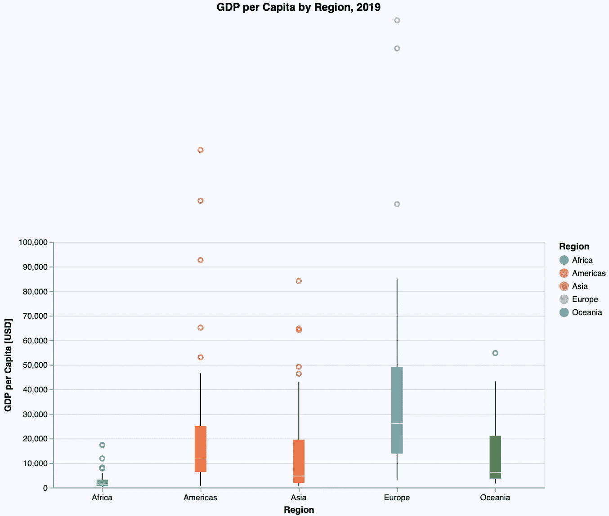

各地区人均 GDP 分布情况(3)[图片由作者提供]

在 VegaLite 中获得大致相似结果的唯一方法是使用一个`filter`表达式将*数据*限制在 100，000 美元范围内。但是要注意:这在概念上是不同的，给我们的不是完全相同的图，就好像我们要在整个数据集上做一样。所以我们没有一个真正的可视化解决方案。

这可能只是 VegaLite 文档的一个问题，我找不到任何其他解决方案(或者是我没有做足够的研究，例如还使用了 Vega-Lite 的大量文档)。

# 结论

我认为，上面的例子很好地表明，VegaLite 是另一个 Julia 图形包，它非常接近图形语法的概念(甚至比牛虻更接近)。对 VegaLite 来说也是如此，他的发现是，情节规范非常一致，因此容易学习。

但是正如我们在 violin 情节中看到的，如果事情不是预先定义的，规范可能会变得非常复杂。加上相当非朱利安语法需要一些时间来学习和习惯，我不会向偶尔用户推荐 VegaLite。它需要一些学习和训练。但是如果你投入时间和精力，你会得到一个真正强大的(交互式的)可视化工具。

VegaLite 的一个有趣的附加组件是交互式数据浏览器 *Voyager* (参见: [DataVoyager.jl](https://github.com/queryverse/DataVoyager.jl) )。这是一个允许加载数据和创建各种可视化的应用程序，无需任何编程。

如果你想自己尝试上面的例子，你可以从我的 GitHub 库中得到一个 [Pluto notebook](https://github.com/roland-KA/StatisticalPlotsWithJulia/blob/main/notebooks/DV-Basics-VegaLite.jl) ，它是本文的一个可执行变体。