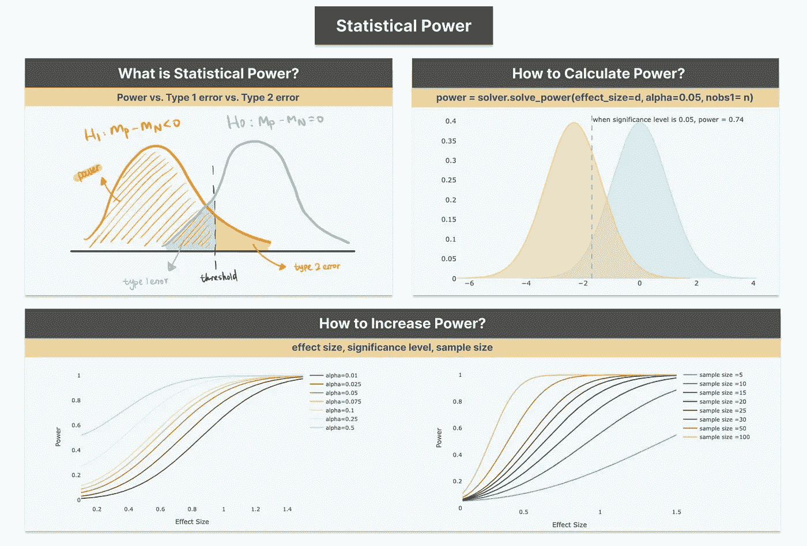
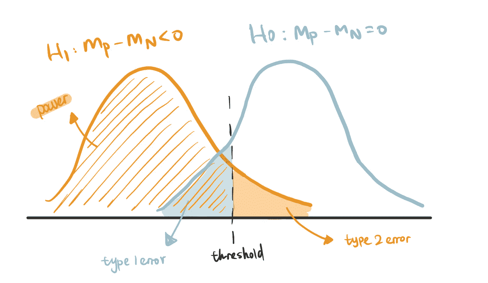
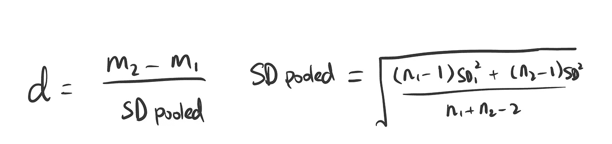
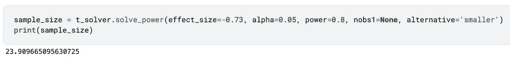

# 假设检验中的统计功效——直观解释

> 原文：<https://towardsdatascience.com/statistical-power-in-hypothesis-testing-visually-explained-1576968b587e>

## 权力是什么/为什么/如何的互动指南



假设检验中的统计能力(图片来自我的[网站](https://www.visual-design.net/)

# 什么是统计能力？

统计功效(Statistical Power)是假设检验中的一个概念，它计算当一个效应实际上是积极的时，检测到一个积极效应的概率。在我之前的文章中，我们演练了进行[假设检验](/an-interactive-guide-to-hypothesis-testing-in-python-979f4d62d85)的程序。在本帖中，我们将通过在假设检验中引入统计能力来建立这一点。

## 电源和类型 1 错误和类型 2 错误

当谈到功率时，似乎不可避免地会提到 1 型和 2 型误差。它们都是比较**预测结果**和**实际结果的著名假设检验概念。**

让我们继续使用我以前的文章“[假设检验的交互式指南](/an-interactive-guide-to-hypothesis-testing-in-python-979f4d62d85)”中的 t-test 例子来说明这些概念。

</an-interactive-guide-to-hypothesis-testing-in-python-979f4d62d85>  

*总结:我们使用了单尾双样本 t 检验来比较两个客户样本——接受活动优惠的客户和拒绝活动优惠的客户。*

```
recency_P = df[df['Response']==1]['Recency'].sample(n=20, random_state=100)
recency_N = df[df['Response']==0]['Recency'].sample(n=20, random_state=100)
```

*   零假设(H0):接受和不接受报价的顾客在*新近度*上没有区别——用下面的蓝线表示。
*   替代假设(H1):与不接受报价的客户相比，接受报价的客户具有更低的*新近度*——用下面的橙色线表示。



权力图解(图片由作者提供)

**类型 1 错误(假阳性)**:如果值落在图表中的蓝色区域内，即使它们在零假设为真时出现，我们也选择拒绝零假设，因为它们低于阈值。因此，我们正在犯第一类错误或假阳性错误。它与显著性水平(通常为 0.05)相同，这意味着我们允许 5%的风险，即当事实上没有差异时，声称接受报价的客户具有较低的新近性。类型 1 错误的结果是，公司可能向具有低新近值的人发出新的活动提议，但是响应率不好。

**第二类错误(假阴性)**:如橙色区域中突出显示的，它是当替代假设实际上为真时拒绝替代假设的概率——因此当实际上存在差异时，声称两组之间没有差异。在商业环境中，营销团队可能会失去一个潜在的高投资回报的目标活动机会。

**统计功效(真正):****正确** **接受替代假设为真时的概率。**与第二类错误正好相反:*幂= 1 —第二类错误*，我们正确预测接受报价的客户比不接受报价的客户更有可能有较低的新近度。

将鼠标悬停在下面的图表上，您将看到当我们应用不同的阈值时，功耗、1 型误差和 2 型误差是如何变化的。(*查看我的网站上的* [*代码片段*](https://www.visual-design.net/code-snippets) *部分，如果你想自己构建的话)*

# 为什么要使用统计能力？

显著性水平广泛用于确定假设检验的统计显著性。然而，这只是故事的一部分——尽量避免声称存在真正的影响/差异**,因为实际上并不存在差异。**一切都基于假设**零假设为真。如果我们想看到事情积极的一面——当另一个假设为真时，做出正确结论的概率——该怎么办？我们可以使用能量。**

此外，功效在确定样本量时也发挥了作用。小样本量可能偶然给出小的 p 值，表明它不太可能是假阳性错误。但这并不能保证有足够的证据证明是真的。因此，通常在实验之前定义功效，以**确定为检测真实效果提供充分证据所需的最小样本量**。

# 如何计算功率？

功效的大小受三个因素影响:**显著性水平、样本量和效应量**。Python 函数`solve_power()`计算给定参数值的功率— *effect_size，alpha，nobs1* 。

让我们使用上面的客户新近度示例来进行功耗分析。

```
from statsmodels.stats.power import TTestIndPower
t_solver = TTestIndPower()
power = t_solver.solve_power(effect_size=recency_d, alpha=0.05, power=None, ratio=1, nobs1= 20, alternative='smaller')
```

*   **显著性水平:**我们设置 ***alpha*** 值为 0.05，这也决定了 1 类错误率为 5%。 ***备选项= '较小'*** 是指定备选项假设:两组之间的均值差小于 0。
*   **样本大小: *nobs1*** 指定样本 1 的大小(20 个客户) ***比率*** 是样本 2 相对于样本 1 的观察次数。
*   **效果大小:*效果大小*** 计算为相对于合并标准差的平均差之间的差。对于双样本 t 检验，我们使用 Cohen 的 d 公式来计算效应大小。我们得到了 0.73。通常，0.20、0.50、0.80 和 1.3 被认为是小、中、大和非常大的效果大小。



```
# calculate effect size using Cohen's d
n1 = len(recency_N)
n2 = len(recency_P)
m1, m2 = mean(recency_N), mean(recency_P)
sd1, sd2 = np.std(recency_N), np.std(recency_P)
pooled_sd = sqrt(((n1 - 1) * sd1**2 + (n2 - 1) * sd2**2) / (n1 + n2 - 2))
recency_d = (m2 - m1)/pooled_sd
```

如上图交互图“功效、1 型误差和 2 型误差”所示，显著性水平为 0.05 时，功效为 0.74。

# 如何增加统计能力？

功效与效应大小、显著性水平和样本量正相关。

## 1.效果大小

当效果大小增加时威力也会增加(*查看* [*代码片段*](https://www.visual-design.net/code-snippets) *)*

较大的效应大小表明相对于合并的标准差，平均值的差异较大。当效应大小增加时，表明两个样本数据之间有更多观察到的差异。因此，权力增加，因为它提供了更多的证据，替代假设是正确的。将鼠标悬停在线上，查看随着效果大小的变化，功率如何变化。

## 2.显著性水平/第一类误差

重要级别增加时功率增加(*查看* [*代码片段*](https://www.visual-design.net/code-snippets) *)*

在类型 1 误差和类型 2 误差之间有一个折衷，因此如果我们允许更多的类型 1 误差，我们也将增加功率。如果您将鼠标悬停在第一个交互式图表“功率、1 型和 2 型误差”的线条上，您会注意到，当我们试图减轻 1 型误差时，2 型误差会增加，而功率会减少。这是因为，如果将假阳性错误降至最低，我们就提高了标准，并为我们可以归类为积极影响的东西增加了更多的限制。当标准太高时，我们也在降低正确分类一个正面效果的概率。因此，我们不能让他们都完美。因此，第一类误差为 0.05，功率为 0.8 时，应用一个通用阈值来平衡这种折衷。

## 3.样本量

功率随着样本大小的增加而增加(*检出* [*代码片段*](https://www.visual-design.net/code-snippets) *)*

功效也与样本量成正相关。大样本量降低了数据的方差，因此样本的平均值将更接近总体平均值。因此，当我们观察样本数据中的差异时，它不太可能是偶然发生的。如交互图所示，当样本量大到 100 时，很容易以相对较小的效果尺寸达到 100%的功效。

在假设检验中，我们经常颠倒这一过程，并使用下面的代码推导出给定期望功效时所需的样本大小。对于这个例子，需要在每个样本组中有大约 24 个客户来运行功效为 0.8 的 t 测试。



希望这篇文章对你有所帮助。如果你想阅读更多这样的文章，我将非常感谢你的支持，注册成为[中级会员](https://destingong.medium.com/membership)。

# 带回家的信息

本文介绍了一个统计学概念——权力，并回答了一些与权力有关的问题。

*   什么是统计能力？—功率与 1 型误差和 2 型误差相关
*   我们为什么使用统计能力？—功率可用于确定样本大小
*   如何计算功率？—功效由效应大小、显著性水平和样本大小计算得出。

## 更多这样的文章

</an-interactive-guide-to-hypothesis-testing-in-python-979f4d62d85>  

[德斯坦贡](https://destingong.medium.com/?source=post_page-----1576968b587e--------------------------------)

## 开始学习数据科学

[View list](https://destingong.medium.com/list/get-started-in-data-science-8006bb4ba3ad?source=post_page-----1576968b587e--------------------------------)8 stories

[德斯坦贡](https://destingong.medium.com/?source=post_page-----1576968b587e--------------------------------)

## 机器学习实用指南

[View list](https://destingong.medium.com/list/practical-guides-to-machine-learning-a877c2a39884?source=post_page-----1576968b587e--------------------------------)10 stories

*原载于 2022 年 5 月 8 日 https://www.visual-design.net*<https://www.visual-design.net/post/statistical-power-in-hypothesis-testing>**。**