# 用 SciPy 检验两个独立样本均值的统计显著性

> 原文：<https://towardsdatascience.com/statistical-significance-testing-of-two-independent-sample-means-with-scipy-638cb834b4d1>

## 数据科学基础

## Python 假设检验初学者指南

AB 测试或随机实验是金标准方法，用于了解感兴趣的治疗对所考虑的结果的因果影响。对于任何数据爱好者来说，能够评估 AB 测试结果并对治疗做出推断是一项有用的技能。在本帖中，我们将着眼于评估 Python 中连续数据的两个独立样本均值之间差异的统计显著性的实用方法。


托尔加·乌尔坎在 [Unsplash](https://unsplash.com?utm_source=medium&utm_medium=referral) 上拍摄的照片

# 📜基础

在最简单的 AB 测试中，我们有两个变量需要比较。在一个变体中，比如说变体 A，我们将默认设置设置为基线。被分配了默认场景的记录通常被称为*控制组*。在另一个变体中，比如说变体 B，我们引入了利息处理。被分配治疗的记录通常被称为*治疗组*。我们假设这种治疗方法可以为我们提供一定的优于默认设置的好处，并想测试假设在现实中是否成立。在 AB 测试中，变异被随机分配到记录中，这样两组都是可比较的。

现在，假设我们刚刚从 AB 测试中收集完样本数据。是时候评估治疗对结果的因果影响了。我们不能简单地比较两组之间的差异，因为它只能告诉我们特定的样本数据，而不能告诉我们更多关于总体的信息。为了从样本数据中做出推断，我们将使用*假设检验*。

# 🔬假设检验

我们将使用几种不同测试的组合来分析样本数据。我们将看看两种不同的选择。

## 🔎选项 1

这是我们的选项 1 流程的样子:

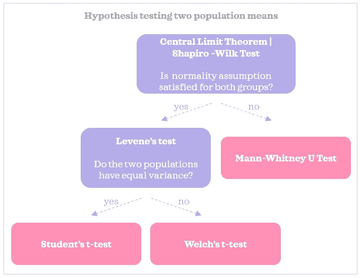

选项 1

学生 t 检验是比较两个不成对样本均值的常用检验，因此我们将在可行的情况下使用学生 t 检验。但是，为了使用学生的 t 检验，我们将首先检查数据是否满足以下假设。

**📍正态性假设** 学生的 t 检验假设*两组均值的抽样分布呈正态分布*。让我们澄清一下我们所说的*均值的抽样分布*是什么意思。假设我们抽取一个大小为 n 的随机样本，我们记录它的平均值。然后，我们取另一个大小为 n 的随机样本，并记录其平均值。我们这样做，假设总共 10，000 次，以收集许多样本均值。如果我们绘制这 10，000 个均值，我们将看到*均值的抽样分布*。

根据*中心极限定理* :
◼️无论总体分布如何，当样本大小为 30 左右或更多时，均值的抽样分布接近正态。
◼️对于正态分布的总体，即使样本量较小(即小于 30)，均值的抽样分布也将接近正态。

让我们看一个 Python 中的简单例子。我们将为两组创建一个假想的人口数据:

```
import numpy as np
import pandas as pd
from scipy.stats import (skewnorm, shapiro, levene, ttest_ind, 
                         mannwhitneyu)
pd.options.display.float_format = "{:.2f}".formatimport matplotlib.pyplot as plt
import seaborn as sns
sns.set(style='darkgrid', context='talk', palette='Set2')N = 100000
np.random.seed(42)
pop_a = np.random.normal(loc=100, scale=40, size=N)
pop_b = skewnorm.rvs(10, size=N)*50fig, ax = plt.subplots(1, 2, figsize=(10,5))
sns.histplot(pop_a, bins=30, kde=True, ax=ax[0])
ax[0].set_title(f"Group A (mean={pop_a.mean():.2f})")
sns.histplot(pop_b, bins=30, kde=True, ax=ax[1])
ax[1].set_title(f"Group B (mean={pop_b.mean():.2f})")
fig.suptitle('Population distribution')
fig.tight_layout()
```

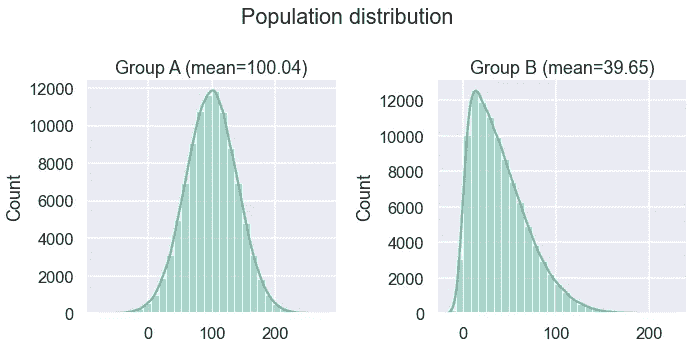

我们可以看到，A 组的人口数据是正态分布的，而 B 组的人口数据是右偏的。现在，我们将分别用 2 和 30 个样本量绘制两个总体均值的抽样分布图:

```
n_draw = 10000
for n in [2, 30]:
    np.random.seed(42)
    sample_means_a = np.empty(n_draw)
    sample_means_b = np.empty(n_draw)
    for i in range(n_draw):
        sample_a = np.random.choice(pop_a, size=n, replace=False)
        sample_means_a[i] = sample_a.mean()

        sample_b = np.random.choice(pop_b, size=n, replace=False)
        sample_means_b[i] = sample_b.mean()

    fig, ax = plt.subplots(1, 2, figsize=(10,5))
    sns.histplot(sample_means_a, bins=30, kde=True, ax=ax[0])
    ax[0].set_title(f"Group A (mean={sample_means_a.mean():.2f})")
    sns.histplot(sample_means_b, bins=30, kde=True, ax=ax[1])
    ax[1].set_title(f"Group B (mean={sample_means_b.mean():.2f})")
    fig.suptitle(f"Sampling distribution of means (n={n})")
    fig.tight_layout()
```

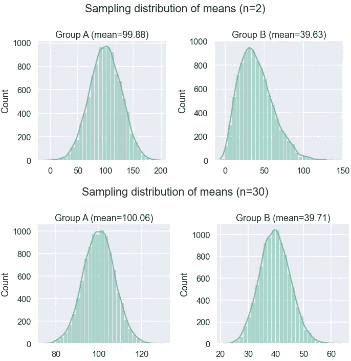

我们可以看到，即使是 2 的小样本量，总体 A 的均值的抽样分布也是正态分布的，因为总体一开始就是正态分布的。当样本容量为 30 时，均值的抽样分布均近似正态分布。我们看到抽样分布中样本均值非常接近总体均值。这里有很多关于均值的抽样分布和正态性假设的额外资源可供阅读:
◼️ [样本均值的分布](https://courses.lumenlearning.com/wmopen-concepts-statistics/chapter/distribution-of-sample-means-3-of-4/)
◼️ [正态性假设](http://www2.psychology.uiowa.edu/faculty/mordkoff/GradStats/part%201/I.07%20normal.pdf)

所以这意味着，如果两组样本都是 30 或以上，那么我们假设这个假设是成立的。当样本容量小于 30 时，我们用夏皮罗-维尔克检验来检验总体是否正态分布。如果检验表明其中一个总体不是正态分布的，那么我们将使用 Mann-Whitney U 检验作为比较两个样本均值的替代检验。这个测试没有对正态性做出假设。

**📍等方差假设** 学生的 t 检验也假设两个总体的方差相等。我们将使用 Levene 的测试来找出两组是否具有相等的方差。如果符合正态假设，但根据 Levene 的检验，不符合等方差假设，我们将使用 Welsh 的 t-检验作为替代，因为 Welsh 的 t-检验没有作出等方差假设。

## 🔨选项 2

根据 [this](https://www.rips-irsp.com/articles/10.5334/irsp.82/) 和 [this source](http://daniellakens.blogspot.com/2015/01/always-use-welchs-t-test-instead-of.html) ，我们可以使用韦尔施的 t 检验作为学生 t 检验的默认。以下是资料来源的作者描述的一些转述和简化的主要原因:
◼️等方差在现实中是非常不可能的
◼️·莱文的检验往往具有低功效
◼即使两个群体具有等方差，韦尔施的 t 检验也与学生的 t 检验一样有效。

因此，我们可以考虑一个更简单的替代方案:

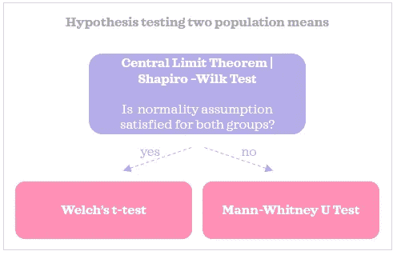

选项 2

现在，是时候将这些选项翻译成 Python 代码了。

# 🔎例子

假设我们已经收集了以下样本数据:

```
n = 100
np.random.seed(42)
grp_a = np.random.normal(loc=40, scale=20, size=n)
grp_b = np.random.normal(loc=60, scale=15, size=n)df = pd.DataFrame({'var': np.concatenate([grp_a, grp_b]), 
                   'grp': ['a']*n+['b']*n})
print(df.shape)
df.groupby('grp')['var'].describe()
```

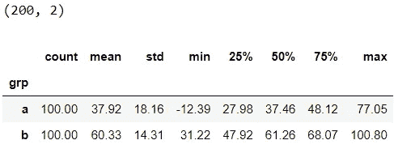

下面是两个样本数据的分布:

```
sns.kdeplot(data=df, x='var', hue='grp', fill=True);
```

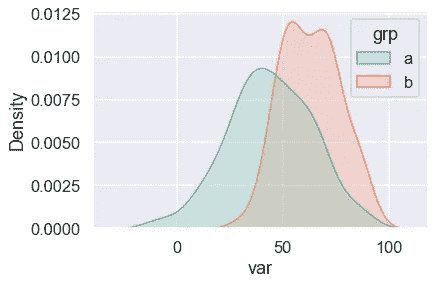

## 情景一:治疗有影响吗？

我们将假设我们想要检验以下假设:

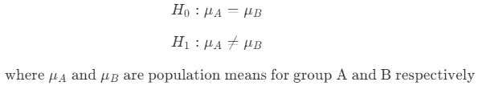

无效假设通常是保守地认为治疗没有效果。只有当我们有足够的统计证据时，我们才会拒绝零假设。换句话说，除非证明有影响，否则没有影响。如果平均值在统计学上有显著差异，那么我们可以说治疗有影响。这将是一个双尾测试。我们将使用 0.05 的 alpha 来评估我们的结果。

让我们根据选项 1 流程创建一个函数来测试差异:

太棒了，我们将使用函数来检查总体均值是否不同:

```
check_mean_significance1(grp_a, grp_b)
```


很好，p 值非常接近 0，并且低于α，我们拒绝零假设，并得出结论，我们有足够的统计证据表明两组的均值不同:治疗有影响。

现在让我们修改选项 2 的代码片段:

是时候将它应用到我们的数据集了:

```
check_mean_significance2(grp_a, grp_b)
```

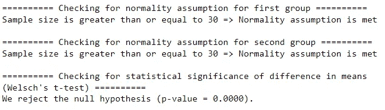

太棒了，我们在这个例子中得到了相同的结论，因为在第一个选项中没有满足等方差假设。

## 场景 2:治疗有正面影响吗？

在上面的场景中，我们并不关心撞击的方向。在实践中，我们经常想知道治疗是否有积极的影响(或消极的影响，取决于所考虑的结果)。所以我们将稍微改变一下假设:

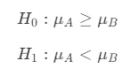

现在，这变成了一个单尾测试。我们将重用该函数，但这次我们将使用`alternative`参数将测试从双尾测试改为单尾测试:

```
check_mean_significance1(grp_a, grp_b, alternative='less')
```

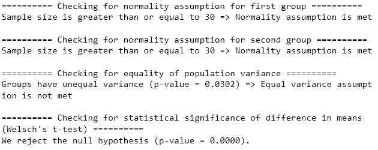

由于 p 值低于α，我们拒绝零假设，并得出结论，我们有足够的统计证据表明，治疗组的均值在统计上显著高于对照组:治疗对结果有影响。

为了完整起见，让我们看看选项 2:

```
check_mean_significance2(grp_a, grp_b, alternative='less')
```

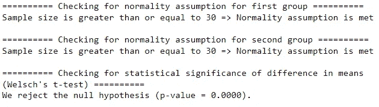

瞧，我们已经到了文章的结尾。希望你已经学会了比较样本均值并对总体做出推断的实用方法。有了这项技能，我们可以帮助做出许多重要的决定。


Avinash Kumar 在 [Unsplash](https://unsplash.com?utm_source=medium&utm_medium=referral) 上拍摄的照片

*您想访问更多这样的内容吗？媒体会员可以无限制地访问媒体上的任何文章。如果你使用* [*我的推荐链接*](https://zluvsand.medium.com/membership)*成为会员，你的一部分会费会直接去支持我。*

感谢您阅读这篇文章。如果你感兴趣，这里有我其他一些帖子的链接:

◼️ [在 r 中粗化精确匹配](/coarsened-exact-matching-in-r-a36ae7ef6849)
◼️ [倾向得分匹配](/propensity-score-matching-a0d373863eec)
◼️ [用 SHAP 解释 Scikit-learn 模型](/explaining-scikit-learn-models-with-shap-61daff21b12a)
◼️️ [K 近邻解释](/k-nearest-neighbours-explained-52c910c035c5)
◼️️ [逻辑回归解释](/logistic-regression-explained-7695f15d1b8b)
◼️️ [比较随机森林和梯度推进](/comparing-random-forest-and-gradient-boosting-d7236b429c15)
◼️️ [决策树是如何建立的？](/how-are-decision-trees-built-a8e5af57ce8?source=your_stories_page-------------------------------------)
◼️️ [管道、列变压器和特性 Union 说明](/pipeline-columntransformer-and-featureunion-explained-f5491f815f?source=your_stories_page-------------------------------------)

再见🏃 💨