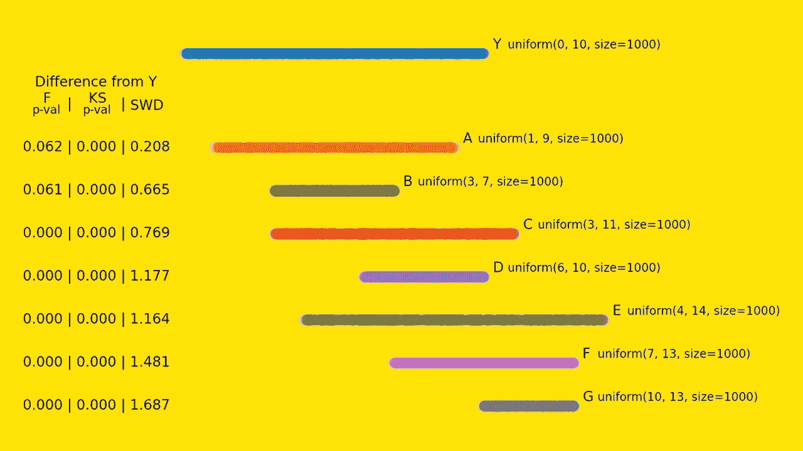
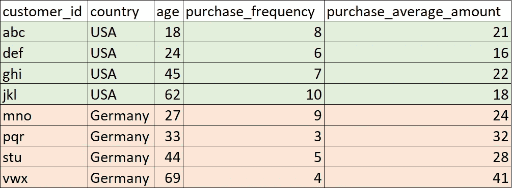
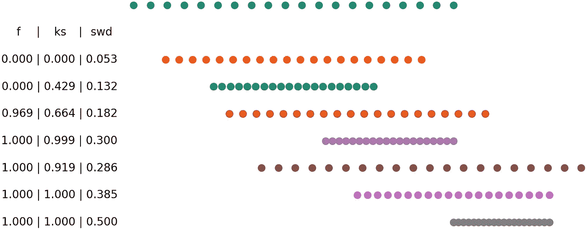
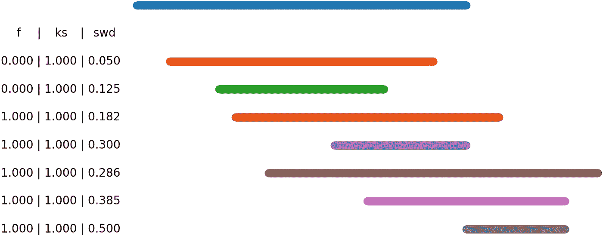
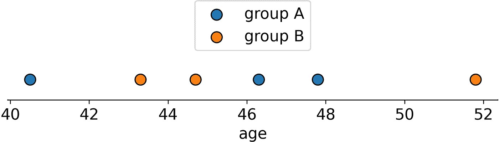
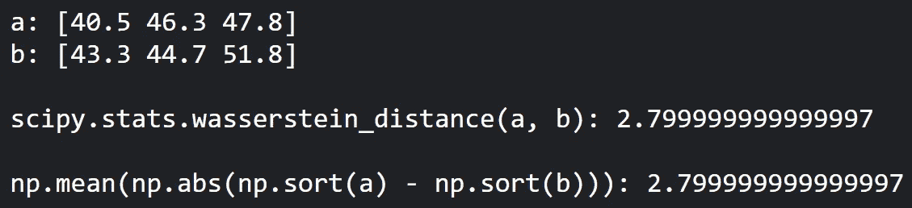
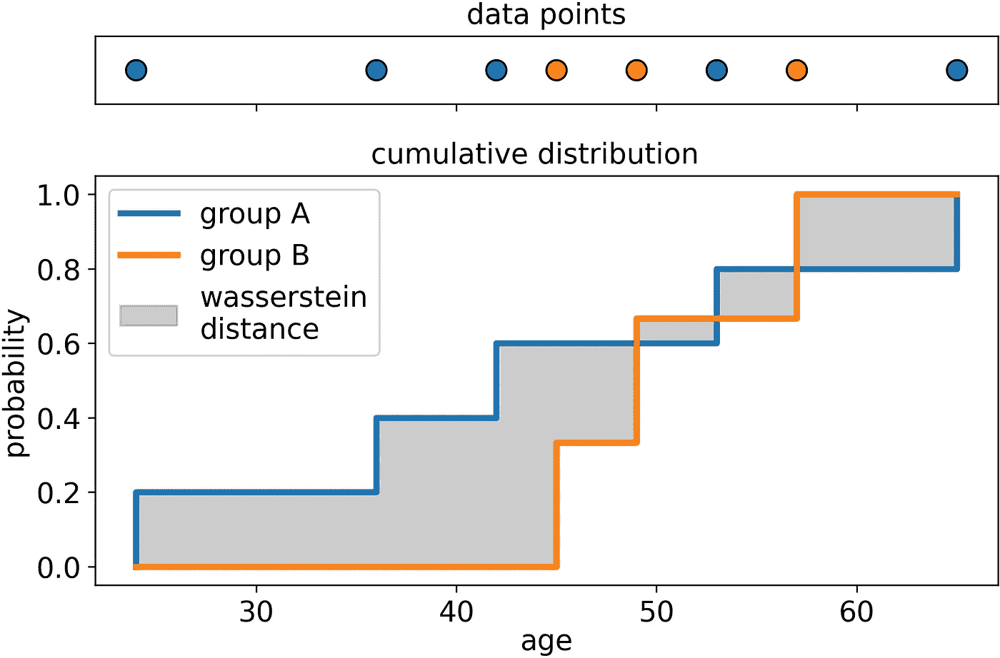
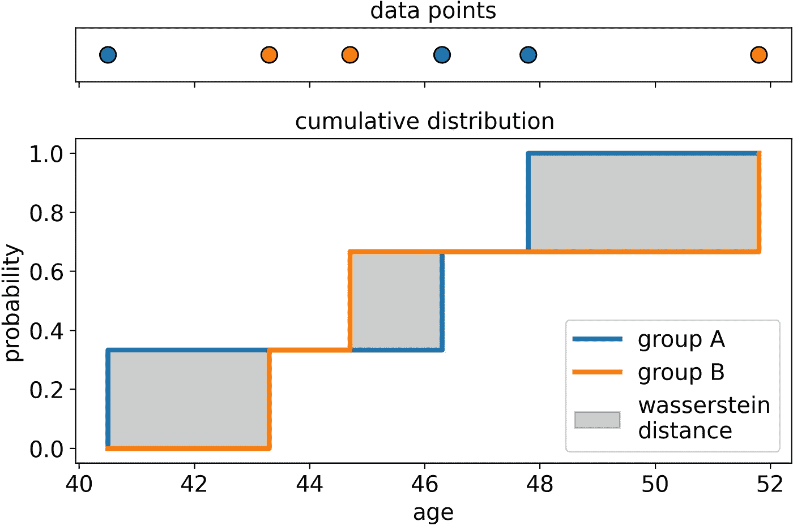
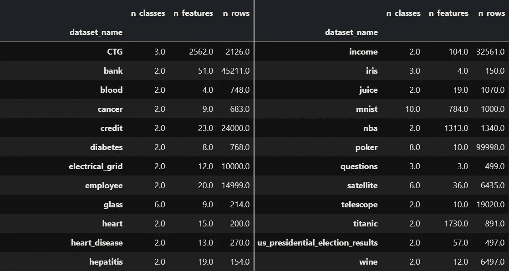
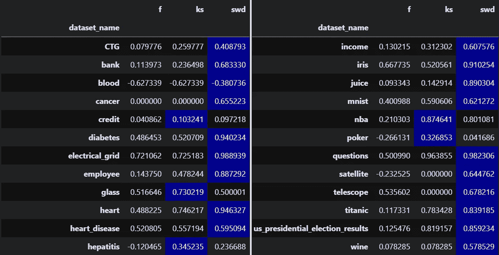

# 统计测试不会帮助你比较分布

> 原文：<https://towardsdatascience.com/statistical-tests-wont-help-you-to-compare-distributions-d829eefe418>

## 忘记 p 值，开始了解“标准化的 Wasserstein 距离”:一个实际有用的测量分布之间差异的方法。



[图片由作者提供]

O 数据世界中最常出现的问题之一，从**机器学习**到**商业分析**，从**金融**到**医学研究**是:

> "这些变量在这些群体中有多大差异？"

我打赌你以前去过那里。您有一个数据集和两组(或更多组)客户，比如来自美国的客户和来自德国的客户，并且您记录了一些变量，如年龄、购买频率和平均购买金额。



[图片由作者提供]

您想知道哪个变量更能区分美国客户和德国客户。或者，换句话说，**美国和德国客户之间哪个变量的差异更大**。

要做到这一点，你需要**一种测量分布差异的方法**，例如，德国客户的年龄与美国客户的年龄有多大差异，等等。

这项措施在许多领域都很有用:

*   **机器学习**。在预测分析中，确定哪些功能可能更具预测性非常有用。此外，它还有助于检测分布变化(也称为培训/服务偏差)。
*   **聚类分析**。它允许识别哪些特征将一个给定的聚类与群体的其余部分区分开来。
*   **数据/业务分析**。它可以突出显示哪些变量在客户群体(或细分市场)之间更具鉴别力。

# p 值是不够的

我见过的更常用于评估分布差异的方法来自统计学:

*   **F 检验(p 值)**，检验各组均数之间是否存在统计意义上的显著差异；
*   **Kolmogorov-Smirnov 检验(p 值)**，检验各组的分布之间是否存在统计显著性差异。

原则上，人们喜欢使用 p 值的原因很明显。因为 p 值总是在 0 和 1 之间，所以它们很容易在不同变量之间进行比较。例如，如果变量“年龄”的 p 值为 30%，而“购买频率”的 p 值为 3%，那么购买频率在两组中明显有更大的差异。

> 请注意，在下文中，我将使用 1 减去 p 值来代替 p 值，p 值可以粗略地解释为分布之间的差异显著的概率。

然而，**使用统计测试的 p 值很少是最佳选择**。我举个例子解释一下。

下面，我绘制了 8 个分布，每个分布由 20 个数据点组成，从最小值到最大值等距分布。蓝色组包含 0 到 10 之间的点，橙色组包含 1 到 9 之间的点，依此类推。

在每组的旁边，我报告了关于分布本身和蓝色分布之间的差异的以下指标:

*   F: 1 减去 f 检验的 p 值；
*   KS: 1 减去 Kolmogorov-Smirnov 检验的 p 值；
*   SWD:标准化 Wasserstein 距离(即不是统计检验)；



20 个数据点的不同均匀分布。第一列是 1 减去 f 检验的 p 值。第二列是 1 减去 Kolmogorov-Smirnov 检验的 p 值。第三列是按距离标准化的瓦瑟斯坦距离。[图片由作者提供]

f 给出的信息很差，因为它只确定两组的均值之间是否有显著差异。尽管如此，你可能认为 KS 的结果是可以接受的，因为它随着分布离蓝色分布“更远”而增加。

但是如果我们用 1000 个数据点而不是 20 个数据点重复同样的过程会发生什么呢？



1000 个数据点的不同均匀分布。第一列是 1 减去 f 检验的 p 值。第二列是 1 减去 Kolmogorov-Smirnov 检验的 p 值。第三列是按距离标准化的瓦瑟斯坦距离。[图片由作者提供]

如你所见，KS 现在毫无用处。事实上，区分不同的分布没有帮助:**1 到 9(橙色点)之间的均匀分布与 10 到 13(灰色点)之间的均匀分布具有相同的 p 值**。

相反，标准化的 Wasserstein 距离(SWD)做得很好，因为它给了我们一个关于每个分布与基准分布有多大不同的非常准确的想法。

为了理解什么是标准化的瓦瑟斯坦距离，我们先来看看瓦瑟斯坦距离计算背后的逻辑。

# 瓦瑟斯坦距离

Wasserstein distance 背后的想法简单得令人尴尬。

假设我们有 2 个组，A 组和 B 组，每组由 3 个人组成，他们的年龄都有记录。问题是:我们如何衡量 A 组和 B 组的年龄差异？



两组点。[图片由作者提供]

想象一下，按照年龄对两组进行排序，通过将 A 的第一个元素与 B 的第一个元素放在一起，将 A 的第二个元素与 B 的第二个元素放在一起，以此类推，来形成对。瓦瑟斯坦距离是 B 的每一点与 A 的对应点之间的**平均距离。**

换句话说，瓦瑟斯坦距离回答了这个问题:

> 平均来说，当**保持点的相对位置**时，你应该移动一组中的每个点多少来得到另一组？


具有相同点数的两组之间的距离。[图片由作者提供]

根据这个定义，计算 Wasserstein 距离非常简单，我们还可以检查它是否给出了与 Scipy 的实现相同的结果:



当数组 a 和数组 b 具有相同的长度时，很容易再现 Scipy 的 Wasserstein 距离的相同输出。[图片由作者提供]

然而，**这个定义只适用于具有相同数量**的组。为了使这个概念更普遍，我们必须用累积分布的概念来扩展它。

事实上，在更一般的情况下，Wasserstein 距离被计算为两组累积分布曲线之间的**面积**。只有当两个累积分布完全重叠时，它才等于 0，并且随着分布的远离，它可以是任意大的。

注意，计算两个累积分布之间的面积非常简单，因为它总是矩形的和。



累积分布之间的 Wasserstein 距离。[图片由作者提供]

因此，我们可以调整我们先前的定义，说瓦瑟斯坦距离回答了这个问题:

> 平均来说，当**保持点数的分位数**时，你应该将一组中的每个点数移动多少才能得到另一组？

我们还可以验证这个定义在我们的第一个例子中是否成立:



累积分布之间的 Wasserstein 距离。[图片由作者提供]

```
swd = (43.3-40.5) * .33 + (44.7-46.3) * .33 + (51.8-47.8) * .33
    = 2.8 * .33 + 1.6 * .33 + 4.0 * .33 
    = 2.8
```

这是我们最初发现的数字。

# 标准化瓦瑟斯坦距离

从上一段可以清楚地看出，Wasserstein 距离(作为平均距离计算)取决于要素的测量单位。这是一个问题，因为它不允许比较不同的特性。

为了获得一个可比较的度量，我们应该在某些方面标准化瓦瑟斯坦距离。有许多选项可用，例如将其除以变量的范围(即最大值减去最小值)或除以四分位数范围(即第 75 个百分点减去第 25 个百分点)。

然而，我更喜欢的是**将 Wasserstein 距离除以变量的标准差**(即 A 组和 B 组总共的标准差)。我们终于有了我们一直在寻找的指标:

```
import numpy as np
from scipy.stats import wasserstein_distancedef **standardized_wasserstein_distance**(a, b):
 **"""a and b are numpy arrays."""**  numerator = wasserstein_distance(a, b)
  denominator = np.std(np.concatenate([a, b]))
  return numerator / denominator if denominator != .0 else .0
```

以下是标准化 Wasserstein 距离的一些有用属性:

*   **大于等于 0** (其中 0 表示两个分布完全相同)；
*   **可能大于 1**；
*   不同变量之间具有可比性，因为**是一个纯数字**；
*   可以解释为“**通过多少个标准差，平均下来，我们要移动一组的每一个点，才能得到另一组**”。

# 在真实数据集上验证 SWD

为了评估标准化的瓦瑟斯坦距离是否真的比其他指标更好，我在 24 个数据集上进行了测试(在 Keras 中可用，在 [Apache 许可](https://github.com/keras-team/keras/blob/master/LICENSE)下，在 [Pycaret](https://github.com/pycaret/pycaret) 中可用，在 [MIT 许可](https://github.com/pycaret/pycaret/blob/master/LICENSE)下)。

每个数据集都有一个离散的目标变量，我们将把它用作集群化的自然“基础事实”。下面，我报告了每个数据集的主要统计数据:目标变量中的类的数量、列(或特性)的数量以及行的数量。



用于测试指标的 24 个数据集的主要统计数据。[图片由作者提供]

使用目标变量作为分组变量，对于每个数据集的每一列，我计算了:

*   f 检验(1 减去 p 值)；
*   Kolmogorov-Smirnov 检验(1 减去 p 值)；
*   标准化瓦瑟斯坦距离(瓦瑟斯坦距离除以全分布的标准差)；
*   特征重要性(在训练 CatBoost 分类器，然后提取列的重要性之后获得)。

这是最终输出的一瞥(大约有 7 千行，每个数据集的每个要素一行):


输出表的 5 个随机行。[图片由作者提供]

合理的预期是**具有高特征重要性的列必须具有正分布和负分布之间的高差异**。

因此，衡量指标的优劣的代表是衡量指标本身与 CatBoost 估计的特性重要性之间的**相关性**。为此，我计算了 F、KS、SWD 和 CatBoost 的特性重要性之间的相关性。以下是 24 个数据集的结果:



每个数据集的 F、KS、SWD 和要素重要性之间的相关性。[图片由作者提供]

可以看出， **SWD 在大多数时候都优于其他指标**。此外，通过取相关系数的平均值，我们可以得到:


所有数据集的 F、KS、SWD 和要素重要性之间的平均相关性。[图片由作者提供]

平均而言，SWD 与 CatBoost 估计的特征重要性的相关性为 62%,而 KS p 值仅为 39 %, F p 值仅为 19%,从而证实了我们最初的猜测，即 SWD 是评估分布之间差异的更好的指标。


您可以在下面的笔记本中找到我在本文中使用的全部代码:[https://github . com/smazzanti/standardized _ wasser stein _ distance/blob/main/swd . ipynb](https://github.com/smazzanti/standardized_wasserstein_distance/blob/main/swd.ipynb)


*感谢您的阅读！我希望你喜欢这篇文章。如果你愿意，* [*在 Linkedin 上加我*](https://www.linkedin.com/in/samuelemazzanti/) *！*