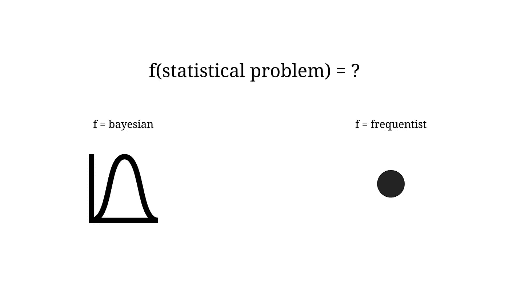

# 统计学 101:可信区间与置信区间

> 原文：<https://towardsdatascience.com/statistics-101-credible-vs-confidence-interval-af7b7e8fdd79>

## 在 5 分钟内掌握可信和置信区间背后的想法

照片由 [Unsplash](https://unsplash.com?utm_source=medium&utm_medium=referral) 上的 [agus prianto](https://unsplash.com/@agusprianto?utm_source=medium&utm_medium=referral) 拍摄

> 根据贝叶斯定理，没有理论是完美的。相反，它是一项正在进行的工作，总是要接受进一步的完善和测试。—内特·西尔弗

在人工智能时代，贝叶斯统计当然成为热门话题。一个简单但很好的解释是，贝叶斯框架能够减少机器学习模型的不确定性，从而实现可靠的预测。今天，我的目的是挖掘贝叶斯统计中的一个核心概念:**可信区间**。虽然可信区间的概念很简单，但很多时候它与众所周知的表亲**置信区间**相混淆。

## 贝叶斯和频率主义框架

在深入本文的主题之前，让我回顾一下贝叶斯和频率主义框架背后的关键思想。重要的是对这两个框架有一个基本的了解，以便更好地定义可信区间和置信区间。

在 **frequentist 框架**中，一个事件发生的概率等于同一过程重复多次时该事件发生的长期频率。例如，在频率主义哲学下，患特定疾病的*概率被解释为患特定疾病*的*长期频率。对于许多事件的概率来说，这是有意义的，但当事件没有长期发生频率时，这就变得更难理解了。*

> 需要记住的事情: [frequentist](https://www.ncbi.nlm.nih.gov/pmc/articles/PMC1114120/) 方法将人口值视为一个固定的、不变的(但未知的)量，没有概率分布。

相反，在**贝叶斯框架**中，概率只是简单地表达了对一个事件的相信程度(置信度)，可以通过一个分布来描述。在我们添加来自数据的知识之前，人口比例的概率分布表达了我们对它的先验信念。比如，你最初的信念是“*这篇文章没用*”，但是读完第一段(你看到一些数据)，*你决定继续读*。最后让我知道你的想法是什么！

这种思维方式来自于贝叶斯定理的**历时解释**。*【历时】*表示某事随着时间的推移而发生；在这种情况下，假设的概率(我们的信念)会随着时间的推移而改变，因为我们会看到新的数据。

> 要记住的事情:[贝叶斯](https://www.ncbi.nlm.nih.gov/pmc/articles/PMC1114120/)方法是基于这样一个想法，即未知量，如人口平均数和比例，具有概率分布。

总之，如果我们应该总结频率主义者和贝叶斯框架，我们可以说:

*   如果我们有一个**统计问题**，我们用**频数学家**方法处理它，结果，我们将得到**不动点估计值**。
*   如果我们有一个**统计问题**，我们用**贝叶斯**框架处理它，结果，我们将得到**分布**。

作者图片——贝叶斯与频率主义框架:预期结果

## 置信区间

**frequentist 置信区间**具有以下长期频率概念:来自相同目标人群且具有相同样本大小的随机样本将产生包含真实(未知)估计值的 ci，其频率(百分比)由置信水平设定。实际上，从同一人群中随机抽取几个样本是相当复杂的；相反，我们从感兴趣人群的单个样本中收集数据，并计算该样本的置信区间。 [**这个特定置信区间的解释将是**](https://www.ncbi.nlm.nih.gov/pmc/articles/PMC6630113/) :我们可以 XX% (90%，95%，99%)确信，基于假设的重复实验，真实(未知)估计值将位于置信区间的下限和上限之内。

> 话虽如此，XX%的置信水平并不意味着对于给定的已实现区间，总体参数有 XX%的概率位于该区间内！

## 可信区间

像置信区间一样，**可信区间**描述和总结了与你试图估计的未知参数相关的不确定性，但是使用了概率分布。虽然置信区间和可信区间的目标是相似的，但它们的统计定义和意义却非常不同。事实上，后者是使用基于假设和近似的复杂技术计算的，可信区间的计算和解释非常简单。

由于贝叶斯推断返回可能效应值的分布(后验)，因此[可信区间](https://easystats.github.io/bayestestR/articles/credible_interval.html)就是包含特定百分比的可能值的范围。例如，95%可信区间就是包含 95%值的后验分布的中心部分。

与频率区间相比，贝叶斯区间可能更容易理解。事实上，贝叶斯框架允许我们说*“给定观察到的数据，效应有 XX%的概率落在这个范围内”*，相比之下，更复杂、更频繁的替代方案将是“*”，当从这种数据计算置信区间时，有 XX%的概率，效应落在这个范围内*。

## 结论

频数 XX% **置信区间**意味着在大量重复样本的情况下，XX%的此类计算置信区间将包括参数的真实值。在 frequentist 术语中，参数是*固定的*(不能认为具有可能值的分布)，置信区间是*随机的*(因为它取决于随机样本)。另一方面，贝叶斯可信区间是基于估计参数是具有分布的随机变量的思想。因此，**可信区间**就是后验分布域中的一个区间，在该区间内，一个未观察到的参数值以特定的概率落入。

一般来说，很容易混淆，但在我看来，可信区间的概念比置信区间的概念更直观。在第一种情况下，对概率和分布的基本理解足以理解可信区间背后的思想。

在这篇文章中，我想给你一个快速的介绍统计学中这两个重要的概念，不要太技术化或数学化。我希望读完这篇文章后，你会有一个额外的武器来区分可信区间和置信区间。