# 统计训练营 2:中心、变化和位置

> 原文：<https://towardsdatascience.com/statistics-bootcamp-2-center-variation-and-position-9de00a231e80>

## [统计训练营](https://towardsdatascience.com/tagged/statistics-bootcamp)

## 学习作为数据科学家日常使用的库背后的数学和方法


作者图片

为了更正式地解决关于媒体的统计讲座系列的需求，我已经开始创建一系列的统计训练营，如上面的标题所示。这些将建立在彼此的基础上，因此将被相应地编号。这样做的动机是以一种自下而上的方式使统计知识民主化，以满足数据科学界对更正规的统计培训的需求。这些将从简单开始，向上和向外扩展，一路上有练习和工作实例。谈到工程、编码和统计，我个人的哲学是，如果你理解数学和方法，现在使用大量库的抽象就会消失，让你成为生产者，而不仅仅是信息的消费者。对许多学习者/读者来说，这些的许多方面将是一个回顾，然而有一个全面的理解和一个参考资源是重要的。快乐阅读/学习！

在第二篇文章中，我们将讨论描述性统计。即数据分组和分布。

## 数据

假设我们有以下数据集:

```
34 78 98 56 74 74 93
88 67 89 91 95 73 70
49 56 87 97 76 85 71
66 78 90 84 58 76 73
81 90 93 89 77 79 84
73 67 74 89 90 50 76
98 46 88 78 89 56 69 
```

*   关于这个数据集，我们可能会问什么问题？
*   我们该如何开始回答这些问题呢？

让我们首先按照从最小值到最大值的顺序组织数据集:

```
34, 46, 49, 50, 56, 56, 56, 58, 66, 67, 67, 69, 70, 71, 73, 73, 73, 74, 74, 74, 76, 76, 76, 77, 78, 78, 78, 79, 81, 84, 84, 85, 87, 88, 88, 89, 89, 89, 89, 90, 90, 90, 91, 93, 93, 95, 97, 98, 98
```

*提示:可以在 Python 中使用* `list.sort()` *或者在 R* 中使用 `sort(list)`

# *频率表*

*从这里，让我们创建一个**频率表**。**频率**是通过计算属于特定类别的独特观察值的数量而得到的。**类**，这里用的是我们的分组类别。当我们考虑该类的**宽度**时，它们应该都具有相同的大小(例如下面显示的 10)。我们的频率列表产生了我们的**频率分布—** 是所有类别及其频率的列表。将此与**相对频率**进行比较，相对频率是一个类的频率与观察总数的比率(该类中独特观察的比例)。最后，我们有我们的**相对频率分布**，这是所有类及其相对频率的列表。创建或使用频率表时的一些通用指南:*

1.  *类的数量应该在提供有效的摘要和显示数据的相关特征之间取得平衡*
2.  *每个观察值必须只属于一个类(互斥)*
3.  *每个类应该有相同的宽度*

```
*Class  |  Frequency  |   Relative Frequency
_____________________________________________
30-39         1                 0.02
40-49         2                 0.04
50-59         5                 0.10
60-69         4                 0.08
70-79         16                0.33
80-89         11                0.22
90-99         10                0.20
Total         49                1.00*
```

## *累积频率*

*我们可以通过实现累积频率和累积相对频率来增加我们的相对频率表。为此，我们按升序处理列出的数据，并将我们“所在”类之前的所有类中的唯一实例总数相加，得出**累积频率。**类似于相对频率，**累积相对频率**，是包含的数据相对于整体的比例。*

```
*Class| Freq.| Relative Freq.| Cumulative Freq.| Cumulative Rel. Freq
____________________________________________________________________
30-39    1         0.02              1                0.02
40-49    2         0.04              3                0.06
50-59    5         0.10              8                0.16
60-69    4         0.08              12               0.24
70-79    16        0.33              28               0.57
80-89    11        0.22              39               0.80
90-99    10        0.20              49               1.00
Total    49        1.00*
```

# *分布*

*一个**分布**可以有多种形式(表格、图表或公式)。然而，它总是/提供的是观察值，以及它们出现的频率(记住我们上面的频率表！).分布的形状在决定使用适当的统计方法时起着非常重要的作用。*

*以下是你在职业生涯中可能会遇到的一些分布形状:*

*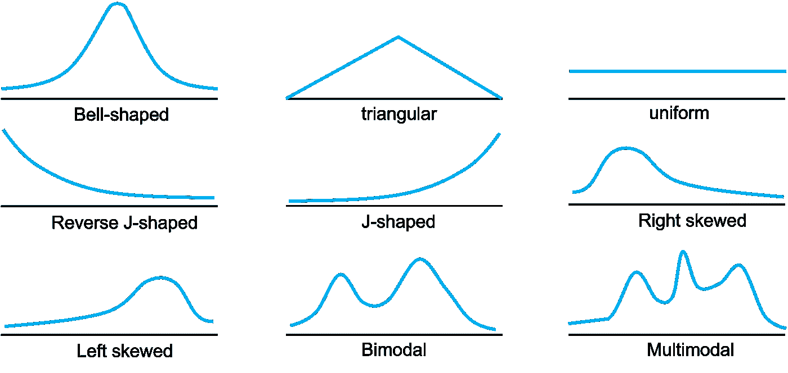*

*作者图片*

*分布的**模态**是峰值的数量。所以单峰是 1，双峰是 2，多峰大于 2 个峰。**对称性**存在于一个分布中，如果它能被分成互为镜像的两部分。在上图中，钟形、三角形和均匀分布都被认为是对称的。**偏斜度**存在于非对称的单峰分布。*右偏*分布，或许与直觉相反，表明该分布的*右尾*比左尾长，因此峰值出现在左侧，反之亦然*左偏*。*

*稍微提醒一下，人口数据的分布叫做**人口分布**，样本数据的分布叫做**样本分布**！*

# *描述性措施*

*正如我们在第一次训练营中所介绍的，参数是对总体的描述性度量，统计是对样本的描述性度量。*

*我们将涵盖 3 种描述性措施:*

1.  *集中趋势测量*
2.  *变化的度量*
3.  *位置的度量*

# *1.中心的度量*

***算术平均值**(平均值)是值的总和除以值的总数。尽管无论是计算样本还是总体，数学都是相同的，但符号不同:*

**

***中值**是数据数组中的*中点*，要求你的数据按顺序排列。*

*   *如果数据数组大小是偶数，则选择中间的两个数据点，并求它们的平均值*
*   *如果数据数组大小为奇数，则选择中间值*
*   ***当有异常值时，使用中位数很重要***

*数据的**中间值**是数据集中最低值和最高值之和除以 2。*

***模式**是数据集中出现频率最高的值。如果你回想我们上面的频率表，这将构成最高频率的类/值。*

*出于复习目的，请尝试回答这些问题:*

**举个例子。有一个最高频率的类的分布叫什么？
举例。频率最高的两节课呢？**

*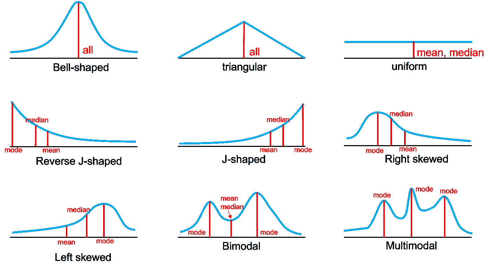*

*作者图片*

*为了说明你是如何被中心度量引入歧途的，让我们用一个例子来说明。*

**举例。两个对立队的篮球支付者的身高，单位为英寸:
第一队的数据集:72，73，76，76，78
第二队的数据集:67，72，76，76，84
这里，两个数据集具有相同的平均值、中间值和众数！接下来，我们来看看变化/扩散的衡量标准……**

# *2.变化的度量*

*我们可以用不同的方式来思考数据集的跨度。例如，数据集的**范围**是最高值减去最低值。然而，最常见的是**标准差**。标准差是观察值与平均值的平均差距。请注意计算中的差异，因为它在样本与总体指标之间有所不同:*

*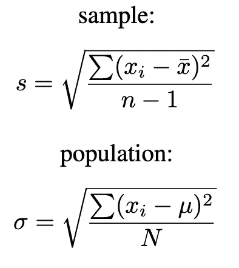*

***变异系数(CVar)** 用于当单位不同时比较两个变量的标准偏差(变异)。CVar 越大，变化越大。*

*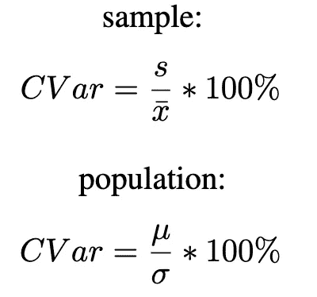*

**举例。哪个数据集的变异更多？
数据集 1: 41，44，45，47，47，48，51，53，58，66
数据集 2: 20，37，48，48，49，50，53，61，64，70
集 1 均值:50
集 1 std。戴夫。:7.4
设置 2 平均值:50
设置 2 标准值。戴夫。:14.2
我们可以看到数据集 2 的标准差较大**

## *切比雪夫定理*

*是来自任何数据集中的值的比例，我们期望这些值落在平均值的“k”个标准偏差内，并且至少是 1-(1/k)，其中“k”是大于 1 的数字。*

*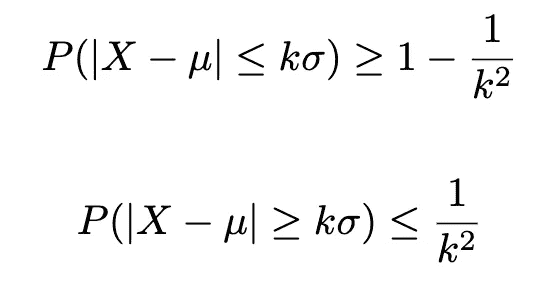*

*   *至少 75%的数据将落在 2 个标准偏差内:
    1-(1/k)= 1-(1/2)= 1–1/4 = 0.75*
*   *至少 88.89%的数据将落在 3 个标准偏差内:
    1-(1/k)= 1-(1/3)= 1–1/9 = 0.8889*
*   *如果我们的均值=50，s=7.4，在 2 个标准偏差范围内
    =(50–2 * 7.4，50+2*7.4) = (35.2，64.8)
    因此，10 次观察中约有 9 次在 35.2 和 64.8 之间，约 90%的数据将在此范围内*

**举例。给定一个数据集的平均值和标准差，如何确定 75%的数据落在哪个值内？**我们倒推一下:
75% = 0.75
0.75 = 1-(1/k)
求解 k:
k = 2**

## *经验常态规则*

***经验正态规则**可以定义为:当数据的分布为钟形(正态分布)时，以下构成经验正态的陈述为真:*

1.  *大约 68.3%的**数据值将落在平均值的 **1** **标准差**内，样本为 x±1s，总体为终点μ 3σ***
2.  ***大约 95.4%的数据值将落在平均值的**2**2**标准差**内，样本为 x±2s，总体为终点μ 2σ***
3.  ***大约 **99.7%** 的数据值将落在平均值的 **3 个标准偏差**内，样本为 x±1s，人口为终点μ 3σ***

******

***作者图片***

## ***正态分布***

***正态分布的特征如上图所示。也称为高斯分布或钟形曲线。正态分布的符号为“N ”,并考虑了平均值和标准偏差:***

***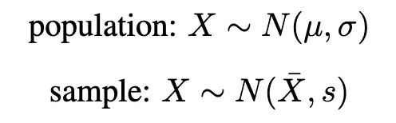***

*****标准正态分布的符号，**表示我们的数据呈正态分布，但平均值以 0 为中心，标准差为 1:***

***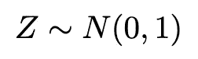******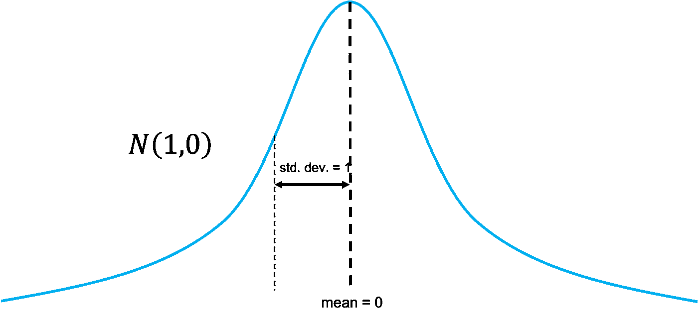***

***作者图片***

***通过执行*标准化，我们可以将我们的正态分布标准化为标准正态分布。*这产生了我们的 Z 值(统计)，我们将在随后的训练营中看到。数据集中的值被转换为 z 值，其中“X”是原始数据值，减去平均值并除以标准偏差。我们对数据集中的每个数据点执行此操作。***

***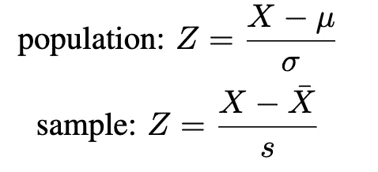***

***这是总体和样本关于均值、标准差和方差的符号的汇总表。***

***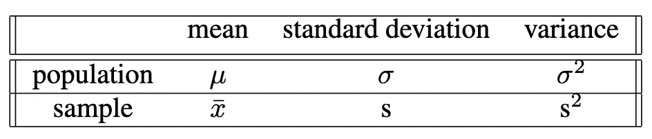***

# ***3.位置的度量***

***百分位数将数据集分成 100 个相等的部分，其中第 p 个百分位数(对应于值“X”)是这样一个值，即数据集中至多 p%的观察值小于该值 X，其余的大于该值。我们可以使用以下公式计算给定值 X 的百分位数:***

***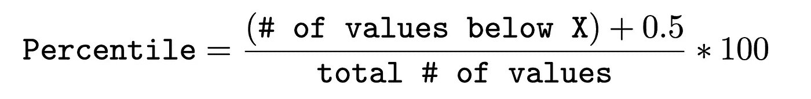***

***你可能接触到的第一个百分位数是在你出生不到一天的时候！我们经常谈论新生儿的身高、体重和头围。这里有一个[链接](https://lilyvolt.com/baby-and-toddler-growth-charts-for-boys)到这样一个图表。从医学角度来看，随着个人年龄的增长，跟踪这种情况可能是不同病理(性早熟、骨病等)的迹象。)如果他们“脱离”他们的曲线或者突然增长等等。***

***顾名思义，允许我们将数据分成四等份和三个分界点——Q1、Q2 和 Q3。***

*   ***Q1 =第 25 百分位***
*   ***Q2 类似于中间值(第 50 百分位)***
*   ***Q3 =第 75 百分位***

*****四分位数间距(IQR)** 是第一个四分位数(Q1)和第三个四分位数(Q3)之间的差值。因此，is 可以表示为:IQR=(Q3-Q1)。***

***当考虑发行时，我们可以用一个 **5 数字总结来概括。**其中三个是四分位数(Q1、Q2、Q3)，提供中间两个四分位数数据的中心和变化的测量。在我们 5 个数字的总结中，最后 2 个数字是提供总数据范围信息的最小和最大数据值。***

***看看我们下面的分布:***

***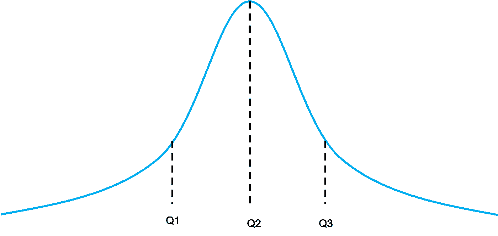***

1.  ***找到中间值，这是 Q2。***
2.  ***求分布前半部分的中位数(即从第一个数据值到中位数)，这就是 Q1***
3.  ***找出分布后半部分的中间值(即从中间值到最后一个值)，这就是 Q3***

***我们使用这些度量来确定数据集中的*偏斜度*，这对于确定运行哪种类型的推断统计非常重要。即使用平均值或米德点，以及任何可能被保证的变换。***

## ***极端值***

***异常值是完全超出数据总体模式的观察值。在数据科学领域，离群值经常在没有参考任何量化指标的情况下被讨论，所以让我们来解决这个问题。如果一个数据点的值分别比数据的上端和下端 Q3 和 Q1 的值大或小 1.5*IQR，我们称之为异常值**。这些离群值在我们内心的栅栏之外。**极端异常值**超过外部围栏，或大于或小于 3*IQR 值。*****

*****下部内栅栏:Q1-(1.5 * IQR)
上部内栅栏:Q3+(1.5*IQR)*****

*****离群值(内部围栏外)
<Q1—(1.5 * IQR)
>Q3+(1.5 * IQR)*****

*****极端异常值(外部围栏)
<Q1—(3 * IQR)
>Q3+(3 * IQR)*****

## *****箱线图*****

*****我们需要 5 个元素来构建我们的箱线图
1。Q1
2。Q2 3。Q3
4。内栅栏
5。外部围栏*****

*   *****画一个边代表 Q1 和 Q3 的方框(总是垂直于数值所在的方向)*****
*   *****在 Q2 的方框内画一条线(与 Q1 和 Q3 的线平行)*****
*   *****画一条平行线，连接 Q1 和仍然在较低的内栅栏内的最小值*****
*   *****画一条平行线，将 Q3 连接到仍在上部内栅栏内的最大值*****

*****您应该会得到如下结果:*****

*****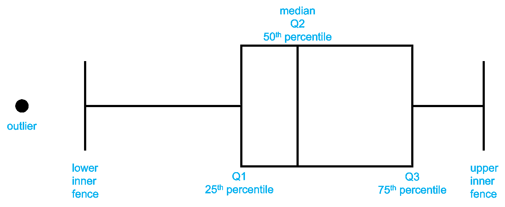*****

*****作者图片*****

*****使用箱线图，我们可以了解数据的中心，通过箱线图每个部分的长度和须状/栅栏的长度来了解变化和偏斜。*****

******例 1。计算偶数个观察值的四分位数:
3，16，17，18，19，20，21，22
Q2 =(18+19)/2 = 18.5
Q1 =(16+17)/2 = 16.5
Q3 =(20+21)/2 = 20.5******

******例二。计算奇数个观察值的四分位数:
53，62，78，94，96，99，103
Q2 = 94
Q1 =？
Q3 =？******

*****关于奇数观测值的 Q1 和 Q3 计算中包含中位数的问题…这实际上取决于你使用的统计软件。不同的引用使用不同的规则:*****

*   *****Excel/SPSS/R —包括 Q2，中位数(94)
    Q1=70
    Q3 = 97.5*****
*   *****Stata 不包括 Q2，中位数(94)
    Q1=62
    Q3 = 99*****

# *****总结*****

*****在本次训练营中，我们介绍了分布和描述性统计。我们已经讨论了中心值的度量——平均值、中间值和众数。你学习了变异的度量——标准差、变异系数、切比雪夫法则和经验法则。位置的四分位数和异常值量化度量。最后，您已经看到了总体和样本之间的符号和计算的不同。*****

*****该系列之前的训练营:*****

*****[#1 奠基](https://medium.com/p/227f934924d9/edit)*****

*****此外，如果你喜欢看到这样的文章，并希望无限制地访问我的文章和所有由 Medium 提供的文章，请考虑使用下面的我的推荐链接注册。会员费为 5 美元/月；我赚一小笔佣金，这反过来有助于推动更多的内容和文章！*****

*****[](https://medium.com/@askline1/membership) *****