# 统计训练营 3:可能…概率

> 原文：<https://towardsdatascience.com/statistics-bootcamp-3-probably-probability-588a2640fc13>

## [统计训练营](https://towardsdatascience.com/tagged/statistics-bootcamp)

## 学习作为数据科学家日常使用的库背后的数学和方法


作者图片

为了更正式地解决关于媒体的统计讲座系列的需求，我已经开始创建一系列的统计训练营，如上面的标题所示。这些将建立在彼此的基础上，因此将被相应地编号。这样做的动机是以一种自下而上的方式使统计知识民主化，以满足数据科学界对更正规的统计培训的需求。这些将从简单开始，向上和向外扩展，一路上有练习和工作实例。谈到工程、编码和统计，我个人的哲学是，如果你理解数学和方法，现在使用大量库的抽象就会消失，让你成为生产者，而不仅仅是信息的消费者。对许多学习者/读者来说，这些的许多方面将是一个回顾，然而有一个全面的理解和一个参考资源是重要的。快乐阅读/学习！

在我们的第三次训练营中，我们将介绍概率。

你觉得在美国坐飞机或开车更安全吗？一种旅行方式比另一种旅行方式的风险大多少？这两个问题都可以通过使用概率来回答。

# 可能性

一个**概率实验**是一个导致明确结果的随机过程，称为结果。一个**结果**是概率实验的一次尝试的结果。一个**事件**是在进行概率实验时可能发生也可能不发生的一些特定结果(可能有多种结果——男孩或女孩)。我们可以使用**样本空间**来定义可能的事件。样本空间列出了概率实验所有可能结果的集合。**概率**是某个*特定*事件发生的几率，是推断统计的基础。

*示例:*

```
| Experiment             | Sample Space                    |
| ---------------------- | ------------------------------- |
| Coin toss              | Heads, tails                    |
| Roll a die             | 1,2,3,4,5,6                     |
| Sex of three people    | {F,F,F},{M,M,M},{M,M,F},{F,F,M} |
| Superbowl winner       | Names of 32 teams               |
```

## 概率的性质

属性 1:事件发生的概率总是在 0 和 1 之间，包括 0 和 1。
性质 2:事件不可能发生的概率为 0。不可能发生的事件称为**不可能事件**。
性质 3:某一事件必须发生的概率为 1。必须发生的事件称为**确定事件。** 性质 4:样本空间中所有可能结果的概率之和为 1。

# 我们如何计数？

这可能看起来像一个愚蠢的副标题，但当我们考虑概率时，正式涵盖是很重要的。我们利用计数规则来量化事件(结果)发生的方式。我们可以用下面的等式来定义它:

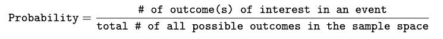

这产生了一个**概率分布**。

*举个例子。如果我们想知道第一个、第二个和第三个孩子的性别(即顺序问题)，找出一个家庭中三个孩子性别的样本空间。我们将使用树形图。树形图是一种示意图，从一个起点发出分支，显示概率实验的所有可能结果。*

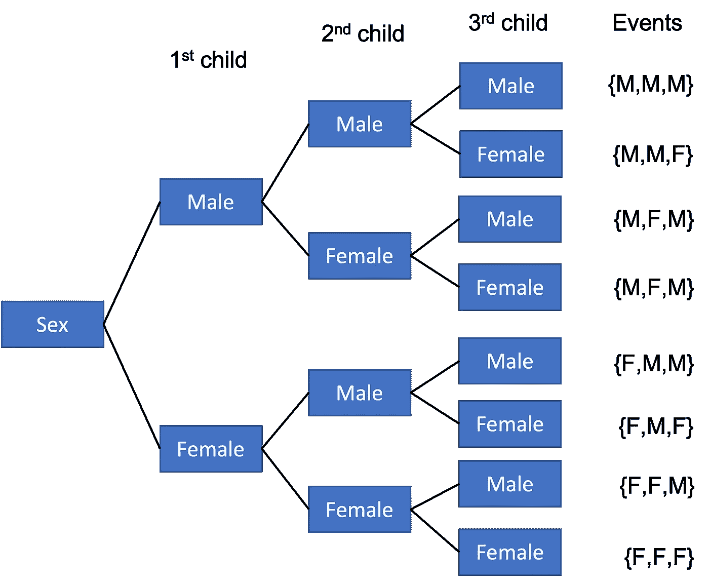

当我们掷骰子两次时，有 36 种可能的结果。请注意，这里结果的顺序很重要。当确定总和为 11 的概率时(表示为:P(sum=11)，这可以通过两种方式实现，5+6 和 6+5。p(sum = 11)=(11 可能发生的方式)/N=2/36=0.056= 5.6%

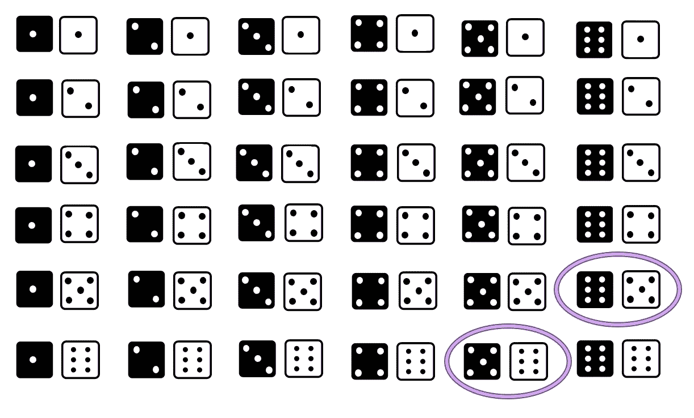

作者图片

当我们一次掷出两个骰子时，样本空间是多少？

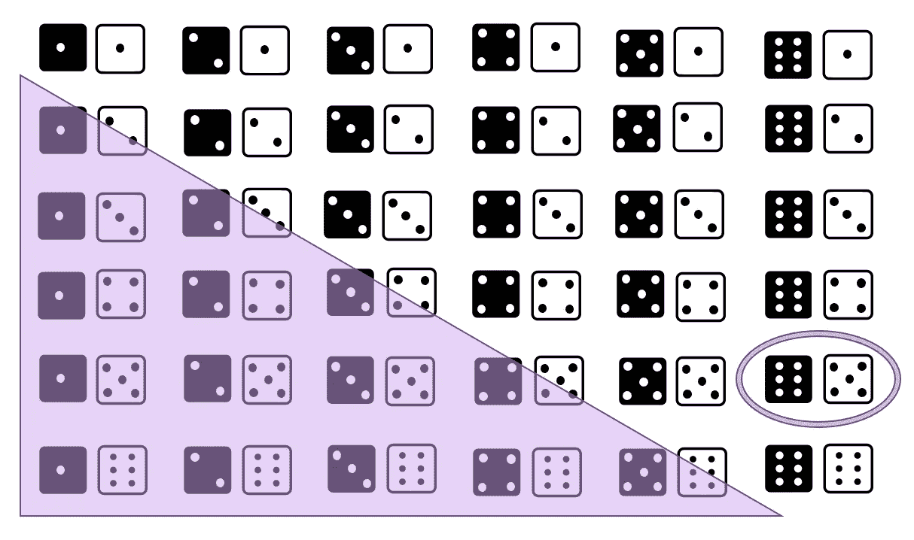

作者图片

样本空间为 21。这种情况下，(5，6)和(6，5)一样，所以只算一次。P(sum=1) = 1/21。所以请注意，当顺序重要和不重要时，样本空间是如何不同的，36 对 21。

## 计数规则

**的基本计数规则**是找出一系列事件中结果的总数，乘以每个事件的结果数。

*举例。糖尿病患者的两个锻炼计划和三个饮食计划。
锻炼计划= 2 个结果
饮食计划= 3 个结果
可能的策略总数= 2*3 = 6*

当允许重复时，基本计数规则适用，即每个事件的结果数不变。

*举例。数字 1-9 用于 6 位学生证。如果允许同一个数字重复出现，有多少张独特的卡片是可能的？
9*9*9*9*9*9 = 9⁶=531441
其中每个“9”是我们必须从中选择的选项(数字)的数量。*

如果不允许重复，那么每个事件的结果数减少 1。因此，如果我们重复上面的例子，但是不允许重复:

*举例。不允许重复:
9*8*7*6*5*4 =60480*

让我们讨论一些公式。

阶乘公式:

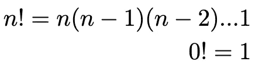

# 排列

**排列**是按照*特定的*顺序排列对象。**排列规则**是每次使用 r 个对象以特定顺序排列对象，称为 n 个对象每次取 r 个对象的排列。想想——‘n Permute r’，它被写成:

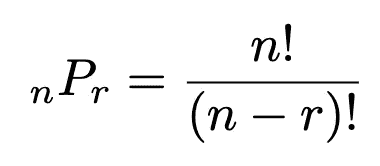

## 排列示例

*举例。如果三位女士(杰姬、玛丽亚和简)参加比赛，有多少种不同的完成顺序？*

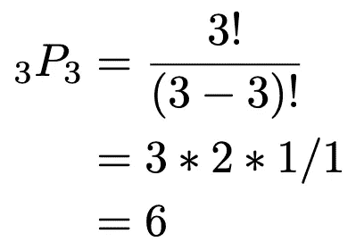

*有 6 种不同的加工顺序。*

*举例。有 5 个人参加了之前的比赛(Jackie、Maria、Carolyn、Carly、Jane ),但是只有前两个人获奖，而且奖金是不同的。前两个选项有多少种不同的排序？*

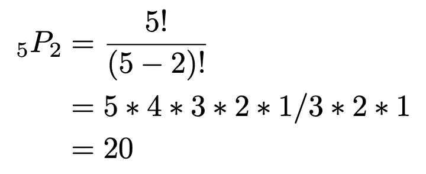

*前两个奖项有 20 种不同的选择。*

# 组合

**组合**是选择不同的对象，不考虑顺序。**组合规则**是可以从 n 个对象中选择 r 个不同对象的方式的数量。想想——‘n 选 r’。

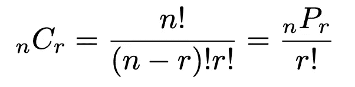

## 组合示例

*举例。7 名女性和 5 名男性社会学研究生。一个 4 人委员会可以有多少种选择方式？*

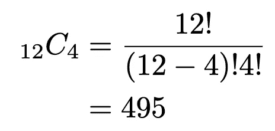

*如果委员会中必须有 2 名男性和 2 名女性，那么可以通过多少种方式选出这个委员会？*

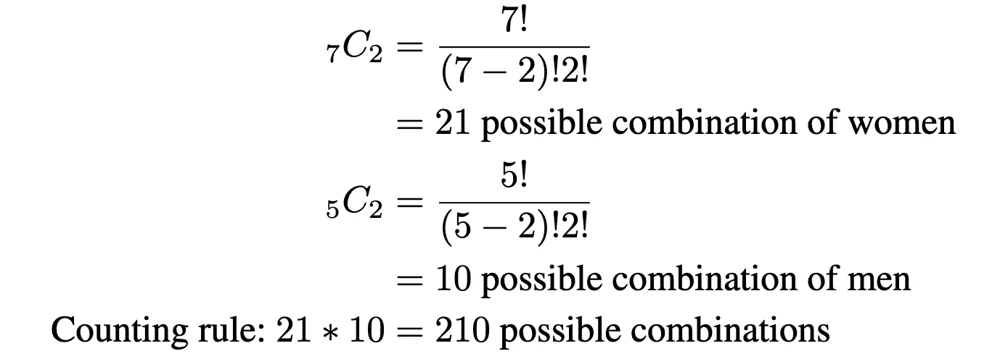

*如果委员会中必须至少有***2 名女学生，那么这个委员会有多少种选择方式？**

*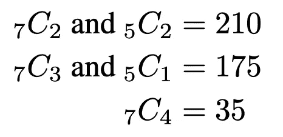*

**组建委员会的可能方式:
-正好 2 女(210 种方式)
-正好 3 女(175 种方式)
-正好 4 女(35 种方式)
合计:420 种方式**

## *互补规则*

***互补规则**可以形式化为:事件的概率 E 是事件不发生的概率值的 100%。*

*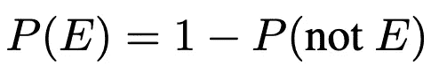*

*换句话说，你要么得到事件，要么得不到事件。E 的补码表示如下:*

*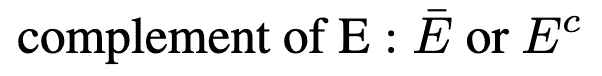**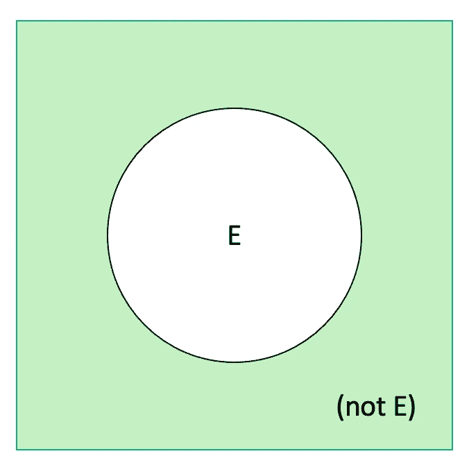*

**举例。如果有 60%的机会(概率)白袜队会赢得世界大赛，有 40%的机会他们不会。**

## *事件之间的关系*

***(非 E)** :事件“E 不发生”
**(A & B)** :事件“A 和 B 都发生”
**(A 或 B)** :事件“A 或 B 发生”*

*我们的样本空间的概率总和必须总是 1，P(S)=1。*

*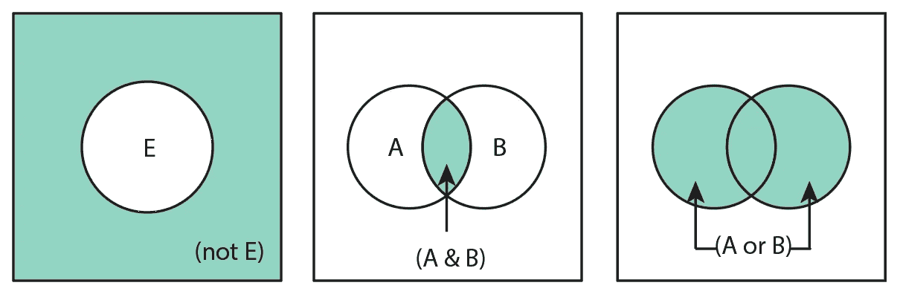*

*作者图片*

## *互斥事件*

*如果事件不能同时发生，则称之为**互斥**。这意味着他们没有共同的结果。P(A & B)=0。*

*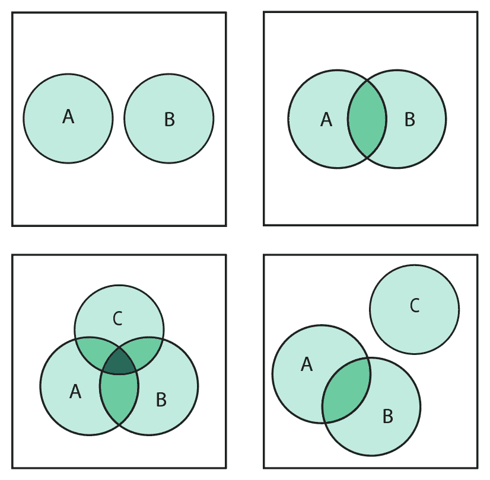*

*作者图片*

*如果你被问及从一副牌中抽取一张牌时得到一个皇后或一颗心的事件，如果被问及这是一个互斥事件，你会怎么回答？你会说“不”。如果你在从一副牌中抽取一张牌时被问及是得到一个梅花还是一颗心，那该怎么办？这些是互斥的吗？是的，他们是！*

# *事件的概率计算*

*在本文中，我们将讨论计算事件时的规则和概率类型。关于事件的计算，我将在随后的训练营中介绍贝叶斯。*

## *加法规则*

***一般加法规则**规定，如果 A 和 B 是任意两个事件，则:*

*P(A 或 B) = P(A) + P(B) - P(A 和 B)*

*如果 A 和 B*互斥*，那么我们应用**特殊加法规则**:*

*P(A 或 B) = P(A) + P(B)*

*写得更一般:*

*P(A 或 B 或 C 或…) = P(A) + P(B) + P(C) +..*

*让我们看看，当事件互斥时，我们是否要使用加法的一般规则。*

**举个例子。如果你被问及从一副牌中抽取一张牌时得到梅花或红心的概率，你会怎么回答？
P(梅花或红心)= P(梅花)+ P(红心)- P(梅花和红心)
= 13/52+13/52-0 = 2/4 = 0.5 = 50%**

*我们得到交点 P(梅花和红桃)的零。如果有三个不互斥的事件会发生什么？你可以用文氏图来帮助回答这个问题。*

*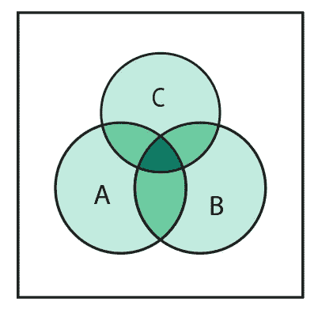*

*作者图片*

*P(A 或 B 或 C) = P(A) + P(B) + P(C) - P(A 和 B) - P(B 和 C) - P(A 和 C) - P(A 和 B 和 C)*

**举例。在一所有 200 名女生的学校，58 人打排球，40 人打篮球，8 人两者都打。随机抽取的女学生两项运动都不玩的概率有多大？V —排球
B —篮球
确定我们被提供的概率是多少。然后，寻找补码**

*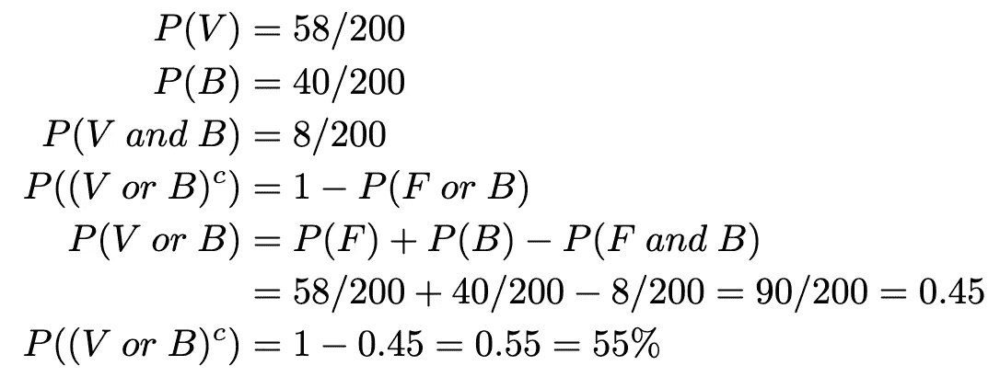*

*万一发生灾难，应急计划是一件好事，但不要与应急表混淆。除非你知道你做了正确的统计作业的应急计划是一个应急表。；)*

***列联表**显示了一个以上分类变量的频率分布。假设我们有一个足球运动员，瓦利德，他受伤了。他随后获得并阅读了有关止痛药的信息，特别是他偶然发现了一项比较两种不同药物及其副作用的研究，见下表。*

*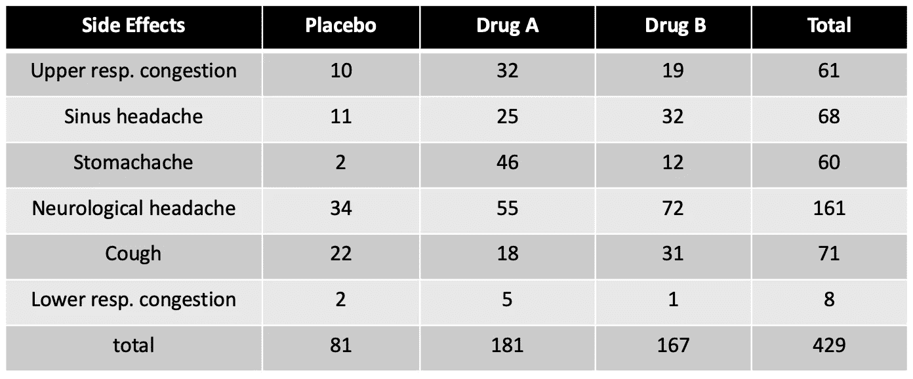*

## *边缘概率*

*假设这项研究中的患者是随机选择的。我们服用药物 A-P(A)的可能性有多大？**边际概率**是单个*事件发生的概率。为了获得一些直觉，你可以把它想成‘药物 A 的基础率/流行率是…’。你可以看到副作用的边际概率在右边，安慰剂、药物 A (=181/429)和药物 B 在底部。**

*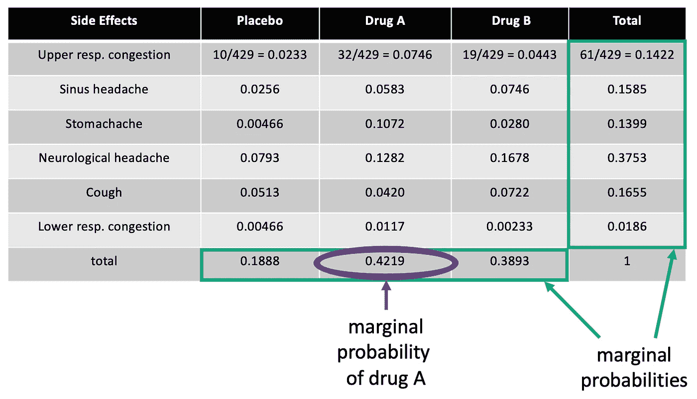*

## *联合概率*

***联合概率**是多个事件同时(并发)发生的概率。*

**举个例子。对于本研究中随机选择的患者，患有窦性头痛并服用药物 B P(窦性头痛和药物 B)的可能性有多大？**

*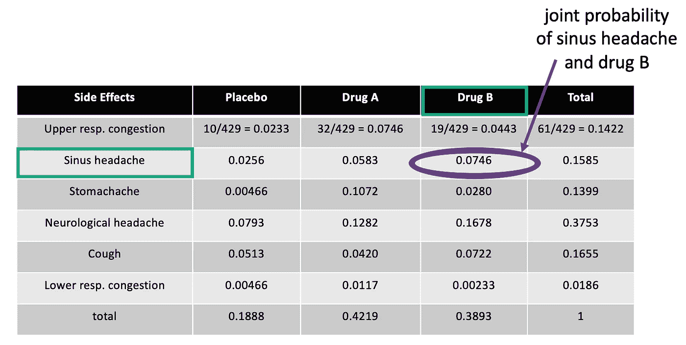*

*同一个表格显示，我们可以通过遵循特定的行和列得出答案，即 0.0746 = 7.46%*

## *条件概率*

*条件概率是事件 H(患者头痛)发生的概率，前提是事件 A(患者服用了药物 A)已经发生。我们用条形符号来表示。P(H|A)，其中“|”可以解释为“给定那个”。*

**举例。对于随机选择的使用药物 A 的患者，他们患窦性头痛的几率是多少？**

*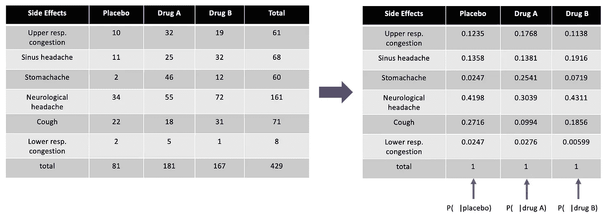*

*所以给定一个随机的病人(' | ')如果给他们开了药 A，他会头痛的概率:P(H|A) = 25/181 = 0.1381。*

*条件概率被定义为:*

*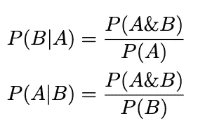*

*你可能在数据科学、统计文章和新闻中听说过并使用过敏感性和特异性这两个术语。认识到这些都是我们日常生活中条件概率的例子是很重要的。:)*

*敏感性:P(试验阳性|疾病存在)
特异性:P(试验阴性|疾病不存在)*

# *乘法规则*

*一般乘法规则是两个事件发生的概率(联合概率)可以用一些数学直觉写成:*

*P(A 和 B) = P(A)*P(B|A) = P(B)*P(A|B)
注:P(A 和 B)与 P(B 和 A)相同*

*三个事件发生的**联合概率**为*

*P(A 和 B 和 C) = P(A|(B 和 C))*P(B 和 C)
注:P(B 和 C) = P(B|C)*P(C)
P(A 和 B 和 C) = P(A|(B 和 C))*P(B|C)*P(C)
注:这些规则适用于任何事件。这些规则不需要任何假设。*

*让我们从医学的角度来思考这个问题。你的病人咳嗽了 3 周，一周前开始出疹子，诊断是什么？考虑两个同时发生的事件的简单或单一解释比两个不同的原因更不可能，这一点总是很重要的。就像奥卡姆剃刀一样，简单的理论比复杂的理论更受青睐。*

# *独立事件*

*如果 A 发生的事实不影响 B 发生的概率，即 P(B|A)=P(B)，则 A 和 B 两个事件是独立的。*

*独立事件的示例:*

1.  *抛几次硬币*
2.  *无关人员的疾病状态(非传染性)；)*
3.  *在不同州进行的研究的测试结果*

*从属事件的示例:*

1.  *在同一个冰球队受伤*
2.  *来自同一家族的个体的基因测序*

## *独立事件的乘法法则*

*为了便于回顾，乘法法则用于计算两个独立事件按顺序发生的概率。我们再来一遍:*

1.  *找出每个事件分别发生的概率*
2.  *根据基本的计数规则，将答案相乘*
3.  *P(A 和 B) = P(A)*P(B|A)，如果独立，则 P(B|A)=P(B)，因此，P(A 和 B) = P(A)*P(B)*

**举例。一枚硬币抛两次，第一次和第二次抛正面的概率是:1/2 * 1/2 = 1/4
HH，TT，HT，TH，4 种可能的结果
所以，P(HH)=1/4=0.25**

**举例。美国数据和统计报告显示，22%的理疗师是男性。如果随机选择 3 个理疗师(A，B，C)，求她们都是女性的概率。
P(随机选择的理疗师为女性)= 1 - P(理疗师为男性)= 1–0.22 = 0.78 = 78%
P(A 为女性 B 为女性 C 为女性)= P(A)* P(B)* P(C)= 0.78 * 0.78 * 0.78 = 0.47 = 47%**

## *详尽的事件*

*如果在同一空间中必须发生一个或多个事件，则事件是详尽的。假设样本空间中的事件都是穷举且互斥的，那么肯定会发生一个事件。*

1.  *E1、E2 和 E3 不重叠(互斥)。*
2.  *填写整个样本空间，S(穷举)。*

*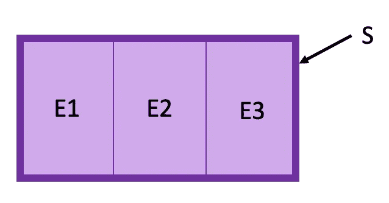*

# *全概率法则*

*如果我们在同一个样本空间中引入另一个事件呢？*

*P(B) =椭圆内的总面积
P(E1 & B)、P(E2 & B)、P(E3 & B)互斥所以:
P(B)= P(E1&B)+P(E2&B)+P(E3&B)、按加法规则
= P(E1)* P(B | E1)+P(E2)* P(B | E2)+P(E3)* P(B | E3)、按一般乘法*

*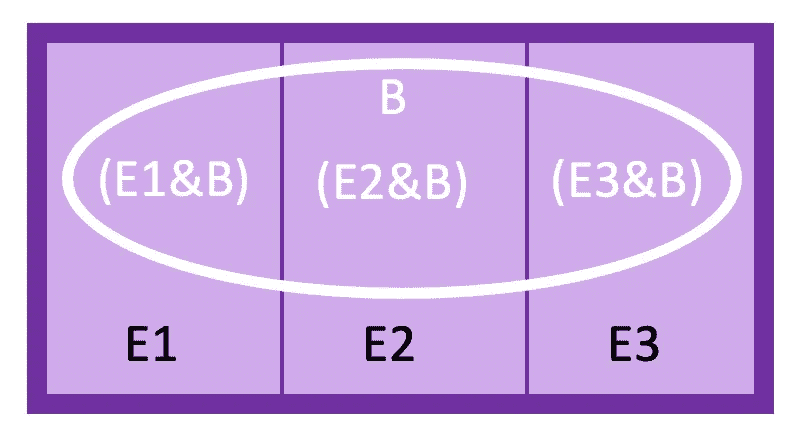*

*作者图片*

***全概率规则**规定，如果事件 E1，E2… Ek 互斥且穷尽，则对于同一样本空间中的任何事件 B:*

*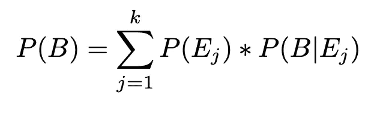*

**举例。一组 50 岁的人参加了一项研究。每个受试者被分为中风的低风险、中等风险或高风险。其中，60%为低风险，30%为中等风险，10%为高风险。经过 5 年的随访，该研究发现 1%的低风险受试者患有中风，5%的中风险受试者和 9%的高风险受试者患有中风。如果随机选择一个 50 岁的人，求他/她中风的概率。让我们使用之前的方便的树形图。**

*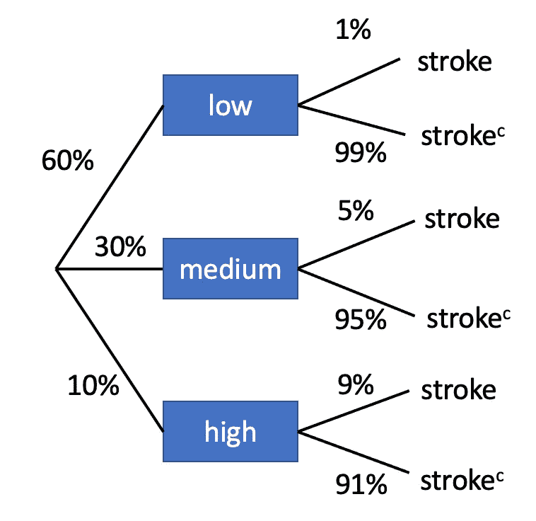*

*作者图片*

**我们现在把数学建立出来:
P(低)=0.6，P(中)=0.3，P(高)=0.1
P(中风|低)=0.01，P(中风|中)=0.05，P(中风|高)=0.09
计算中风的风险，不考虑风险， 我们将 3 组的联合概率(中风和风险水平)相加:
P(中风)= P(低和中风)+ P(中和中风)+ P(高和中风)
为了实际获得联合概率，我们将使用一般乘法规则:P(A 和 B) = P(A)*P(B|A)
P(中风)= P(低)*P(中风|低)+ P(中)*P(中风|中)+ P(高)*P(中风) 我们可以称之为基本利率。**

# *总结*

*在这个训练营中，我们已经介绍了概率的概念和符号的形式。你已经学会了如何“数数”；)以及边际概率、联合概率和条件概率之间的差异。我们已经研究了一些如何计算这些结果的例子，并辅以可视化来帮助理解。*

*该系列之前的训练营:*

*[#1 奠基](https://medium.com/p/227f934924d9/edit)
[#2 中心、变化和位置](https://medium.com/@askline1/statistics-bootcamp-2-center-variation-and-position-9de00a231e80)*

*除非另有说明，所有图片均由作者创作。*

*此外，如果你喜欢看到这样的文章，并希望无限制地访问我的文章和所有由 Medium 提供的文章，请考虑使用下面的我的推荐链接注册。会员费为 5 美元/月；我赚一小笔佣金，这反过来有助于推动更多的内容和文章！*

*<https://medium.com/@askline1/membership> *