# 统计训练营 4:贝叶斯、硬币、鱼、山羊和汽车

> 原文：<https://towardsdatascience.com/statistics-bootcamp-4-baes-coins-fish-goats-and-cars-e31e9c3d6cbd>

## [统计训练营](https://towardsdatascience.com/tagged/statistics-bootcamp)

## 学习作为数据科学家日常使用的库背后的数学和方法


作者图片

为了更正式地解决关于 Medium 的统计讲座系列的需求，我已经开始创建一系列统计训练营，如上面的标题所示。这些将建立在彼此的基础上，因此将被相应地编号。这样做的动机是以一种自下而上的方式使统计知识民主化，以满足数据科学界对更正规的统计培训的需求。这些将从简单开始，向上和向外扩展，一路上有练习和工作实例。当谈到工程、编码和统计时，我的个人哲学是，如果你理解数学和方法，现在使用大量库的抽象就会消失，并允许你成为生产者，而不仅仅是信息的消费者。对一些学习者/读者来说，这些的许多方面将是一个回顾，然而有一个全面的理解和一个参考资源是重要的。快乐阅读/学习！

这个训练营致力于介绍贝叶斯定理，并深入研究一些概率分布。

# **贝叶斯法则**

**贝叶斯规则**是计算条件概率的规则。贝叶斯的一些背景知识:

*   用于根据新获得的信息修正概率
*   源自一般乘法法则
*   因为这已经发生了”…“这现在或多或少有可能”等等。

假设事件 A1，A2，…Ak 是互斥的和穷举的(正如我们之前的训练营所介绍的)。那么对于任何事件 B:

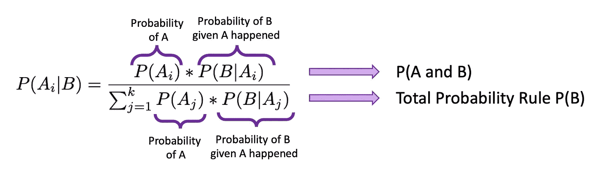

P(A)是事件 A 在没有其他证据存在时的概率，称为事件 A 的**先验概率**(A 的基础率)。P(B)是事件 B 发生的总概率，可以细分为上式中的分母。P(B)被称为证据的**概率，并从**全概率规则中导出。** P(B|A)是给定 A 已经发生的情况下，事件 B 发生的概率，称为**可能性。** P(A|B)是假设 B 已经发生，A 发生的可能性有多大的概率。它被称为**后验概率。我们试图计算后验概率。****

如果(来自 bootcamp 3)在中风的低、中和高风险以及 5 年内中风概率的示例中，问题是“如果随机选择的 50 岁受试者在过去 5 年内中风，他/她属于低风险组的概率是多少？”此外，您将获得与之前相同的概率(见下文)。

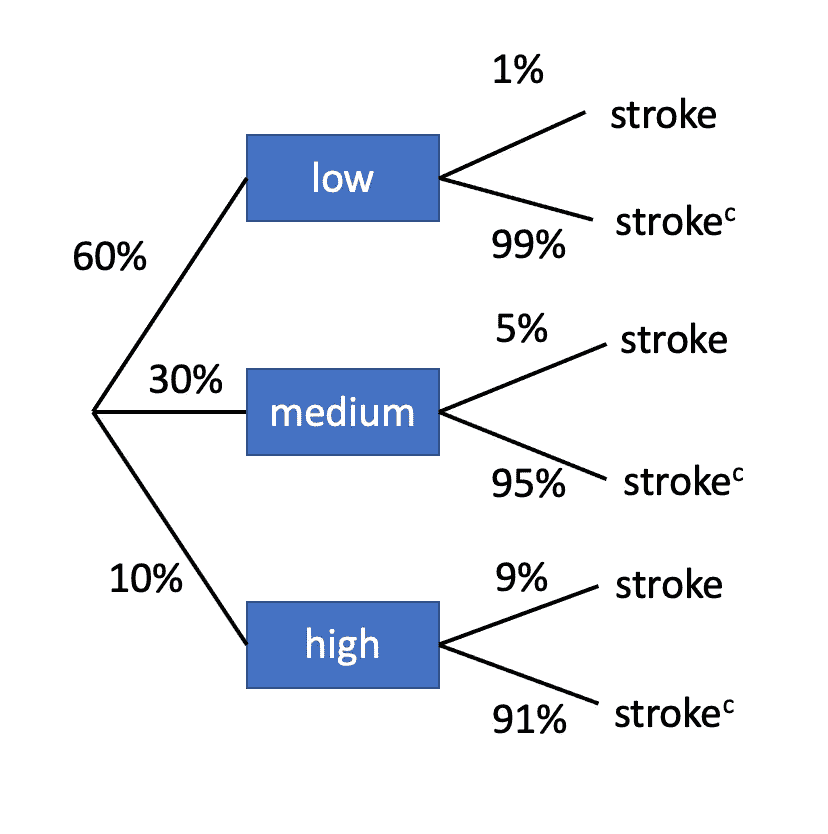

P(低)= 0.6，P(中)= 0.3，P(高)= 0.1
P(冲程|低)= 0.01，P(冲程|中)= 0.05，P(冲程|高)= 0.09
P(冲程|低)=？(这是我们的后验概率)

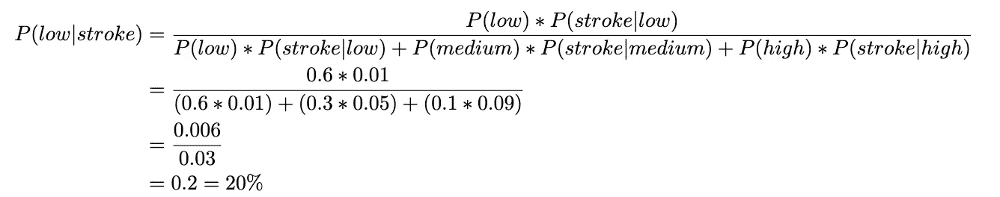

因此，我们的答案是，如果一个随机选择的 50 岁受试者在过去 5 年中患过中风，他/她处于低风险组的概率是 20%。

让我们想到经典的蒙蒂霍尔问题。其中两扇门后有一只山羊，第三扇门后是你梦想中的车。你选择一扇门。另一扇门打开后会出现一只山羊，而不是你当前的选择。蒙蒂问你是否希望留在你的门或切换到另一扇门。你该怎么办？你应该改变——但是为什么呢？！让我们来看看…

当你第一次选择门时，你有 1/3 或 33.33%的正确选择率(随机)——这将会改变。假设汽车在 1 号门后面，而你选择了 2 号门……那么你现在拥有一只山羊。蒙蒂知道车在哪里。他不能打开你的门或车在哪里。那么你应该留下还是换一个？你刚刚得到了 33.33%以上，所以你应该切换！

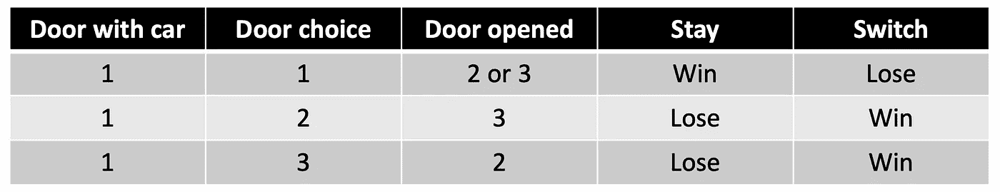

这就是为什么它是一个条件概率问题。我们的条件是第二次你需要做决定的时候“门打开了”。如果我们在所有的场景和所有的门的选择上玩这个，同样的概率成立。如果蒙蒂随机打开一扇门，你第二次赢得汽车的机会将是 50%，而不是 66.6%的转换和 33.33%的停留。

## 随机变量

一个**随机变量**是一个数量变量，其值取决于几率。与一个**离散随机变量**相比，它是一个随机变量，其可能的值可以被列出。

# 离散概率分布

*举例。每天，杰克和迈克都是生物实验室的最后一名，他们通过掷硬币来决定谁来打扫实验室。如果是正面(H)，那么杰克会清理。如果是反面，迈克将做这项工作。连续三天，他们向他们的实验室主管报告。样本空间为:
{H，H，H} {H，H，T} {H，T，T} {T，H，T} {H，T，H} {T，H，H} {T，T，H} {T，T，T}
杰克清理实验室 0、1、2、3 次的概率是多少？(设‘x’为杰克打扫的次数)。
这里是理论或预期的概率分布:*


*现在对随机变量 X 进行 1000 次观察(投掷 3 次平衡硬币获得的正面数)。这是经验概率分布(观察到的)。*

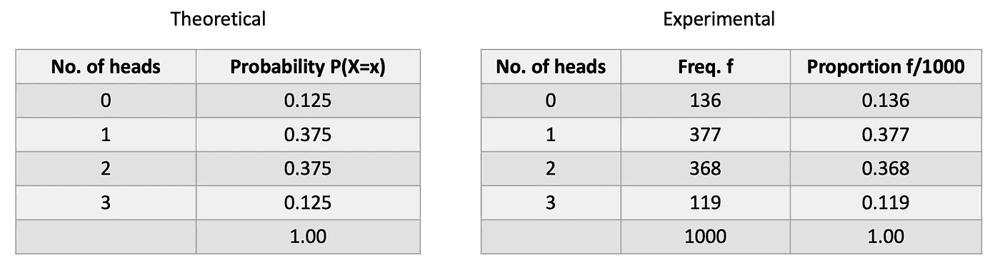

请注意，当试验数量很大时，经验分布中的概率相当接近理论(真实)分布中的概率。

## 大数定律

如果我们扔一个平衡的硬币一次，我们理论上有 50–50 的机会硬币正面朝上。如果硬币被扔 50 次会发生什么？头会出现 25 次吗？不一定，因变异而异。大数定律指出，随着试验次数的增加，经验概率(从观察值估计的概率)将接近理论概率。在这种情况下，1/2。你可以在下图中看到，头的比例越接近理论值，投掷次数就越多。

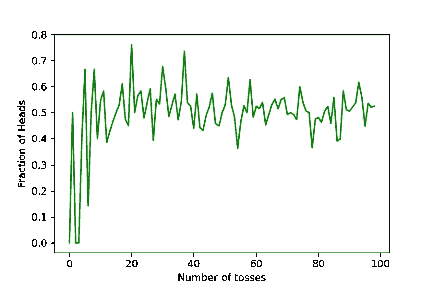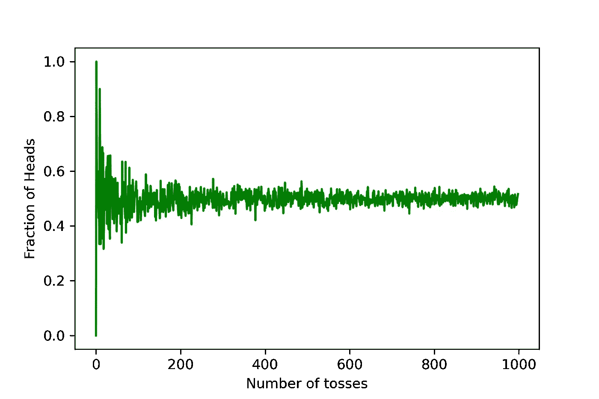

下面是用 python 生成上图的代码:

```
from random import randint
import matplotlib.pyplot as plt
import numpy as np
import pandas as pd
    #num = input('Number of times to flip coin: ')
fracti = []
tosses = []
for num_tosses in range(1,1000):   
    flips = [randint(0,1) for r in range(int(num_tosses))]
    results = []
    for object in flips:
            if object == 0:
                results.append(1)
            elif object == 1:
                results.append(0)
    fracti.append(sum(results)/int(num_tosses))
    tosses.append(flips)df = pd.DataFrame(fracti, columns=['toss'])
plt.plot(df['toss'], color='g')
plt.xlabel('Number of tosses')
plt.ylabel('Fraction of Heads')
plt.savefig('toss.png',dpi=300)
```

概率分布的要求:

1.  离散随机变量的概率之和必须等于 1，σP(X = X)= 1。
2.  样本空间中每个事件的概率必须介于 0 和 1 之间(包括 0 和 1)。即 0≤ P(X) ≤1。

概率分布与相对频率分布相同，但是，**相对频率分布**是*经验*，而**概率分布**是*理论*。

## 离散概率分布均值或期望值

离散随机变量 X，的**均值表示为μX，或者在不引起混淆的情况下，简称为μ。其定义如下:**

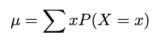

术语**预期值**和**期望**通常用于代替术语**表示**——这也是为什么当你看到大写的'𝔼'表示期望时，你应该想到“意味着”。

要解释随机变量的平均值，请考虑随机变量 x 的大量独立观察值。这些观察值的平均值大约等于 x 的平均值μ。观察值越多，平均值越接近μ。

相对频率表实际上是一个离散的概率分布，它包含随机变量(同胞 x)和每个事件的概率(相对频率)。给定班级中兄弟姐妹的概率分布，找出班级中兄弟姐妹的预期数量(平均值)。下表显示了相对频率分布。


计算平均值:

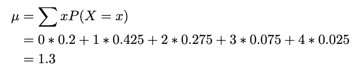

## 离散概率分布标准偏差

离散随机变量 X 的标准偏差表示为σ_x，或者在不引起混淆的情况下，简称为σ。它被定义为:

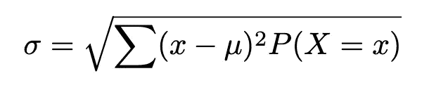

离散随机变量的标准偏差也可以通过计算公式获得:

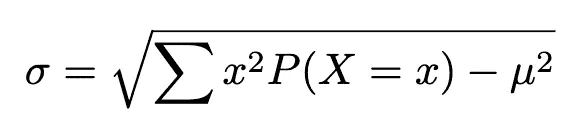

在我们相同的频率分布上执行操作:

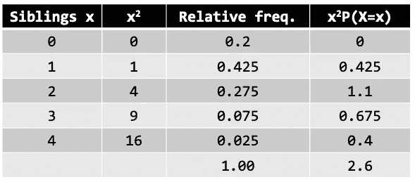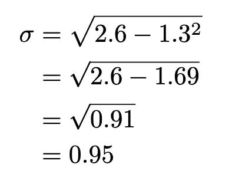

## 离散概率分布累积概率

*举例。抛一枚硬币 10 次。拥有* ***最多*** *3 个头的概率有多大？
设 X =总人数
P(X≤3)= P(X = 0)+P(X = 1)+P(X = 2)+P(X = 3)*

*拥有* ***最少*** *3 个头的概率有多大？*

*P(X≥3)= P(X = 3)+P(X = 4)+P(X = 5)+..+P(X = 10)
= 1-P(X = 0)+P(X = 1)+P(X = 2)
= 1-P(X≤2)*

在 2 和 4(含)之间有**的概率有多大？**

*P(2≤X≤4)= P(X≤4)-P(X<2)
= P(X≤4)-P(X≤1)
= P(X = 4)+P(X = 3)+P(X = 2)*

# 二项分布

伯努利试验代表只有两种可能结果的实验(例如 A 和 B)。该公式表示为:

P(X=A) = p，P(X=B) = 1-p=q

p:结果的概率(如 A)
1-p:另一个结果的概率(如 B)

示例:

*   抛硬币
*   考试及格还是不及格
*   为每名受试者分配治疗/对照组
*   筛查/诊断测试中的测试阳性/阴性

# 二项式分布

二项式试验是几个伯努利试验的串联。这是一个概率实验，必须满足以下要求:

1.  必须有固定的试验次数
2.  每次试验只能有两种结果(如成功/失败)
3.  审判必须是独立的
4.  每次试验的成功概率必须相同

**二项式分布**是一系列“n”次独立试验中成功次数的离散概率分布，每次试验都有两种可能的结果和一个恒定的成功概率。当 n=1 时，伯努利分布可以被视为特殊的二项式分布。

符号:

**X~Bin(n，p)** p:成功概率(1-p:失败概率)
n:试验次数
X:n 次试验成功次数，0≤X≤n

应用计数规则:

“x”次试验成功→p * p *……* p = p^x
n-x:失败→( 1-p)*(1-p)*……*(1-p)=(1-p)^(n-x)= q^(n-x)

二项式概率公式(理论):


*举例。每天，Adrienne 和 Banafshe 在工程实验室呆得最晚，并抛硬币决定谁来清理实验室。如果是正面(H)，阿德里安娜将做这项工作，如果是反面(T)，巴纳夫什。然而，他们使用的硬币有 0.7 的概率正面朝上。在接下来的一周，找出 Adrienne 清理实验室的概率，或者正好是 3 天(这里的一周是 5 天工作周)。设 X 表示阿德里安娜一周清理实验室的天数。X~Bin(5，0.7)。*

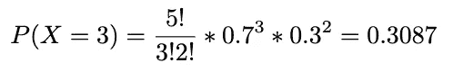

*阿德里安娜至少清理 3 天的概率有多大？我们可以用下面的公式来表示，并进行与上面相同的计算，将 X=3、X=4 和 X=5 的概率相加。*

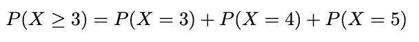

*举例。一份名为《美国人健康统计报告》的出版物指出，在过去的一年中，12 岁及以上的美国人中有五分之三的人至少看过一次医生。如果随机选择 10 个 12 岁以上的美国人，找出去年正好有 3 个人至少看过一次医生的概率。找出至少 3 个人每年至少看一次医生的概率。
n:试验次数=10 次
X:n 次试验中成功(拜访医生)的次数= 3 次
p:成功的数字概率= 3/5
q:失败的数字概率= 2/5*

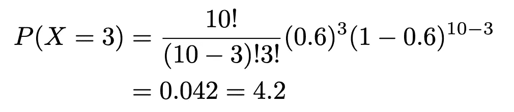

并且:

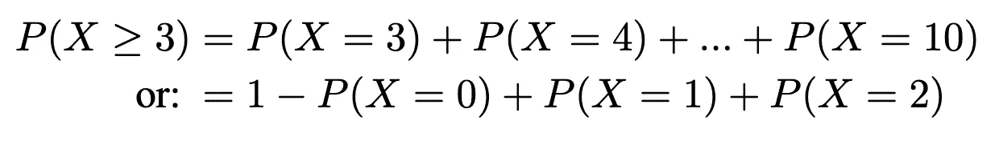

## 贱而立。二项分布的发展

*   均值:μ=n*p
*   方差:σ = n*p*q
*   标准差:σ= sqrt(n*p*q)

*举例。阿德里安娜一周内清理次数的均值和标准差是多少？
n=5，p=0.7，q = 0.3
μ= 5 * 0.7 = 3.5
σ= sqrt(5 * 0.7 * 0.3)= 1.02*

一般来说，如果 p <0.5, is symmetric if p=0.5, and left skewed if p> 0.5，则二项式分布是右偏的。下图说明了 n=6 的 3 种不同二项式分布的这些事实。

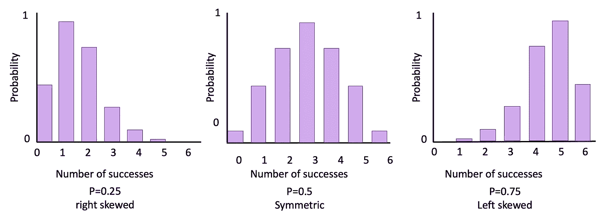

## 超过两种结果？

如果我们有两个以上的结果呢？假设我们在看辛西娅的 M&M 巧克力豆。我们闭着眼睛从盒子里选了 5 个。我们有两个蓝色、一个黄色、一个红色和一个绿色的机会有多大？

# 多项式分布

**多项分布**是指每个试验有两个以上独立结果的分布。如果 X 包括跟踪 k 个互斥且穷尽的事件 E1，E2，..Ek 具有相应的概率 p1，p2，..pk，其中 X1 是 E1 将出现的次数，X2 是 E2 将出现的次数，等等。，那么 X(x1，x2，..)会发生的情况是:

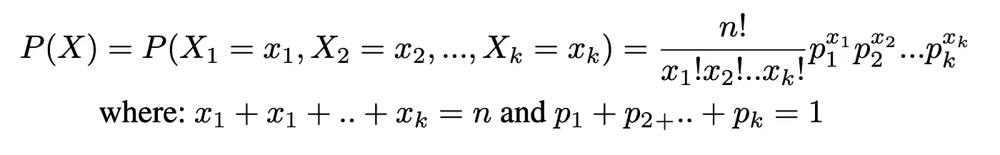

*举例。在大城市，50%的人选择电影，30%的人选择晚餐和戏剧，20%的人选择购物，作为最有利的休闲活动。如果随机选择 5 个人作为样本，找出其中 3 个计划去看电影，1 个计划去看戏，1 个计划去购物中心的概率。
n=5，x1=3，x2=1，x3=1，p1=0.5，p2=0.3，p3=0.2*

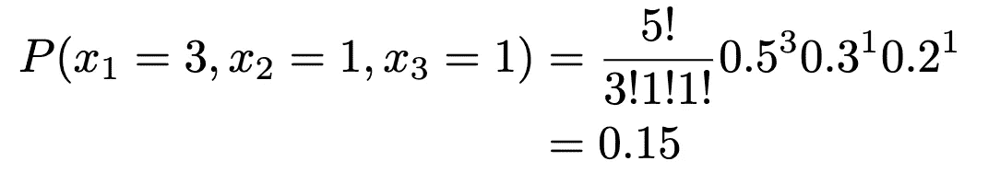

现在，假设我们想计划避免急诊室过度拥挤。如果我们知道在西北医学中心一年有 25，000 次就诊(365 天)，急诊室一天处理 60 次，那么我们一天处理 68 次的几率是多少？

假设一家面包店没有足够的巧克力片就不会对他们的松饼收费，我们该如何建模呢？

# 泊松分布

泊松的正确发音是 pwa-saw，法语里是鱼的意思！**泊松分布**是一种离散概率分布，模拟特定事件在特定时间段、数量等发生的频率。(例如，每个松饼的巧克力片数量；) ).在形式上，它是在一个时间间隔(体积、时间等)内发生 X 次的概率。)对于一个变量，其中λ是每单位(时间、体积等)发生的平均次数的*。)*

公式是:

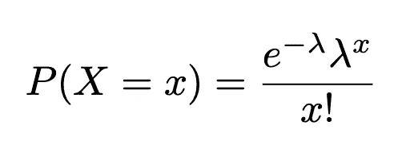

x=0，1，2，…(出现次数)，e =是指数函数

*   均值:μ = λ
*   方差:σ = λ
*   标准差:sqrt(λ)

请注意，均值和方差是泊松分布中的 sam！

*举个例子。在黑鹰赛季，49，687 个比赛小时中发现了 203 起受伤事件。求 1000 个游戏小时内发生 2 次伤害的概率。
1。求每 1000 游戏小时的伤害率
2。X = 2，其中 X ~泊松(* λ *=4.0855):*

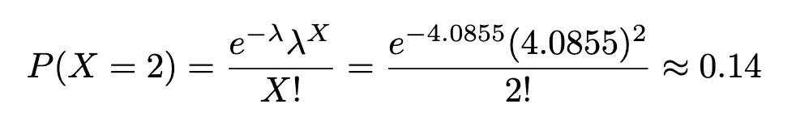

精神食粮，真的。假设和以前一样的面包店，有便宜的不新鲜的羊角面包和新鲜的羊角面包，面包店的新手把它们都混在一起了。有 14 个新鲜的和 5 个不新鲜的。如果你想购买 6 个羊角面包，只有 1 个过期的几率有多大？

# 超几何分布

超几何分布是指在没有替换的情况下*进行采样时，具有**两个互斥结果**的变量的分布。它通常用于人口规模小的情况。*

给定两种类型对象的总体，例如有 A 类型的 A 项和 B 类型的 B 项，a+b 等于总总体，我们要选择 n 项。A 型项目选‘x’号的概率是多少？

第一步。选择 A 型 x 项的方法的数量(x 项来自 A 型，所以其余 n-x 项必须来自 B 型):

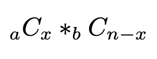

第二步。从(a+b)的池中选择 n 个项目的总方法数:

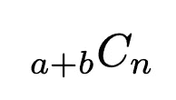

因此，概率 P(X=x)如果在没有替换的情况下，在样本大小为 n 的情况下，选择 X 个类型 A 的项目和 n-X 个类型 B 的项目:

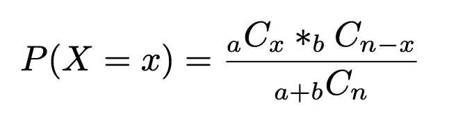

*举例。10 个人申请一项篮球研究的研究协调员职位。6 人完成了研究生学位，4 人没有。如果研究的调查者随机选择 3 名申请人，没有替换，找出这 3 人都有研究生学位的概率。
a=6 有研究生学位
b=4 没有研究生学位
n=3
X=3*

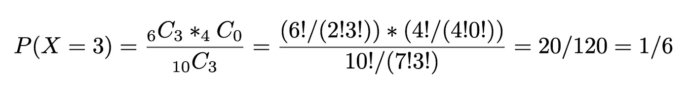

# 总结

在本次训练营中，我们继续学习概率论，包括介绍贝叶斯定理，以及如何使用之前学习的概率规则(乘法理论)推导贝叶斯定理。您还学习了如何思考概率分布——泊松分布、伯努利分布、多项式分布和超几何分布。期待本系列的下一期，我们将继续构建我们的统计知识！！

该系列之前的训练营:

[#1 打基础](https://medium.com/p/227f934924d9/edit)
[#2 中心、变化和位置](https://medium.com/@askline1/statistics-bootcamp-2-center-variation-and-position-9de00a231e80)
[#3 概率……概率](/statistics-bootcamp-3-probably-probability-588a2640fc13)

除非另有说明，所有图片均由作者创作。

此外，如果你喜欢看到这样的文章，并希望无限制地访问我的文章和所有由 Medium 提供的文章，请考虑使用下面的我的推荐链接注册。会员费为 5 美元/月；我赚一小笔佣金，这反过来有助于推动更多的内容和文章！

<https://medium.com/@askline1/membership> 