# 统计训练营 5:什么是正常的？

> 原文：<https://towardsdatascience.com/statistics-bootcamp-5-what-is-normal-dd7ca037d37d>

## [统计训练营](https://towardsdatascience.com/tagged/statistics-bootcamp)

## 学习作为数据科学家日常使用的库背后的数学和方法


作者图片

为了更正式地解决关于 Medium 的统计讲座系列的需求，我已经开始创建一系列统计训练营，如上面的标题所示。这些将建立在彼此的基础上，因此将被相应地编号。这样做的动机是以一种自下而上的方式使统计知识民主化，以满足数据科学界对更正规的统计培训的需求。这些将从简单开始，向上和向外扩展，一路上有练习和工作实例。当谈到工程、编码和统计时，我的个人哲学是，如果你理解数学和方法，现在使用大量库的抽象就会消失，并允许你成为生产者，而不仅仅是信息的消费者。对一些学习者/读者来说，这些的许多方面将是一个回顾，然而有一个全面的理解和一个参考资源是重要的。快乐阅读/学习！

本文致力于介绍正态分布及其性质。

# 什么是正常？

医学研究人员已经确定了一个人的血压、胆固醇和甘油三酯的所谓正常区间。

《出埃及记》收缩压:110–140(这些指标在办公室和家庭血压测量中有所不同)

但是我们的问题仍然存在，我们如何确定所谓的*正常*间隔？

# 正态分布

正态分布(高斯)是一个变量的连续、对称、钟形分布，用 *N(μ，σ)* 表示。

表示它的数学方程表示为:

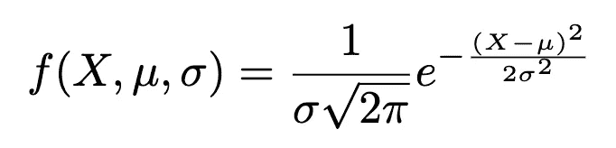

并代表概率密度函数或 p.d.f .(简称)。平均值用 *μ* 表示，标准偏差用 *σ表示。*

属性:

*   钟形的，两条尾巴在两个方向上无限延伸
*   关于中心对称—平均值、中间值和众数
*   分布曲线下的总面积等于 1
*   曲线下的面积代表概率

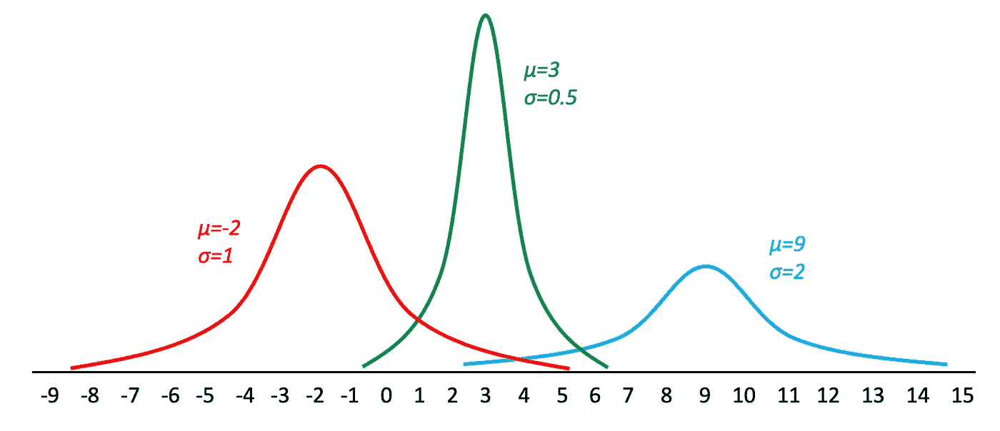

*举例。去年，芝加哥的高中有 3264 名 12 年级女生入学。这些学生的平均身高是 64.4 英寸，标准偏差是 2.4 英寸。这里的变量是身高，人口由 3264 名 12 年级女生组成。均值和标准差相同的正态曲线:μ = 64.4，σ = 2.4* 。

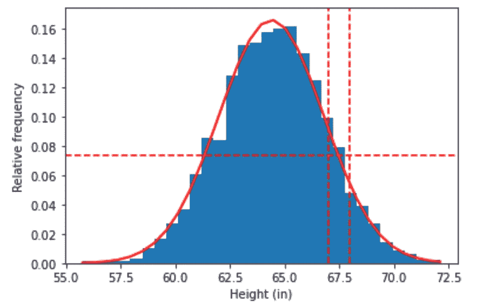

*因此，我们可以通过 67 至 68 英寸之间的曲线下面积来估算身高在 67 至 68 英寸之间的学生的百分比，该面积为 0.0735，并在图表中显示为身高在 67 至 68 英寸之间。*

# 经验法则——重温

虽然我们在之前的训练营中已经讨论过这个问题，但是间隔重复是确保回忆和记忆的最好方法！这里我们用图形强调了经验法则。

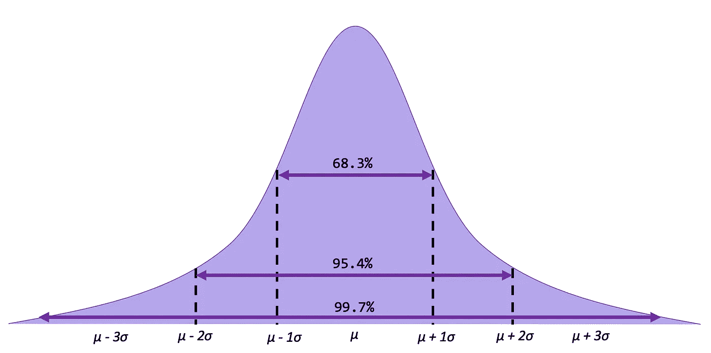

1.  大约 68.3%的数据值将落在平均值的 **1** **标准差**内，样本为 x±1s，人口为终点μ 3σ
2.  大约 95.4%的数据值将落在平均值的**2**标准偏差内，样本为 x±2s，总体为终点μ 2σ
3.  大约 **99.7%** 的数据值将落在平均值的 **3 个标准偏差**内，样本为 x±1s，人口为终点μ 3σ

# 标准正态分布 *N(0，1)*

不同的正态分布有不同的均值和标准差。**标准正态分布**是均值为 0，标准差为 1 的正态分布。标准正态分布的概率密度函数符号为:

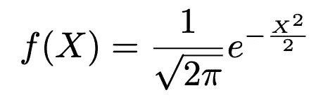

我们可以看到，看上面的等式，它是正态分布的概率密度函数(如上)提供的等式的简化。标准化是我们将这些分布转换成标准正态分布(0，1)进行比较的过程。我们可以使用下面的等式转换任何正态分布变量的值，这称为 z 得分。

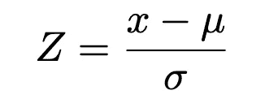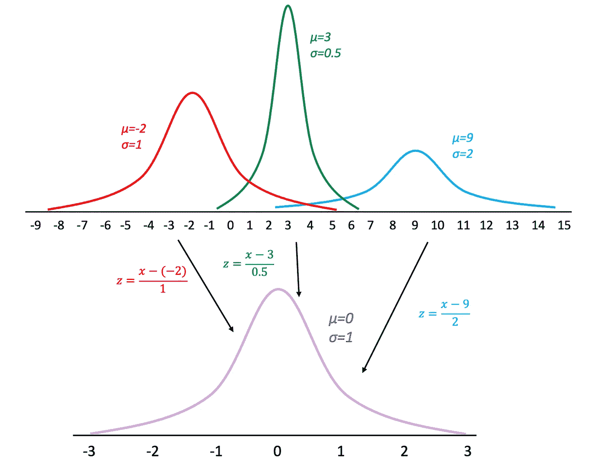

将此与之前定义的上述正常曲线的概率密度函数进行比较。

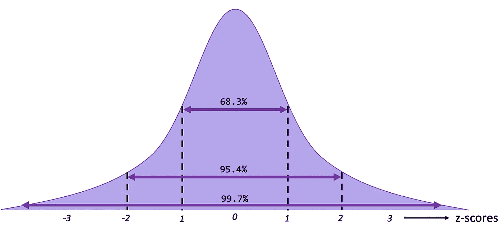

## 标准正态分布下的面积

将您的正态分布转换为标准正态分布后，在标准正态分布表( [z 表](https://www.dummies.com/article/academics-the-arts/math/statistics/how-to-use-the-z-table-147241/))中查找 z 分数，以确定曲线下的面积。我们使用此表来查找曲线下的区域(下图中突出显示),该区域位于(a)指定 z 得分的左侧;( b)指定 z 得分的右侧，以及(c)两个指定 z 得分之间。

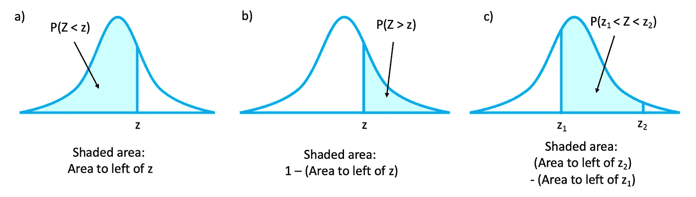

*举例说明。*


*a)求 z=2.06 左边的面积。P(Z < 2.06) = 98.03%
b)求 z = -1.19 右边的面积。P(Z > -1.19) = 88.3%
c)求 z = 1.68 和 z = -1.37 之间的面积。
P(-1.37<Z<1.68)= P(Z<1.68)—P(Z<-1.37)
= 0.9535–0.0853
= 0.8682 = 86.82%*

请记住，t 型表默认位于左侧…

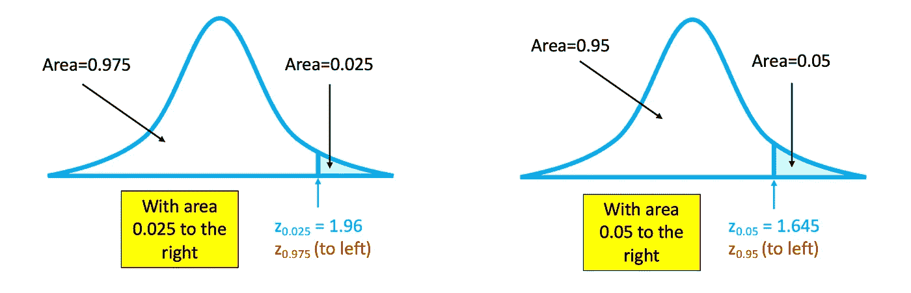

*举例。在 2008 年棒球赛季期间，马克记录了他每次本垒打的距离(以米为单位),发现它们正态分布，平均值为 100，标准偏差为 16。确定他下一个本垒打落在 115 到 140 米之间的概率。
P(115 < X < 140)=？其中 X =每次本垒打的距离。*

*画出正态曲线:X ~ N(100，16)，μ = 100，σ = 16* 。

*计算 z 分数:
Z1 =(115–100)/16 = 0.94
z2 =(140–100)/16 = 2.50*

*P(z1 < Z < z2) =？其中 Z~ N(0，1)。*

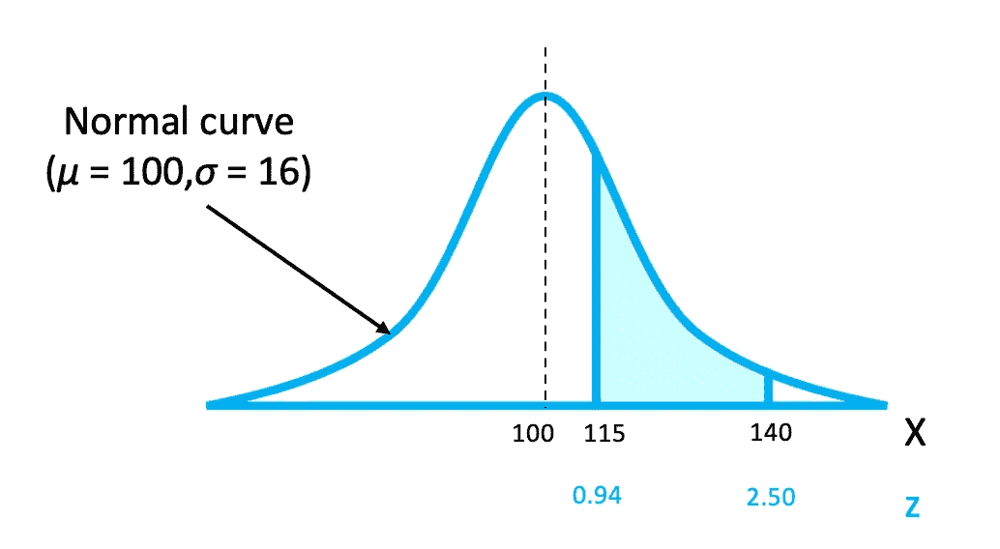

*位于 0.94 和 2.50 之间的标准正态曲线下的面积与均值为 100、标准差为 16 的正态曲线下 115 和 140 之间的面积相同，即 P(115<X<140)= P(0.94<Z<2.50)= P(Z<2.50)-P(Z<0.94)。*

*0.94 左边的面积是 0.8264，2.50 左边的面积是 0.9938。因此，所需的面积为 0.9938–0.8264 = 0.1674。马克下一个本垒打落在 115 到 140 米之间的几率是 0.1674 = 16.74%。*

*举例。如果给你一个标准正态分布曲线下的面积，并要求你找出 z 值，会怎么样？*

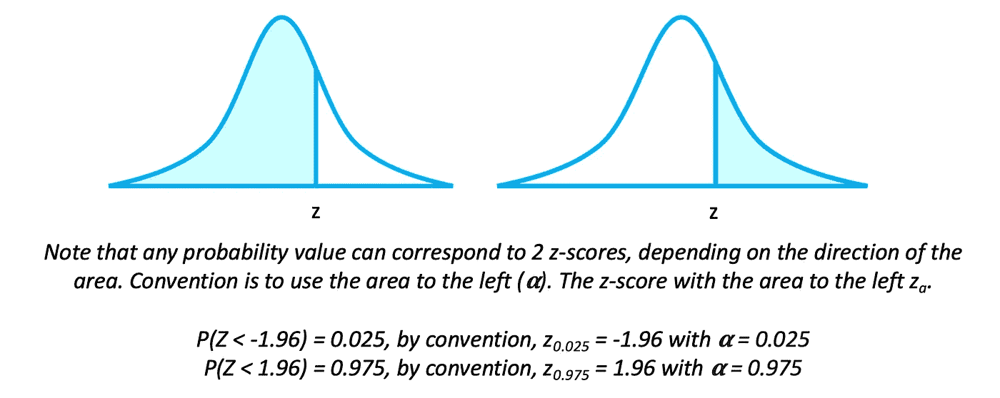

# 评估常态

给定数据集，构建正态概率图:

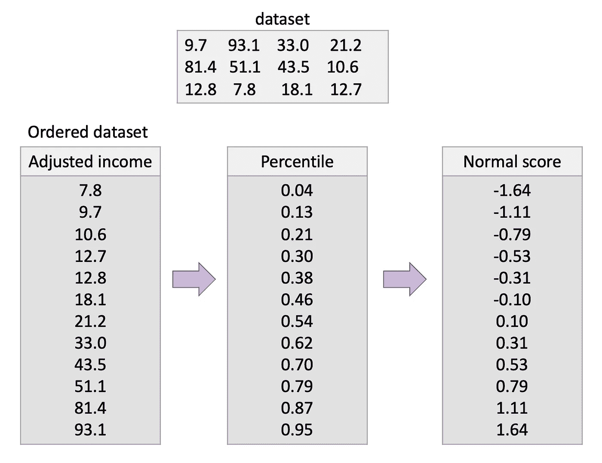

正态概率图是观察数据与正态分数的关系图。如果是线性的，变量是正态分布的，如果不是线性的，变量不是正态分布的。绘制上面的数据，我们得到了曲线图:

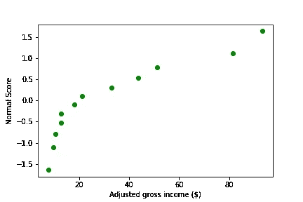

## 正常 Q-Q 图

Q-Q 图(分位数-分位数图)是一种概率图，是一种通过绘制两个概率分布的分位数来比较它们的图形方法。

如果数据确实是从高斯分布中采样的，Q-Q 图将是线性的:


生成上述图的代码:

```
import numpy as np
import statsmodels.api as statmod
import matplotlib.pyplot as plt#create dataset with 100 values that follow a normal distribution
data = np.random.normal(0,1,100)#create Q-Q plot with 45-degree line added to plot
fig = statmod.qqplot(data, line='45')
plt.show()
```

# 样本均值的分布

不同样本的样本均值代表一个随机变量，服从一个分布。x

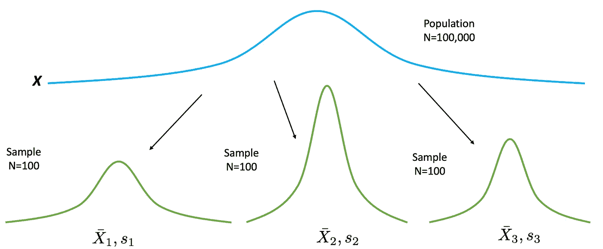

样本平均值的**抽样分布**是使用从总体中抽取的特定大小的所有可能随机样本计算出的平均值的分布。如果样本是通过替换随机选择的，样本均值在很大程度上会与总体均值 *μ* 有所不同。这些差异是由采样误差引起的。**抽样误差**是样本测量值和相应的总体测量值之间的差值，因为样本不是总体的完美代表。

*举例。假设一位教授给一个 4 人的小班进行了一次 8 分测验。测验的结果是 2、4、6 和 8。为了便于讨论，假设这四个学生构成了总体。
总体的平均值为:*

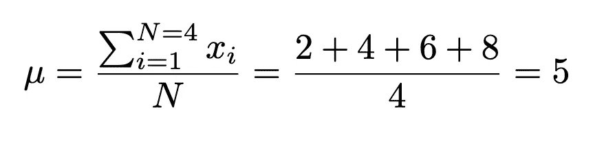

*总体的标准差为:*

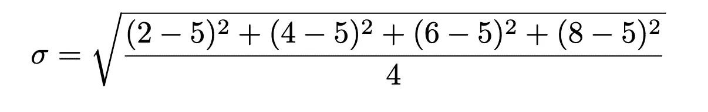

*现在，如果所有样本大小为 2 的样本被替换，并且每个样本的平均值被找到，则分布为:*

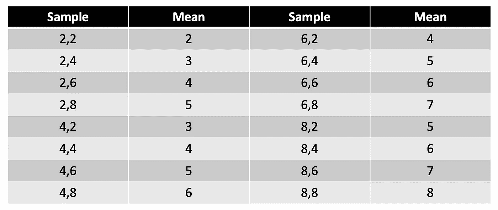

*样本均值的均值为:*

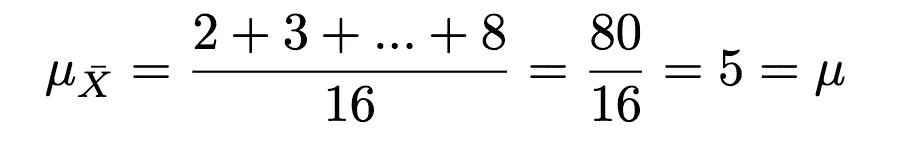

*样本均值的标准差为:*

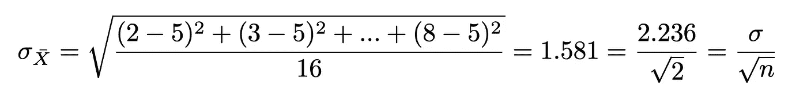

## 样本均值的性质

1.  样本平均值将与总体平均值相同。

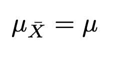

2.样本均值的标准偏差将小于总体的标准偏差，它等于总体偏差除以样本大小的平方根。这意味着采样误差更小，并且与更大的样本量相关联。

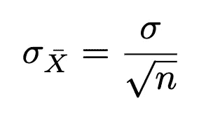

**样本平均值的标准偏差称为平均值的**标准误差** *

样本量越大:

*   样本均值 mux 越接近总体均值 mu。
*   采样误差越小
*   总体平均值周围样本平均值的标准偏差越小

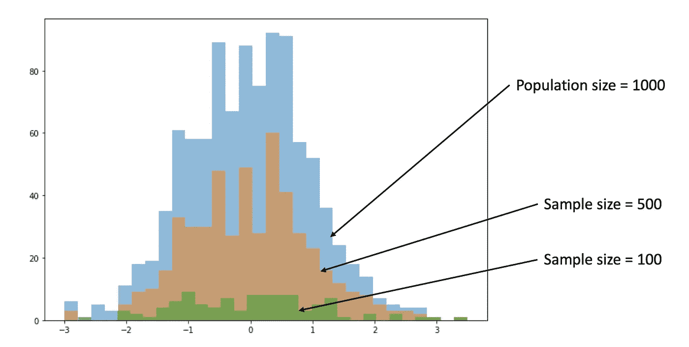

大量样本的样本均值分布

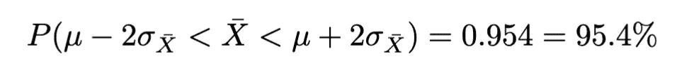

1.  结论:将有 95.4%的样本均值落在 *μ_xbar 或μ* 两边的 2 个 *σ_xbar* 内。
2.  换句话说:如果我们有 100 个样本，将有大约 95 个样本均值落在 *μ* 每侧的 2 *σ_xbar* 内。

## 置信区间

如果我们重复上述实验几次，并且每次我们在 Xbar 估计值的每一侧构建长度为 2 个标准误差的区间，那么我们可以确信(考虑经验法则)这些区间的 95.4%将覆盖总体参数， *μ。*

如果我们重复几次实验，构造几个置信区间，那么这些区间的 95.4%包含总体参数， *μ。*

# 中心极限定理

中心极限定理指出，随着样本量 *n* 无限制增加，从具有均值 *μ* 和标准差 *σ，*的总体中替换得到的样本均值的分布形状将接近正态分布。该分布将具有平均值 *μ* 和标准偏差 *μ/sqrt(n)。*

为什么中心极限定理(CLT)如此重要？

如果样本量足够大，无论总体分布如何，CLT 都可以用来回答关于样本均值的问题。

那就是:

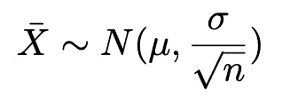

并转换成 z 分数:

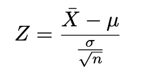

1.  当来自总体的变量呈正态分布时，样本均值的分布将呈正态分布，对于任何样本量 n。
2.  当来自总体的变量不是正态分布时，经验法则是:需要 30 或更多的样本量来使用正态分布来逼近样本均值分布。样本量越大，近似值就越好。也就是说，CLT 需要 n ≥ 30 才能发挥作用。

## z 得分公式摘要

第一个用于在变量呈正态分布时获取有关单个数据点的信息:

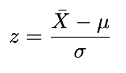

> 注意:z 的第一个等式默认是向左的！

当变量呈正态分布或样本量≥ 30 时，当我们应用样本均值的中心极限定理时，如果我们想要获得信息，则使用第二种方法:

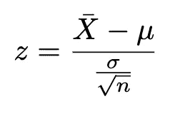

*举例。一个人每年消耗的肉的平均磅数是 218.4 磅。假设标准差为 25 磅，分布近似正态。
a)找出随机选择的一个人每年消费少于 224 磅的概率。
b)如果选择了一个 40 人的样本，找出该样本的平均值低于每年 224 磅的概率。
解答:
a)问题问的是一个人。*

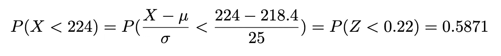

这个问题是关于尺寸为 40 的样本的平均值。

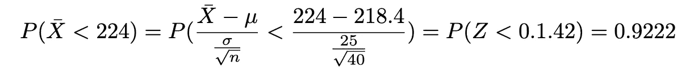

*这两个概率之间的巨大差异是由于样本均值的分布比单个数据值的分布更不稳定。(注:个人相当于说 n=1)。*

# 二项式分布的正态近似

回想一下，二项分布是由 *n* (试验次数)和 *p* (成功概率)决定的。当 *p* 约为 0.5 时，随着 *n* 的增加，二项式分布的形状变得类似于正态分布。

当 p 接近 0 或且 n 相对较小时，正常近似值不准确。根据经验，统计学家*通常*同意，只有当 *n*p* 和 *n*q* 都大于或等于 5，即 ***np≥5*** 和 ***nq≥5*** 时，才使用正态近似。

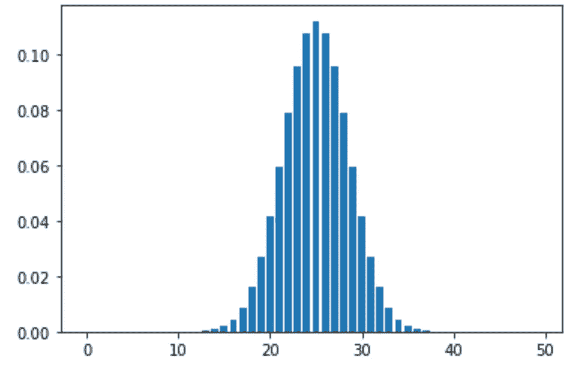

```
import math
import matplotlib.pyplot as pyplotdef binomial(x, n, p):
    return math.comb(n, x) * (p ** x) * ((1 - p) ** (n - x))n = 50
p = 0.5
binomial_list = []
keys = []for x in range(50):
    binomial_list.append(binomial(x, n, p))for y in range(50):
    keys.append(y)

pyplot.bar(x=keys, height=binomial_list)
pyplot.show()
```

**连续性修正**是当连续分布用于近似离散分布时采用的修正。

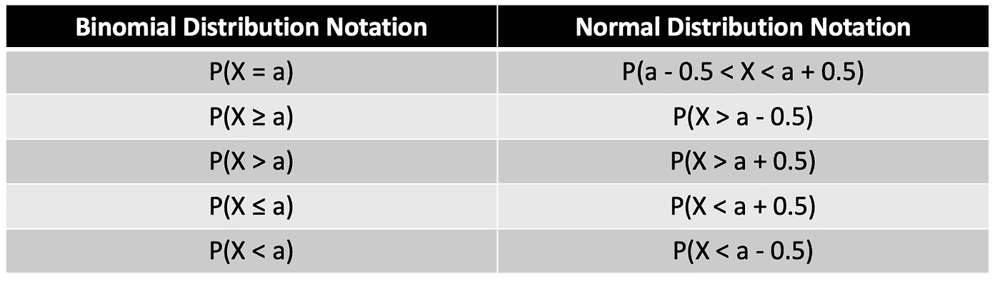

> 对于所有情况， *μ=n*p，σ=sqrt(n*p*q)，n*p≥5，n*q≥5*

## 二项分布正态近似的逐步过程

1.  查看是否可以使用正态近似
2.  求平均值 *μ、*和标准差 *σ*
3.  用概率符号写出问题，例如 P(X=x)
4.  利用连续性校正因子重写问题，并显示正态分布的相应 AUC
5.  计算相应的 z 值
6.  求解！

*举例。一本杂志报道称，6%的美国人开车时会看手机。如果随机选择 300 名司机，找出其中 25 人开车时看手机的确切概率。然后用正态近似求近似概率。
p=0.06，q=0.94，n=300，X = 25* ***精确*** *概率采用二项式近似:*


*正常近似法:*

1.  *检查是否可以使用正常近似值。n*p=300*0.06 = 18，n*q = 300*0.94 = 282
    由于 n*p ≥ 5，且 n*q ≥ 5，所以可以用正态分布*
2.  *求平均值和标准差*

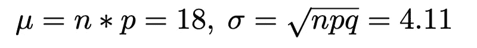

*3。把问题写成概率记法 P(X=25)。*

*4。利用连续性修正系数重写问题。
P(25–0.5<X<25+0.5)= P(24.5<X<25.5)*

*5。找到相应的 z 值:*

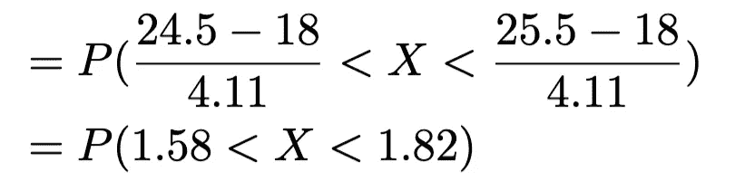

6.求解:

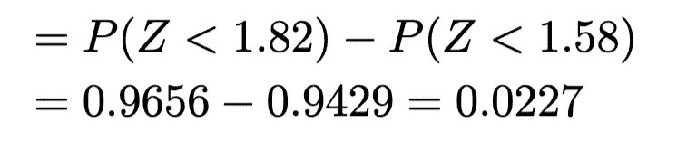

*25 个人边开车边看报纸的概率是 2.27%。*

# 总结

在本次训练营中，我们继续学习概率论，包括介绍贝叶斯定理，以及如何使用之前学习的概率规则(乘法理论)推导贝叶斯定理。您还学习了如何思考概率分布——泊松分布、伯努利分布、多项式分布和超几何分布。期待本系列的下一期，我们将继续构建我们的统计知识！！

该系列之前的训练营:

[#1 打基础](https://medium.com/p/227f934924d9/edit)
[#2 中心、变异和位置](https://medium.com/@askline1/statistics-bootcamp-2-center-variation-and-position-9de00a231e80)
[#3 概率……概率](/statistics-bootcamp-3-probably-probability-588a2640fc13)
[#4 贝叶斯、鱼、山羊和汽车](/statistics-bootcamp-4-baes-coins-fish-goats-and-cars-e31e9c3d6cbd)

除非另有说明，所有图片均由作者创作。

此外，如果你喜欢看到这样的文章，并希望无限制地访问我的文章和所有由 Medium 提供的文章，请考虑使用下面的我的推荐链接注册。会员费为 5 美元/月；我赚一小笔佣金，这反过来有助于推动更多的内容和文章！

[](https://medium.com/@askline1/membership) 