# 统计训练营 6:建立我们的信心

> 原文：<https://towardsdatascience.com/statistics-bootcamp-6-building-our-confidence-ba7be17c008c>

## [统计训练营](https://towardsdatascience.com/tagged/statistics-bootcamp)

## 学习作为数据科学家日常使用的库背后的数学和方法


作者图片

为了更正式地解决关于 Medium 的统计讲座系列的需求，我已经开始创建一系列统计训练营，如上面的标题所示。这些将建立在彼此的基础上，因此将被相应地编号。这样做的动机是以自下而上的方式使统计知识民主化，以满足数据科学界对更正规的统计培训的需求。这些将从简单开始，向上和向外扩展，一路上有练习和工作实例。当谈到工程、编码和统计时，我的个人哲学是，如果你理解数学和方法，现在使用大量库的抽象就会消失，并允许你成为生产者，而不仅仅是信息的消费者。对一些学习者/读者来说，这些的许多方面将是一个回顾，然而有一个全面的理解和一个参考资源是重要的。快乐阅读/学习！

这篇文章致力于我们的估计和假设检验的置信区间。

# 估计

估计值是推断统计学的核心。**估计**是一种相对于已知或未知的真实值来近似特定值的方法。在 stats 中，这往往是我们从给定的数据样本中估计的参数值。估计值不一定能再现被估计参数的值，但理想情况下，我们的样本应该尽可能接近。因此，虽然我们很少有机会获得人口数据来进行全面的比较，但我们基于样本的估计的*误差*是可以评估的。

根据 a Allan Bluman 的观点，一个好的评估者应该有三个特性。它应该是**无偏的**，意味着预期值等于计算值。它应该是**一致的，**随着我们的样本量和信息量的增加，估计值应该接近真实的参数值。最后，它应该是**有效的**，这意味着它具有最小的可能方差[1]。

我们可以考虑几种不同的估计。一个是**点估计。**点估计是一个特定的数值，通常存在于可能值的连续体中。例如，当我们对缺失数据进行数值插补时，我们是在估计一个特定的值。与**区间估计**相比，区间估计提供了一个*范围*的值，这些值可能包含也可能不包含真实参数(当我们试图尽可能接近真实值时，请考虑准确性)[1]。在这里，我们应该获得一些关于置信区间的直觉。如果我们有一个可能包含真实参数值的区间估计，我们希望 __%确定点估计包含在区间估计内。因此，置信区间是区间估计的一个例子。

任何特定样本的平均值都不可能完全等于总体平均值 *μ* 。为什么，你问？由于采样误差。考虑到抽样误差，参数通常被估计在一个数值范围内，称为置信区间。这些区间给出了真实参数的一组似是而非的值。

# 置信区间

更正式地说，**置信区间**是指如果我们重复对总体进行采样并执行计算，区间将包含真值(总体参数或点估计)的概率。换句话说，我们从样本中得到的点估计的分组有多接近？我们通过使用从样本中获得的数据并指定我们希望在估计中具有的置信水平来导出置信区间。三个常用的置信区间是第 90、95 和 99 百分位。

当已知 *σ* 时，特定水平α(*α*)的参数(总体)均值的置信区间公式可通过下式计算:

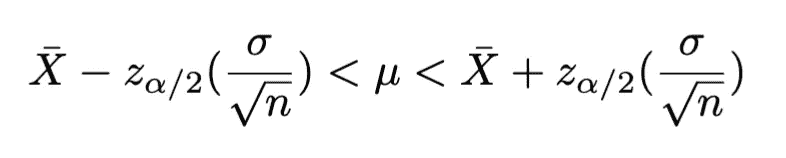

*   *α :* 显著性水平
*   *α =* 1 —置信区间
*   90%置信区间:z_ *α/2* = 1.65
*   95%置信区间:z_ *α/2* = 1.96
*   99%置信区间:z_ *α/2* = 2.58

## 当 *σ* 已知时，一个总体的置信区间是指

给定置信区间 1 - *α，*我们需要从 z 得分分布表中找到相关的 z 得分(临界值)。另一种写等式的方法如下所示:

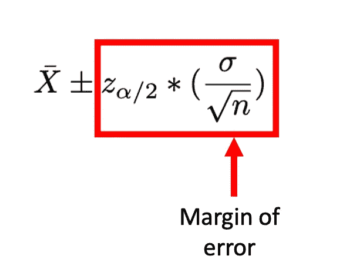

*   Xbar:样本平均值
*   z_ *α/2* : z 分数/临界值
*   *σ* :总体标准差
*   n:样本量

***举例。*** *如果您想确保 95%的情况下总体均值(参数均值)落在您指定的值范围内，请根据样本均值 Xbar 确定置信区间。第 95 个置信区间相当于α = 0.05。让我们根据之前指定的等式来计算。*

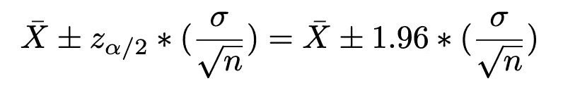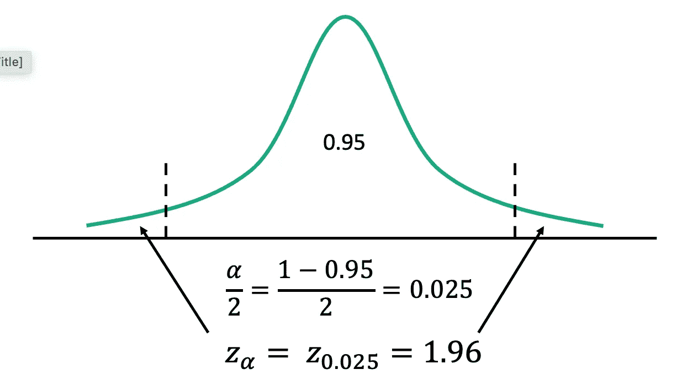

## 一个样本 z 间隔

我们的目的是找到总体均值的置信区间， *μ* 。我们的假设包括我们的样本是随机的，我们的样本是正态分布或足够大，我们可以假设它是(n ≥ 30)，并且标准偏差 *σ* 是已知的。我们需要 *σ* 来按照上面的公式进行计算。

1.确定一个置信水平(1 - *α)*

2.使用 z 表，找到 z_{ *α* /2}

3.总体/参数均值的置信区间， *μ* 的范围为

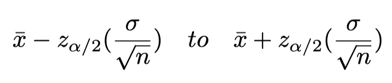

其中 z_{ *α* /2}是从步骤 1 中得出的， *n* 是样本大小， *xbar* 是从样本数据中计算出的平均值。

4.解释你的发现。这意味着陈述“我们的总体均值， *μ* 将落在(__，__)，(置信水平)的时间量内。

请注意，置信区间被认为对于正态总体是*精确的*，对于来自非正态总体的大样本是近似正确的【1】。

***举例。这里我们有芝加哥市区 32 家不同商店的一罐猫粮的价格。找出芝加哥市区所有宠物店猫粮平均价格μ的 95%置信区间。假设年龄的人口标准差是 0.8 美元。***

```
1.96       2.43       2.32       2.45       2.00       3.21       2.97       1.90       3.04       1.63       3.31       2.39       2.00       2.78       3.45       3.54       4.70       3.82       4.15       3.16       3.54       2.49       2.96       3.35       2.47       2.94       1.96       3.40       1.74       1.51       2.23       1.66
```

*由于总体标准差已知，样本量为 32，较大(≥30)，我们可以在σ已知的情况下，使用单样本 z 区间来求所需的置信区间。*

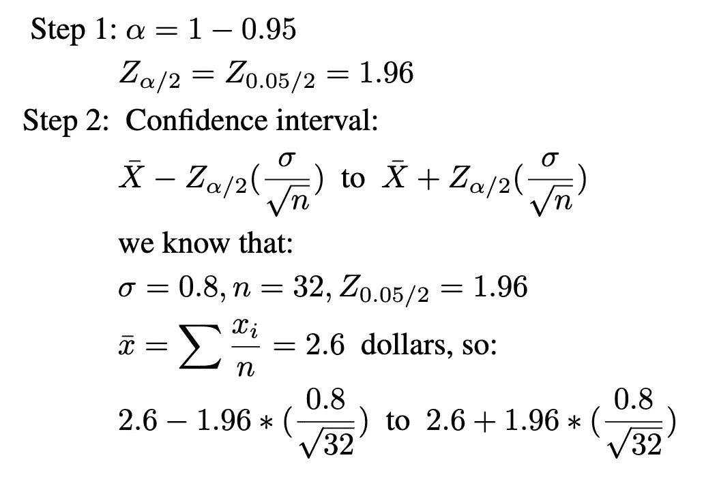

真实总体均值的置信区间从 2.32 美元到 2.88 美元。我们对此的解释如下:我们可以有 95%的把握，芝加哥市中心一罐猫粮的平均价格在 2.32 至 2.88 美元之间。

## 准确(性)

> “准确忠于意图，精确忠于自身”——西蒙·温彻斯特[2]

准确性是一个有内涵的术语，但不管怎样，它意味着有一个基础事实，我们作为评估者可以通过这个基础事实来评估我们有多正确或接近这个基础事实。为此，随着我们的置信区间宽度的增加，我们估计的准确性下降。直觉上，这应该是有意义的，因为对于现在包含在该范围内的参数，有更多可能的点估计。例如，按照上面的例子，95%的置信区间(2.32，2.88)对 99%的置信区间(2.24，2.96)。正如我们可以清楚地看到，第二个更广泛。这是由于我们必须更加确定我们的估计值在这个范围内。在前面的示例中，Xbar 是 2.6，因此在 95%的置信水平下，我们估计的误差是 2.6–2.32 = 0.28 美元，在第 99 个示例中，我们估计的误差是 2.6–2.24 = 0.36 美元。

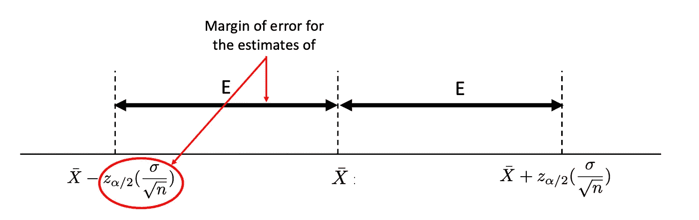

# 误差幅度

我们的置信区间的一半范围(等式的后半部分)可以解析出来，如下所示。这被称为我们的**误差范围，**用 *E* 表示。它代表了我们的参数估计和基于我们的置信水平的参数值的最大可能差异。

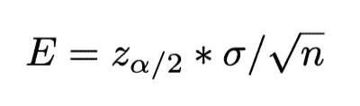

看看这个等式，如果我们有一个预先指定的置信水平(z_{ *α* /2})，我们如何减少误差 *E* (即增加我们估计的准确性)？

> 增加样本量！

由于“n”是分母中唯一的变量，这将是我们唯一可以轻松降低“E”的方法，因为我们不能强迫我们的总体具有不同的标准差。

## 样本量

假设我们想要一个更小的误差幅度。假设我们需要确保 90%的情况下，总体均值都在样本均值的 0.2 美元以内。我们需要多大的样本量才能说明这一点(假设 *σ* = *0.8* )？

我们可以在误差公式中求解出 *n* :

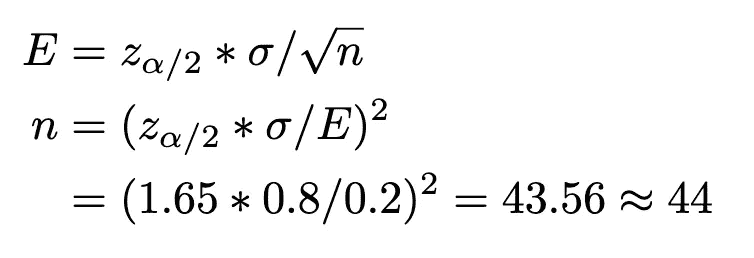

当从误差范围确定样本量 n 时，我们应该总是向上取整。这就是为什么 E 永远不会比我们想要的大。

# 假设检验

我们如何利用我们所学的关于置信区间的知识来回答诸如…

1.  一种新药会降低一个人的 a1c(用于检测糖尿病的实验室)吗？
2.  新设计的安全带会减少车祸中司机的伤亡人数吗？

这些类型的问题可以通过统计假设检验来解决，统计假设检验是一种评估关于人口的主张的决策过程。

## 假设检验(直觉)

假设我抱怨我一年只挣 1000 美元，你相信我。然后，我邀请你一起来，我们爬进我的宝马，开到我的私人机库，坐上我的私人飞机，飞到我 3000 平方英尺的地方。巴黎市区的公寓。对于我的投诉，您首先想到的是什么？我是个骗子…

## 假设检验(逻辑)

*   你假设了某种现实(我每年挣 1000 美元)
*   你观察到一些与假设相关的东西(你看到了我所有的物品)
*   你会想，“根据假设，我观察到我所观察到的东西的可能性有多大？”
*   如果你不相信这是可能的(也就是说，这种情况发生的可能性很小)，你拒绝这个假设。如果你相信这是可能的(即有足够的机会发生)，你不会拒绝它，继续前进。

## 假设检验(正式)

一个**统计假设**是关于一个总体参数的假设，典型的是 *μ* 。形式化一个假设有两个组成部分，无效假设和替代假设。

1.  **零假设** (H₀):一种统计假设，说明一个参数等于一个特定值(或者不同人群中的参数集是相同的)。
2.  **替代假设** (Ha 或 H₁):一种统计假设，说明参数比指定值大<(左尾)、≦(双尾)或>(右尾)(或说明参数之间存在差异)。

所以我们进行假设检验的步骤如下:

1.  陈述我们的无效假设和替代假设——h₀和 H₁
2.  根据我们的假设确定这是右尾检验、左尾检验还是双尾检验
3.  确定我们的重要性水平α。
4.  根据 alpha，从适当的分布表中找出相关的临界值(这些临界值根据您拥有的“尾部”类型而有所不同，应该在表的顶部显示方向性)
5.  根据我们的数据计算测试统计
6.  将我们的测试统计数据与我们的临界静态值进行比较
7.  做出拒绝或不拒绝零假设的决定。如果它落在拒绝区域，则拒绝，否则接受空值
8.  解释你的发现——“有足够的证据支持零假设”或“没有足够的证据拒绝零假设”

# 测试统计和临界值

**检验统计量**是根据从样本中收集的 our 计算出的值，并与先验阈值(临界值)进行比较，以确定显著性。临界值作为分离排斥和非排斥区域(显著和非显著)的边界。这些是根据相关的统计表确定的。到目前为止，我们已经讨论了 z 表，但是将在后续训练营中讨论其他统计表。请参见下图，了解双尾(两个剔除区域)是如何工作的。

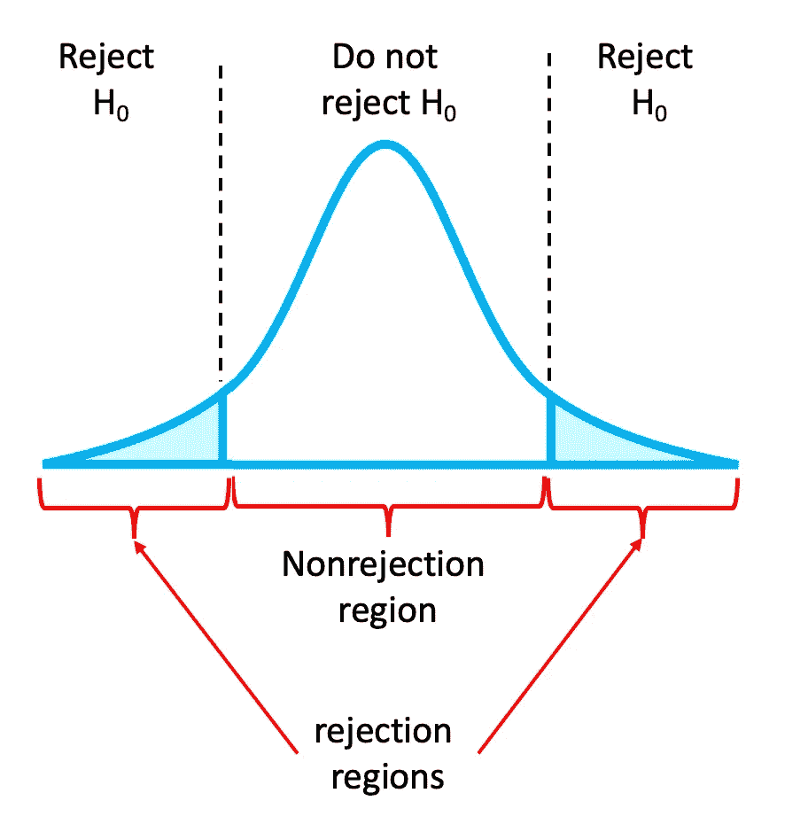

## 拒绝区域

我们的假设检验的一部分是决定我们预期的关系是什么样的，因此我们将研究哪个“尾巴”。有 3 个选项可用——双尾、左尾和右尾。在**双尾检验**中，当检验统计小于或大于我们的临界统计值(先验确定)时，零假设被拒绝(左侧和右侧的拒绝区域)。这等同于研究“不管方向如何，这与临界值不同吗？”。在**左尾检验**中，只有当检验统计量小于临界统计量(拒绝区域在左边)时，零假设才会被拒绝。最后，在**右尾检验**中，当检验统计量大于临界统计量时(拒绝区域在钟形曲线的右侧)，零假设被拒绝。见下图:

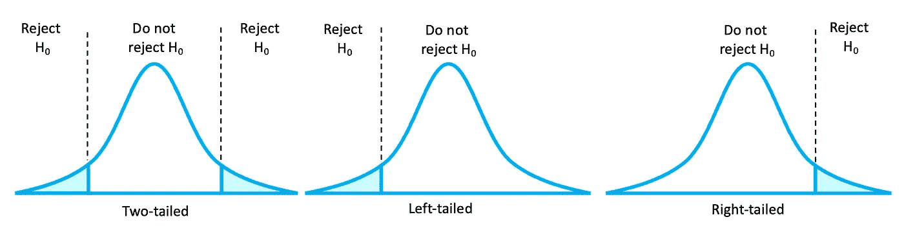

## 假设检验的结论

如果进行假设检验以拒绝零假设(H₀)，我们可以得出结论:“基于我们的样本，检验结果在统计上是显著的，并且有足够的证据支持替代假设(H₁)，该假设现在可以被视为是真的”。事实上，我们很少知道总体参数。因此，如果我们不拒绝零假设，我们必须谨慎，不要夸大我们的发现，认为数据没有提供足够的证据来支持替代假设。例如，“没有足够的证据/信息来确定零假设是错误的。”

## 单样本 z 检验

在单样本 z 检验中，我们将一个*单个*样本与其所在总体的信息进行比较。这是最基本的统计测试之一，我们可以通过以下 8 个步骤来测试我们的假设:

1.零假设是 H0: *μ = μ* ₀ *，*另一个假设是 3 个可能选项中的一个，这取决于方向是否重要，如果重要，是哪个方向:

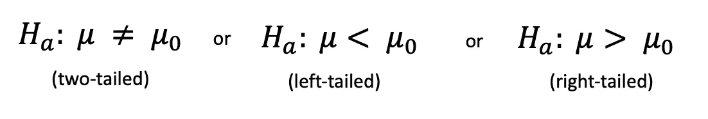

2.确定测试的方向——你要研究的是哪条尾巴

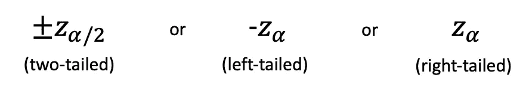

3.决定一个显著性水平， *α* 。

4.基于 alpha，从适当的分布[表](https://www.ztable.net/)中找出相关的临界值(这些临界值根据你所拥有的“尾部”的种类而不同，并且应该在表的顶部显示方向性)

5.根据我们的数据计算测试统计

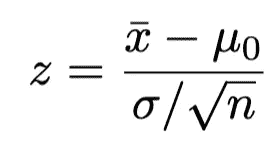

6.将我们的测试统计值与我们的临界静态值进行比较 Zcalc >，

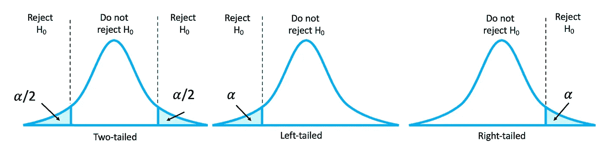

7.做出拒绝或不拒绝零假设的决定。如果它落在拒绝区域，则拒绝，否则接受空值

8.解释调查结果—“有足够的证据支持拒绝零假设”或“没有足够的证据拒绝零假设”

***举例。*** *一位医生很想知道一种新的哮喘药物是否会有不良副作用。具体来说，医生关心病人的 spO2。给患者用药后，spO2 会保持不变吗？医生知道健康人群的平均 spO2 为 95%，这种情况的假设是:*

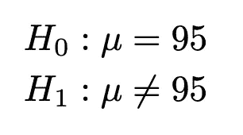

这被称为双尾检验(如果 H₀被拒绝，μ不等于 95，因此它可以小于或大于 95)。我们将在接下来的训练营中看看如何跟进。如果问题是服药后 spO2 是否下降呢？

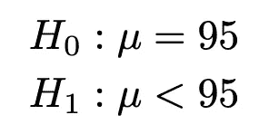

*这是左尾检验的符号(如果 H0 被拒绝，μ被认为小于 95)。如果问题是服药后 spO2 是否增加呢？*

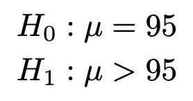

*这是右尾检验的符号(如果 H0 被拒绝，μ被认为大于 95)。*

***举例。一位气候研究人员希望了解加利福尼亚州华氏 80 度的平均天数是否大于 81 天。在加州随机选择的 30 个城镇的样本平均为 83 天。在α = 0.05 时，测试 80 华氏度的平均天数大于 81 天。平均值的标准偏差为 7 天。***

*让我们检查一下我们的假设:1)我们得到了一个随机样本，2)样本量 n=30，即≥ 30，3)参数的标准差已知。*

1.  陈述假设。H0: μ = 81，H1: μ ≥ 81
2.  *设置显著性水平，α = 0.05*
3.  测试的方向性:*右尾测试(因为我们测试的是‘大于’)*
4.  *利用α = 0.05，已知检验为右尾，则临界值为 Zcrit = 1.65。如果 Zcalc > 1.65，则拒绝 H0。*
5.  *计算测试统计值。*

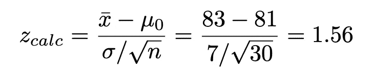

*6。比较 Zcalc 和 Zcrit。由于 Zcalc = 1.56 < Zcrit = 1.65，*

*7。Zcalc 不属于拒绝区域，因此，我们无法拒绝零假设。*

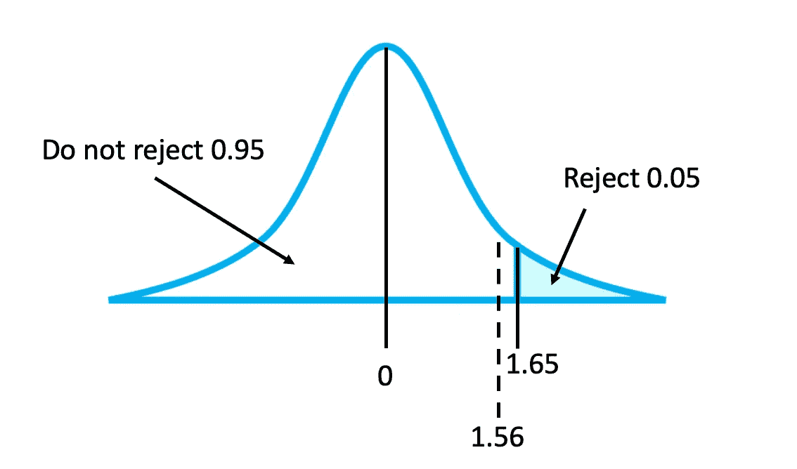

*8。解释我们的发现。没有足够的证据支持平均天数大于 81 天的说法。*

***举例。*** *据芝加哥公寓协会报道，市中心一居室公寓的平均租金为 2200 美元。为了了解单个公寓大楼的平均成本是否不同，租户在大楼内随机选择了 35 套公寓，发现 1-BR 公寓的平均成本为 1800 美元。标准差(σ)是 300 美元。在α = 0.01 时，是否可以得出结论，1-BR 在个人公寓的平均成本不同于 2200 美元？*

*让我们检查一下我们的假设:1)我们得到了一个随机样本，2)样本为 35，即≥ 30，3)提供了总体的标准差。*

1.  陈述假设。H0:μ= 2300，H1:μ**≦***2200*
2.  *α = 0.01*
3.  *测试的方向性:双尾*

4.*根据 z 表找到临界值。由于α = 0.01 且检验为双尾检验，所以临界值为 Zcrit(0.005) =* *2.58。如果 Zcalc >为 2.58 或 Zcalc < -2.58，则拒绝 H0。*

5.*计算 z 检验统计量*

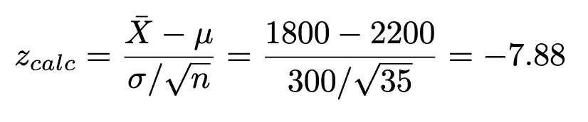

*6。将计算的统计值与步骤 2* 中确定的统计值进行比较

*7。由于 Zcalc = -7.88 < -2.58，落入拒绝区域，我们拒绝 H0。*

8。解释我们的发现。有足够的证据支持这种说法，即在那栋单独的公寓大楼里，1-BR 公寓的平均价格不同于 2200 美元。具体来说，它比参数均值更便宜。

# 摘要

我们已经讨论了如何通过使用置信区间来获得从我们的数据生成的统计估计的置信度。读完这篇文章后，你应该对小置信区间和大置信区间的含义以及推论的含义有了一个很好的理解。在工程领域，我们讨论加工部件的公差，数学“公差”也不例外。这里我们通常用术语重复性来量化我们的数学估计。我们可以将可重复性定义为持续产生相同结果的能力。如果指标或设计不具有可重复性，它将产生分散的结果(即更宽的置信区间)。

下一次训练营将需要详细说明类型 1 和类型 2 错误之间的权衡，敬请关注！

该系列之前的训练营:

[#1 打基础](https://medium.com/p/227f934924d9/edit)
[#2 中心、变异和位置](https://medium.com/@askline1/statistics-bootcamp-2-center-variation-and-position-9de00a231e80)
[#3 大概……概率](/statistics-bootcamp-3-probably-probability-588a2640fc13)
[#4 贝氏、鱼、山羊和汽车](/statistics-bootcamp-4-baes-coins-fish-goats-and-cars-e31e9c3d6cbd)
[#5 什么是正常的](/statistics-bootcamp-5-what-is-normal-dd7ca037d37d)

除非另有说明，所有图片均由作者创作。

## 参考

[1] Allan Bluman，统计学，初等统计学。
【2】温彻斯特，西蒙。完美主义者:精密工程师如何创造现代世界。HarperLuxe，2018。

此外，如果你喜欢看到这样的文章，并希望无限制地访问我的文章和所有由 Medium 提供的文章，请考虑使用下面的我的推荐链接注册。会员费为 5 美元/月；我赚一小笔佣金，这反过来有助于推动更多的内容和文章！

[](https://medium.com/@askline1/membership) [## 通过我的推荐链接加入 Medium-Adrienne Kline

### 阅读阿德里安娜·克莱恩(以及媒体上成千上万的其他作家)的每一个故事。您的会员费直接支持…

medium.com](https://medium.com/@askline1/membership)