# 统计训练营 7:平衡第一类和第二类错误

> 原文：<https://towardsdatascience.com/statistics-bootcamp-7-balancing-type-i-and-ii-errors-848a699a65a8>

## [统计训练营](https://towardsdatascience.com/tagged/statistics-bootcamp)

## 学习作为数据科学家日常使用的库背后的数学和方法


作者图片

这篇文章是一个更大的 Bootcamp 系列的一部分(完整列表见 kicker！).这本书致力于理解第一类和第二类错误并介绍 t 分布。

我们基于假设检验做出的任何决定都可能是不正确的。我们可以在应该接受的时候拒绝，反之亦然。当我们使用一个*单一*样本来告知总体概率时，就会出现这种情况。

在统计学中，我们考虑两种类型的错误，这取决于情况(我们很少知道)的地面真相的方向性，但可以估计。有第一类和第二类错误。**第一类**错误是当我们拒绝了不应该拒绝的零假设，即零假设=真。相反，当我们未能拒绝零假设(接受零假设)时，发生了**类型 II** 错误，此时我们不应该拒绝零假设，即零假设=假。您可以在下面的列联表中看到这种现象的直观表示。

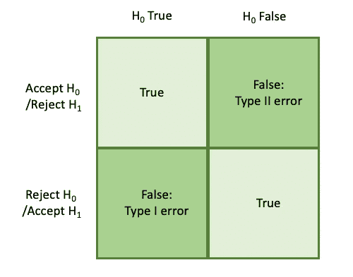

从图形上看，我们可以将其表示为:

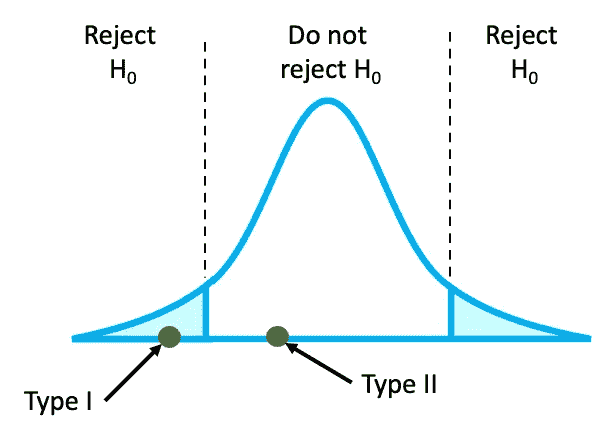

***举例。***h₀:*= 150*lbs(女性平均体重 150 lbs)* h₁:*μ*≠150*lbs(女性平均体重不到 150 lbs)**

**如果地面真值为μ* = 150 *lbs，则发生了 I 类误差，但数据分析得出的结论是μ* ≠ 150 *lbs。相反，如果地面真值为μ* ≠ 150 *lbs，则发生了第二类错误，但数据分析得出的结论是μ =* 150 *lbs。**

# *误差概率*

*现在，I 型和 II 型错误都有一定的发生概率。I 型错误的概率 *P* 表示为 P(I 型错误)= *α* ，我们称之为统计学中的显著性水平。这是完全偶然拒绝零假设的概率，是曲线下面积(AUC)。
**p(I 型错误)= P(拒绝 H₀ | H₀为真)***

**

*第二类误差的概率 P 表示为 P(第二类误差)= β。这是当零假设为假，替代假设为真时，不拒绝零假设的概率。
**p(ⅱ型错误)= P(未能拒绝 H₀ | H₁为真)**
或:
**p(ⅱ型错误)= P(未能拒绝 H₀ | H₀为假)***

*我们必须平衡α的风险和β的风险，因为这两者是相互权衡的。因为 *α* 越小，β的值就越大，反之亦然，假设样本量保持不变。我们可以在这里直观地看到:*

*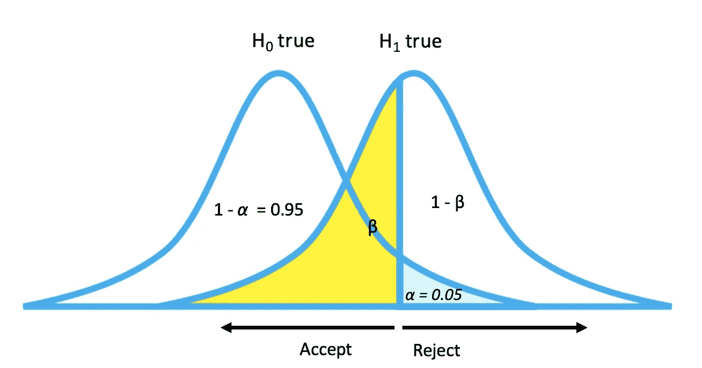*

*如果我们考虑让这些分布相互滑动，如果我们通过将右分布进一步向右移动来减少 *α* (第一类误差)，我们不可避免地会增加β的值(第二类误差)。*

*从上面回到我们的权变表，我们可以填充我们所学到的东西，以及如何将它融入到我们之前所学的东西中。*

*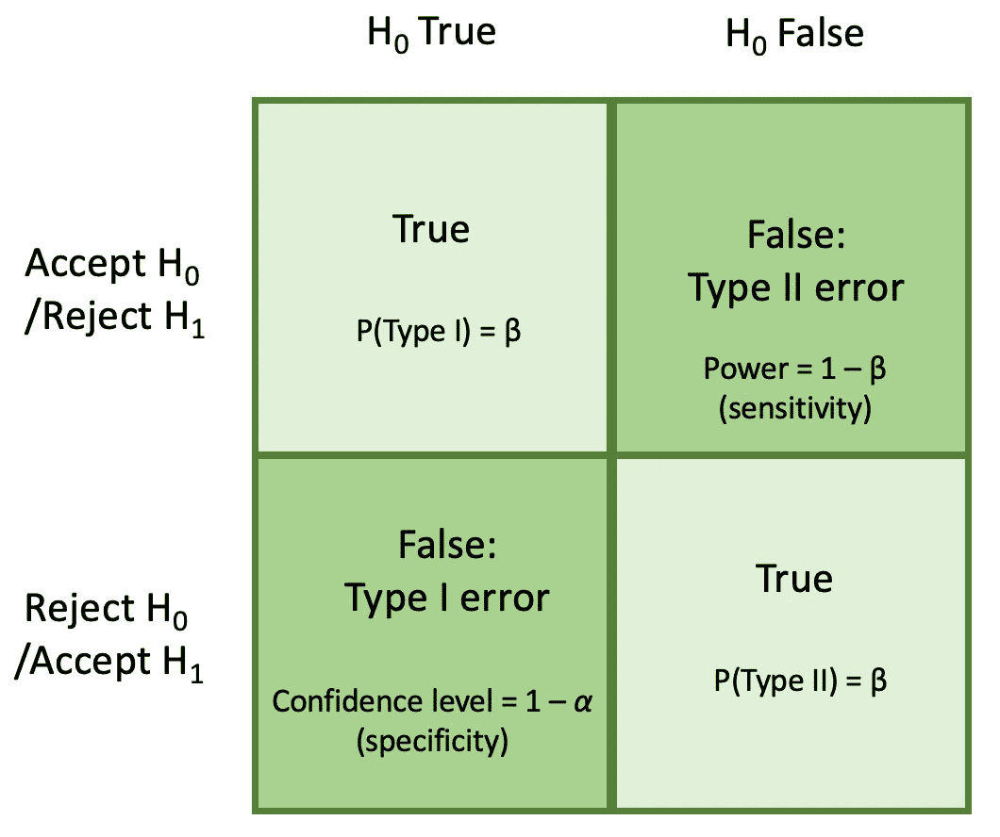*

# *p 值*

*概率值(P 值)是指分布曲线下的面积，表示如果零假设为真，从我们的数据中获得我们观察到的结果(检验统计)的概率。这告诉我们，我们应该对我们的结果感到多么“惊讶”——也就是说，我们有多少反对₀和支持₁的证据。像以前一样，我们有 3 种不同的测试:双尾，右尾和左尾。*

*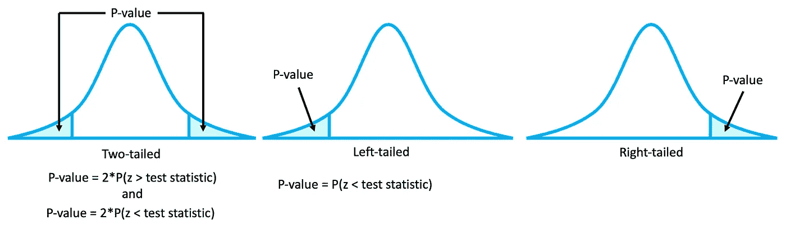*

*请注意，对于双尾测试，我们必须将 P 值乘以 2，因此我们在任一尾都有相同的概率(5%，如果 *α* = 0.05)，否则它默认为我们想要的 1/2-0.025 或 2.5%。毫不奇怪，如果你的 p 值非常小(意味着它的位置在分布的尾部)，H **₀** 更有可能是假的，因为有更多的证据表明它离分布的均值越远。*

*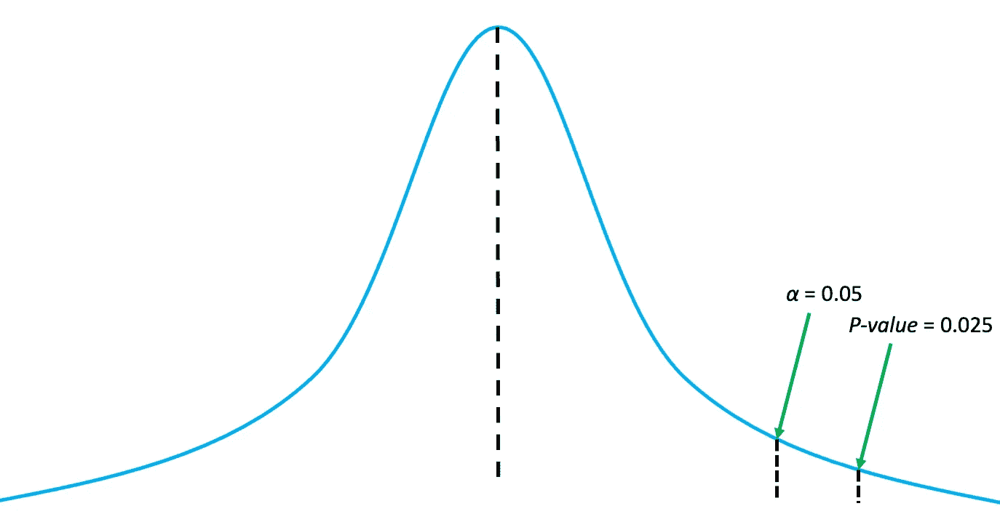*

*在我们上次的训练营中，我们学习了基于 ***临界值*** 方法*，*的假设检验，在这里，当使用 ***p 值*** 方法求解时，我们遵循下面概述的前 4 个步骤。我们的不同之处在于第五步。我们将确定计算出的统计值的相应 p 值，而不是确定我们的临界点。*

## *单样本 z 检验(P 值法)*

*我们现在将讨论使用 ***p 值方法的假设检验。*** 我们的假设和前面一样:简单随机样本，正态和/或大总体， *σ* 已知*

1.  *陈述我们的无效假设和替代假设——h₀(μ=μ)和 H₁.*
2.  *根据我们的假设确定这是否构成右(μ > μ₀)，左(μ < μ₀) or two-tailed test (μ ≠ μ₀).*
3.  *Ascertain our significance level *α* 。*
4.  *根据我们的数据计算测试统计*

*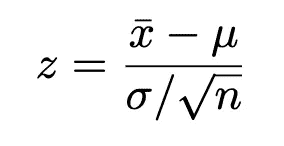*

*5.根据相应 z 表中的测试统计数据确定我们的 p 值(分布范围内的面积)。*

*6.将我们的 P 值与 *α* 进行比较。*

*7.做出拒绝或不拒绝零假设的决定。如果 P 值≤ *α* ，拒绝零假设。如果 P 值> *α* ，不拒绝零假设。*

**

*8.解释你的发现——“有足够的证据支持拒绝零假设”或“没有足够的证据拒绝零假设”。*

*如果您想知道这两种方法(临界 v . p-值)是否会给出不同的结果，它们不会。它们只是对同一现象的两种不同的思考方式。使用临界值方法，您可以直接将统计数据与临界值进行比较。在 p 值法中，您比较的是与相同临界值和检验统计量相关的相关曲线下面积(AUC)。*

****举例(p 值法)。一位图书管理员想知道她的学生每天平均借阅的图书数量是否是 50 本。她收集了一年中 30 个随机工作日的图书样本，发现平均有 52 本书。在α = 0.05 时，测试平均图书借阅量为> 50 本/学年。平均值的标准差是 4 本书。****

**让我们检查一下我们的假设:1)我们得到了一个随机样本，2)样本量 n=30，即≥ 30，3)总体的标准差(σ)已知。**

1.  **陈述假设。H₀: μ = 50，H₁: μ > 50**
2.  *测试的方向性:*右尾测试(因为我们测试的是‘大于’)**
3.  **我们的显著性水平是α = 0.05**
4.  **计算测试统计值。**

*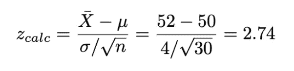*

**5。根据我们相应的* [*z 表*](https://www.ztable.net/) *(右尾)中的检验统计量，确定我们的 p 值(分布下面积)。我们通过在行上找到 2.7，然后在列上找到 0.04 来读取 z 表，从而得到 2.74，zcalc 左边的面积是 0.99693，因此右边的面积是 0.00361。**

*6。我们的 p 值< α = 0.05，因此我们拒绝零假设。*

*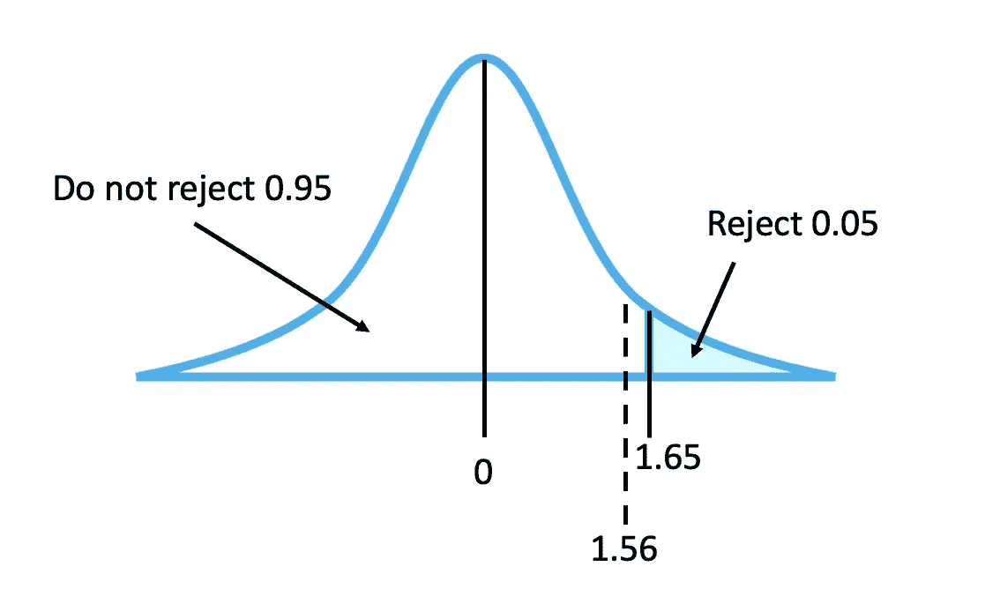*

**7。解释我们的发现。有足够的证据支持这样的说法，即一天平均借出的图书数量是 50 本。**

****举例(p 值法)。*** *《自然》系列科学杂志认为，这些报告的平均审查时间是 8 周。为了了解每份期刊的平均成本是否不同，研究人员随机选取了 35 篇论文作为样本，这些论文的平均审阅时间为 9 周。标准差(σ)为 1 周。在α = 0.01 时，是否可以得出平均复习时间不同于 8 周的结论？**

**让我们检查一下我们的假设:1)我们得到了一个随机样本，2)样本为 35，即≥ 30，3)提供了总体的标准差。**

1.  **陈述假设。H₀: μ = 8，H₁: μ* **≠** 8*
2.  **测试的方向性:双尾**
3.  **α = 0.01**
4.  **计算 z 检验统计量**

*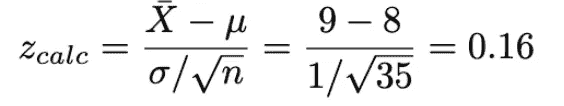*

**5。根据我们相应的* [*z 表*](https://www.ztable.net/) *(双尾)中的检验统计量，确定我们的 p 值(分布下面积)。我们通过在行上找到 0.1，然后在列上找到 0.06 来读取 z 表，从而得到 0.16，zcalc 左侧的面积是 0.4364，但是我们需要乘以 2，因为这是一个双尾测试，所以我们得到:2(0.4364) = 0.8692。**

*6。既然 p 值≯*α在任何一边，它都不落入拒绝区域，我们拒绝失败拒绝 H₀.**

*7。解释我们的发现。没有足够的证据支持平均审查时间不同于 8 周的说法。*

## *当 *σ* 未知时的置信区间*

*在之前的训练营中，我们所研究的例子已经提供了总体标准差σ。然而却鲜为人知。为了在σ未知时进行补偿，我们使用 t 分布和值，而不是标准的正态 N(0，1)分布和 z 得分和值。这些方程看起来非常相似。尽管它们对应的“查找”表不同:*

*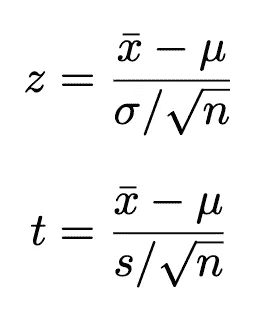*

*简而言之，如果σ(总体标准差)已知，则使用 z 分布。否则，使用样本分布“s”的 t 分布。*

*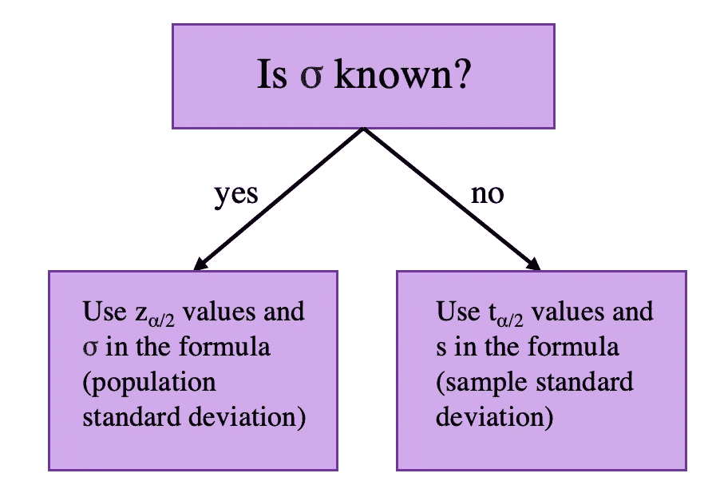*

# *t 分布*

*t 分布由自由度(DOF)和 *α* 的值来参数化，自由度可以是任何无符号整数。注意 DOF 通常近似为 *n* (样本数)-1。t 分布有几个特性:*

*   *形状由 DOF = n-1 决定*
*   *可以取(-inf，inf)之间的任何值*
*   *它围绕 0 对称，但比我们的标准正态曲线 N(0，1)更平坦*

*随着 t 分布自由度的增加，它接近标准正态分布— N(0，1)。t 分布的符号表示为:*

*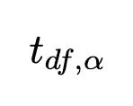*

*用我们得到的不同 DOF 绘制不同的 t 分布(代码如下):*

*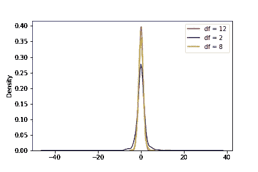*

```
*from scipy.stats import t
import matplotlib.pyplot as plt
import seaborn as sns
import numpy as np

#generate t distribution with sample size 1000
x = t.rvs(df=12, size=1000)
y = t.rvs(df=2, size=1000)
z = t.rvs(df=8, size=1000)

#sns.kdeplot(x) # plotting t, a separately 
fig = sns.kdeplot(x, color="r")
fig = sns.kdeplot(y, color="b")
fig = sns.kdeplot(z, color="y")
plt.legend(loc='upper right', labels=['df = 12', 'df = 2', 'df = 8'])
plt.show()*
```

*对于一条 15 自由度的曲线，在一次右尾测试中t 的临界值 *t* 是多少(0.05)？为此，使用一个 [t 形工作台](https://www.google.com/url?sa=t&rct=j&q=&esrc=s&source=web&cd=&cad=rja&uact=8&ved=2ahUKEwiYr5CLirv7AhWaElkFHQcLAuMQFnoECBIQAQ&url=https%3A%2F%2Fwww.sjsu.edu%2Ffaculty%2Fgerstman%2FStatPrimer%2Ft-table.pdf&usg=AOvVaw0PptqSy1oUPBEt_PLI35Jt)。*

*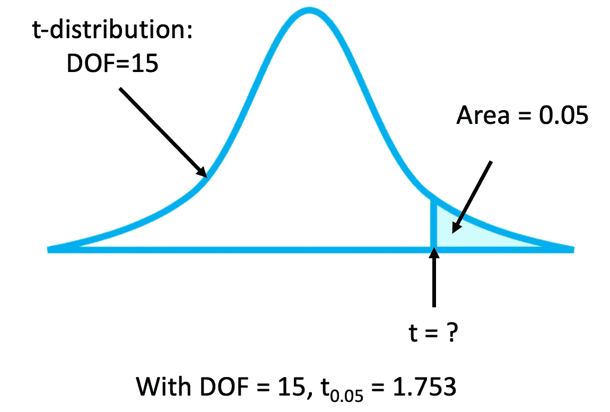*

## *一个样本 t 间隔*

*既然您已经习惯于从 t 表中确定 t 值，我们可以将此转化为确定给定μ的置信区间(CI ),此时 *σ* 未知。*

*同样，我们的假设是我们已经获得了一个简单的随机样本，并且该样本构成了一个正态总体或者足够大以假设正态性，并且 *σ* 是未知的。非常类似于我们在 z 分布中计算 CIs 的方式:*

1.  *确定置信水平:1 - *α**
2.  *确定 DOF = *n* - 1(其中 *n* 是样本大小)*
3.  *参考 t 表来查找 *t_{α/2}* 的 t 值*
4.  *分别计算样本的平均值和标准偏差， *x_bar* 和 *s**
5.  *置信区间表示为:*

*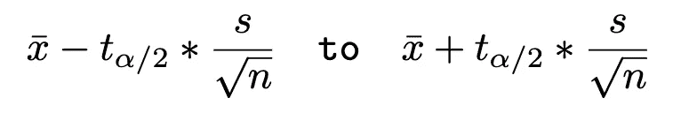*

*6.总结 CI。*我们可以说，样本的平均值将落在这些界限(置信水平)时间量*内。*

****举例。t 检验中的置信区间。*** *一项糖尿病研究招募了 25 名参与者，调查一种新的糖尿病药物计划对 a1c 水平的影响。1 个月后，受试者的 a1c 记录如下。使用数据找出血红蛋白 a1c 平均下降的 95%置信区间。假设样本来自正态分布的总体。**

```
*6.1  5.9  7.0  6.5  6.4 
5.3  7.1  6.3  5.5  7.0
7.6  6.3  6.6  7.2  5.7
6.0  5.4  5.8  6.2  6.4
5.9  6.2  6.6  6.8  7.1* 
```

1.  **我们在问题中指定的置信度为 0.95，α = 0.05**
2.  **自由度= n–1 = 25–1 = 24**
3.  **根据 t(24，0.05)对应的 t 表，值为:**

*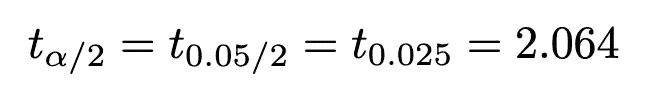*

**4。平均值 x_bar = 6.356，标准偏差 s = 0.60213509**

**5。使用我们的公式:**

***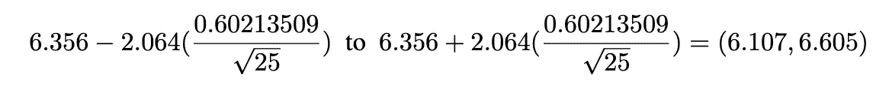*

**6。我们对这一置信区间的解释是，在 95%的情况下，该人群的平均糖化血红蛋白在 6.12 和 6.61 之间**

## *t 检验:P 值与临界值*

*正如本文前面所指出的，在描述 z 检验方法(临界值与 p 值)之间的差异时，t 检验也是如此。它们只是对同一现象的两种不同的思考方式。使用临界值方法，您可以直接将统计数据与临界值进行比较。在 p 值法中，您比较的是与相同临界值和检验统计量相关的相关曲线下面积(AUC)。唯一的区别是 t 检验应用于样本而不是总体，因此我们在寻找我们的值/面积时计算我们的自由度(DOF)。让我们解决实现这两种解决方案类型的同一个问题。*

****举例。一个样本的 t 检验临界值逼近*** *一位游泳教练声称男性游泳运动员的平均身高要高于女性。15 名男性游泳运动员的平均身高为* 188 厘米*，标准差为 5 厘米。如果女游泳运动员的平均身高是 175 cm，那么在α = 0.05 时，是否有足够的证据支持这一说法？假设人口是正态分布的。**

**让我们首先检查我们的假设:**

*   **我们获得了一个随机样本**
*   **人口呈正态分布**
*   **提示*中提供了总体标准差*

1.  *陈述假设。H₀: μ = 175 cm，H₁: μ > 175 cm*
2.  **测试的方向性:右尾**
3.  **α = 0.05，df = 15–1 = 14**
4.  **计算 t(calc):**

*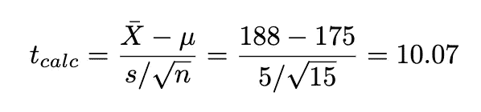*

*5.*根据 t 表找出临界值。由于α = 0.05，且检验为右尾检验，因此临界值为 Tcrit(0.05) = 1.761。如果 Tcalc > 1.761，则拒绝 H₀。**

*6.由于 10.07 > 1.761 落入拒绝区域，我们拒绝 H₀.*

*7。解释我们的发现。有足够的证据支持男性游泳运动员的平均身高高于女性的说法。*

****举例。其中样本 t 检验 p 值的取值方法****

**让我们解决上面同样的问题，但是使用 p 值方法。**

1.  **基于 t 统计量(10.07)的相应 p 值(分布下面积)为< .00001。**
2.  *由于 t crit<α落入拒绝区域，我们拒绝 H₀.*
3.  *解释我们的发现。有足够的证据支持男性游泳运动员的平均身高高于女性的说法。*

# *摘要*

*在本次训练营中，我们已经讲述了错误、z 与 t 测试以及如何使用两种主要方法(p 值和临界值)进行统计计算。读完这篇文章后，您应该理解改变 I 型错误的比率是如何影响 II 型错误的比率的。作为参考，I 型错误被认为更具攻击性。这样做的基本原理是，现状(Ho)是我们的默认假设，默认和假设没有影响比声称一个错误的要好。*

*除非另有说明，所有图片均由作者创作。*

*此外，如果你喜欢看到这样的文章，并希望无限制地访问我的文章和所有由 Medium 提供的文章，请考虑使用下面的我的推荐链接注册。会员费为 5 美元/月；我赚一小笔佣金，这反过来有助于推动更多的内容和文章！*

*[](https://medium.com/@askline1/membership) [## 通过我的推荐链接加入 Medium-Adrienne Kline

### 阅读阿德里安娜·克莱恩(以及媒体上成千上万的其他作家)的每一个故事。您的会员费直接支持…

medium.com](https://medium.com/@askline1/membership)*