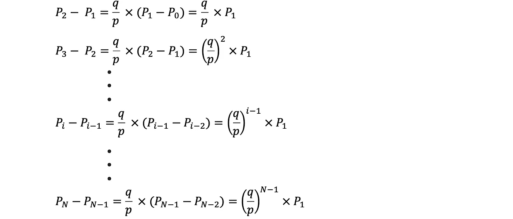
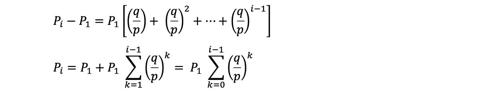
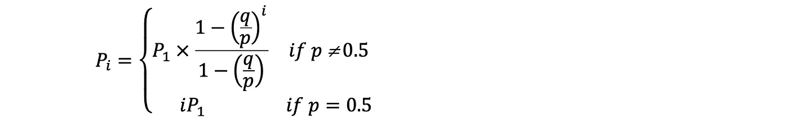
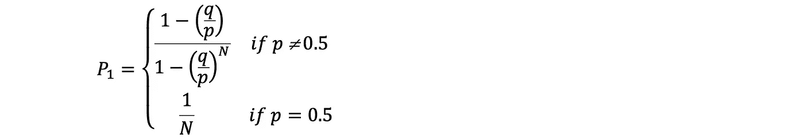
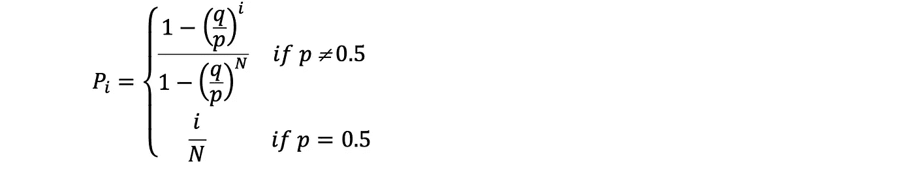

# 统计学概念——赌徒的破产问题

> 原文：<https://towardsdatascience.com/statistics-concept-the-gamblers-ruin-problem-cfee39a9cf37>

## 带概念解释和数学推导的赌徒破产问题完全初学者指南

克里斯·利维拉尼在 [Unsplash](https://unsplash.com/) 上的照片

在这篇文章中，我将介绍一个统计学概念，赌徒的破产问题。这个概念与赌徒有关，当一个赌徒在赢了之后增加他或她的赌注到一个固定的分数，但是在输了之后不减少它，最终将会破产。[2]这也是理解简单随机行走或随机过程的一个很好的例子。如果未来状态的条件概率分布仅依赖于当前状态而不依赖于过去的历史，则随机过程具有马尔可夫性质。[4]本文将从问题陈述开始，接着是数学推导，最后是结论。

## 问题陈述

考虑一个赌徒，他开始时的初始财富为 **i 单位**，对连续赌博的结果下注，即连续掷硬币。在每次连续投掷硬币时，如果硬币正面朝上，游戏者将赢得 1 个单位，如果硬币反面朝上，游戏者将失去 1 个单位。假设硬币的**次连续投掷是独立的**，每次投掷的结果是正面或反面，概率为 p，q = 1-p。

让 Rₙ表示 nᵗʰ赌博后的总财富。游戏者的目标是最终赢得所有的钱，即给定庄家得到的**N-I 个单位**的 **N 个单位**而不被毁掉(耗尽资金)。在任何情况下，赌徒在赢了所有的钱或变得倾家荡产后停止游戏，无论哪种情况先发生。

现在我们可以推导出**如果赌徒从 I 个单位开始，B 从 N-I 个单位开始，他最终得到所有钱的概率**其中 0 < i < N。

## 用定义分配变量

设 P(H) = p =掷硬币结果是正面的概率
p(hᶜ)= q = 1 p =掷硬币结果是反面的概率

Rₙ = ∆₁ + ∆₂ + … + ∆ₙ，r₀= I**∫**赌徒从 I 单位开始
当游戏继续进行时，{Rₙ : n ≥ 0}形成一个简单的随机游走，其中∆形成 i.i.d .序列 r.v.s .分布为
p(∈= 1)= p**∫**如果硬币正面朝上则赢 1
p(∈= 1)= q

> **I . I . d . r . v . s =独立同分布的随机变量意味着随机变量的集合具有与其他随机变量相同的概率分布，并且都是相互独立的[3]**

**由于当 Rₙ = 0 或 Rₙ = N 时游戏停止，
设τᵢ = min{ n ≥ 0: Rₙ ∈ {0，N} | R₀ = i }，表示当 R₀ = i 时游戏停止的时间。如果 Rτᵢ = N，则游戏者赢得所有的钱，如果 Rτᵢ = 0，则游戏者破产**

**设 Pᵢ = P(Rτᵢ = N) =当赌博者以 I 个单位开始时，他以所有的钱结束的概率，R₀ = i**

## **衍生物**

**赌徒的破产问题可以通过随机行走来建模，从初始赌注开始，在给定的概率分布下，每一步都会赢或输。由于每一步都是独立于过去的，所以本质上是一个马尔可夫链。**

**接下来，根据马尔可夫性质，继续计算 Pᵢ，我们得到**

****

**图一。圆周率的递归方程。图片作者。**

**对于 i = 1，2，…，n1，请注意，P₀ = P(R₀ = N) = 0，Pₙ = P(Rₙ = N) = 1**

**递归方程的推导如下:如果∆₁=为 1，那么游戏者的总财富增加到 R₁ = i + 1，因此游戏者现在将以概率 Pi+1 获胜。类似地，如果∆₁= 1，那么游戏者的财富减少到 r₁= 1，因此游戏者将以概率 pi 1 获胜。**

**由于 p + q = 1，我们可以将递归方程改写为**

****

**图二。重写图 1 中的递归方程。图片作者。**

**因此，我们得到**

****

**图 3。将值代入图像 2 的等式。图片作者。**

**加上第一个 i -1，我们得到**

****

**图 4。添加图像 3 的第一个 i-1。图片作者。**

**这里我们可以用几何级数方程来简化并得到**

****

**图 5。任意数 a 和任意整数 i ≥ 1 的几何级数方程。图片作者。**

****

**图 6。用几何级数方程简化图像 4 的方程。图片作者。**

**利用 Pₙ = 1 的事实，我们得到**

****

**图 7。将 Pn = 1 代入图像 6 的等式，得出 P1。图片作者。**

**因此，**

****

**图 8。结合图像 6 和图像 7 的方程，得出圆周率。图片作者。**

**注意 1 - Pᵢ是破产的概率。**

## **例子**

**如果一个赌徒从 50 个单位开始赢得 100 个单位，那么这个赌徒赢的概率是多少(I)如果 p = 0.5(公平游戏)，(ii)如果 p = 0.45，(iii) p = 0.55？**

**(I)如果 p = 0.5，P₅₀ = 50/100 = 50%
(ii)如果 p = 0.45，p₅₀=[1-(0.55/0.45)⁵⁰)/[1-(0.55/0.45)⁰⁰]= 0.0044%
(iii)如果 p = 0.55，p₅₀=[1-(0.45/0.55)⁵⁰)/[1-(0.45/0.55)⁰⁰]= 99.996%**

**从这里我们可以看到，如果是公平游戏，p = 0.5，游戏者获胜的概率是 50%，而如果 p = 0.45，它将下降到 0.0044%。如果 p = 0.55，它将增加到约 100%。**

**这也意味着，如果 **p > 0.5** (每一次赌博都对他有利)，那么赌徒有很大的概率**永远不会破产，而是会变得无限富有**。另一方面，如果 **p ≤ 0.5** (每一次赌博都对他不利)，那么几乎以概率 1，赌徒将会倾家荡产。**

## **结论**

**总之，赌徒的破产问题表明，一个玩负期望值游戏的赌徒最终会破产，不管他们的下注系统如何。换句话说，即使一个财富有限的**赌徒在玩一场公平的游戏(也就是说，每个赌注对双方的期望值都是零)，面对一个财富**无限的对手**最终也不可避免地会破产** **。****

## **参考**

**[1] [哥伦比亚大学:金融工程笔记，2018](http://www.columbia.edu/~ks20/FE-Notes/4700-07-Notes-GR.pdf)**

**[2] [赌徒的毁灭——维基百科](https://en.wikipedia.org/wiki/Gambler%27s_ruin)**

**[3] [独立同分布随机变量—维基百科](https://en.wikipedia.org/wiki/Independent_and_identically_distributed_random_variables)**

**[4] [马尔科夫属性—维基百科](https://en.wikipedia.org/wiki/Markov_property)**