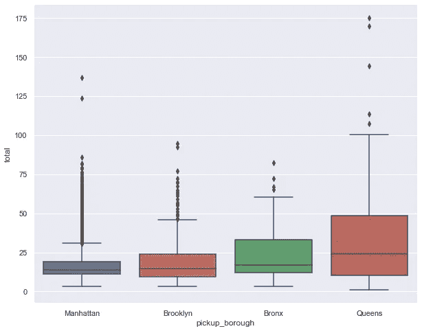
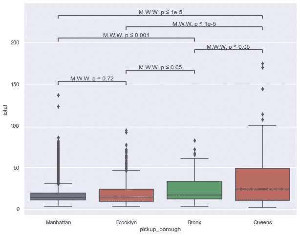
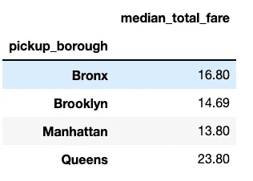
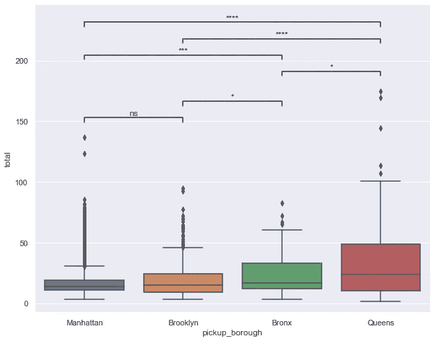

# statan 注释:在 Seaborn 图上添加统计显著性注释

> 原文：<https://towardsdatascience.com/statsannotations-add-statistical-significance-annotations-on-seaborn-plots-6b753346a42a>

## 从三行代码的比较中获得洞察力

# 动机

假设您正试图确定出租车在两个城市之间的总支付中值是否有显著差异。您决定创建一个箱形图来观察每个接送城市的总费用。



作者图片

这张图让你对多个城市之间的总票价差异有所了解，但不能让你深入了解你在寻找什么。

如果像下面这样在一个箱线图上添加统计注释不是很好吗？这就是 statannotations 派上用场的时候了。



作者图片

# 什么是 statannotations？

[statannotations](https://github.com/trevismd/statannotations) 是一个 Python 包，可以选择计算统计测试，并在 seaborn 生成的图上添加统计注释。

要安装 statannotations，请键入:

```
pip install statannotations
```

# 分析数据

为了学习如何使用 statannotations，我们首先从从 seaborn 加载纽约出租车的数据集开始。

让我们看看每个城市的总票价中值:



作者图片

我们可以看到，从皇后区接乘客的出租车的总费用中值最高，其次是布朗克斯、布鲁克林和曼哈顿。

为了更好地了解每个城市总票价的分布情况，我们可以创建每个城市总票价的箱线图:


作者图片

为了给绘图添加统计注释，我们将使用 statsannotions。

# 在图上添加统计注释

首先获取每个城市所有乘车的总费用:

接下来，获取这两个城市的所有可能的比较组合:

```
[('Manhattan', 'Brooklyn'),
 ('Manhattan', 'Bronx'),
 ('Manhattan', 'Queens'),
 ('Brooklyn', 'Bronx'),
 ('Brooklyn', 'Queens'),
 ('Bronx', 'Queens')]
```

现在我们已经准备好向图中添加统计注释了！特别地，我们将使用[曼-惠特尼 U 检验](https://www.statisticshowto.com/mann-whitney-u-test/)来比较两个独立的组。

无效假设是两个城市的总票价相等。另一个假设是两个城市的总票价不相等。

```
Manhattan vs. Brooklyn: Mann-Whitney-Wilcoxon test two-sided, P_val:7.225e-01 U_stat=9.979e+05
Brooklyn vs. Bronx: Mann-Whitney-Wilcoxon test two-sided, P_val:1.992e-02 U_stat=1.608e+04
Bronx vs. Queens: Mann-Whitney-Wilcoxon test two-sided, P_val:1.676e-02 U_stat=2.768e+04
Manhattan vs. Bronx: Mann-Whitney-Wilcoxon test two-sided, P_val:5.785e-04 U_stat=2.082e+05
Brooklyn vs. Queens: Mann-Whitney-Wilcoxon test two-sided, P_val:3.666e-12 U_stat=9.335e+04
Manhattan vs. Queens: Mann-Whitney-Wilcoxon test two-sided, P_val:2.929e-30 U_stat=1.258e+06
```



作者图片

图中星星数量的含义:

```
 ns: p <= 1.00e+00
       *: 1.00e-02 < p <= 5.00e-02
      **: 1.00e-03 < p <= 1.00e-02
     ***: 1.00e-04 < p <= 1.00e-03
    ****: p <= 1.00e-04
```

`ns`代表无统计学意义。一般来说，p 值越小，支持替代假设的证据就越强。

在上图中，我们可以看到，除了曼哈顿和布鲁克林，大多数城市对之间的总支付中值存在显著差异。

# 将 p 值添加到图中

如果您不喜欢星形符号，而是希望将 p 值添加到您的图中，请指定`text_format="simple"`:


作者图片

您将看到特定城市对之间比较的 p 值！

# 结论

恭喜你！您刚刚学习了如何向 seaborn 图添加统计注释。我希望这篇文章能让你在更深的层次上研究两个数据之间的关系。

随意发挥，并在这里叉这篇文章的源代码:

<https://github.com/khuyentran1401/Data-science/blob/master/visualization/statsannotation_example.ipynb>  

我喜欢写一些基本的数据科学概念，并尝试不同的数据科学工具。你可以在 LinkedIn 和 T2 Twitter 上与我联系。

星[这个回购](https://github.com/khuyentran1401/Data-science)如果你想检查我写的所有文章的代码。在 Medium 上关注我，了解我的最新数据科学文章，例如:

<https://pub.towardsai.net/atoti-build-a-bi-platform-in-python-beea47b92c7b>  </how-to-create-interactive-and-elegant-plot-with-altair-8dd87a890f2a>  </introduction-to-yellowbrick-a-python-library-to-explain-the-prediction-of-your-machine-learning-d63ecee10ecc>  </how-to-sketch-your-data-science-ideas-with-excalidraw-a993d049f55c> [## 如何用 Excalidraw 勾画您的数据科学想法

towardsdatascience.com](/how-to-sketch-your-data-science-ideas-with-excalidraw-a993d049f55c)