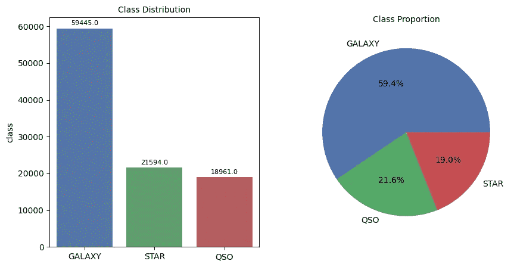
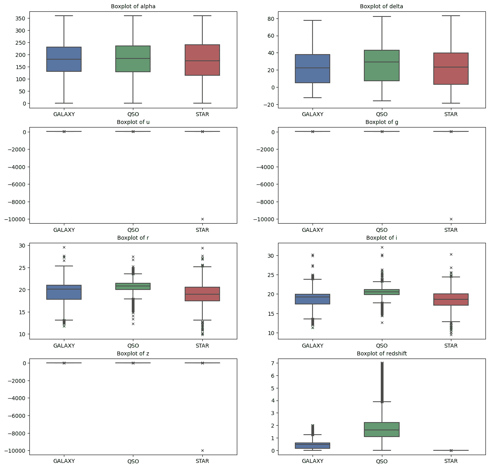
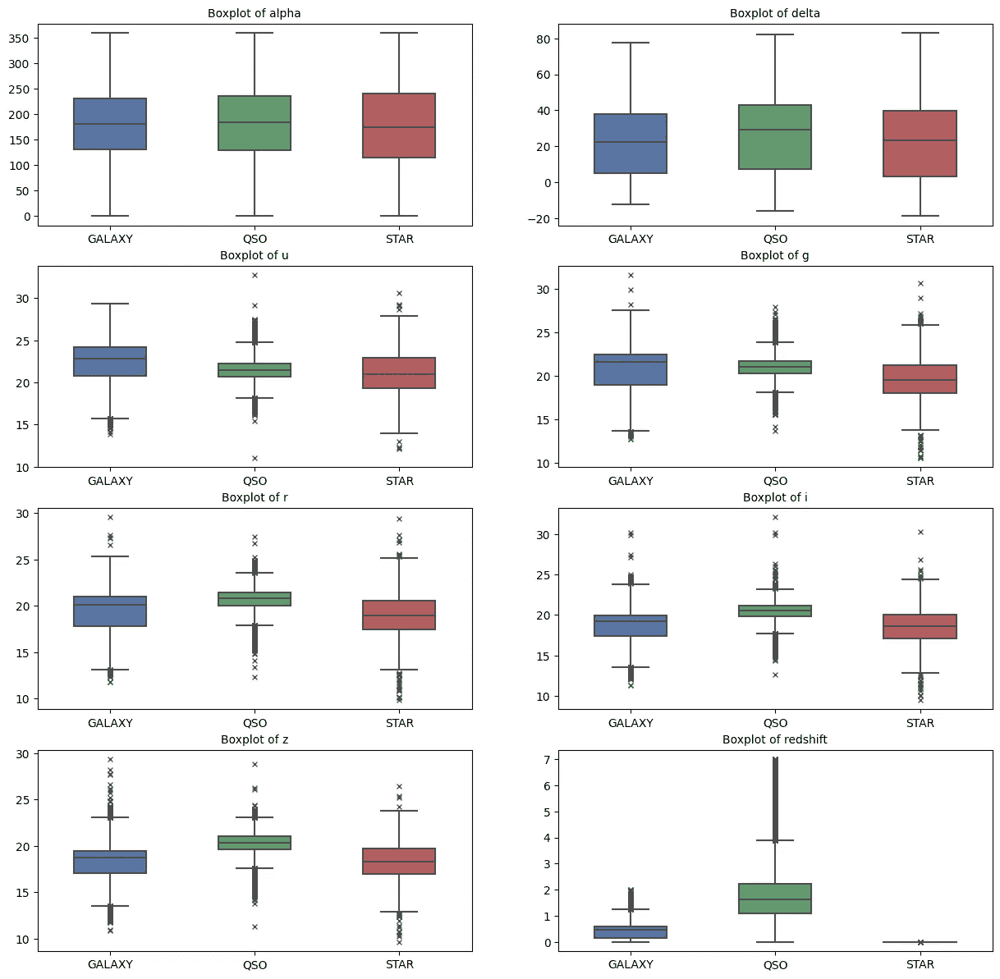
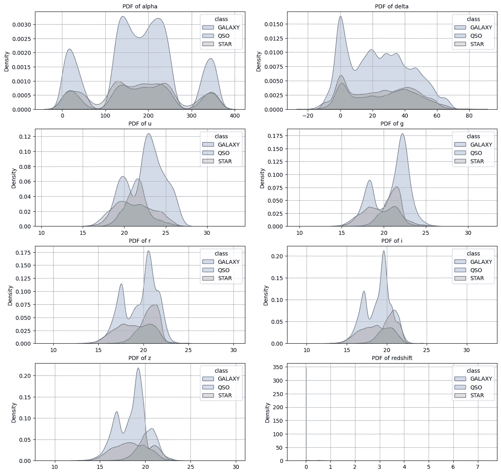
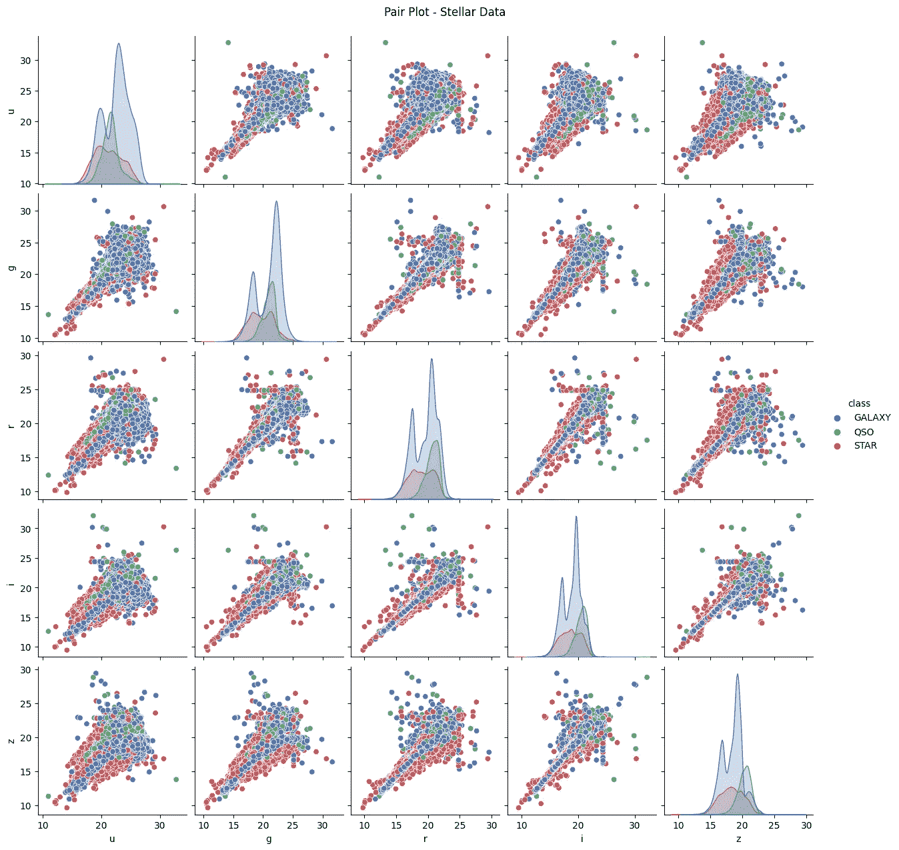
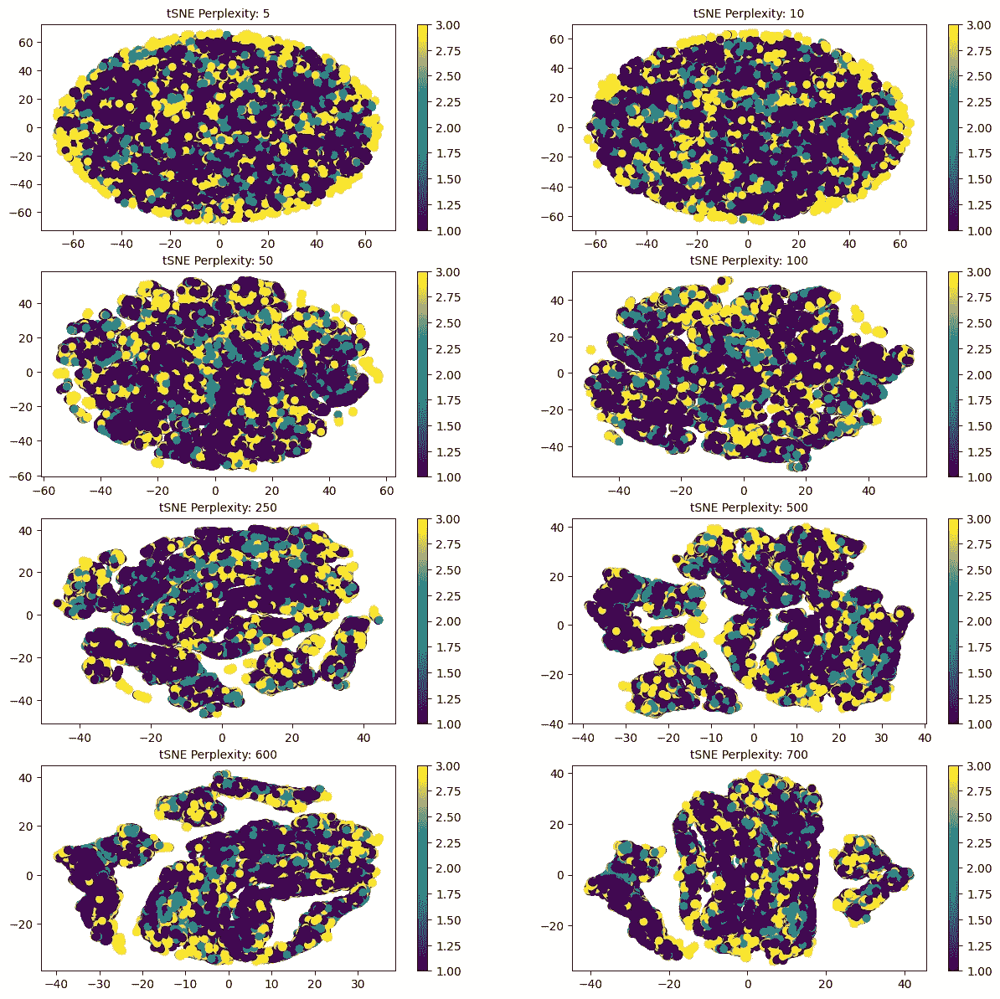
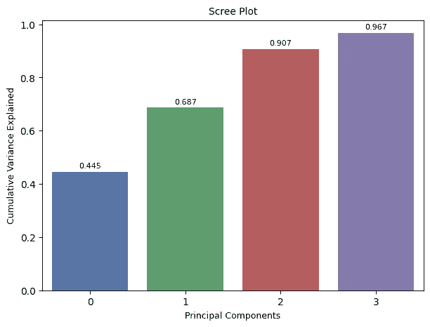
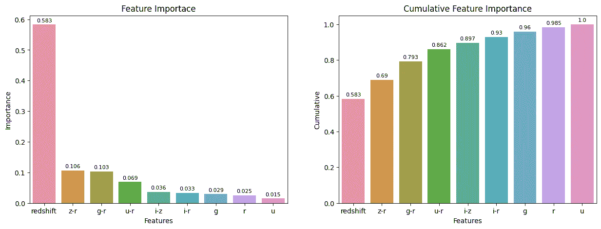
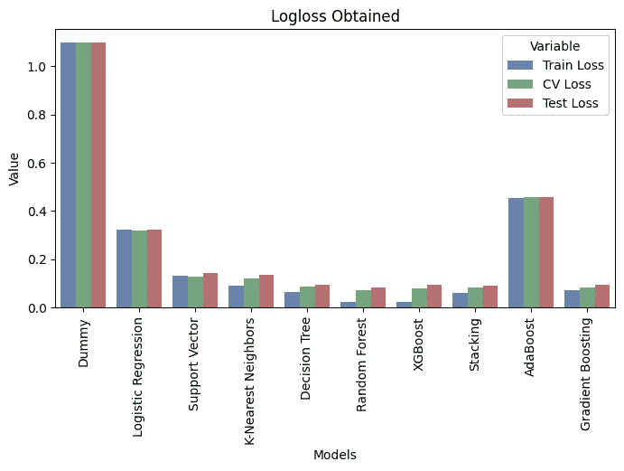

# 恒星分类:一种机器学习方法

> 原文：<https://towardsdatascience.com/stellar-classification-a-machine-learning-approach-5e23eb5cadb1>

## 天文学中恒星分类问题的端到端机器学习解决方案。


Cerqueira 在 [Unsplash](https://unsplash.com?utm_source=medium&utm_medium=referral) 上拍摄的[照片](https://unsplash.com/@shotbycerqueira?utm_source=medium&utm_medium=referral)

# 1.介绍

天文学是研究地球大气层以外的宇宙万物的学科。天文学家使用恒星分类法，根据光谱特征对恒星进行分类。光谱特征有助于天文学家提取更多关于恒星的信息——元素、温度、密度和磁场。

星系、类星体和恒星的分类方案是天文学中最基本的方案之一。这个问题旨在根据光谱特征对恒星、星系、类星体(发光的超大质量黑洞)进行分类。

# 2.数据集概述

这些数据包括由 **SDSS** (斯隆数字巡天)拍摄的 10 万次太空观测。每个数据点由 17 个特征列和 1 个类别列描述，识别它是**星**、**星系**还是**类星体**【1】。

> 注:SDSS 的数据属于公共领域。请参考最后的引文。

## 2.1.数据集中的要素

1.  `obj_ID` =对象标识符，在 CAS 使用的图像目录中标识对象的唯一值。
2.  `alpha` =赤经角(J2000 历元时)。
3.  `delta` =赤纬角(在 J2000 历元)。
4.  `u` =测光系统中的紫外线滤光器。
5.  `g` =光度系统中的绿色滤镜。
6.  `r` =测光系统中的红色滤光片。
7.  `i` =测光系统中的近红外滤光片。
8.  `z` =测光系统中的红外滤镜。
9.  `run_ID` =用于识别特定扫描的运行编号。
10.  `rereun_ID` =重新运行编号，指定图像的处理方式。
11.  `cam_col` =摄像机列，用于识别运行中的扫描线。
12.  `field_ID` =标识每个字段的字段号。
13.  `spec_obj_ID` =用于光学光谱对象的唯一 ID(这意味着具有相同`spec_obj_ID`的 2 个不同观测值必须共享输出类别)。
14.  `class` =物体类别(星系、恒星或类星体)。
15.  `redshift` =基于波长增加的红移值。
16.  `plate` =车牌 ID，标识 SDSS 的每个车牌。
17.  `MJD` =修改后的儒略日，用于表示给定 SDSS 数据的拍摄时间。
18.  `fiber_ID` =光纤 ID，标识每次观察时将光线指向焦平面的光纤。

## **2.2。对理解数据有用的背景信息**

**2.2.1。天球**:天球是一个假想的球体，半径很大，与地球同心。天空中的所有物体都可以被想象成投射在天球的内表面上，天球的中心可能是地球或观察者[2]。

**2.2.2。天球赤道**:天球赤道是假想天球与地球赤道在同一平面上的大圆【3】。

**2.2.3。赤经和赤纬**:赤经和赤纬都用于天文学和太空导航。赤经告诉*天体在天球中向左或向右多远*，赤纬告诉*天体在天球中向上或向下多远*【4】。

**2.2.4。测光系统**:单词 *photo* 表示*光线*， *metry* 表示*测量*。因此，测量人眼所能感知的光的亮度叫做光度学。UBV 光度系统(来自紫外、蓝色和可见光)，也称为约翰逊系统，是一种通常用于根据颜色对恒星进行分类的光度系统。这是第一个标准化的光度系统[5，6]。

**2.2.5。红移:红移对天文学家来说是一个关键概念。该术语可以从字面上理解——光的波长被拉伸，因此光被视为向光谱的*红色部分“偏移”。它揭示了太空中的物体(恒星/行星/星系)相对于我们是如何运动的。它让天文学家测量我们宇宙中最遥远(因此也是最古老)物体的距离[7]。***

我知道数据集中的一些特征非常有用，例如导航角度—*和 ***赤纬*** 、光度系统的过滤器— ***u*** 、 ***g*** 、 ***r*** 、 ***i*** 、 ***z*** 和并且，数据集中的其他列是在学习阶段没有用的 id。*

# *3.机器学习问题公式*

## *3.1.机器学习问题的类型*

*这是一个多类分类问题，因为该数据集有 3 个不同的目标类需要预测。*

## *3.2.将用于评估模型的性能指标*

***3.2.1。多类 logloss** : Logloss 量化预测概率与相应的实际/真实值的接近程度(在二进制设置中)。为多类设置扩展的 Logloss 称为多类 logloss。*

***3.2.2。混淆矩阵**:总结了学习模型遇到的*混淆*。正确和错误预测的数量以计数值显示，并按每个类别细分。*

# *4.探索性数据分析*

## *4.1.数据集的架构*

*我使用熊猫作为参考变量来读取数据集。*

*从 CSV 文件中读取数据集*

*数据集的以下方案显示了数据集没有空像元，并且还显示了每个要素的数据类型。*

*数据集的架构*

## *4.2.数据集的分布*

*下图显示了数据中的阶级分布和阶级比例。*

**

*类别分布和比例—作者图片*

## *4.3.单变量分析*

*单变量分析采用单个特征来分析数据。*

***4.3.1。箱线图***

*箱线图是一组数据中四分位数的直观表示。下图显示了基于目标类别的每个特性的箱线图。*

*使用箱线图的另一个好处是，我可以快速寻找异常值。我可以看到特征— ***r*** ， ***g*** ， ***z*** 有一个来自 STAR 类的离群值。*

*STAR 类别的 ***红移*** 特征的箱线图显示 0 值，这意味着，对于将数据点分类为具有最大准确度的 STAR 类别的模型，其 ***红移*** 应该为 0。*

**

*移除异常值之前每个要素的箱线图-按作者分类的图像*

*下图是相同的箱线图，但是从数据集中移除了异常值。*

**

*移除异常值后每个要素的箱线图-按作者分类的图像*

***4.3.2 密度图***

*密度图是一组点的 PDF 的直观表示。PDF 主要显示数据的分布。下图显示了基于目标类别的每个特征的密度图。*

*给定特征的每个密度图中的类是重叠的，这意味着我不能使用简单的逻辑语句对数据进行分类。我不得不采用一种统计模型来对数据进行分类。*

*恒星类别的 ***红移*** 特征的密度图符合上面的箱线图。*

**

*每个特征的密度图—按作者分类的图像*

## *4.4.多变量分析*

*多元分析考虑多个特征来分析数据。*

***4.4.1 配对图***

*成对图将数据中的成对关系可视化。下面的 pairplot 说明了****g******r******I***和*特征的成对关系。结论是所有的特征( ***u*** ， ***g*** ， ***r*** ， ***i*** ， ***z)*** 彼此正相关。***

****

**u、g、r、I 和 z 要素的配对图-按作者分类的图像**

****4.4.2。t-SNE 图****

**t-分布式随机邻居嵌入(t-SNE)是一种*可视化*高维数据的工具。这是一种降维技术，但它创建的新列不用于建模，因为 ***它不产生预测模型*** ，因此看不见的数据可以映射到更低的维度。**

**以下不同困惑值的 t-SNE 图旨在更好地直观理解数据是否可以在更低的维度上进行分类。生成这些图的执行时间需要几个小时。**

****

**具有不同困惑的 t-SNE 情节—作者图像**

# **5.特征工程和特征重要性**

**我将把数据集分成 3 组—训练集、交叉验证集和测试集。在将模型部署到生产环境之前，测试模型的性能是一个很好的做法。**

*   **训练集将拥有 60%的数据。**
*   **交叉验证集将有 20%的数据。**
*   **测试集将包含 20%的数据。**

**由于数据集目前不平衡，我需要通过应用*分层抽样*来分割数据集，这样可以保持目标变量的多样性不变。**

**应首先在训练集上实施特征工程，然后是交叉验证和测试集，以避免数据泄漏。**

**从数据中分离特征和目标**

**构建训练集、交叉验证集和测试集**

## **5.1.数据标准化**

**特征的密度图不遵循高斯分布，并且特征不具有一致的比例。将所有要素的值纳入一致的范围而不扭曲值的含义是很重要的。**

**应用最小最大标量将要素纳入一致的比例**

## **5.2.**特色工程****

**特征工程是利用领域知识通过数据挖掘技术从原始数据中提取特征的过程。这些特征可以用来提高机器学习算法的性能。特征工程可以认为是应用机器学习本身[8]。**

****5.2.1。通过应用数值运算构建新特征****

**经过多次试错，我通过用 ***减去***r***g******u******I******z***以及用 ***i*** 减去 ***z*** 构建了新的特征。**

*总功能现在—****g******r******红移******g-r******I-z******u-r***，**

******5.2.2。主成分分析******

****PCA 是一种降维技术。它检测输入要素的线性组合，这些输入要素能够最好地捕捉整个要素集中的方差，其中的分量相互正交且不相关。****

****使用 scikit-learn 库，我将组件设置为 0.95(这意味着 PCA 将找出新的组件，这些组件将保留整个数据集中 95%的方差)。PCA 确定了保持 95%方差的 4 个成分。****

********

****保留 95%方差的 4 个组成部分—作者图片****

******5.2.3。基于逻辑回归测试特征工程特征和 PCA 成分******

****我建立了 3 个逻辑回归模型。****

1.  ****模型 1 仅用于特征工程特征。****
2.  ****模型 2 仅适用于 PCA 组件。****
3.  ****特征工程特征和 PCA 组件的模型 3。****

****模型 2(只有五氯苯甲醚成分)表现不佳。模型 3(特征工程+ PCA)和模型 1(仅特征工程)的性能是相似的，这意味着除了已经进行特征工程的特征之外，PCA 组件没有添加太多有用的信息。****

## ****5.3.特征重要性****

****特征重要性是识别模型可以有效学习的重要特征的过程。这项技术旨在对特性进行评分，因此我可以挑选出得分高的特性。****

****我开发了一个随机森林模型来获取基本特征。下面的特征重要性图清楚地说明了特征—*和*是最不重要的。******

**********

*****使用随机森林模型的特征重要性—图片由作者提供*****

# *****6.建模*****

## *****6.1.超参数调谐*****

*****超参数控制模型的学习过程。在此过程中，学习模型暴露于每个参数的一组值，然后选择最佳参数值。这个过程叫做*。调整的性能指标通常由训练集上的*交叉验证*来衡量。******

****我使用了 RandomizedSearchCV 来调整超参数。****

****超参数调谐****

****我在这个阶段使用了一系列的分类和集成算法。目的是尝试尽可能多的模型。我不会把所有代码放在这里，因为博客会变得很大，但是代码在我的 GitHub 个人资料中。****

> ****建模的代码链接:[此处](https://github.com/mohd-saifuddin/Stellar-Classification-Problem/blob/main/03-Modeling-FI.ipynb)。****

****集成模型，即*随机森林分类器*和 *XGBoost 分类器*似乎有过度拟合的迹象，因为训练损失明显小于交叉验证和测试损失。****

****然而，**堆积分级机**表现更好，没有过度拟合的迹象。在这个分类器中，我堆叠了*逻辑回归*、*支持向量分类器*、 *K 邻居分类器*、*决策树分类器*以及它们的**最佳**参数。****

## ****6.2.堆叠分类器模型****

****堆叠分类器是一种集成技术，它将多个学习模型(学习者)结合起来，形成一个强大的模型。通过组合每个学习者的预测来获得最终的预测。****

******6.2.1。代码******

****在下面的片段中，我使用了一些我在笔记本中定义的自定义函数，你可以从上面的链接中参考它们。****

******6.2.2。输出******

****在下一小节中，我将向您展示为解决恒星分类问题而训练的所有模型的性能总结报告。****

## ****6.2.所有应用模型的总结****

```
**+----+---------------------+--------------+-----------+-------------+
|    | Models              |   Train Loss |   CV Loss |   Test Loss |
|----+---------------------+--------------+-----------+-------------|
|  0 | Dummy               |        1.099 |     1.099 |       1.099 |
|  1 | Logistic Regression |        0.322 |     0.319 |       0.324 |
|  2 | Support Vector      |        0.133 |     0.13  |       0.143 |
|  3 | K-Nearest Neighbors |        0.091 |     0.12  |       0.137 |
|  4 | Decision Tree       |        0.065 |     0.086 |       0.094 |
|  5 | Random Forest       |        0.024 |     0.072 |       0.084 |
|  6 | XGBoost             |        0.022 |     0.08  |       0.093 |
|  7 | Stacking            |        0.061 |     0.082 |       0.09  |
|  8 | AdaBoost            |        0.456 |     0.457 |       0.459 |
|  9 | Gradient Boosting   |        0.073 |     0.082 |       0.093 |
+----+---------------------+--------------+-----------+-------------+**
```

********

****模型性能摘要—按作者分类的图片****

# ****7.ML 应用的产品化****

****生产化是将机器学习模型从 Jupyter 笔记本环境中暴露给外界的过程。****

## ****7.1.在本地应用程序上部署模型****

****在这个子阶段，我将堆叠分类器对象和特征缩放对象一起导出到磁盘。然后我在 Dash 的帮助下创建了一个前端界面。****

****7.1.1。本地应用程序演示****

****本地应用程序演示—作者制作的视频****

## ****7.2.将本地应用程序部署到云****

****我不得不重新设计前端接口，从 Dash 接口到 Streamlit 接口。AWS Elastic Beanstalk 不允许我的 Dash 应用程序，并且 Elastic Beanstalk 环境的健康状况降级/严重(我猜是我这边的一些配置问题)。****

****我最终决定使用 Streamlit 接口。在 Streamlit 中，部署任何数据科学或机器学习应用程序都是快速而简单的。****

******7.2.1。云应用 URL******

****网址:[https://mohd-saifuddin-stellar-classification-app-app-izkfa 9 . streamlit . app/](https://mohd-saifuddin-stellar-classification-app-app-izkfa9.streamlit.app/)****

# ****8.学习成果****

****我在这个项目中的学习成果。****

1.  ****我学会了如何将一个*研究*问题作为一个*机器学习*问题来处理。****
2.  ****我学会了执行详细的 EDA —单变量分析和多变量分析。****
3.  ****我学会了数据处理。****
4.  ****我学习了特征工程和特征重要性。在这个过程中，拥有领域知识或咨询该领域的专家会产生丰硕的成果。****
5.  ****我学习了不同算法的建模。****
6.  ****最后学习了机器学习模型的*生产化*到前端应用。****

# ****9.参考****

****[1] Abdurro'uf 等人，斯隆数字巡天的第十七次数据发布:MaNGA、MaStar 和 APOGEE-2 数据的完整发布(Abdurro'uf 等人提交给 ApJS)[【arXiv:2112.02026】](https://arxiv.org/abs/2112.02026)。****

****[2]天球。(2022 年 11 月 21 日)。维基百科。[此处](https://en.wikipedia.org/wiki/Celestial_sphere)。****

****[3]天球赤道。(2021 年 10 月 30 日)。维基百科。[此处](https://en.wikipedia.org/wiki/Celestial_equator)。****

****[4]银河球，赤纬，赤经。(2017 年 6 月 17 日)。YouTube。[此处](https://youtu.be/TEQb6F6dpRI)。****

****[5] UBV 光度系统。(2022 年 10 月 13 日)。维基百科。[此处](https://en.wikipedia.org/wiki/UBV_photometric_system)。****

****[6]光度系统。(2022 年 11 月 18 日)。维基百科。[此处](https://en.wikipedia.org/wiki/Photometric_system#Photometric_letters)。****

****【7】什么是‘红移’？欧洲航天局。[这里的](https://www.esa.int/Science_Exploration/Space_Science/What_is_red_shift)。****

****[8]特征工程。(2022 年 11 月 2 日)。维基百科。[此处](https://en.wikipedia.org/wiki/Feature_engineering)。****

# ****10.结束****

****感谢您的阅读。如果你有什么建议，请告诉我。****

1.  ****机器学习代码:[此处](https://github.com/mohd-saifuddin/Stellar-Classification-Problem)。****
2.  ****Streamlit 应用代码:[此处](https://github.com/mohd-saifuddin/Stellar-Classification-App)。****

****可以在 LinkedIn 上联系我:[这里](https://www.linkedin.com/in/mohammed-saifuddin-850a6b133/)。****