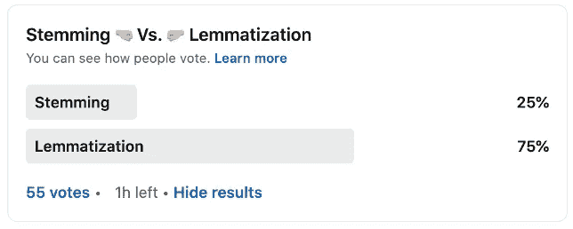
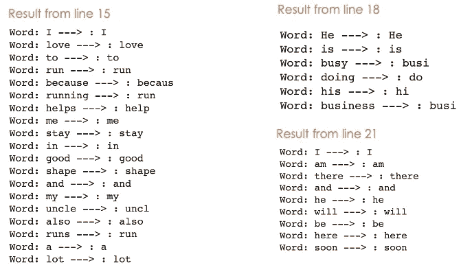

# 词干化和词汇化——哪一个值得一试？

> 原文：<https://towardsdatascience.com/stemming-lemmatization-which-one-is-worth-going-for-77e6ec01ad9c>

## 选择正确的文本规范化方法的快速指南


照片由 [Javier Allegue Barros](https://unsplash.com/@soymeraki) 在 [Unsplash](https://unsplash.com/photos/C7B-ExXpOIE) 上拍摄(作者修改)

# 介绍

2022 年 3 月 4 日星期五，[我在 LinkedIn](https://www.linkedin.com/feed/update/urn:li:activity:6905462248907890688/?commentUrn=urn%3Ali%3Acomment%3A(ugcPost%3A6905462248169705472%2C6905502375625289728)) 发起了一项民意调查，以了解人们倾向于使用哪种文本规范化技术。75%的投票者选择了`**Lemmatization**`，剩下的 25%选择了`**Stemming**`，这是否意味着这 25%都是错的，或者 75%都是对的？我不这么认为，因为这两种方法的目的相似，并且各有利弊。



[LinkedIn 民意调查结果](https://www.linkedin.com/feed/update/urn:li:activity:6905462248907890688/?commentUrn=urn%3Ali%3Acomment%3A(ugcPost%3A6905462248169705472%2C6905502375625289728))始于 2022 年 3 月 4 日星期五(图片由作者提供)

在本文中，我们将讨论`**Stemming**`、`**Lemmatization**`，这是 NLP 中用于文本数据规范化的两个广泛使用的概念。我们将从定义这两个概念开始，解释它们的区别，并使用`[**NLTK**](https://www.nltk.org/)`库 ***提供它们的 python 实现。***

# 理解并实施每个概念

在这一节中，我们将通过不同的例子来理解每一个是如何工作的。

## 堵塞物

词干来源于**词干、**，词干是[词缀](https://www.thoughtco.com/what-is-affix-grammar-1689071#:~:text=In%20English%20grammar%20and%20morphology%2C%20an%20affix%20is%20a%20word,either%20a%20prefix%20or%20suffix.)所依附的单位。存在不同的词干提取方法，但是我们将关注英语中最常见的:`**PorterStemmer**`，由[马丁·波特](https://en.wikipedia.org/wiki/Martin_Porter)于 1980 年开发。它通过逐步应用一组规则[来工作，直到获得规范化的形式。让我们看看词干对下面例子的影响。](https://vijinimallawaarachchi.com/2017/05/09/porter-stemming-algorithm/)

```
# Examples of Stemming
sentence1 = **"*I love to run because running helps runners stay in good shape*"**sentence2 = **"*He is busy doing his business*"**sentence3 = ***"I am there and he will be here soon"***
```

[stem_examples.py](https://gist.github.com/keitazoumana/b6cc077f26711ff627b1a7d7b4f2a4cc#file-stem_examples-py)

我们可以在下面找到第 15 行和第 18 行的结果。箭头的右边(→)是左边每个单词对应的词干。



第 15、18 和 21 行的句子 1、2 和 3 的词干结果(图片由作者提供)

让我们考虑来自第 15 行的**结果。想象一下，搜索关于“跑步”的文档，我们可能还希望工具返回那些包含“跑步”、“跑步”、“跑步者”的文档，这实际上是有帮助的。这正是词干化背后的**想法**，允许同一个单词的不同变体映射同一个词干。**

使用词干，生成的基本形式的术语并不总是有意义的。例如，**叔叔**转化为**叔叔。**

通过查看第 18 行的**结果，我们注意到具有不同含义的单词，例如**busy**和 **busy** 被映射到同一个词干( **busi** )，这是有问题的。**

## 词汇化

词条化来源于**词条**，一个词的词条与其词典形式相对应。单词的词条是根据它们的意思(形容词、名词或动词)创建的。)在文本中它们被使用。让我们对相同的例子进行术语化。

[lemma_examples.py](https://gist.github.com/keitazoumana/d9992ef17f0790dbe603ef73ca11de7f#file-lemma_examples-py)

下面是两个句子的词汇化结果。


第 18、21 和 24 行的句子 1、2 和 3 的词汇化结果(图片由作者提供)

通过查看前面的词汇化结果，我们可以注意到上下文得到了保留，所有的术语都是有意义的，而词干处理则不是这样。我认为词汇化是处理用例时应该采用的正确方法，例如**聊天机器人**、[词义消歧](https://en.wikipedia.org/wiki/Word-sense_disambiguation)，仅举几个例子，其中单词的上下文很重要。

# 一些优点和缺点

你可以在下面找到词干化和词汇化的一些好处(✅)和缺点(❌)。该列表并不详尽。

## 堵塞物

✅一个简单的基于规则的算法，简单快速。

✅降低了单词向量的维度，最终实现了更好的机器学习性能。

❌无法根据语法结构来映射具有不同形式的术语(例如，从句子 3 来看，**是**， **am** ， **be** 代表同一个词根动词， **be** )。

具有不同含义的❌单词可以被映射到相同的词干(例如 **busi** 表示**busy**和 **busy** )。

## 词汇化

✅通过提供有意义的和真实的字典单词产生更好的结果。

❌比词干处理更复杂，计算时间也更长。

# 最后的想法？

即使词干有一些好处，也不应该盲目采用，用户应该意识到它的缺点。由于现代的计算能力，术语化的处理时间可以最小化。一个人应该始终清楚地理解业务需求，以便明智地采用正确的方法。

# 结论

恭喜你！🎉 🍾您刚刚学习了什么是词干化和词汇化，以及何时使用它们。我希望您喜欢阅读这篇文章，并希望它对您未来的用例有所帮助。点击**跟随**按钮进行更新。此外，请查找以下额外资源，以促进您的学习。

欢迎在 LinkedIn 上加我，或者在 Twitter 和 YouTube 上关注我。讨论人工智能，人工智能，数据科学，自然语言处理的东西总是令人愉快的！

[Google Colab 上的源代码](https://colab.research.google.com/drive/1GTXyr2OGJzWZtWW627TTUkpff6uGzFov?usp=sharing)

斯坦福大学自然语言处理的词干分析和词汇化

[大卫·拉罗彻尔的博客，词干问题](https://blogs.harvard.edu/dlarochelle/2014/03/30/the-problems-with-stemmming-a-practical-example/)

再见🏃🏾