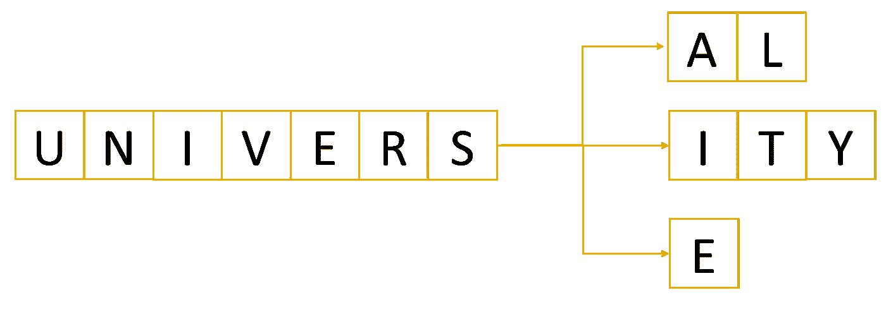
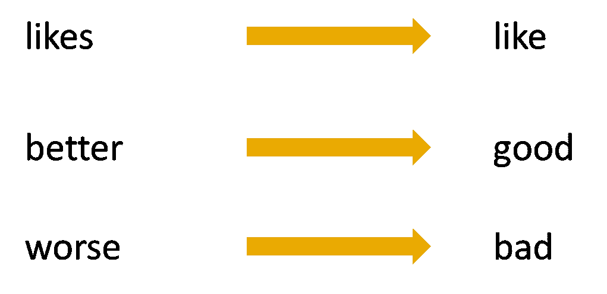

# 自然语言处理中的词干化与词汇化

> 原文：<https://towardsdatascience.com/stemming-vs-lemmatization-in-nlp-dea008600a0>

## 面向自然语言理解的文本预处理中如何规范词语


克拉丽莎·沃森在 [Unsplash](https://unsplash.com/s/photos/scrabble?utm_source=unsplash&utm_medium=referral&utm_content=creditCopyText) 上的照片


词干化和词汇化是自然语言处理(NLP)中使用的算法，用于规范化文本，并为在[机器学习](https://databasecamp.de/en/machine-learning)中的进一步处理准备单词和文档。例如，在 NLP 中，你可能想要承认这样一个事实，即单词“like”和“liked”是不同时态的同一个单词。目标是将两个单词缩减为一个共同的词根，这可以通过词干化或词汇化来实现。这样，这两个词就被类似地对待，否则“like”和“liked”对于模型来说就像“like”和“car”一样不同。

# 什么是词干？

我们使用词干来去除单词中的后缀，最后得到一个所谓的词干。例如，单词“likes”、“likely”和“liked”都产生了它们共同的词干“like ”,可以用作这三个单词的同义词。这样，NLP 模型可以知道这三个单词在某种程度上是相似的，并且在相似的上下文中使用。

词干分析让我们将单词标准化为词干，而不考虑它们的词形变化，这有助于许多应用，如聚类或分类文本。搜索引擎广泛使用这些技术来给出更好的结果，而不考虑单词的形式。在 2003 年谷歌实现 word stems 之前，搜索“鱼”并不包括关于鱼或钓鱼的网站。

**波特的斯特梅尔**算法是最流行的词干提取方法之一，于 1980 年提出。它基于这样一种想法，即英语中的后缀是由更小更简单的后缀组合而成的。它以高效和简单的工艺著称，但也有一些缺点。

因为它是基于许多来自英语的硬编码规则，所以它只能用于英语单词。此外，可能存在波特的斯特梅尔的输出不是一个英语单词，而只是一个人工词干的情况。

```
from nltk.stem.porter import * 
porter_stemmer = PorterStemmer() print(porter_stemmer.stem('alumnus')) Out: 'alumnu'
```

然而，最大的问题是过流和欠流，这是大多数算法的共同缺点。

# 转向过度和转向不足

每当我们的算法将多个单词词干化到同一个词根时，即使它们不相关，我们也称之为过度词干化。尽管“宇宙”、“大学”和“宇宙”这三个词相互关联，来自同一个词根，但它们的意思却大相径庭。当我们将这些词输入一个好的搜索引擎时，搜索结果应该是非常不同的，不应该被视为同义词。我们称这样的错误为假阳性。



示例大学|图片:作者

词干提取不足与这种行为正好相反，包括多个单词不是来自同一个词根的情况，尽管它们应该来自同一个词根。“校友”一词描述大学以前的学生，多用于男性。“Alumnae”是它的女性版本，“aluminum”是一所大学的多个以前的学生。


示例校友|图片:作者

在基本的搜索引擎或其他 NLP 应用程序中，这些单词绝对应该被视为同义词。然而，大多数词干提取算法没有将它切割到它们的公共根，这是一个假阴性错误。

# 什么是词汇化？

词干化是词干化的发展，它描述了将一个词的不同词尾变化形式组合在一起的过程，这样它们就可以作为一个单独的项目进行分析。词汇化类似于词干化，但它给单词带来了上下文。所以它把意思相近的单词链接成一个单词。词汇化算法通常也使用位置参数作为输入，例如单词是形容词、名词还是动词。



每当我们为自然语言处理做文本预处理时，我们都需要词干化和词汇化。有时你甚至会发现文章或讨论中这两个词被用作同义词，尽管它们并不是。通常，词汇化比词干化更受欢迎，因为它是对单词的上下文分析，而不是使用硬编码的规则来去除后缀。然而，如果文本文档很长，那么词汇化会花费相当多的时间，这是一个严重的缺点。

# 这是你应该带走的东西

*   词干化和词汇化是帮助我们进行自然语言处理的文本预处理的方法。
*   它们都有助于将多个单词映射到一个共同的词根。
*   这样，这些单词被类似地处理，并且模型知道它们可以在类似的上下文中使用。

*如果你喜欢我的作品，请在这里订阅*[](https://medium.com/subscribe/@niklas_lang)**或者查看我的网站* [*数据大本营*](http://www.databasecamp.de/en/homepage) *！还有，medium 允许你每月免费阅读* ***3 篇*** *。如果你希望有****无限制的*** *访问我的文章和数以千计的精彩文章，不要犹豫，点击我的推荐链接:*[【https://medium.com/@niklas_lang/membership】](https://medium.com/@niklas_lang/membership)每月花$***5****获得会员资格**

*[](https://medium.com/codex/why-you-should-know-big-data-3c0c161b9e14) [## 为什么您应该了解大数据

### 定义大数据及其潜在威胁

medium.com](https://medium.com/codex/why-you-should-know-big-data-3c0c161b9e14) [](https://medium.com/@niklas_lang/understanding-mapreduce-with-the-help-of-harry-potter-5b0ae89cc88) [## 借助《哈利·波特》理解 MapReduce

### MapReduce 是一种允许并行处理大型数据集的算法，例如，在多台计算机上…

medium.com](https://medium.com/@niklas_lang/understanding-mapreduce-with-the-help-of-harry-potter-5b0ae89cc88) [](/learn-coding-13-free-sites-to-help-you-do-it-9b2c1b92e573) [## 学习编码:13 个免费网站帮助你开始

### 一旦你决定要学习编码，你会被众多的在线工具宠坏，这些工具可以帮助你…

towardsdatascience.com](/learn-coding-13-free-sites-to-help-you-do-it-9b2c1b92e573)*