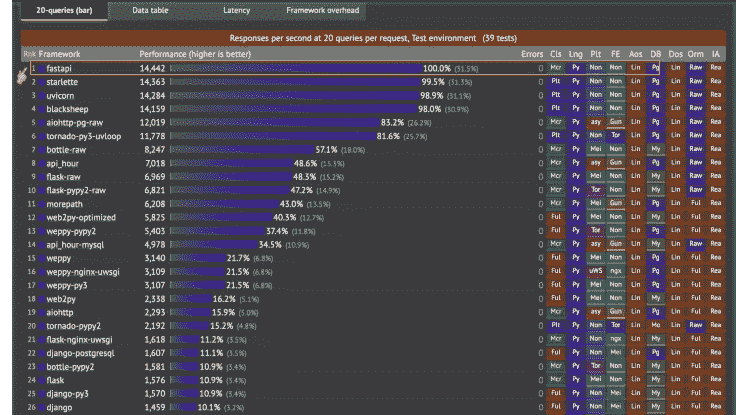
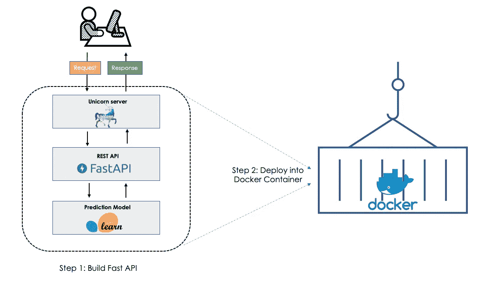
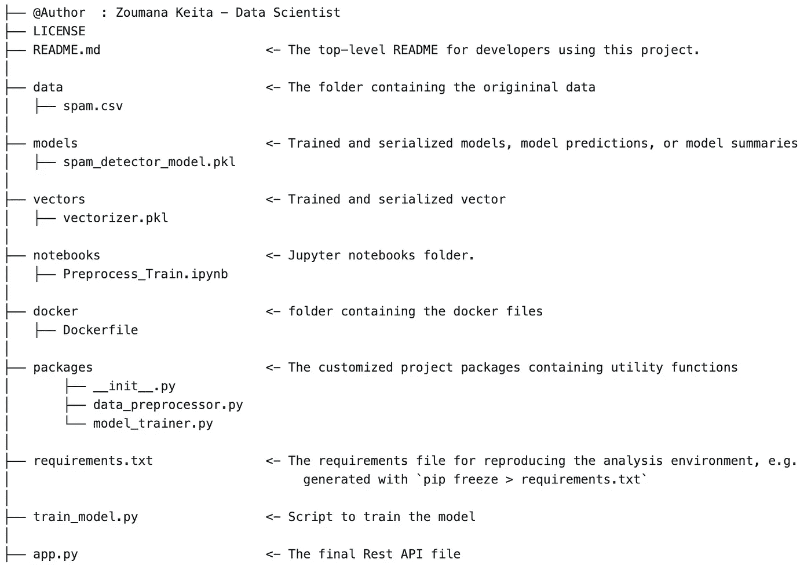
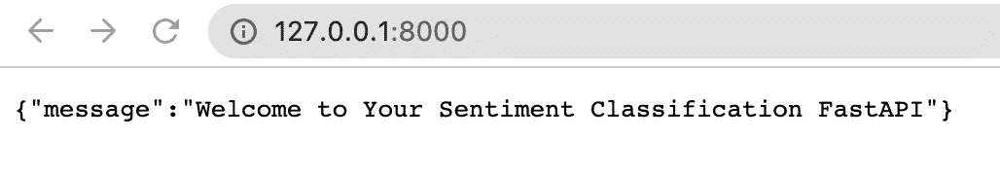
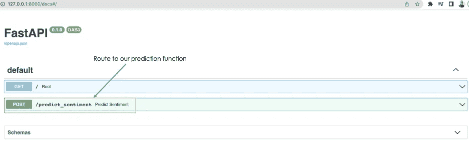
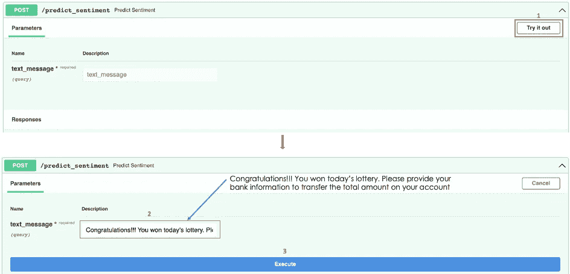
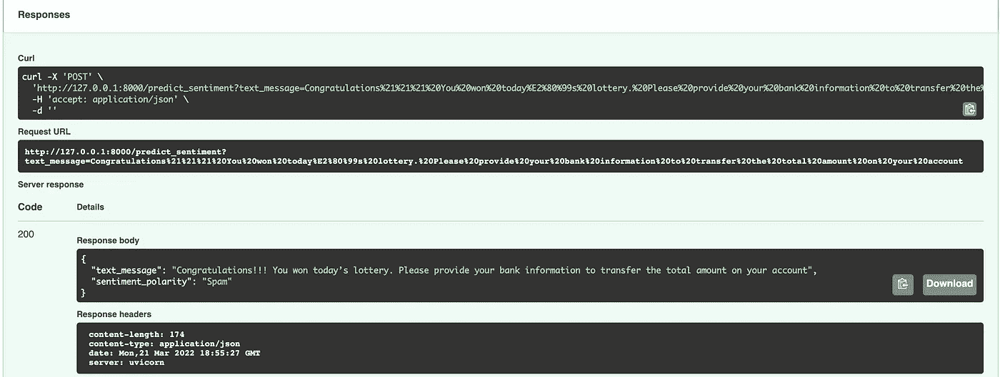

# 使用 Fast API 逐步构建机器学习 API 的方法

> 原文：<https://towardsdatascience.com/step-by-step-approach-to-build-your-machine-learning-api-using-fast-api-21bd32f2bbdb>

## 一种快速而简单的方法，将您的模型作为 API


由[库尔特·科托阿加](https://unsplash.com/@kydroon)在 [Unsplash](https://unsplash.com/photos/0b5g9_pnMqc) 拍摄的照片

# 介绍

无论你的机器学习模型有多高效，只有当它为企业创造价值时，它才会有用。当它存储在计算机的文件夹中时，不会发生这种情况。在这个快速发展的环境中，需要速度和良好的部署策略来将您的人工智能解决方案推向市场！

这篇文章解释了`**Fast API**`如何在这个问题上提供帮助。我们将从 Fast API 的全局概述开始，并通过创建一个 API 来说明它。

# FastAPI —什么和为什么？

您可能已经熟悉了不同的框架，如 Flask、Django 等。然而，在 RESTful 微服务的高性能和开发方面，Fast API 脱颖而出。这一点可以通过以下来自 [techempower](https://www.techempower.com/benchmarks/) 的基准分析摘录来突出说明。



来源: [techempower 性能指标评测](https://www.techempower.com/benchmarks/)

## 我们用例的实现

这里的目标是为情感分类模型服务，该模型旨在预测给定的文本消息是垃圾邮件还是垃圾邮件。整个数据科学过程(数据分析、数据预处理、模型训练等)我们就不深入了。)，因为本文的目标是围绕创建 API，这需要模型已经被训练好。如果你有兴趣了解更多，请参考[这篇文章](/create-an-awesome-streamlit-app-deploy-it-with-docker-a3d202a636e8)。

让我们从理解工作流开始，突出我们试图实现的主要组件。



文章的两个主要过程(图片由作者提供)

**第一步:构建 API**

*   用户/客户端向**uvicon****服务器**发送请求，服务器与 API 交互以触发预测模型。
*   该模型返回极性(spam 或 ham)，结果以 JSON 格式显示给用户。

**步骤 2:部署到 Docker**

*   创建 API 后，我们将创建一个 Docker 映像，应用程序将在其中运行。

**项目结构**

下图显示了我们项目的主要文件夹及其内容。



项目结构(图片由作者提供)

我们将更加关注以下几个方面:

*   包含服务器端的所有指令
*   `**docker**`包含 **Dockerfile** 来创建容器。

**构建 API 的步骤**

python 文件`**app.py**`中的 API 实现分为以下三个主要部分。

1.  导入 API 所需的所有库(**第 2 行到第 3 行**)。之前的步骤是安装那些库，这可以通过运行`**pip install -r requirements.txt**`命令来完成。
2.  加载序列化的模型和向量(**第 6 行和第 9 行**)并实例化快速 API ( **第 12 行**)

需求. py

3.定义 API 的端点。在我们的例子中，它将有如下所示的两条路线。

*   **默认路由** `**"/”**`:通过不带参数的 **root()** 函数，简单返回如下 JSON 格式的“消息”:“欢迎使用您的情感分类 FastAPI”。

app _ 默认 _ 路由. py

*   **预测路由** `**"/predict_sentiment"**`:该路由触发`**predict_sentiment()**`函数，该函数将用户的消息作为参数，并按照**第 19 到 22 行定义的格式返回 JSON 响应。**情感极性是模型的预测。

最后，我们可以在命令行中从 **app.y** 文件的位置使用以下指令运行它(API)。

```
uvicorn app:app --reload
```

*   `uvicorn`启动独角兽服务器。
*   `app`:对应 python 文件`app.py`是“:”符号左边的那个。
*   `app`:对应指令`app = FastAPI()`在`app.py`内创建的对象。如果文件名是 main.py，指令将是`uvicorn **main**:app --reload`
*   `--reload`:用于在任何代码更改后重启服务器的选项。请记住，这只能在开发阶段使用，而不能在部署阶段使用。

这是我们运行前面的命令得到的结果

**第 1 行**显示 unicorn 服务器运行在 localhost (http://127.0.0.1)端口 8000 上。

访问默认路由非常简单。只需在我们最喜欢的浏览器上键入以下 URL。

这就是我们得到的结果。



默认路线的响应(图片由作者提供)

这里有一个有趣的部分。URL***http://127 . 0 . 0 . 1:8000/docs***提供了与我们的 API 进行交互的完整仪表板。下面是结果。



我们的 API 的文档来自[***http://127 . 0 . 0 . 1:8000/docs***](http://127.0.0.1:8000/docs)**网址(图片由作者提供)**

*从上一张图中，当我们选择绿色框中的***/predict _ perspective***时，我们得到了与我们的 API 交互的完整指南，如下所示。*

*只需选择**试用**选项卡，并在 **text_message** 区域中提供您想要预测的消息。*

**

*请求 API 进行预测(图片由作者提供)*

*我缩小了我在 text_message 框中键入的消息，以便您可以正确地看到它。选择**执行**按钮后，最终得到如下结果。*

**

*API 对文本消息的响应(图片由作者提供)*

*通过查看 API **响应体**部分，我们可以看到其结果如下*

```
*{
  **"text_message": "Congratulations!!! You won today’s lottery.          Please provide your bank information to transfer the total amount on your account"**,
  **"sentiment_polarity": "Spam"**
}*
```

*恭喜你。您已经完成了创建 API 的第一步。*

## *部署到 Docker 容器*

*我们的 API 已经准备好了，现在是时候将它部署到 Docker 容器中了。容器化背后的想法是，它将使我们的 API 可移植，并能够以更安全的方式跨任何平台(包括云)统一和一致地运行。此外，使用 Kubernetes 可以使 API 的扩展更加容易。但是 Kubernetes 的角色将在另一个时间。*

*下面是我们应用程序的`Dockerfile`的内容。*

*docker_content.py*

*让我们了解一下🧐的档案*

*Dockerfile 文件包含五个主要指令，如下所示。*

*   *`FROM`从 docker hub 获取一个官方的 python 映像，然后我们的文件将从该映像构建。*
*   *`WORKDIR`:创建/app 作为应用程序的工作目录。*
*   *`COPY`:将文件从源文件夹复制到目的文件夹。*
*   *`RUN`:运行 requirements.txt 文件以安装项目依赖项。*
*   *`CMD`:创建一个入口点，最终使镜像可执行。*

***构建 Docker 镜像** 下面的命令构建名为`fastapiapp`的镜像，标记为 ***最新的*** 版本。这个图像是从以前的 docker 文件构建的。*

```
*docker build -t fastapiapp:latest -f docker/Dockerfile .*
```

*运行命令将创建带有以下成功消息的映像*

```
*Successfully built 9ecdd7e21323
Successfully tagged fastapiapp:latest*
```

***运行容器*** 

```
*docker run -p 80:80 fastapiapp:latest*
```

*之后，您应该会收到一条类似于此的消息，其中包含 API 的 URL。*

```
*INFO:     Started server process [1]
INFO:     Waiting for application startup.
INFO:     Application startup complete.
INFO:     Uvicorn running on [http://0.0.0.0:80](http://0.0.0.0:80)(Press CTRL+C toquit)*
```

**

*部署后与 API 交互的仪表板(图片由作者提供)*

*您在 docker 上部署了快速 API 应用程序🎉🎉🎉！*

# *结论*

*恭喜你！🎉 🍾您刚刚学习了如何使用 Fast API 创建您的 API。我希望你喜欢阅读这篇文章，它给了你所需的技能。请在下面找到更多资源来帮助您进一步学习。*

*此外，如果你喜欢阅读我的故事，并希望支持我的写作，考虑[成为一个媒体成员](https://zoumanakeita.medium.com/membership)。每月支付 5 美元，你就可以无限制地阅读媒体上的故事。通过使用[我的注册链接](https://zoumanakeita.medium.com/membership)，我将获得一小笔佣金。*

*欢迎在 [Medium](https://zoumanakeita.medium.com/) 、 [Twitter](https://twitter.com/zoumana_keita_) 和 [YouTube](https://www.youtube.com/channel/UC9xKdy8cz6ZuJU5FTNtM_pQ) 上关注我，或者在 [LinkedIn](https://www.linkedin.com/in/zoumana-keita/) 上跟我打招呼。讨论人工智能、人工智能、数据科学、自然语言处理和人工智能是一种乐趣！*

*再见🏃*

# *额外资源*

*[GitHub 上的源代码](https://github.com/keitazoumana/Fastapi-tutorial)*

*[FastAPI 文档](https://fastapi.tiangolo.com/)*