# 在 Python 中使用 Sweetviz 进行自动化探索性数据分析的分步指南

> 原文：<https://towardsdatascience.com/step-by-step-guide-to-automated-exploratory-data-analysis-using-sweetviz-in-python-1061ed3f91da>


卢克·切瑟在 [Unsplash](https://unsplash.com?utm_source=medium&utm_medium=referral) 上的照片

# 目录

[摘要](#711c)
[数据科学概论&分析学](#6dc2)
∘ [一个数据科学家的技能](#cbb5)
∘ [行业关键经验](#b93d)
[有哪些不同的分析水平？](#0c9d)
[sweet viz 是什么？](#e165)
[用 Sweetviz](#976c)
∘ [第一步:安装 Sweetviz 并读取原始数据](#5c92)
∘ [第二步:创建报表](#ab82)
∘ [第三步:显示报表](#e9da)
∘ [按类别生成 EDA 汇总](#2e8b)
[结论](#0b56)
[引用](#14c9)

# 摘要

只需一行代码，开源 Python 模块 Sweetviz 就可以为探索性数据分析(EDA)创建令人惊叹的可视化效果。此外，它还会生成一份汇总报告，并可用于构建交互式仪表板。一个完全自包含的 HTML 应用程序就是产生的输出。

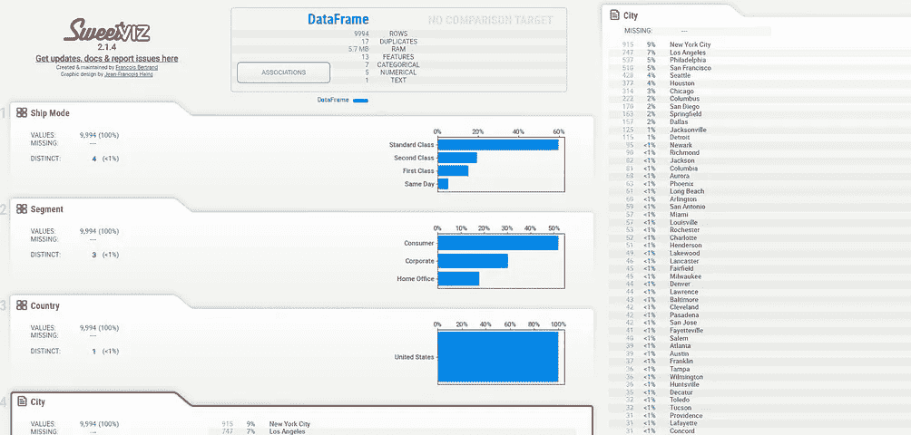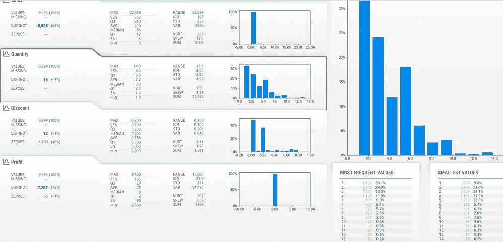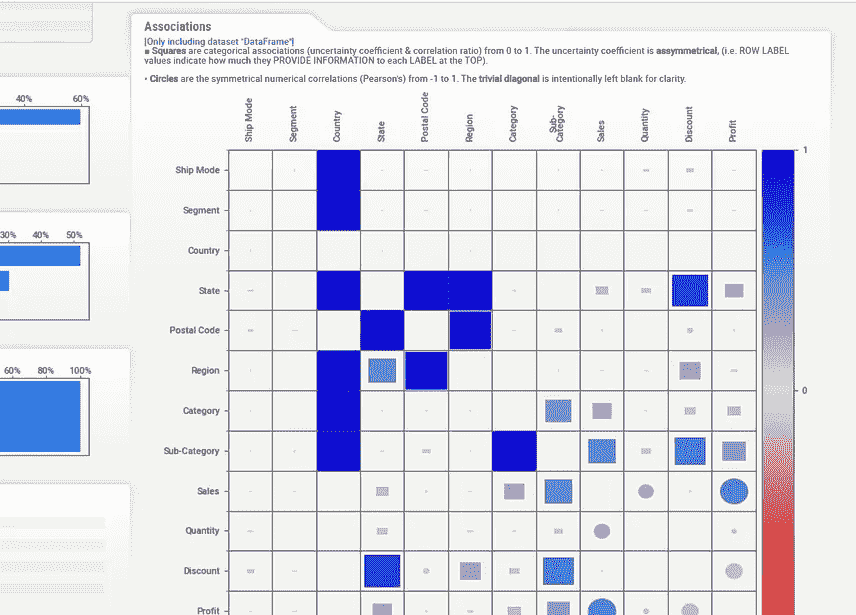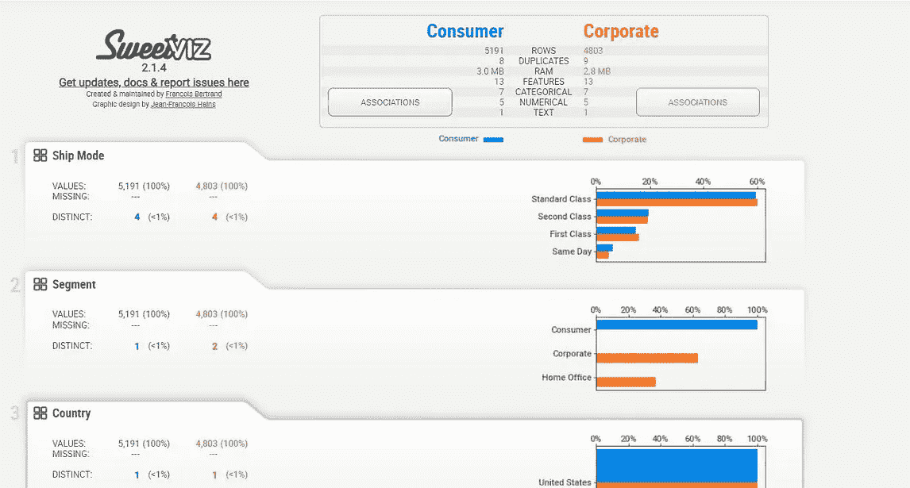

图片 Sweetviz 的输出示例。来源—作者。

# 数据科学和分析简介

数据科学是处理数据并从中提取价值的技术。数据科学不仅仅是大数据。它涉及使用数据来实现价值，甚至产生市场趋势，使企业能够衡量业绩。数据科学通常被定义为对大型多结构数据使用统计和机器学习技术来识别以下内容的过程:

*   相互关系
*   原因
*   对事件进行分类和预测
*   识别模式和异常
*   可能性

数据科学有助于数据驱动的决策。

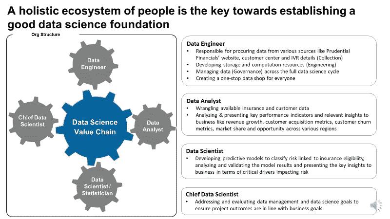

图一。推动组织中数据科学价值链的不同角色。来源:作者。

## 数据科学家的技能

随着数据科学行业的发展，数据科学家应该了解数学、业务和技术。

*   业务—数据科学家应该具备业务领域的知识，以了解问题空间，并提出最适合问题空间的解决方案。
*   数学(数学+统计学+机器学习)——应该能够理解统计学、机器学习模型、算法统计学，并将它们应用于结构化和非结构化数据。
*   技术(编程)——应该能够熟练使用 R、Python、SAS、SQL、Hadoop 等。，并处理后端和前端编程。

## 行业的主要经验

*   每个人都应该对使用数据感到好奇(这是一个关键的品质)。
*   沟通技巧被低估了。
*   数据收集和争论是最大的挑战。
*   数据科学家比软件工程师更擅长统计，比统计学家更擅长软件。
*   数据科学行业刚刚起步，需要更好地定义角色；因此，人们可以与不同的商业利益相关者一起工作。

如前所述，在开发和使用算法之前，分析数据成为一个关键组成部分。在开始讨论如何使用 SweetViz 优化数据 EDA 之前，让我们先了解一下分析的基本层面。

# 有哪些不同的分析级别？

可以使用 DIPP 框架对分析级别进行分类。定义和示例如下:

*   **描述性** —从数据中获得洞察力。例如，制药公司按地区和地域销售特定品牌的药物。
*   **好奇** —使用描述性统计从数据中了解特定的趋势或发现。例如，如果一种药物在该地区的销售额很低，为什么销售额会下降
*   **预测**——使用统计和机器学习模型进行预测。例如使用历史数据预测药物的销售，以便可以为销售代表设定目标。
*   **说明性** —使用优化或解决方案向业务利益相关者推荐决策。例如，为了提高销售额，销售代表应该将一个区域中的处方者作为目标。

# Sweetviz 是什么？

只需一行代码，开源 Python 模块 Sweetviz 就能为探索性数据分析创建极具吸引力的精确视觉效果。此外，它还可以生成报告摘要，并有助于开发交互式仪表板。一个完全自包含的 HTML 应用程序就是产生的输出。该技术通过比较数据集和显示目标值来快速创建报告。在 SweetViz 的帮助下，您可以快速表征目标属性、训练与测试数据以及其他数据类型(Dey，2021)。


图片来源—[*https://github.com/fbdesignpro/sweetviz*](https://github.com/fbdesignpro/sweetviz)，许可免费使用和分发—[https://github.com/fbdesignpro/sweetviz/blob/master/LICENSE](https://github.com/fbdesignpro/sweetviz/blob/master/LICENSE)

Sweetviz 具有以下特点(Bertrand，2022):

*   **创建目标分析(需要训练模型时适用):**布尔型或数字型目标值如何与其他特征关联。
*   **比较和对比几种数据集类型:**不同的数据集(如用于训练对比测试数据，甚至训练对比验证的数据集)或组内特征(如男性对比女性，类别 1 对比类别 2)。
*   **识别不同类型的关系:**为了提供所有数据类型的综合信息，Sweetviz 可以轻松找到 Pearson's correlation 等数字关联、不确定系数等分类关联以及分类-数字数据类型。
*   **数据类型推断:**通过可选的手动覆盖，SweetViz 自动识别数字、类别和文本特征。
*   **了解汇总数据**，包括类型、唯一值、缺失值、重复行、最常见值和数值分析，包括最小值/最大值/范围、四分位数、平均值、众数、标准差、总计、中位数绝对偏差、变异系数、峰度和偏斜度。

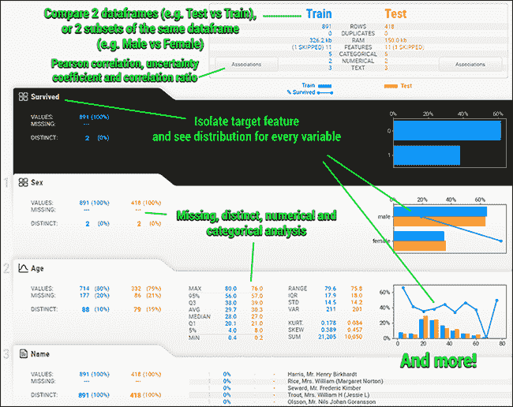

图二。SweetViz 的输出示例。我*法师来源:*[*https://github.com/fbdesignpro/sweetviz*](https://github.com/fbdesignpro/sweetviz)*。*自由使用和分发的许可—[https://github.com/fbdesignpro/sweetviz/blob/master/LICENSE](https://github.com/fbdesignpro/sweetviz/blob/master/LICENSE)

# 使用 Sweetviz 分析数据

用于此分析的数据可以在找到[(许可——公共领域，因此可以免费使用和分发)。这是一个超级商店数据集的例子，这是一种模拟，你可以进行深入的数据分析，以提供关于企业如何在减少损失的同时增加收入的想法。](https://www.kaggle.com/datasets/bravehart101/sample-supermarket-dataset?resource=download)

要使用 Sweetviz，我们需要安装它。注意这是一个外部包，不随 Anaconda Navigator 一起安装。

## 步骤 1:安装 Sweetviz 并读取原始数据

```
! pip install --user sweetviz

import pandas as pd

data = pd.read_csv('SampleSuperstore.csv')

data.head()
```

数据中的前五条记录如下所示。因为数据属于商店，所以我们有关于不同装运的信息，包括装运模式(Ship Mode)、客户群、国家、城市、州、邮政编码和产品装运到的地区。项目/产品运输的类别和子类别也可以与销售 KPI(关键性能指标)一起使用，包括销售额、数量、折扣和利润。

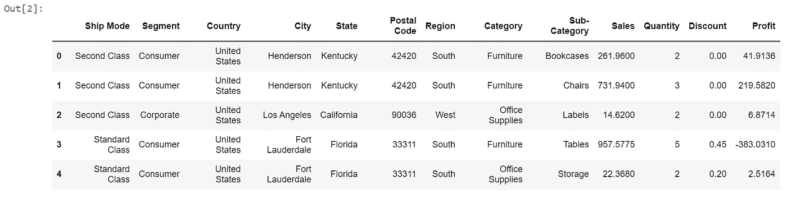

图 3。示例输出—数据的前 5 行。来源—作者。

## 步骤 2:创建报告

创建报告有 3 个主要功能:

*   **analyze ()** —允许用户对数据执行基本的探索性数据分析(EDA)。这等同于创建描述性统计，并生成汇总、数字分布、5 点统计(均值、中值、众数、标准差等)。)，以及数据中所有属性的相关性。请注意，除了相关图之外，它不会产生任何其他多变量分析。
*   **compare()** —用于比较训练和测试数据，在建立机器学习模型时特别有用。
*   **compare_intra()** —该函数允许用户比较数据中的两个分类属性。例如，从上面的数据中，如果我们想要创建消费者与所有其他属性的其他客户群的比较摘要，我们可以使用 compare_intra 来实现相同的目的。注意，只有二进制比较是使用这个函数执行的。它目前不支持任何多类别的比较。

```
import sweetviz as sv
analyze_report = sv.analyze(data, pairwise_analysis="on")
analyze_report.show_html('Data EDA.html', open_browser=True)
analyze_report.show_notebook(w=None, 
                h=None, 
                scale=0.8,
                layout='vertical',
                filepath=None)
```

运行 SweetViz 有两个组成部分。第一，我们使用 analyze()生成报告，第二，我们使用 show_html()或 show_notebook()在笔记本中或使用 HTML 文件显示报告。

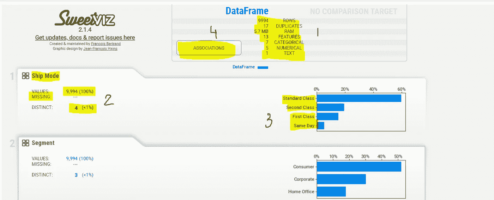

图 4。analyze()的示例输出。来源—作者。

图 4 展示了样本输出的快速快照。这里需要强调几个关键领域:

1.  **第 1 部分** —该部分提供关于数据的信息，包括行数、重复数(如果有)、总特征或列数，以及每列的数据类型。
2.  **第 2 & 3** 节—这是我们对每个变量进行单变量分析的地方。我们得到记录的数量、缺失值计数、不同类别的数量以及特性的计数图。
3.  **第 4 节** —提供所有变量的相关性分析。您需要单击关联选项卡来获取关联矩阵。

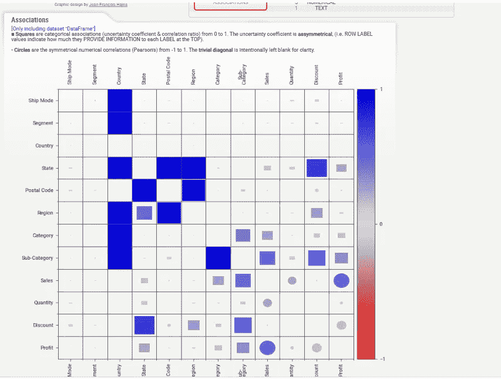

图 5。显示了数据中所有属性的相关矩阵。完成相关性和其他关系所需的时间可以是二次的。在数据收集包含“关联自动阈值”功能之前，默认值(“自动”)将在没有通知的情况下运行。除此之外，您必须显式地传递 pairwise analysis=" on "(或" off ")参数，因为处理这么多特征会很耗时。此外，该参数还包括关联图的创建(基于 [Drazen Zaric 的理论](/better-heatmaps-and-correlation-matrix-plots-in-python-41445d0f2bec))。来源—作者。

同样，对于数值变量，Sweeviz 生成数据的基本统计数据(下面的第 1 节)，灵活决定区间或桶的分布图，以及数值和分类值的相关性分析。注意-分布图是一个直方图，Y 轴代表每个数字存储桶的数据比例。

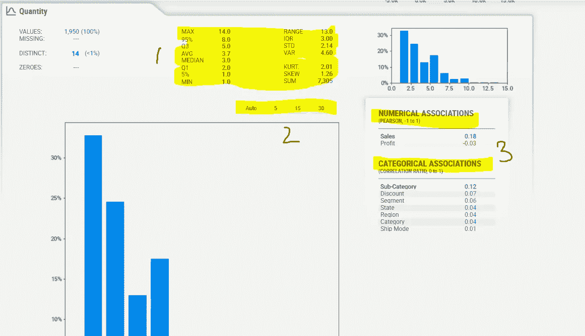

图 6。说明了数字变量的输出。来源—作者。

## 步骤 3:显示报告

虽然我们之前已经介绍过，但是有两种方式可以显示 Sweetviz 报告。1.show_html() 2。显示 _ 笔记本()

show_html()将生成一个 HTML 报告，并保存到指定的文件目录中。选项可用于:

1.  **布局:**“宽屏”或“垂直”布局。当鼠标悬停在每个功能上时，宽屏布局会在屏幕右侧显示详细信息。更新的垂直布局(从版本 2.0 开始)在水平方向上更加紧凑，并允许单击扩展每个详细区域。
2.  **用浮点数缩放**整个报表(缩放= 0.8 或无)。使报告适应任何输出，这很有帮助。
3.  **open_browser** :允许网页浏览器自动打开并显示报告。如果这是你有时不想发生的事情(或者如果它干扰了特定的 ide)，你可以在这里禁用它。

从 2.0 版本开始，新的函数 show_notebook()将嵌入一个 IFRAME 元素，显示笔记本中的报告(例如，Jupyter、Google Colab 等)。).

1.  **w (width):** 设置报告输出窗口的宽度(整个报告可能放不下；对于报告本身，使用布局和/或比例)。w 可以表示为字符串百分比(w =“100%”)或像素计数(w=900)。
2.  **h (height):** 用 h (height)命令设置报告输出窗口的高度。窗口可以拉伸到与所有特征一样高(h =“Full”)或与像素一样多(h=700)。
3.  **缩放/布局:**类似 show_html()的功能

## 按类别生成 EDA 摘要

compare_intra()函数允许用户比较数据中的两个分类属性。输出大体上与分析功能一致，只是我们有按类别的摘要。请注意，这个函数只能产生二进制比较。因此，为了创建此分析，我们将“消费者”视为第一类，其余视为其他(公司/总部)。尽管如此，我们在报告中将这一类别定义或标记为“公司”下面是一个简单的例子。

```
my_report = sv.compare_intra(data, data["Segment"] == "Consumer", ["Consumer", "Corporate"])

my_report.show_notebook(w=None, 
                h=None, 
                scale=0.8,
                layout='vertical',
                filepath=None)
```

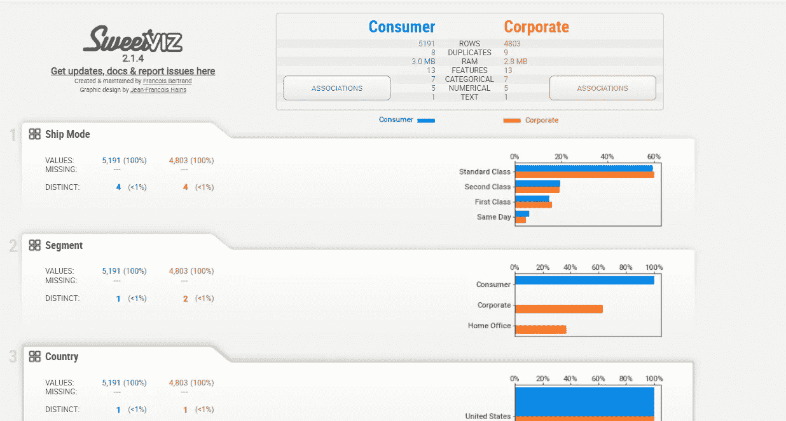

图 7。展示了 compare_intra()的输出。来源—作者。

# 结论

Python 目前支持多个允许对数据进行快速 EDA 的其他包，包括 pandas profiling。虽然 Sweetviz 不一定会产生全面的数据输出，但它可以用来纯粹从单变量分析的角度理解数据结构和潜在趋势。特别是摘要统计，通常允许用户对数据清理过程制定策略，这在以后成为模型准确性的关键。涉及多变量分析的复杂汇总仍然需要手动或使用商业智能工具来执行。

一些有用的链接供你参考。

[](/introduction-to-data-processing-using-descriptive-statistics-and-statistical-charts-in-python-9857a60c481b) [## Python 中使用描述性统计和统计图进行数据处理的介绍

### 测试数据假设(MCAR、MAR、MNAR、集中趋势、偏斜度和异常值)的完整实践指南…

towardsdatascience.com](/introduction-to-data-processing-using-descriptive-statistics-and-statistical-charts-in-python-9857a60c481b) [](/statistics-for-data-science-a-beginners-guide-to-descriptive-statistics-in-python-9e0daa30809a) [## 数据科学统计学 Python 描述性统计初学者指南

### 使用 Excel、Python 和…的集中趋势、离散度、标准差和相关性的工作示例

towardsdatascience.com](/statistics-for-data-science-a-beginners-guide-to-descriptive-statistics-in-python-9e0daa30809a) 

# 参考

1.  f . Bertrand(2022 年 6 月 3 日)。特色。从 GitHub 网站检索:[https://github.com/fbdesignpro/sweetviz](https://github.com/fbdesignpro/sweetviz)
2.  Dey，V. (2021 年 7 月 24 日)。使用 SweetViz 进行数据分析的逐步指南。检索于 2022 年 12 月 3 日，来自印度分析杂志网站:[https://analyticsindiamag . com/step-by-step-step-guide-to-data-analysis-using-sweet viz/#:~:text = What % 20 is % 20 sweet viz % 3F](https://analyticsindiamag.com/step-by-step-guide-to-data-analysis-using-sweetviz/#:~:text=What%20is%20SweetViz%3F)
3.  样本超市数据集。(未注明)。2022 年 12 月 3 日检索，来自 www.kaggle.com 网站[https://www . ka ggle . com/datasets/brave hart 101/sample-supermarket-dataset？资源=下载](https://www.kaggle.com/datasets/bravehart101/sample-supermarket-dataset?resource=download)

*关于作者:高级分析专家和管理顾问，帮助公司通过对组织数据的业务、技术和数学的组合找到各种问题的解决方案。一个数据科学爱好者，在这里分享、学习、贡献；可以和我在* [*上联系*](https://www.linkedin.com/in/angel-das-9532bb12a/) *和* [*推特*](https://twitter.com/dasangel07_andy)*；*