# 使用 Python 和 Zingg 逐步进行身份解析

> 原文：<https://towardsdatascience.com/step-by-step-identity-resolution-with-python-and-zingg-e0895b369c50>

## 一种基于机器学习的开源方法，用于大规模解析身份

从数据中生成有用见解的主要挑战之一是孤立和脱节的数据集，这些数据集的数据质量很差。由于企业数据管道中的多个信息源，经常会引入数据不一致和重复记录。对于从事欺诈检测、个性化和推荐的数据科学家来说，这是一个巨大的问题。对于数据分析师来说，由于基础数据不一致，很难报告准确的客户终身价值、最有价值客户、新增客户和其他指标。

例如，看看下面的客户数据

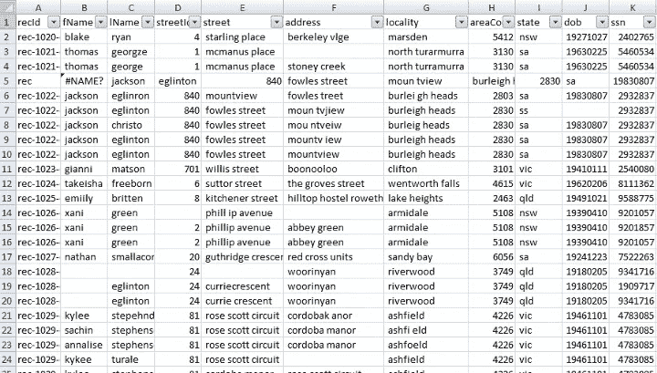

多条记录属于同一客户且没有唯一标识符的客户数据。作者图片

我们可以看到同一客户有多行，如下所示

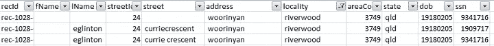

同一客户的不同记录。作者图片

我们有一个 ssn 列，但是不能保证它总是唯一的。在上面的示例中，第二条记录的 ssn 与其他记录不一致。然而，快速人工验证确认这 3 个记录属于同一个客户。

这是属于同一个客户的不同记录的另一个例子。

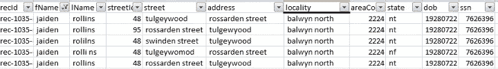

作者图片

定义跨属性的规则并将它们组合起来以评估匹配的记录既耗时又容易出错。建立这样一个系统很容易需要几个月的时间，并延迟实际的分析。试图利用数据列大规模执行身份解析也不容易。

总体而言，构建身份解析系统面临以下挑战

1.  随着记录数量的增加，查找重复项所需的比较总数变得难以管理。我们对一个属性的 N 个记录进行比较的总数由下式给出


作者图片

随着我们的数据集大小 N 的增加，比较的数量会迅速增加


缩放身份分辨率。作者图片

2.理解使用哪些属性来识别重复项并为具有许多属性和变化的大型数据集决定匹配标准是很困难的。

在构建身份解析系统时，通常包括以下步骤

*   预处理:尽可能规范化数据，例如去掉常见的单词，去掉前导和尾随空格，使属性变成小写或大写，清理标点符号等。这样做是为了我们可以定义特定于属性的匹配规则。
*   索引:由于将每个记录与其他记录进行比较会显示出可伸缩性问题，所以我们将数据集分成更小的块，然后在块内执行比较。这减少了处理，并且将系统扩展到更大的数据量变得容易得多。
*   属性级规则定义:根据标准比较相关属性，例如，当且仅当电子邮件完全匹配时，我们才会认为两条记录的电子邮件属性相似。
*   记录级规则定义:上面定义的属性级比较被汇总到记录级相似性的组合定义中。例如，名字和姓氏匹配，但电子邮件不完全匹配。
*   组相似性:如果两个记录分别与第三个记录匹配，但彼此不匹配，可能是由于缺少属性，我们如何处理这种情况？

我们自己建造这个当然是可行的，但是值得我们花费时间吗？让我们探索一个开源选项— [Zingg](https://github.com/zinggAI/zingg) 。我们将使用 [Zingg 的 Python api](https://readthedocs.org/projects/zingg/) ，为我们的客户数据构建一个身份解析管道。

作为一个基于 ML 的工具，Zingg 负责上述步骤，以便我们可以大规模地执行身份解析。

为了执行实体解析，Zingg 定义了五个阶段——findTrainingData、标签、训练、匹配和链接。

1.  **findTrainingData** :作为一个有监督的机器学习系统，Zingg 从训练数据中学习匹配。findTrainingData 阶段从我们的数据中选择样本对，用户可以通过这些样本对建立训练集。
2.  **label** :这个阶段调出交互式标签，显示在 findTrainingData 中选择的对。标签器提示用户将它们标记为匹配或非匹配。如果用户不确定或不能决定，用户可以选择不确定作为选项。
3.  **训练**:使用标记的数据，Zingg 学习相似性规则以识别潜在的重复。Zingg 不会将数据集中的每条记录与数据集中的每条其他记录进行比较，这将导致大型数据集的可伸缩性问题。相反，Zingg 首先学习如何将相似的记录组合成块。它还根据训练集学习合适的相似性规则，从而减少所需的比较总数。模型被保存到磁盘上，以供较新的数据使用。
4.  **匹配**:应用经过训练的模型来预测可用于解析身份的匹配分数。
5.  **链接**:跨数据集查找匹配

**findTrainingData** 和 **label** 阶段通常运行几次，样品由用户标记。Zingg 通过 **findTrainingData** 仔细选择不匹配、明显匹配和边缘案例样本，以建立一个具有足够变化的健壮训练集来训练模型。

一旦我们有了大约 30-40 个匹配样本，我们就可以通过运行**训练**阶段来训练和保存模型。一旦模型被训练，随着具有相同属性的新数据集的到来，可以执行**匹配**或**链接**阶段。

让我们对客户数据使用 Zingg 并解析身份。

# 步骤 1:安装 Zingg

开始使用 Zingg 的最快方法是使用 Zingg docker 映像。让我们获得 docker 图像并开始使用它。

```
docker pull zingg/zingg:0.3.4
docker run -u <uid> -it zingg/zingg:0.3.4 bash
```

有关使用 Zingg docker 的更多信息，请点击此处的[链接查看官方文档。](https://docs.zingg.ai/zingg/stepbystep/installation/docker)

我们将使用 [febrl 示例](https://github.com/zinggAI/zingg/tree/main/examples/febrl)加载到 Postgres 中名为 **customers** 的表中。

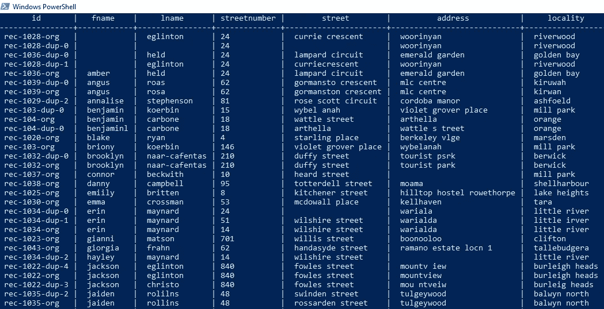

# 步骤 2:定义输入位置和匹配条件

Zingg python 包已经安装在 docker 容器中，所以我们将直接使用它。需要记住的重要一点是，Zingg Python 程序是 PySpark 程序，必须使用 Zingg 发行版提供的 zingg.sh 脚本运行。

让我们为我们的**客户**表定义输入。我们创建一个名为 FebrlExamplePostgresql.py 的 Python 脚本，并导入必要的包

```
from zingg.client import *
from zingg.pipes import *
```

对于我们希望用作输出一部分的每一列，我们创建一个 FieldDefinition 对象。FieldDefinition 接受属性的名称、数据类型和匹配类型。例如，我们可以这样定义名字列

```
fname = FieldDefinition("fname", "string", MatchType.FUZZY)
```

匹配类型配置 Zingg 关于我们希望如何为每个字段执行匹配。Zingg 提供了不同的匹配标准，其中一些是

*   模糊:与缩写、错别字和其他变体的广义匹配，适用于名称等字段
*   精确:不允许有变化，适用于国家代码等字段
*   DONT _ 使用:具有这种匹配类型的字段在处理过程中被忽略，但会出现在输出中

根据我们的列数据文档[这里的](https://docs.zingg.ai/zingg/stepbystep/configuration/field-definitions)，我们可以使用更多的匹配类型。

以下 Python 程序为 Zingg 构建参数，并向其中添加所有字段定义。

```
#build the arguments for zingg
args = Arguments()#set field definitions
fname = FieldDefinition("fname", "string", MatchType.FUZZY)
lname = FieldDefinition("lname", "string", MatchType.FUZZY)
streetnumber = FieldDefinition("streetnumber", "string", MatchType.FUZZY)
street = FieldDefinition("street","string", MatchType.FUZZY)
address = FieldDefinition("address", "string", MatchType.FUZZY)
locality = FieldDefinition("locality", "string", MatchType.FUZZY)
areacode = FieldDefinition("areacode", "string", MatchType.FUZZY)
state = FieldDefinition("state", "string", MatchType.FUZZY)
dateofbirth = FieldDefinition("dateofbirth", "string", MatchType.FUZZY)
ssn = FieldDefinition("ssn", "string", MatchType.FUZZY)fieldDefs = [fname, lname, streetnumber, street, address, locality, areacode
state, dateofbirth, ssn]args.setFieldDefinition(fieldDefs)
```

# 第三步:用 Postgres 连接 Zingg

Zingg 允许我们使用相关的配置为每种类型的数据平台连接到各种数据源和接收器，如[文档](https://docs.zingg.ai/zingg/connectors)中所述。Zingg 的 Python API 提供了一个通用管道，通过它我们可以定义管道的数据源和接收器。

为了将 Zingg 与 Postgres 中的 **customers** 表连接起来，我们创建了一个管道对象，并将其命名为 customerDataStaging。我们将格式设置为 jdbc。

```
customerDataStaging = Pipe("customerDataStaging", "jdbc")
```

我们指定管道的属性来连接我们的 Postgres 数据库。

```
customerDataStaging.addProperty("url","jdbc:postgresql://localhost:5432/postgres")
customerDataStaging.addProperty("dbtable", "customers")
customerDataStaging.addProperty("driver", "org.postgresql.Driver")
customerDataStaging.addProperty("user","suchandra")
customerDataStaging.addProperty("password","1234")
```

为了将我们的输出写到 **customers_unified** 表中，我们创建了另一个具有相关属性的管道对象。

```
customerIdentitiesResolved = Pipe("customerIdentitiesResolved", "jdbc")
customerIdentitiesResolved.addProperty("url","jdbc:postgresql://localhost:5432/postgres")
customerIdentitiesResolved.addProperty("dbtable", "customers_unified")
customerIdentitiesResolved.addProperty("driver", "org.postgresql.Driver")
customerIdentitiesResolved.addProperty("user","suchandra")
customerIdentitiesResolved.addProperty("password","1234")
```

我们还需要 Zingg 的 JDBC 驱动程序来连接 Postgres。让我们[下载](https://jdbc.postgresql.org/download/)Postgres JDBC 驱动程序，并将驱动程序的路径添加到 zingg.conf 的 spark.jars 属性中，如这里[所述](https://docs.zingg.ai/zingg/stepbystep/zingg-runtime-properties)。

# 步骤 4:查找要标记的对—查找训练数据

我们已经定义了输入模式以及输入和输出数据源和接收器。现在让我们指定存储模型和模型标识符的目录。我们还指定数据集的一部分用于选择标记数据，以便可以快速创建我们的训练数据。

```
args.setZinggDir("models")
args.setModelId("customer360")
args.setNumPartitions(4)
args.setLabelDataSampleSize(0.5)
```

接下来，我们调用 Zingg 客户端并指定适当的<phase_name>，它可能是 **findTrainingData** 、 **label** 、 **train** 或 **match** 。我们将阶段名作为命令行的输入。</phase_name>

```
options = ClientOptions([ClientOptions.PHASE,<PHASE_NAME>])
#Zingg execution for the given phase
zingg = Zingg(args, options)
zingg.initAndExecute()
```

这是完整的代码

```
from zingg.client import *
from zingg.pipes import *
import sys
#build the arguments for zingg
args = Arguments()
#phase name to be passed as a command line argument
phase_name = sys.argv[1]
#set field definitions
fname = FieldDefinition("fname", "string", MatchType.FUZZY)
lname = FieldDefinition("lname", "string", MatchType.FUZZY)
streetnumber = FieldDefinition("streetnumber", "string", MatchType.FUZZY)
street = FieldDefinition("street","string", MatchType.FUZZY)
address = FieldDefinition("address", "string", MatchType.FUZZY)
locality = FieldDefinition("locality", "string", MatchType.FUZZY)
areacode = FieldDefinition("areacode", "string", MatchType.FUZZY)
state = FieldDefinition("state", "string", MatchType.FUZZY)
dateofbirth = FieldDefinition("dateofbirth", "string", MatchType.FUZZY)
ssn = FieldDefinition("ssn", "string", MatchType.FUZZY)
fieldDefs = [fname, lname, streetnumber, street, address, locality, areacode
state, dateofbirth, ssn]
#add field definitions to Zingg Client arguments
args.setFieldDefinition(fieldDefs)
#defining input pipe
customerDataStaging = Pipe("customerDataStaging", "jdbc")
customerDataStaging.addProperty("url","jdbc:postgresql://localhost:5432/postgres")
customerDataStaging.addProperty("dbtable", "customers")
customerDataStaging.addProperty("driver", "org.postgresql.Driver")
customerDataStaging.addProperty("user","suchandra")
customerDataStaging.addProperty("password","1234")
#add input pipe to arguments for Zingg client
args.setData(customerDataStaging)
#defining output pipe
customerIdentitiesResolved = Pipe("customerIdentitiesResolved", "jdbc")
customerIdentitiesResolved.addProperty("url","jdbc:postgresql://localhost:5432/postgres")
customerIdentitiesResolved.addProperty("dbtable", "customers_unified")
customerIdentitiesResolved.addProperty("driver", "org.postgresql.Driver")
customerIdentitiesResolved.addProperty("user","suchandra")
customerIdentitiesResolved.addProperty("password","1234")
#add output pipe to arguments for Zingg client
args.setOutput(customerIdentitiesResolved)
#save latest model in directory models/599
args.setModelId("customer360")
#store all models in directory models/
args.setZinggDir("models")
#sample size for selecting data for labelling
args.setNumPartitions(4)
#fraction of total dataset to select data for labelling
args.setLabelDataSampleSize(0.5)
options = ClientOptions([ClientOptions.PHASE,phase_name])
#Zingg execution for the given phase
zingg = Zingg(args, options)
zingg.initAndExecute()
```

我们将使用 Zingg 命令行运行我们的客户身份解析 Python 程序。如前所述，我们将使用 Zingg 脚本来处理所有的依赖关系。

```
zingg.sh 
--properties-file /zingg-0.3.4-SNAPSHOT/config/zingg.conf
--run /zingg-0.3.4-SNAPSHOT/examples/febrl/CustomerIdentityResolution.py findTrainingData
```

下面是在 **findTrainingData** 阶段的一些输出日志。

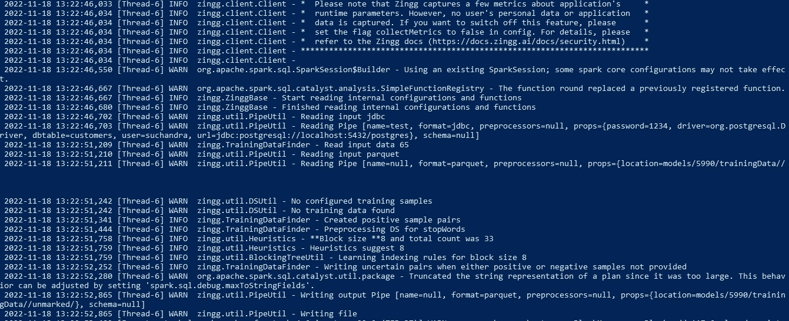

对客户数据进行采样，以找到潜在的配对来显示给用户。作者图片

# 步骤 5:将记录标记为匹配或非匹配，以构建训练集

我们现在可以运行 Zingg **label** 阶段，并标记程序先前选择的记录。

```
zingg.sh 
--properties-file /zingg-0.3.4-SNAPSHOT/config/zingg.conf
--run /zingg-0.3.4-SNAPSHOT/examples/febrl/CustomerIdentityResolution.py label
```

我们看到了成对的记录

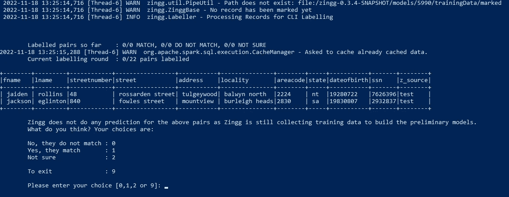

通过用户对选择样本的反馈来建立用于身份解析的训练集。作者图片

我们需要指定它们是否匹配、不匹配或者我们不确定它们是否匹配。上述记录看起来不匹配，因此我们将其标记为 0

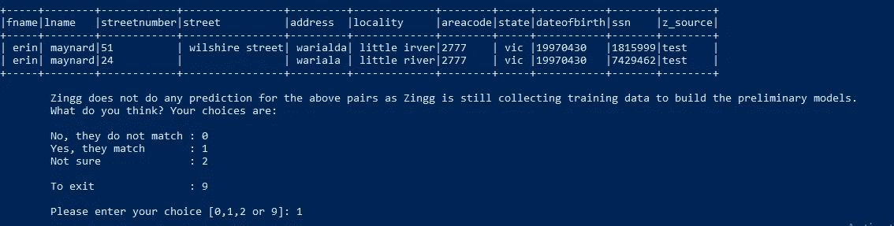

训练 Zingg 进行身份解析。作者图片

另一方面，这些记录看起来非常相似，因此我们将它们标记为 1

这一对我们该怎么办？

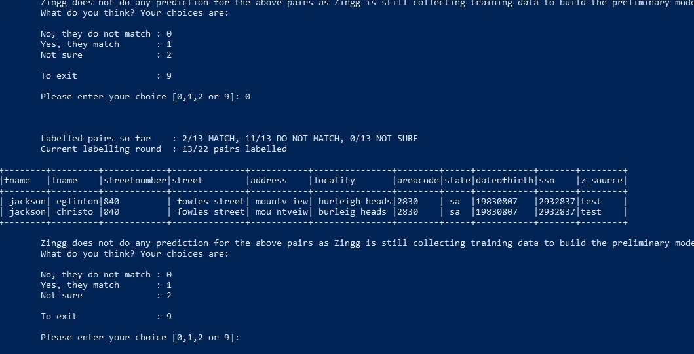

用 Zingg 进行模糊匹配。作者图片

不太可能有两个不同的人住在同一个地方，同一个地区，有相同的出生日期和社会安全号，这两个记录可能是同一个人的姓氏输入不正确，但是也可能是不同的人。对于我们不确定的情况，我们将其标记为 2。

# 步骤 6:运行 Zingg Python 阶段——训练

由于我们的数据集很小，一轮 findTrainingData 和 label 就足够了。所以现在，我们可以通过跑步来建立我们的模型

```
zingg.sh 
--properties-file /zingg-0.3.4-SNAPSHOT/config/zingg.conf
--run /zingg-0.3.4-SNAPSHOT/examples/febrl/CustomerIdentityResolution.py train
```

训练和交叉验证参数打印在屏幕上。

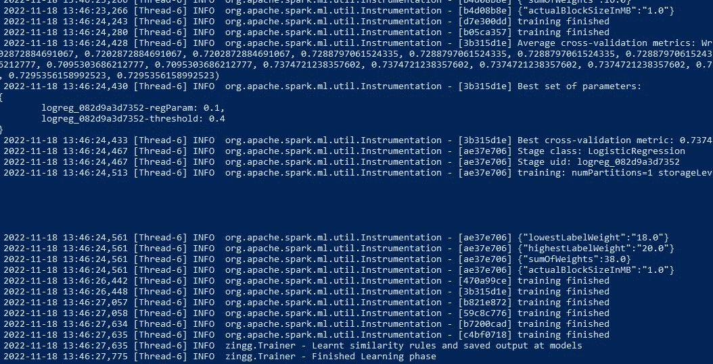

用于身份解析的训练机器学习模型。作者图片

# 步骤 7:准备好解析身份！

Zingg 模特都准备好了，来配吧

```
zingg.sh 
--properties-file /zingg-0.3.4-SNAPSHOT/config/zingg.conf
--run /zingg-0.3.4-SNAPSHOT/examples/febrl/CustomerIdentityResolution.py match
```

完成后，Zingg 将输出写入我们在 Python 程序中指定的表中。

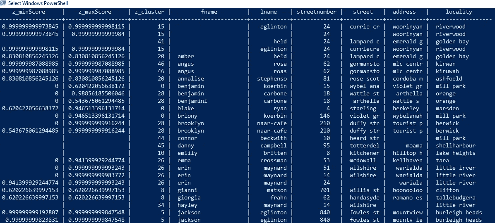

Zingg 的客户身份解析。作者图片

Zingg 添加了 3 个新列

*   Z_CLUSTER —由 Zingg 分配的唯一 ID，具有相同分类的所有记录都匹配或重复。
*   Z_MINSCORE —它表示与该分类中任何其他记录最不匹配的记录
*   Z_MAXSCORE —它表示该记录与该分类中任何其他记录匹配的最大值

使用这些列并应用合适的阈值，我们可以解析身份。我们还可以从注释者那里获得人工评审。

让我们看看 Zingg 如何解释我们之前看到的 eglinton 和 jaiden rollins 的重复记录。

以集群 15 为例

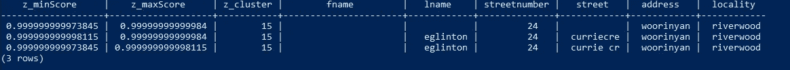

客户记录匹配。作者图片

它有 3 个完全匹配的记录，应该被解析到同一个客户。每个记录显示大于 0.95 的最大和最小分数，这意味着每个记录具有大于 0.95 的最大匹配以及相同聚类内的最小匹配也大于 0.95。我们可以将阈值设置为 0.95，并自动将高于该阈值的记录标记为确定匹配，无需人工干预。

类似地，聚类 37 显示了明显的匹配记录

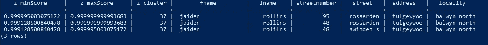

用 Zingg 匹配客户。作者图片

让我们看看第 20 组

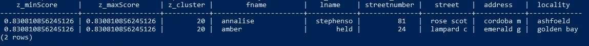

身份解析的人工审查和数据管理。作者图片

这显示分数低于我们选择的阈值，因此我们将把它传递给人类进行审查。

身份解析是构建我们的数据平台和产品的关键步骤。它使我们能够了解谁是我们的核心业务实体。作为一个用于身份解析的定制工具，Zingg 抽象出了构建模糊记录匹配系统的复杂性和工作量。Zingg 负责数据预处理、属性和记录级别的相似性定义和可伸缩性。因此，我们可以将客户、供应商、供应品、产品和零件数据用于关键业务分析和运营，而不必担心信息缺失或不完整。