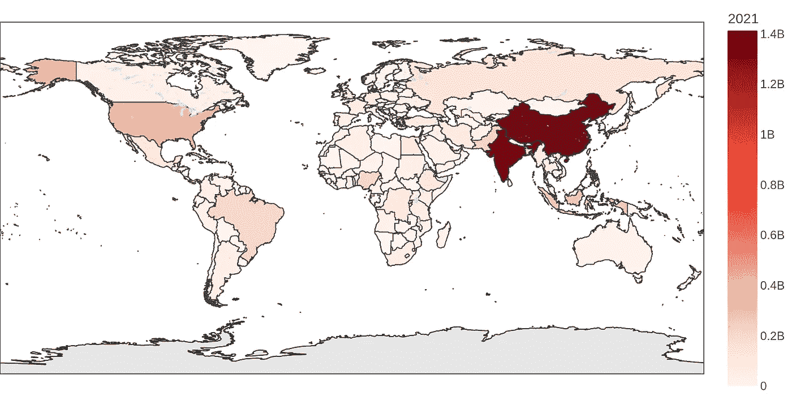
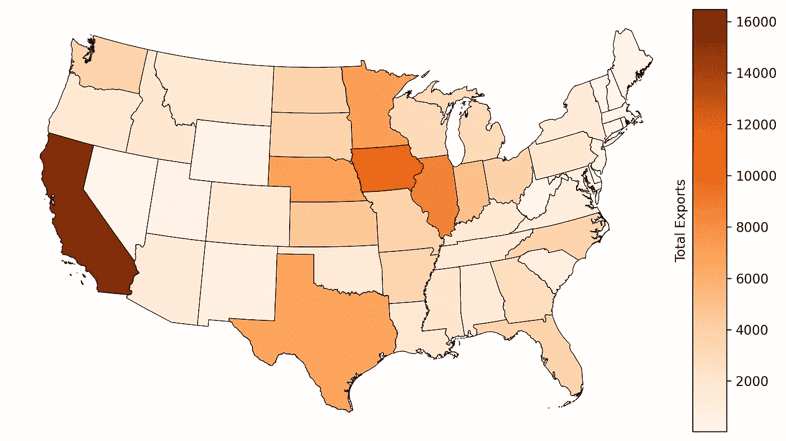
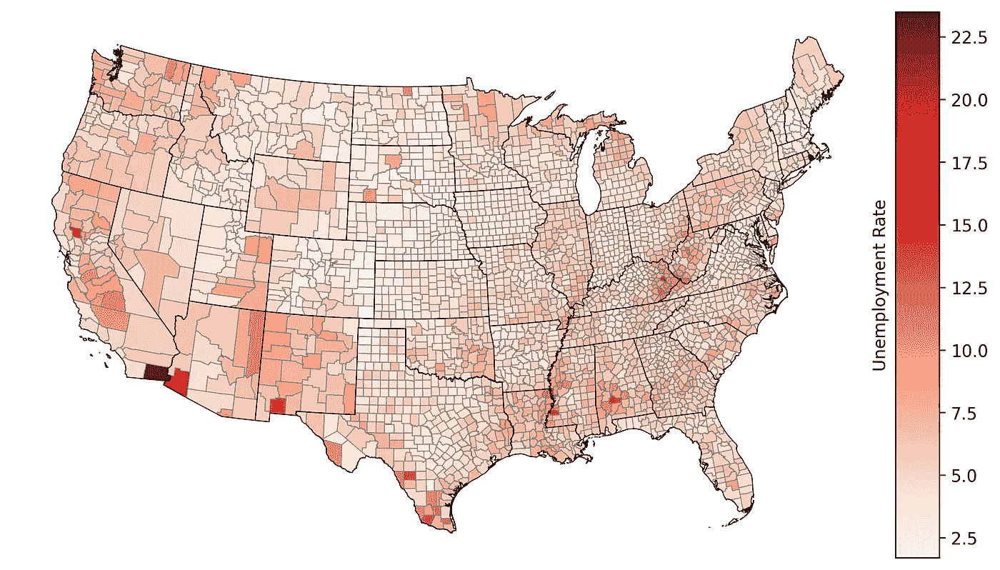
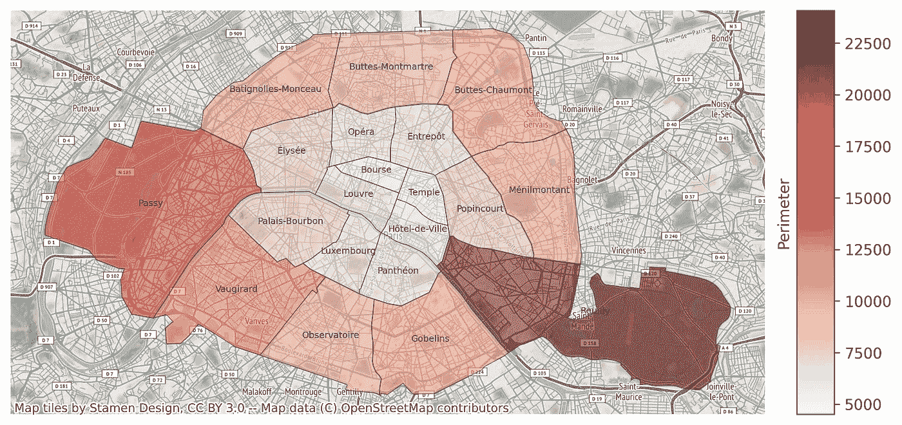

# 在制作美丽的 Choropleth 地图中加强你的游戏

> 原文：<https://towardsdatascience.com/step-up-your-game-in-making-beautiful-choropleth-maps-ab7d3428b3ab>

## 如何使用 Python 制作不同类型地图的指南


JOSHUA COLEMAN 在 [Unsplash](https://unsplash.com/s/photos/maps-color?utm_source=unsplash&utm_medium=referral&utm_content=creditCopyText) 上拍摄的照片

C horopleth 地图是混合空间数据和统计数据的结果。一个简单的例子是显示全球新冠肺炎病例数量的地图。我们广泛使用 choropleth 地图来传递属于社会经济数据、气候变量等的信息。典型的情况是，2D 的 choropleth 图带有 1D 色带(可以是离散的或连续的)。还有一些鲜为人知的弦线图，如 [3D](https://sites-formations.univ-rennes2.fr/mastersigat/MaplibreGL/maps/Choropleth3DMap.html) 弦线图和[二元](https://www.joshuastevens.net/cartography/make-a-bivariate-choropleth-map/)弦线图(带有 2D 色带)。在本文中，我将重点介绍最常见的类型，即带有 1D 色条的 2D 地图。

# 必需品

首先，让我们通过一些必要的事情，然后再进入策划。正如你可能已经猜到的，有许多方法可以制作 choropleth 地图。这是我们需要的一些东西—

1.  Python 库的选择——我们有用于地理空间可视化的库，如 Plotly、Geopandas、Folium 等。Plotly 对初学者友好，但我推荐 geopandas，因为它对输出可视化有更好的控制。
2.  统计数据——我们感兴趣的绘制变量，如温度。
3.  Shapefiles 这些文件保存不同地区的几何数据，如城市、州、国家等。
4.  地图投影的选择。

我将展示一些不同分辨率的 choropleth 地图示例——全球、州/地区和城市级别。

# 全球一级



2021 年世界人口分布图(图片由作者提供)

对于上面的 choropleth 地图，我使用了 [Plotly Express](https://plotly.github.io/plotly.py-docs/generated/plotly.express.choropleth.html) ，这是一种生成地图的简单方法。这里的统计变量是[世界人口](https://data.worldbank.org/indicator/SP.POP.TOTL?end=2021&start=2021)，对于 shapefile，我使用了[世界行政边界](https://public.opendatasoft.com/explore/dataset/world-administrative-boundaries/export/)数据集。下面是复制地图的代码—

我喜欢在绘图之前合并数据集和 shapefile，因为这很方便。正如您所看到的，代码非常短，很容易理解。如果我们想将地图的分辨率更改为区域级别，我们对代码所做的主要更改是在`scope`参数处。

让我们使用 Geopandas 库来检查区域级别的地图。

# 区域一级



美国各州农产品出口的 Choropleth 地图(图片由作者提供)

上面的 choropleth 地图是使用 Geopandas 库制作的。它显示了美国各州不同的农产品出口。你可以在这里下载我们的形状文件。代码如下:

这个代码有点重，尽管它很容易理解，因为它使用 Matplotlib 引擎来绘图。如前所述，我在绘图前合并了数据集和 shapefile。我使用了不同的技术来控制彩条的大小、标签和位置。Plotly 也是如此；因为我更习惯于使用 Matplotlib，所以我更喜欢这样。

## 县级

让我们看看另一个美国县级的地区级 choropleth 地图。我们遵循与上面相同的过程，但包括美国县形状文件。下面是 choropleth 地图，显示了美国不同县的失业率。



美国各县显示失业率的 Choropleth 地图(图片由作者提供)

代码如下:

代码略有不同，因为我在这里包括了县和州的 shapefiles。我用灰色表示县的边界线，用黑色表示州的边界线，以显示不同州和县之间清晰的分界线。

# 城市层面



巴黎 Choropleth 地图(图片由作者提供)

在这个例子中，显示了巴黎市及其不同的行政区。这些颜色代表每个区的周长。我添加了一个背景图，为可视化添加更多的细节和背景。该图的代码如下:

该代码与前面的代码相似，稍微增加了一点，就是使用`contextily`库制作的背景图。你可以为地图选择不同的地形风格(点击[这里](https://contextily.readthedocs.io/en/latest/intro_guide.html))。

# 结论

有不同的方法生成 choropleth 图。我在本文中展示了一些简单的方法。使用 geopandas 和 plotly 进行绘图很简单。我可能对 geopandas 有偏见，因为我花了更多的时间使用它，但我根据情况使用两个库。

## 注意:

本文中使用的所有数据集都有免费使用许可。以下链接:

1.  世界银行数据(知识共享署名 4.0 [许可](https://datacatalog.worldbank.org/public-licenses#cc-by)
2.  Shapefile 数据([开放政府许可 v3.0](http://www.nationalarchives.gov.uk/doc/open-government-licence/version/3/) )
3.  Plotly 数据集(麻省理工学院[许可](https://github.com/plotly/datasets/blob/master/LICENSE)

感谢阅读，干杯！

```
**Want to Connect?**Reach me at [LinkedIn](https://www.linkedin.com/in/rohithteja/), [Twitter](https://twitter.com/rohithtejam), [GitHub](https://github.com/rohithteja) or [Website](https://rohithteja.github.io/)!
```