# Jupyter 笔记本中的便笺

> 原文：<https://towardsdatascience.com/sticky-notes-in-jupyter-notebook-3a2ca55fab99>

## 喜欢用便利贴？现在，Jupyter 笔记本电脑中也提供了这一功能


照片由[凯尔·格伦](https://unsplash.com/@kylejglenn?utm_source=medium&utm_medium=referral)在 [Unsplash](https://unsplash.com?utm_source=medium&utm_medium=referral) 拍摄

Jupyter Notebook 是数据科学家进行数据探索和机器学习实验时集成开发环境(IDE)的热门选择。笔记本是文档的线性组织形式，由代码单元组成，相应的输出如数据框、文本或图表可在代码单元下找到。虽然笔记本对于线性工作流很有用，但数据探索本质上通常是非线性的。在这篇文章中，我们探索如何用 StickyLand 的[2]浮动和粘性细胞将细胞的线性表示重新组织成非线性格式。

# 粘性土地

> *StickyLand 是一个界面，通过在笔记本顶部引入一个永久区域，用户可以自由存储任何笔记本工件，如代码、笔记和任务列表，打破了计算笔记本的传统线性表示。它可以帮助用户更容易地浏览笔记本，编写更少的重复代码，并更好地管理他们代码的执行状态[3]。*

可以把 StickyLand 想象成 Jupyter 笔记本的便利贴，每个便利贴包含一个降价或代码单元。

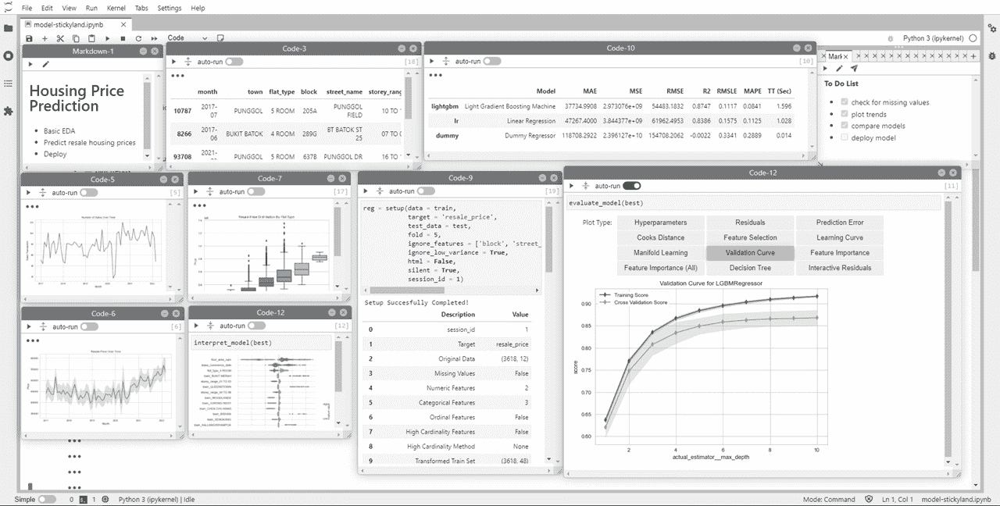

作者图片

我们将使用新加坡住房转售价格数据集[1]来展示 StickyLand 的各种特性，该数据集包含 HDB 住房发展局的转售房屋交易记录。

# 设置

安装软件包

```
#CLI
pip install stickyland #0.1.5
```

启动 Jupyter 实验室(或 Jupyter 笔记本)

```
#CLI
jupyter lab #3.3.2
```

# 粘性元素

让我们来看看 StickyLand 中的不同元素。

**Sticky Dock** 是一个出现在笔记本右上角的区域，当用户滚动笔记本时，它不会移动。点击`Show/Hide StickyLand`按钮即可启动。粘性停靠区是用于容纳多个降价或代码单元格的区域。每个单元格位于粘滞 dock 中不同的选项卡中。我们可以通过将单元格拖放到粘性 dock 中来创建**粘性降价**或**粘性代码**。

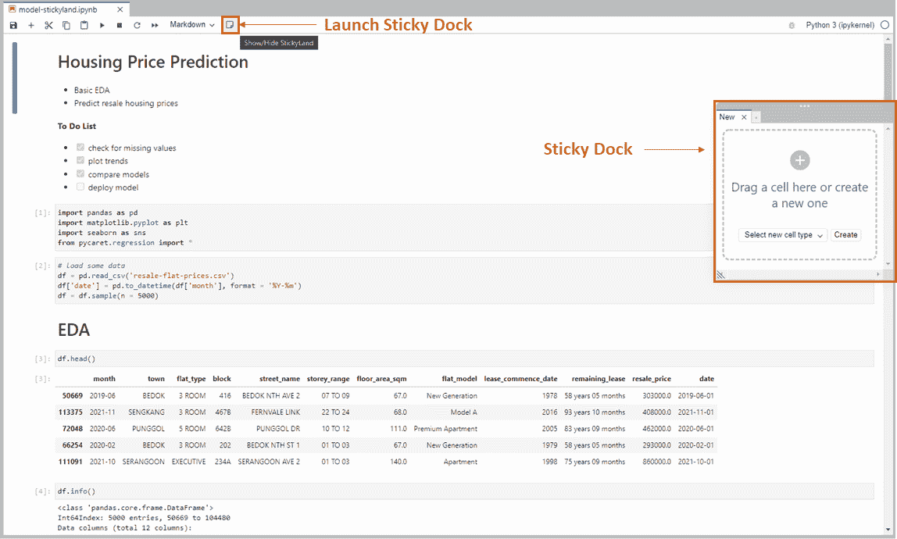

作者图片

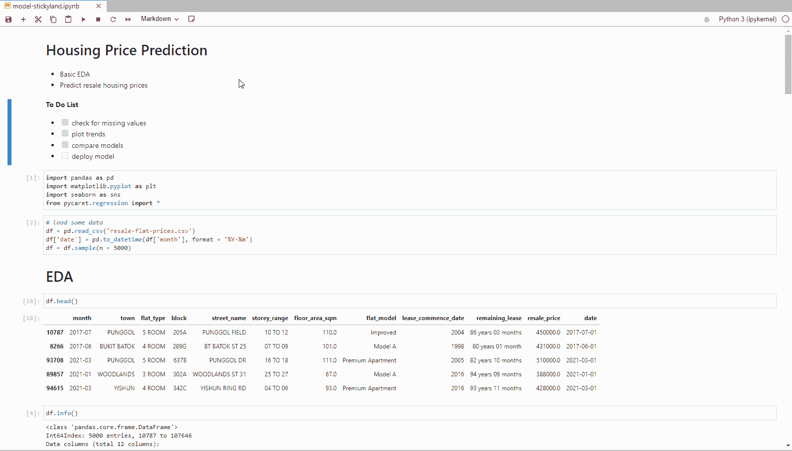

作者 GIF

一个**浮动单元格**浮动在笔记本上方，并且在笔记本滚动时不会改变其位置。我们可以通过拖动单元格的右下角来调整浮动单元格的大小，并通过拖动单元格的标题来改变浮动单元格的位置。浮动单元格可以是降价单元格或代码单元格。要创建浮动单元格:

1.  首先通过将代码或降价单元格拖放到粘性 dock 中来创建粘性代码或降价
2.  点击`Make the cell float`按钮

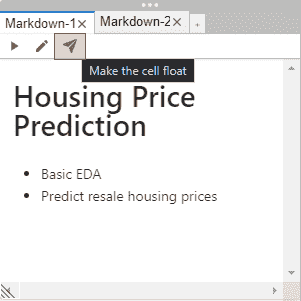

作者图片

3.屏幕上会出现一个浮动单元格，您可以移动它或调整它的大小。我们可以通过点击粘性停靠栏中的召唤按钮将浮动单元格返回到粘性停靠栏。

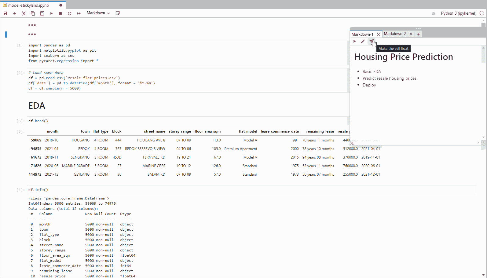

作者 GIF

# 有用的提示

**隐藏单元格**

将单元格放入粘性 dock 后，原始单元格不会被删除，而是被隐藏。我们可以简单地通过点击 3 个点来显示隐藏的单元格。

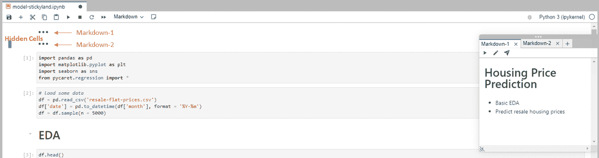

作者图片

**创建新单元格**

我们可以在 sticky dock 中通过选择单元格类型(markdown 或 code)并点击`create`来创建新的单元格。新单元格的内容将在粘性 dock 中可见，并在笔记本中隐藏(显示为 3 个点)。

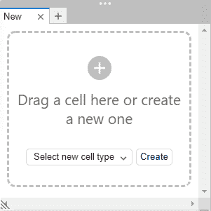

作者图片

**编辑单元格**

我们可以通过点击`pencil`图标来编辑粘性停靠栏中的单元格，所做的更改将会传播到隐藏的单元格中。这适用于降价和代码单元格。

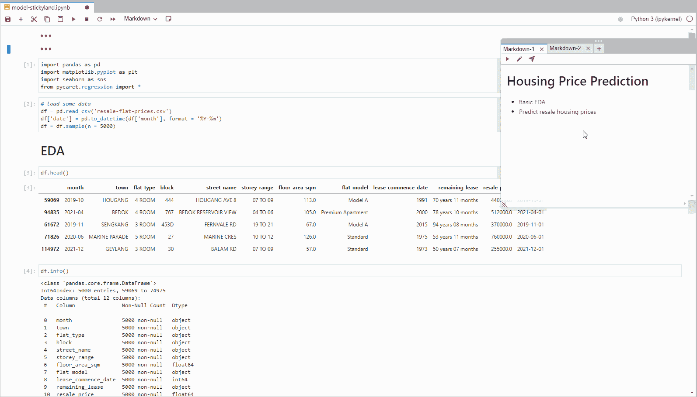

作者 GIF

**从粘性坞站移除电池**

点击粘性坞站选项卡上的`x`，将单元格返回到其在笔记本中的原始位置。


作者 GIF

**隐藏输入**

我们可以通过点击粘性坞站中的`hide input`按钮来隐藏粘性和浮动代码单元的输入代码。这有助于使仪表板更整洁，并为其他重要的单元格腾出空间。

**自动运行**

当笔记本中的任何其他单元格被执行时，`auto-run`功能会自动重新运行启用了`auto-run`的单元格。此功能对于需要定期更新的单元非常有用。例如，当执行为模型定型的单元时，会自动运行显示模型结果的单元。

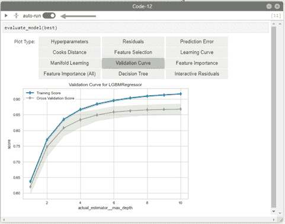

作者图片

# 用例

## 记笔记

一个简单的用例是使用 StickyLand 作为便笺来记录笔记。我们可以在粘性的 markdown 单元格中记笔记，而不是切换到单独的记事本来记笔记或滚动到笔记本顶部的 markdown 单元格中输入笔记。因为当用户滚动时，粘滞的 dock 不会移动，所以我们总是可以访问我们的笔记。

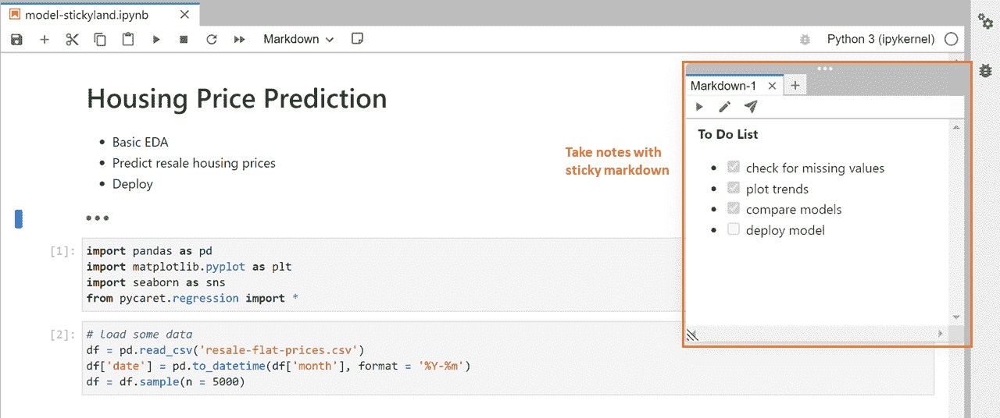

作者图片

# 仪表盘

StickyLand 也可以用来创建临时仪表板。让我们将所有原始的笔记本单元重新排列成一个数据探索和机器学习评估仪表板。这是把所有的单元格拖到粘滞的 dock 后笔记本的样子。原来的细胞是隐藏的，可以通过点击 3 点取消隐藏。空白是我们用来放置浮动单元格的所有画布空间。

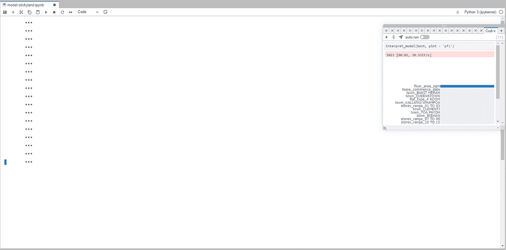

作者图片

这是将选定的单元格放置到位后仪表板的外观。由于画布空间有限，具有交互式输出的单元格在向用户提供更多信息时会很有用。

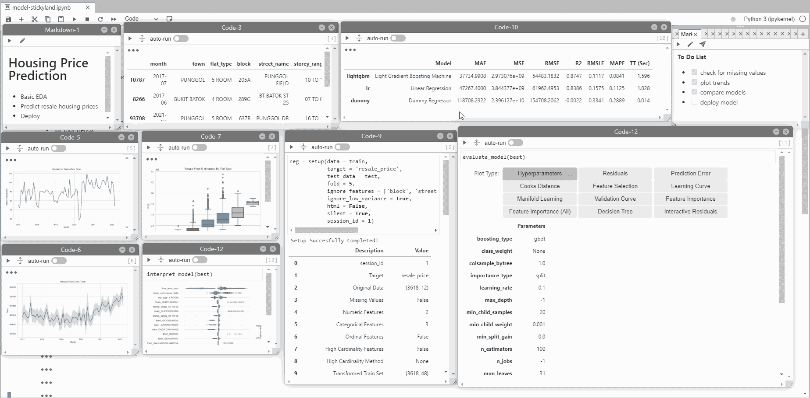

作者 GIF

# 限制

像所有处于早期开发阶段的产品一样，StickyLand 也有一些局限性。在使用它之前了解这些限制是有帮助的。

**粘性元素不会在会话间持续**

笔记本合上后，所有粘性元件都将被移除。如果我们有无法在单个会话中完成的数据探索，这可能是一个问题。这也意味着我们将无法与合作者共享笔记本电脑。下面是相关的 [github 问题](https://github.com/xiaohk/stickyland/issues/5)给出了更多细节。

**无法拖动大浮动单元格调整大小**

通过拖动单元格的右下角来调整浮动单元格的大小。超出画布空间的长浮动单元格不能调整大小，因为浮动单元格的右下角落在画布空间之外。

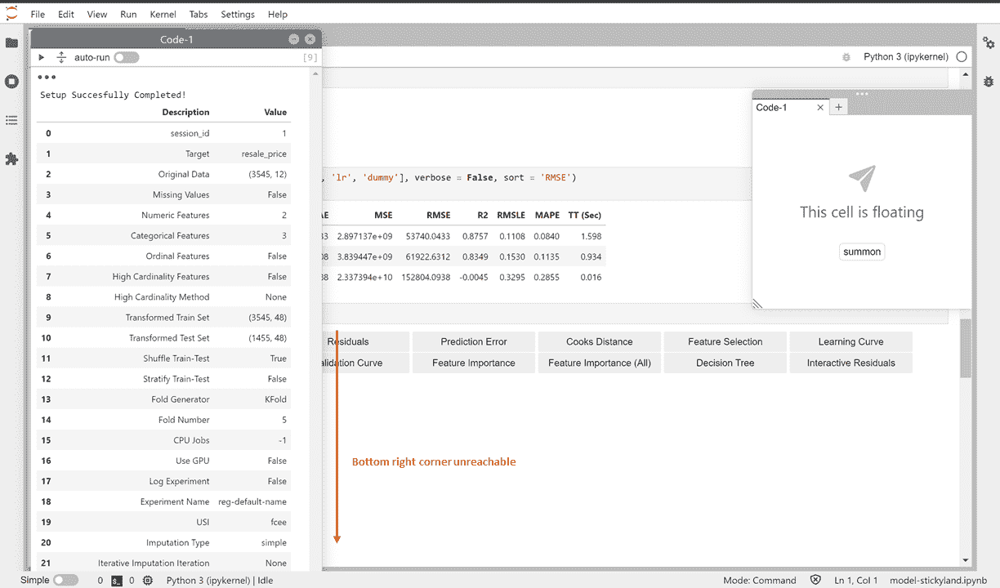

作者图片

一种方法是通过 Chrome 浏览器的 Inspect Element 功能编辑 CSS 元素样式。

1.  右击浮动单元格的标题并选择`Inspect`，这将把我们带到检查元素页面。
2.  查找引用浮动单元格的元素

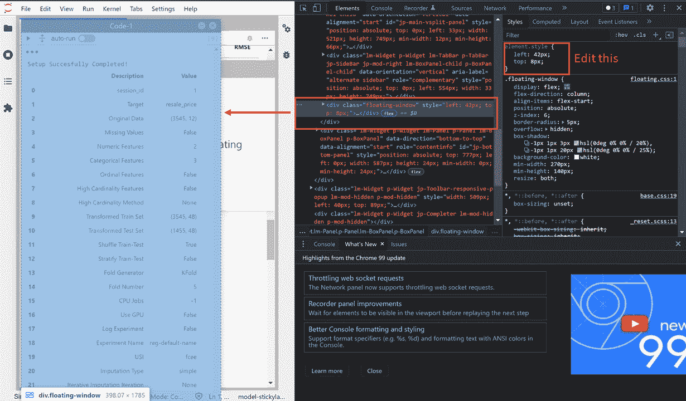

作者图片

3.我们通过包含高度和宽度值来编辑 element.style。浮动单元格的右下角是可访问的，我们可以执行通常的拖动调整大小。

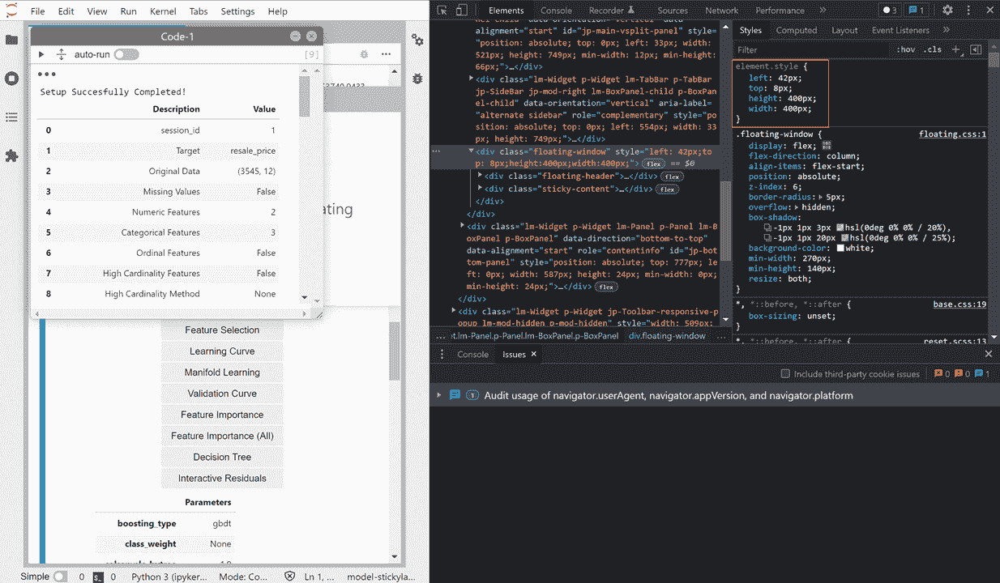

作者图片

**有限的画布空间**

画布空间可能相当有限。这些都是我可以放入的单元格，并且仍然允许图表和文本在 27 英寸的显示器上舒适地可见。请注意，在画布上向下滚动无助于增加放置浮动单元格的空间。

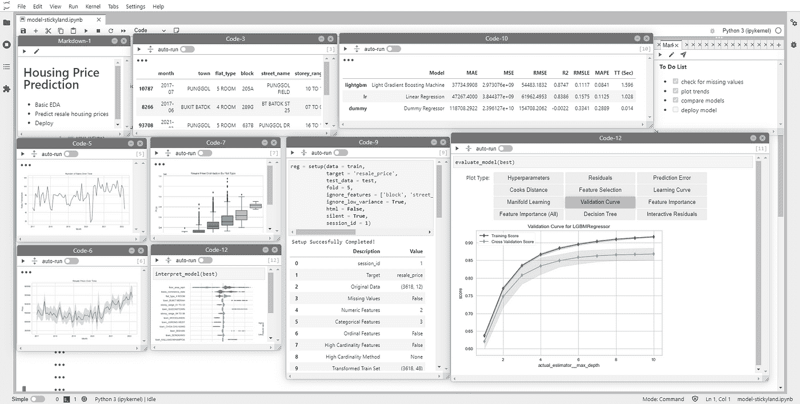

作者图片

# 结论

在本文中，我们介绍了 StickyLand，它可用于在 Jupyter 笔记本中记笔记和创建临时仪表板，以便快速浏览数据。虽然 StickyLand 有其局限性，但期待它的未来发展以及它如何帮助提高 Jupyter 笔记本用户的工作效率无疑是令人兴奋的。点击【3】查看其会议论文[。](https://arxiv.org/abs/2202.11086)

*   [加入 Medium](https://medium.com/@edwin.tan/membership) 阅读更多这样的故事
*   [关注我](https://medium.com/@edwin.tan)获取更多类似的帖子

# 参考

[1] *包含 2022 年 3 月 17 日从 https://data.gov.sg/dataset/resale-flat-prices**的[获取的转售单位价格信息，该信息根据新加坡开放数据许可证版本 1.0](https://data.gov.sg/dataset/resale-flat-prices)*[https://data.gov.sg/open-data-licence](https://data.gov.sg/open-data-licence)*的条款提供。*允许公共使用(商业&非商业)。

[2] [StickyLand Github](https://github.com/xiaohk/stickyland)

[3]王子杰、凯蒂·戴和 w·基思·爱德华兹。2022.粘性世界:打破计算笔记本的线性呈现。参加 2022 年 4 月 29 日至 5 月 5 日在美国路易斯安那州新奥尔良举行的中国计算系统中人的因素会议扩展摘要(CHI '22 Extended Abstracts)。美国纽约州纽约市 ACM，7 页。[https://doi.org/10.1145/3491101.3519653](https://doi.org/10.1145/3491101.3519653)