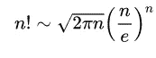
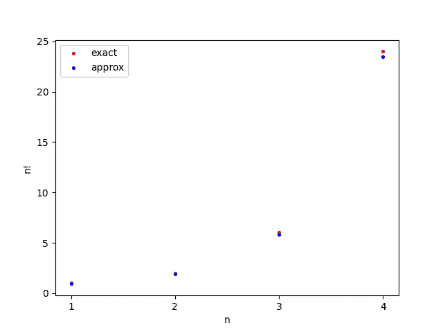
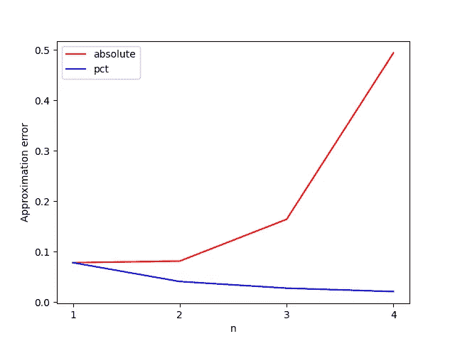
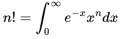
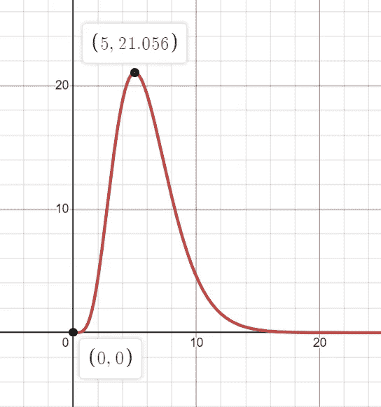
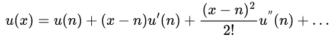
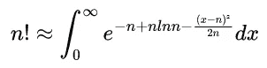
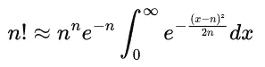
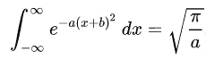
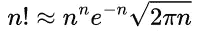

# 阶乘的斯特灵近似——证明及应用

> 原文：<https://towardsdatascience.com/stirlings-approximation-for-factorials-proof-and-applications-c058418e42db>

## 看看如何利用泰勒近似和积分推导出斯特灵近似

# 数据科学和阶乘

阶乘是数学中普遍存在的概念之一。它也是数据科学中使用的一个重要的数学概念。为了模拟泊松过程中的概率分布，使用阶乘。泊松分布的概率质量函数在分母中有阶乘表达式。如果没有计算阶乘的方法，我们就无法找到泊松随机变量的概率。

阶乘也和组合学有关系。比如， *n！*是 *n 个*唯一对象的排列数。从统计力学的观点来看，熵被定义为一个组合问题。熵在信息论中也有单独的定义。当比较两个不同的定义时，它们是相同的。

# 阶乘

Factorial 只为非负整数定义。一个数的阶乘定义为所有等于或小于该数的正整数的乘积。

数学上写为:
*n！= n * (n - 1) * (n - 2) * … * 3 * 2 * 1*

## 解释

一个班的长凳有四个座位。四个朋友，*苏曼*、*苏巴斯*、*苏迪普*和*苏达山*坐在替补席上。所以， *4！*是那些 *4* 的朋友可以坐冷板凳的方式的数量。

[国家癌症研究所](https://unsplash.com/@nci?utm_source=medium&utm_medium=referral)在 [Unsplash](https://unsplash.com?utm_source=medium&utm_medium=referral) 上拍摄的照片

## 计算限制

你在你的科学计算器中计算过阶乘吗？你可能在计算 *70 的时候注意到了*！*。那是因为 *70！*超过 *100* 位，您的计算器限制为 *100* 位*(即 10⁹⁹).的<顺序 70 不是一个很大的数，但是它的阶乘非常庞大，很难计算。现在，想想大数的阶乘。如果我们想使用阶乘的定义来计算阶乘，那么计算阶乘就有计算限制。**

## *需要阶乘近似*

*正如我们上面讨论的，使用阶乘的定义计算阶乘在计算上是昂贵和困难的。因此，出现了使用较便宜和较简单的运算来近似阶乘的需要。有时候，我们只想知道阶乘的阶，而不是确切的值。在这种情况下，能够计算阶乘的阶而不进行整个阶乘计算是有意义的。这就是我们可以使用阶乘近似的地方。阶乘近似值的另一个使用案例是当我们试图查看关系或比较表达式时，会用到阶乘。比如你要比较 *(n-1)！*和 *2^n* ，阶乘近似可能会使比较变得容易。*

# *斯特灵近似*

*斯特林近似法是一种阶乘近似法。其公式如下所示:*

**

*斯特林近似为 *n！**

*让我们直观地看看，对于 n 的一些小值，它们是如何匹配的。*

**

*将实际阶乘值与斯特林近似法进行比较*

*挺好的。随着 *n* 的值变大，近似变得更好。我们将在后面的证明中看到原因。*

*在图中，红色散点和蓝色散点之间的垂直距离似乎在增加。尽管如此，我们仍然声称，对于大值的 *n* ，近似值变得更好，这是怎么做到的？*

*这是真的。尽管距离或绝对差在增加，但近似值的精确度百分比在下降。*

*近似值的精确度百分比定义为:
*|实际阶乘-近似阶乘| /实际阶乘**

*让我们看看相对于上述 *n* 值的绝对差值和准确度百分比的线图。*

**

*斯特林近似的近似误差*

*正如我们在图表中看到的，尽管绝对差值在增加，但相对于 *n* 的准确度百分比在下降。*

**注意阶乘只为非负整数定义。它不是在整个实数域中定义的。因此，连续图仅用于说明目的。**

*现在，让我们看看斯特林近似的证明。*

## *斯特林近似的证明*

*一个数的阶乘 *n* ， *n！*，也可以用整数形式写成:*

**

*这其实和[伽玛函数](https://en.wikipedia.org/wiki/Gamma_function)有关系。在本文中，我们不需要担心伽马函数。不过有兴趣的话有一篇关于伽马函数的优秀 TDS [文章](/gamma-function-intuition-derivation-and-examples-5e5f72517dee)。*

*上述表达式可以通过使用[分部积分](https://en.wikipedia.org/wiki/Integration_by_parts#:~:text=In%20calculus%2C%20and%20more%20generally,of%20their%20derivative%20and%20antiderivative.)技术来证明。积分会产生以下递推关系:
*n！= n * (n - 1)！**

*然后，我们可以找到对 *n=1* 的积分。对于 *n=1* ，积分表达式将计算为 *1* 。所以， *1！=1* 。*

*然后，利用数学归纳法的技巧，我们可以证明上述表达式。*

*现在，我们确信表达式是真实的，让我们试着理解它。*

*一个数的积分 *n* ， *n！*，为 0 至 **∞** 区间内曲线 *y=e^(-x) * x ^ n* 下的面积。首先，让我们看看曲线 *y* 的形状。*

**

*使用 [Desmos](https://www.desmos.com/calculator) 创建。*

*我们可以看到，它形成了某种钟形曲线。对于图形，我们取 *n=5* 。对于 *n* 的值，第二项 *(x^n)* 对于 *x* 的小值是小的，对于 *x* 的大值是大的。相反，第一项 *e^(-x)* 对于 x 的小值较大，对于 x 的大值 *x* 较小。*

*对于 *n = 0* ， *y =* *0* ，而对于 *n → ∞* ， *y → 0* 。*

*所以，我们来看看能否在区间*【0，∞)找到一些极值。**

**y* 可以改写为:
*y = e^(-x +nlnx)。**

*求 y 的最大值和求 *u = -x +nlnx* 的最大值是一样的，因为指数函数是单调递增函数*。**

*因此， *u* 相对于 *x* 的导数将是:
*du/dx = -1 + n / x**

*只有当 *x=n* 时，导数 *du/dx* 才为 0。*

*现在，我们通过计算二阶导数来确定它是一个最大值。*

**d y/dx =-n/x**

*当 *x=n 时，d y/dx = -1/n < 0。**

**在 x = n 时，y=e^(-n) * (n^n) > 0* 。*

*所以 *y* 的全局最大值在 *x=n* 。*

*曲线下的大部分区域是由最大值周围的空间贡献的。所以，让我们用泰勒级数来近似函数 *u* 。*

**

*一阶导数在 *x = n* 处为 *0* 。还有， *u* 在 *x = n* 的值是 *-n + nlnn* 。代入展开式中的值，
*u(x)=-n+nlnn-(x-n)/2n+…**

*我们在进行近似时忽略高阶导数项。*

*那么，近似值可以写成:*

**

*常数可以取出来。*

**

*任意高斯函数的定积分为:*

**

*指数函数几乎在正域中具有曲线下的所有区域，对于较高的 *n* 值更是如此。这就是为什么这种近似更适合于较高的 *n* 值——解决了计算问题并实现了非常好的近似。*

*因此，积分的极限可以从-∞扩展到∞。所以， *n！*可以写成:*

**

*这等同于:*

**

*因此，我们证明了斯特林近似。*

# *结论*

*这里，我们强调阶乘逼近的重要性，并给出阶乘逼近的一种方法，即斯特林逼近。阶乘近似对于大值的 *n* 极其重要，而斯特林近似对于大值的 *n* 实现了极好的近似。所以，当我们遇到 *n* 的大值的阶乘时，我们可以使用这个工具——斯特林近似法。它既可以用来计算阶乘，也可以将表达式简化为另一个近似表达式。我们还展示了斯特林近似的证明，它使用泰勒展开和微积分来计算近似表达式。*