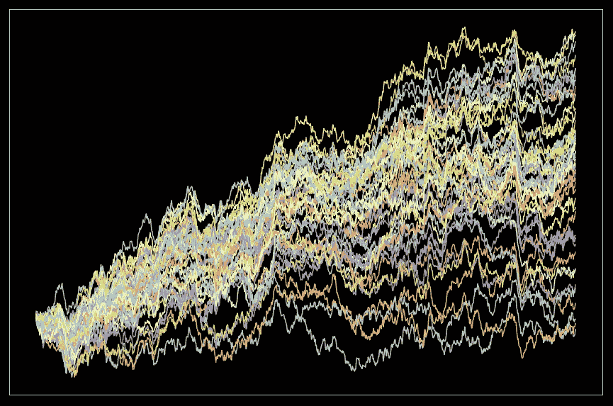
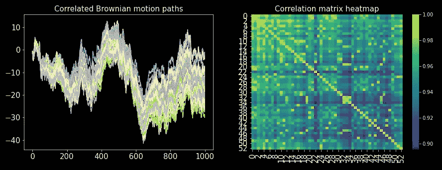

# 随机过程模拟—布朗运动，基础

> 原文：<https://towardsdatascience.com/stochastic-processes-simulation-brownian-motion-the-basics-c1d71585d9f9>

## 随机过程模拟系列的第 1 部分。从头开始用 Python 模拟相关布朗运动。

图片作者。

布朗运动是随机微积分的基础，因此是模拟随机过程的关键。尽管在真实世界的数据中观察纯布朗运动并不容易，但我们可以将它们结合起来并重新调整它们的比例，以构建更复杂的过程来成功地逼近数据。

维纳过程，布朗运动的另一个名字，可以用来建立具有不同属性和行为的过程。

简单来说，**布朗运动是一个连续的过程，它在任何时间尺度上的增量都来自正态分布**。

这就是它们在随机微积分中处于中心地位的原因。正态分布符合大多数分析性质，这就是为什么它也是连续概率理论的中心。

在这个故事中，我们将总结布朗运动的基础知识，并学习如何用 Python 模拟它们。我们还将学习如何

模拟相关的 N 维维纳过程。

如果你的随机微积分生疏，或者不存在，也不用担心，初级的时间序列知识就足够了。

## 目录

*   定义
*   相关过程
*   扩散过程
*   代码摘要
*   最后的话

## 定义

一个过程 *W* ，一个 *t* 的连续函数，即 *W* = *W* (t)是一个布朗运动(维纳过程)如果 W(0) = 0 并且如果对于所有 0 =*t*_ 0<*t*_ 1<…<*t*_*m*增量

*W*(*t*_ 1)——*W*(*t*_ 0)*W*(*t*_ 2)——*W*(*t*_ 1)…，*W*(*t*_ m)——*W*(【t44

是独立的，正态分布的。分布(正态)的均值为零，其方差为时间差*t*_*I*+1】—*t*_*I*。

例如，如果增量是在单位时间内定义的，那么分布就是标准的正态、零均值、单位方差。

用 Python 生成布朗运动非常容易。以下代码生成单位时间内离散采样的维纳过程( *dW* )的增量以及过程路径( *W* ):

例如，对于 1000 个 *T* (样本量):

图片作者。

## 相关过程

布朗运动可以关联到另一个布朗运动。

设 *W* _1 是一个布朗运动，而 *W* _3 是与 *W* _1 相关的另一个布朗运动，则:

其中 *W* _2 是另一个独立的布朗运动。*W*3 和*W*1 的相关性为ρ。

请注意，尽管两个进程*W*3 和 *W* _1 之间存在相关性，但仍然有两个随机性来源， *W* _1 和 *W* _2。这一点经常被试图利用相关性进行预测的策略和模型所忽略，**相关性不会减少随机性的来源**。

下面的函数获取布朗运动的增量， *dW* ，并生成一个相关的布朗运动。返回相关进程的增量。

然而，我们很少只想要一对相关的进程。相反，我们经常需要许多以某种方式相关的过程，一个 N 维维纳过程。

下面的算法的思想是首先产生一个布朗运动，然后，另一个通过ρ与第一个相关，随后的过程应该通过ρ与已经产生的过程的随机选择相关。

结果是流程矩阵，其中每列代表一个流程。

使用这段代码，我们可以生成任意多的流程:

图片作者。

## 扩散过程

我们可以使用布朗运动来构建更复杂过程的最常见形式是带增量的扩散过程(随机微分方程):

其中 *a* _1 和 *b* _1 是 *t* (时间)和过程本身的函数。第一项对应于确定性部分，第二项对应于随机部分。

在这一点上，我们不打算深入研究随机微积分(也称为 itcalculus ),但重要的是要提到，这种扩散过程中的布朗运动可以是相关的，与上一节中的方式相同。如果布朗运动( *W_t* )是相关的，那么 it4 过程( *X_t* )也是相关的。

## 代码摘要

像往常一样，我喜欢用前几节中使用的所有代码的总结来结束这个故事，并生成一个连贯的迷你库，我们可以保存它供以后使用。

将此代码保存为“brownian_motion.py ”,因为我们将在本系列的后续故事中不断使用它。

## 最后的话

这个故事是随机过程模拟系列的第一部分，旨在为该系列的下一个故事奠定基础。这是布朗运动的一个非常简短的概述。但是对于我们的目的来说，这个深度已经足够了。

如果你想深入了解布朗运动，你可以阅读 S. Shreve 关于这个主题的书，布朗运动和随机微积分。

## 参考

[1] S. E. Shreve，I. Karatzas，[布朗运动和随机微积分](http://...) (1998)，数学研究生教材，施普林格。

请继续关注本系列的下一个故事，这只是一个开始，仅仅是即将到来的事情的热身。在 [Medium](https://medium.com/@diego-barba) 上关注我并订阅，以便在接下来的故事一出来就获得更新。

 [## 每当迭戈·巴尔巴出版时，就收到一封电子邮件。

### 每当迭戈·巴尔巴出版时，就收到一封电子邮件。通过注册，您将创建一个中型帐户，如果您还没有…

medium.com](https://medium.com/subscribe/@diego-barba) 

我希望这个故事对你有用。如果我错过了什么，请让我知道。

喜欢这个故事吗？通过我的推荐链接成为媒体会员，可以无限制地访问我的故事和许多其他内容。

 [## 通过我的推荐链接加入 Medium-Diego Barba

### 作为一个媒体会员，你的会员费的一部分会给你阅读的作家，你可以完全接触到每一个故事…

medium.com](https://medium.com/@diego-barba/membership) 

## 浏览随机过程模拟系列

该系列的下一个故事:

 [## 随机过程模拟——奥恩斯坦·乌伦贝克过程

### 随机过程模拟系列的第 2 部分。模拟奥恩斯坦-乌伦贝克过程，规范…

towardsdatascience.com](/stochastic-processes-simulation-the-ornstein-uhlenbeck-process-e8bff820f3)  [## 随机过程模拟——考克斯-英格索尔-罗斯过程

### 随机过程模拟系列的第 3 部分。从头开始用 Python 模拟 Cox-Ingersoll-Ross 过程。

towardsdatascience.com](/stochastic-processes-simulation-the-cox-ingersoll-ross-process-c45b5d206b2b)  [## 随机过程模拟——几何布朗运动

### 随机过程模拟系列的第 4 部分。用 Python 从头开始模拟几何布朗运动。

towardsdatascience.com](/stochastic-processes-simulation-geometric-brownian-motion-31ec734d68d6)  [## 随机过程模拟——广义几何布朗运动

### 随机过程模拟系列的第 5 部分。用 Python 模拟广义布朗运动。

towardsdatascience.com](/stochastic-processes-simulation-generalized-geometric-brownian-motion-a327c0fa6226)