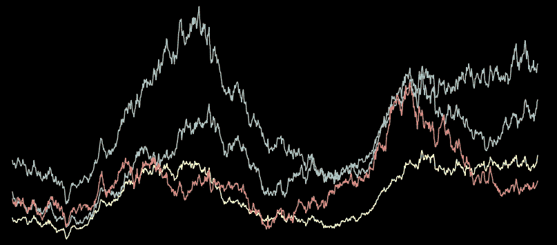
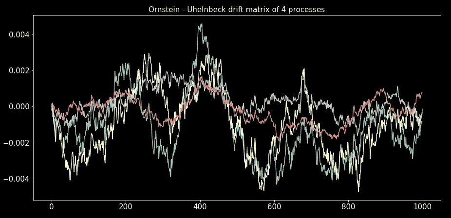
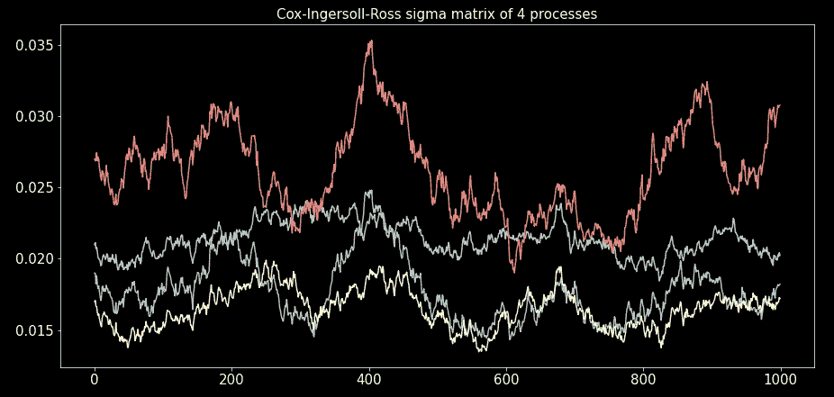
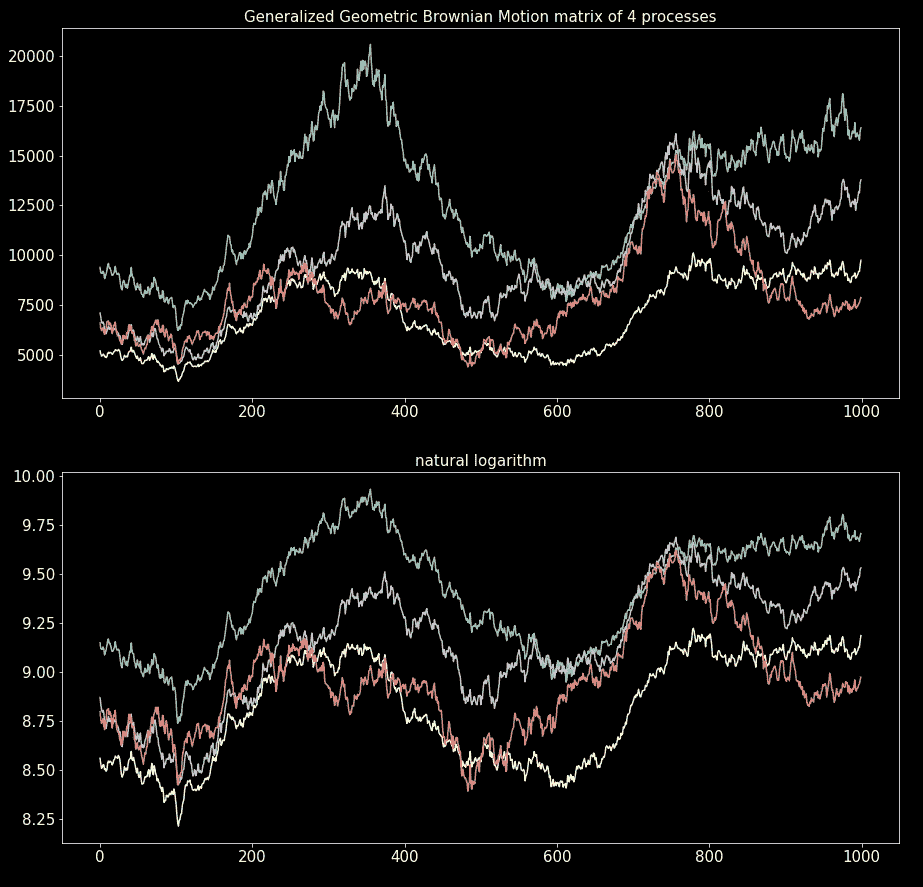
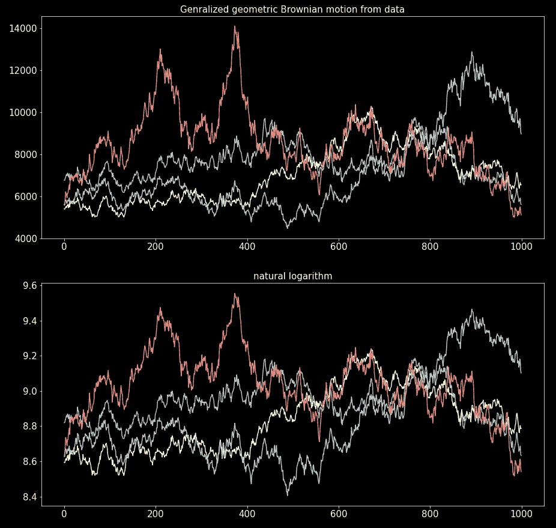

# 随机过程模拟——广义几何布朗运动

> 原文：<https://towardsdatascience.com/stochastic-processes-simulation-generalized-geometric-brownian-motion-a327c0fa6226>

## 随机过程模拟系列的第 5 部分。用 Python 模拟广义布朗运动。

图片作者。

唉，我们已经结束了随机过程模拟系列的旅程。但是我们把最好的留到了最后。在这个故事中，我们将探索广义几何布朗运动。

当过程微分的商和过程本身遵循扩散过程时，广义几何布朗运动发生。[几何布朗](/stochastic-processes-simulation-geometric-brownian-motion-31ec734d68d6)运动是一个特例，因为我们将漂移和随机系数设为常数。

在本案例中，我们将使用[奥恩斯坦-乌伦贝克过程](/stochastic-processes-simulation-the-ornstein-uhlenbeck-process-e8bff820f3)来模拟漂移，使用[考克斯-英格索尔-罗斯过程](/stochastic-processes-simulation-the-cox-ingersoll-ross-process-c45b5d206b2b)来模拟随机系数。

我们将使用在所有先前故事中开发的概念和代码。因此，在深入研究这一部分之前，请检查一下它们(至少浏览一下代码)。整个系列被组织成一个包含五个模块的库，您需要了解前面的四个模块才能使用这个模块。

*   [【第一部分】布朗运动，基础知识](/stochastic-processes-simulation-brownian-motion-the-basics-c1d71585d9f9)
*   [【第二部分】奥恩斯坦-乌伦贝克过程](/stochastic-processes-simulation-the-ornstein-uhlenbeck-process-e8bff820f3)
*   [【第三部分】考克斯-英格索尔-罗斯过程](/stochastic-processes-simulation-the-cox-ingersoll-ross-process-c45b5d206b2b)
*   [【第四部分】几何布朗运动](/stochastic-processes-simulation-geometric-brownian-motion-31ec734d68d6)

## 目录

*   综合 SDE
*   奥恩斯坦-乌伦贝克漂移
*   考克斯-英格索尔-罗斯σ
*   模拟过程
*   数据的参数估计
*   数据模拟
*   代码摘要
*   离别赠言

## 综合 SDE

广义布朗运动的 [SDE](/stochastic-processes-simulation-geometric-brownian-motion-31ec734d68d6) (随机微分方程)的积分形式为:

在[之前的故事](/stochastic-processes-simulation-geometric-brownian-motion-31ec734d68d6)中，我们将μ和σ视为常数。现在我们将它们视为随机过程。注意， **μ可以是任何随机过程或确定性函数，σ也是如此，只要它是正的**。

一个合适的μ的候选者是奥恩斯坦-乌伦贝克过程。

σ的典型候选过程是考克斯-英格索尔-罗斯过程。

## 奥恩斯坦-乌伦贝克漂移

在大多数实际例子中，广义几何布朗运动的漂移项(μ)接近于零，或者至少比过程的随机项小得多。μ经常改变它的符号(这是均值回复)；否则，广义几何布朗运动在某种程度上是可以预测的(在某种程度上是不确定的)。

一个均值回复(平稳)过程，没有积极约束？我们立即转向均值回复的典型过程，Ornstein-Uhenbeck (OU)过程。

在本系列的第二个故事中，我们编写了 OU 流程的模拟代码，并学习了如何从数据中估计其参数。我们将在这里使用该代码，将其保存为“OU_proc.py ”,并将其放在您打算运行本故事代码的同一个目录中。

在[系列的前一个故事](/stochastic-processes-simulation-geometric-brownian-motion-31ec734d68d6)中，关于几何布朗运动，我们为“漂移”对象开发了接口(协议)。

我们只需要将我们的 OU 过程代码包装在一个实现“Drift”协议的类中，我们就是黄金。

协议实现的一个示例:

图片作者。

## 考克斯-英格索尔-罗斯σ

在大多数现实世界的例子中，σ过程也表现出均值回归。此外，我们知道，根据结构，它必须是积极的。从σ过程中观察到的另一个特征是，随机冲击对较大的过程值比较小的过程值更有影响。

进入考克斯-英格索尔-罗斯过程。该流程勾选了σ流程的所有方框。

在[系列的第三个故事](/stochastic-processes-simulation-the-cox-ingersoll-ross-process-c45b5d206b2b)中，我们开发了用于模拟和数据参数估计的 CIR 过程代码。我们将在这里使用该代码，将其保存为“CIR_proc.py ”,并将其放在您打算运行本故事代码的同一个目录中。

西格玛过程的界面(协议)是在本系列的前一篇文章中开发的，关于几何布朗运动。

接口的美妙之处在于，我们只需要实现它们，编写的代码就应该可以工作。我们将 CIR 过程的模拟包装在一个实现协议的新类中，就这样。

CIR“适马”协议实施的一个例子:

图片作者。

## 模拟过程

在本节中，我们将使用在本系列的[前一篇文章](/stochastic-processes-simulation-geometric-brownian-motion-31ec734d68d6)中开发的几何布朗运动的代码。这种代码被设计成依赖于抽象(协议)。因此，只要我们注入符合协议的对象，代码应该没有任何模块。在这一点上，面向对象的方法得到了回报(手指交叉)。

将[上一篇文章](/stochastic-processes-simulation-geometric-brownian-motion-31ec734d68d6)中的代码保存为“geometric_brownian.py ”,并将其放在您打算运行这篇文章代码的目录中。主要的模拟器对象被命名为“GenGeoBrownian”我们将使用它来生成以下模拟。

为了模拟广义几何布朗运动，我们需要:

*   “漂移”协议(“OUDrift”)实例
*   “适马”协议(“CIRSigma”)实例
*   “InitP”协议实例；在这种情况下，我们选择随机的*P0*s，所以我们使用“几何布朗. py”中的“RandomInitP”对象

让我们画出“P_mat”及其自然对数:

图片作者。

## 数据的参数估计

分离包含在另一个随机过程中的随机过程是很棘手的。但这就是我们估计 OU μ和 CIR σ的参数所需要做的。

使用主要过程(广义几何布朗运动)上的滚动窗口进行估计。滚动均值会生成μ过程，滚动标准差会生成σ过程。

我们估计μ过程的 OU 参数和平均相关性；“滚动窗口”参数是窗口的大小:

四个过程的估计 OU 漂移参数:

*   α= 0.0057，γ=-0.00087，β= 0.00026
*   α= 0.0035，γ=-0.0021，β= 0.00022
*   α= 0.011，γ= 0.00037，β= 0.00029
*   α= 0.01，γ= 0.00029，β= 0.00038

四个过程的真实 OU 漂移参数:

*   阿尔法 *=* 0.0097，伽马 *=* 0.00014，贝塔 *=* 0.00028
*   阿尔法 *=* 0.008，伽马 *=-* 0.0002，贝塔 *=* 0.0003
*   阿尔法 *=* 0.013，伽马 *=* 0.0，贝塔 *=* 0.00015
*   阿尔法 *=* 0.007，伽马 *=* 0.0，*贝塔 *=* 0.0001*

估计相关性:

*   ρ=0.67

真实相关性:

*   ρ=0.6

σ过程的 CIR 参数和平均相关性:

四个过程的估计 CIR σ参数:

*   a=0.0043，b=0.017，c=0.0014
*   a=0.0059，b=0.015，c=0.0013
*   a=0.0050，b=0.019，c=0.0014
*   a=0.0042，b=0.028，c=0.0018

四个过程的真实 CIR σ参数:

*   a *=* 0.012，b *=* 0.019，c *=* 0.0025
*   *a=* 0.013，*b*=*0.017，c *=* 0.0021*
*   a *=* 0.015，b *=* 0.021，c *=* 0.0017
*   a *=* 0.01，b *=* 0.027，c *=* 0.0029

估计相关性:

*   ρ=0.58

真实相关性:

*   ρ=0.7

可以看到，估计不是很大。主要原因是没有办法完全隔离μ和σ过程，并且滚动窗口大小会极大地改变结果。根据您的数据，您需要找到滚动窗口大小的最佳位置。

关于窗口大小有一个折衷。较大的窗口将生成更稳健的滚动统计数据，但用于估计参数的时间序列将会更小。

## 数据模拟

最后，我们来看一个直接从数据进行模拟的例子。我们使用上一节中开发的评估工具。下面的代码片段考虑了数据以熊猫数据帧的形式出现的可能性:

来自数据(及其自然对数)的模拟过程图:

图片作者。

## 代码摘要

代码总结已经成为该系列前几个故事的常态，这个故事也不会例外。这是我们在本故事的各个部分中编写的迷你库:

## 离别赠言

带着巨大的悲伤，我结束了这个关于随机过程的系列。希望对你有帮助；对我来说，我喜欢编写这个系列的模块。

事后看来，除了关于随机过程的基本知识之外，本系列还有一些重要的收获。我们还学习了 OO(面向对象)设计模式和模块化架构。

如果我们采用命令式脚本风格，我们可以用更少的代码行(不包括我的大量文档字符串)编写整个系列。但是那不会产生一个干净的库，我们可以用它作为未来项目的工具。

> …通向光明的道路似乎是黑暗的，前进的道路似乎是倒退的，笔直的道路似乎是漫长的…
> 
> —老子陶德王

## 参考

[1]b . ksen dal，[随机微分方程](http://.../) (2013)，第六版，Springer。

如果你想要更多这样的系列，请跟随我。我希望这个故事和整个随机过程模拟系列对你有用。如果我错过了什么，请让我知道。对于任何质疑、批评等。，留言评论。

 [## 每当迭戈·巴尔巴出版时，就收到一封电子邮件。

### 每当迭戈·巴尔巴出版时，就收到一封电子邮件。注册后，如果您还没有，您将创建一个中型帐户…

medium.com](https://medium.com/subscribe/@diego-barba) 

喜欢这个故事吗？通过我的推荐链接成为媒体会员，可以无限制地访问我的故事和许多其他内容。

 [## 通过我的推荐链接加入 Medium-Diego Barba

### 作为一个媒体会员，你的会员费的一部分会给你阅读的作家，你可以完全接触到每一个故事…

medium.com](https://medium.com/@diego-barba/membership) 

## 浏览随机过程模拟系列

该系列之前的故事:

 [## 随机过程模拟—布朗运动，基础

### 随机过程模拟系列的第 1 部分。从头开始用 Python 模拟相关布朗运动。

towardsdatascience.com](/stochastic-processes-simulation-brownian-motion-the-basics-c1d71585d9f9)  [## 随机过程模拟——奥恩斯坦·乌伦贝克过程

### 随机过程模拟系列的第 2 部分。模拟奥恩斯坦-乌伦贝克过程，规范…

towardsdatascience.com](/stochastic-processes-simulation-the-ornstein-uhlenbeck-process-e8bff820f3)  [## 随机过程模拟——考克斯-英格索尔-罗斯过程

### 随机过程模拟系列的第 3 部分。从头开始用 Python 模拟 Cox-Ingersoll-Ross 过程。

towardsdatascience.com](/stochastic-processes-simulation-the-cox-ingersoll-ross-process-c45b5d206b2b)  [## 随机过程模拟——几何布朗运动

### 随机过程模拟系列的第 4 部分。用 Python 从头开始模拟几何布朗运动。

towardsdatascience.com](/stochastic-processes-simulation-geometric-brownian-motion-31ec734d68d6)