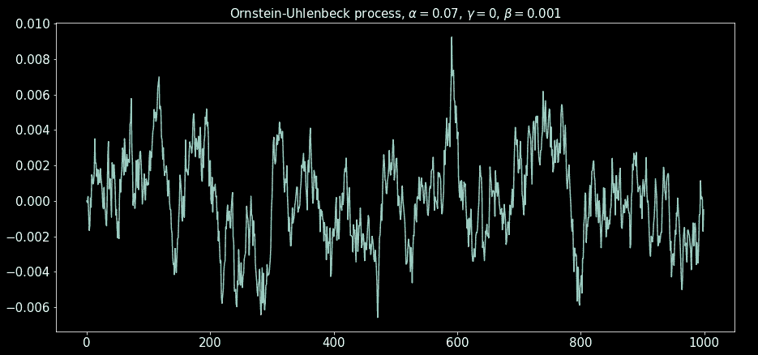
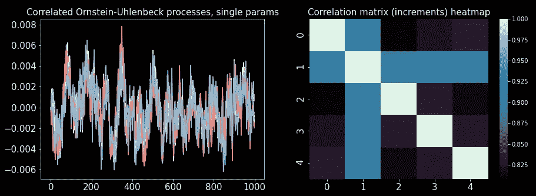
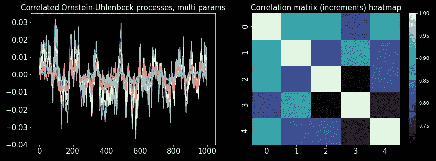

# 随机过程模拟——奥恩斯坦·乌伦贝克过程

> 原文：<https://towardsdatascience.com/stochastic-processes-simulation-the-ornstein-uhlenbeck-process-e8bff820f3>

## 随机过程模拟系列的第 2 部分。用 Python 模拟规范平稳过程奥恩斯坦-乌伦贝克过程。

图片作者。

对平稳性的追求。不管我们是想进行统计推断还是拟合机器学习模型，我们似乎总是在寻找稳定的特征、稳定的解释变量以及稳定的一切。

当我们处理指数随机变量时，平稳性意味着平稳的随机过程。

在这个故事中，我们将讨论**奥恩斯坦-乌伦贝克过程**。平稳随机过程中的规范过程。**这个过程不仅是平稳的，而且是正态分布的**。要是时间序列特征也像这样就好了。

在接下来的章节中，我们将模拟奥恩斯坦-乌伦贝克过程，学习如何从数据中估计其参数，最后，模拟多个相关过程。这个想法是，在这个故事的结尾，你可以随身携带一个完整的用于奥恩斯坦-乌伦贝克模拟的迷你库。

在整个故事中，我们将使用在关于[布朗运动](/stochastic-processes-simulation-brownian-motion-the-basics-c1d71585d9f9)系列的第一个故事中介绍的工具和概念。如果你已经知道布朗运动的基本知识，只需检查代码，因为我们将使用布朗运动的模拟方法。否则，先通读一遍，然后再回来。

## 目录

*   过程的方程式
*   模拟过程
*   从数据中估计参数
*   相关过程
*   代码摘要
*   最后的话

## 过程的方程式

奥恩斯坦-乌伦贝克(简称 OU)过程满足随机微分方程(SDE):

其中 *W_t* 为[布朗运动](/stochastic-processes-simulation-brownian-motion-the-basics-c1d71585d9f9)，α和β为正常数。

时间微分项的确定性部分(过程的漂移)是导致均值回复的原因。当 *X_t* 大于γ(渐近均值)时，漂移为负，将过程拉回均值，当 *X_t* 小于γ时，则相反。均值回复参数α控制漂移的幅度，因此值越高，均值回复过程越剧烈。最后，β控制过程的随机冲击。注意，对于非常高的β值，由于漂移不再有显著影响，该过程渐进地是重新标度的布朗运动。

这个过程被用作稳定过程的标准过程有两个主要原因:

1.  随机微分方程在封闭形式下是可积的(我们喜欢这一点)。
2.  过程路径是正态分布的。因此，如果布朗运动是随机过程的中心，因为它的增量是正态分布的，那么 OU 过程是均值回复过程的中心，因为它的路径是正态分布的。

SDE 的解决方案是:

其渐近均值和方差分别为γ和β / 2α。因此，过程的分布是 N(γ，β / 2α)。

## 模拟过程

为了模拟这个过程，我们需要将 SDE 的解转化为一个离散的向量方程，这个过程的每个单位时间是一个向量的指数。

我们设 t = (0，1，2，…， *T* -1)，其中 T 是样本量。我们为指数构建数组，然后逼近积分。为了近似积分，我们使用累积和。请注意，这种积分近似值不适用于非常小的样本量，因此让样本量大于约 100 是个好主意。

让我们对此进行编码。

首先，我们将定义数据类中的参数。传递许多参数通常会变得混乱，在它们自己的对象中传递它们会更干净:

为了生成 OU 流程模拟，我们将使用代码从该系列的[第一个故事](/stochastic-processes-simulation-brownian-motion-the-basics-c1d71585d9f9)中生成布朗运动。将代码保存为“brownian_motion.py”。如果不将其保存在运行以下代码的文件夹中，就必须更改 import 语句。

让我们模拟一个 OU 流程:

图片作者。

## 从数据中估计参数

为了估计给定过程的 OU 参数，我们使用普通最小二乘(OLS)回归。

我们通过离散方程(时间序列方式)近似随机微分方程，称为欧拉-丸山方法(随机差分δ*X _ t*取为前向差分):

此外，如果我们使δt = 1，则:

其中，ε为内径标准正常值。

现在很容易看出回归说明，即 y = a + b X + ε形式的方程。

以下函数执行回归并估计 OU 参数:

让我们用一个模拟过程来测试它，看看我们是否能恢复 OU 参数。

我们得到:

α= 0.06845699877932063，γ=-3.9905935875610906 e-05，β= 0.00092785693546220497295，

这个估计并不完美，但已经足够好了。为了恢复真实参数，我们应该在许多样本中估计它们，平均值将更接近真实参数。

## 相关过程

正如我们在本系列的第一部分中所看到的，扩散过程的随机项是相关的。因此，我们自然希望有一种方法来创建相关的 OU 流程。这在许多模型中都是有用的。

因此，我们使用我们在系列的第 1 部分中编码的相关布朗运动矩阵，并使用这些过程来构建 OU 过程。

这里我们可能需要两个主要功能:

1.  所有流程都有相同的 OU 参数，并且它们是相关的。
2.  每个过程都有不同的 OU 参数，但是过程是相互关联的。

我们通过让下面代码中的“OU_params”参数采用两种不同的类型来实现这一点。如果它是“OUParams”的一个实例，那么它就是案例 1；如果它是一个“偶参数”实例的元组，那么它就是情况 2。

两种使用情况的示例:

图片作者。

图片作者。

## 代码摘要

像往常一样，我喜欢用各节中使用的所有代码的摘要来结束这个故事，并生成一个连贯的迷你库，我们可以保存它以供以后使用。

将这段代码保存为“OU_proc.py ”,因为我们将在本系列的后续故事中用到它。

## 最后的话

我们已经成功地建立了一个微型库来模拟奥恩斯坦-乌伦贝克过程并从数据中估计其参数。这对于蒙特卡罗模拟非常有用，一旦我们知道了我们想要研究的过程的参数，我们就可以生成许多蒙特卡罗试验来获得一些统计数据和进一步的分析。

请继续关注该系列的下一个故事。

## 参考

[1] B .克森达尔，[随机微分方程](http://...) (2013)，第六版，施普林格。

请继续关注本系列的后续报道。在[媒体](https://medium.com/@diego-barba)上关注我，订阅以便在接下来的故事一出来就能得到更新。

<https://medium.com/subscribe/@diego-barba>  

我希望这个故事对你有用。如果我错过了什么，请让我知道。

喜欢这个故事吗？通过我的推荐链接成为媒体会员，可以无限制地访问我的故事和许多其他内容。

<https://medium.com/@diego-barba/membership>  

## 浏览随机过程模拟系列

本系列的前一篇报道:

</stochastic-processes-simulation-brownian-motion-the-basics-c1d71585d9f9>  

该系列的下一个故事:

</stochastic-processes-simulation-the-cox-ingersoll-ross-process-c45b5d206b2b>  </stochastic-processes-simulation-geometric-brownian-motion-31ec734d68d6>  </stochastic-processes-simulation-generalized-geometric-brownian-motion-a327c0fa6226> 