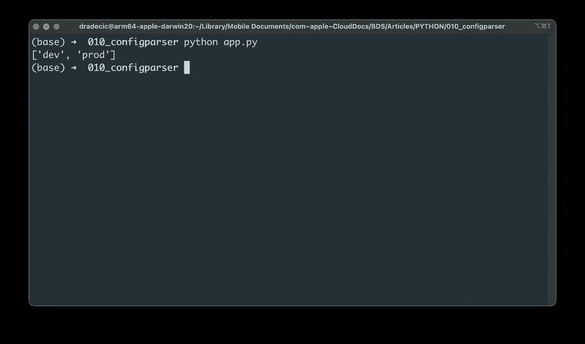
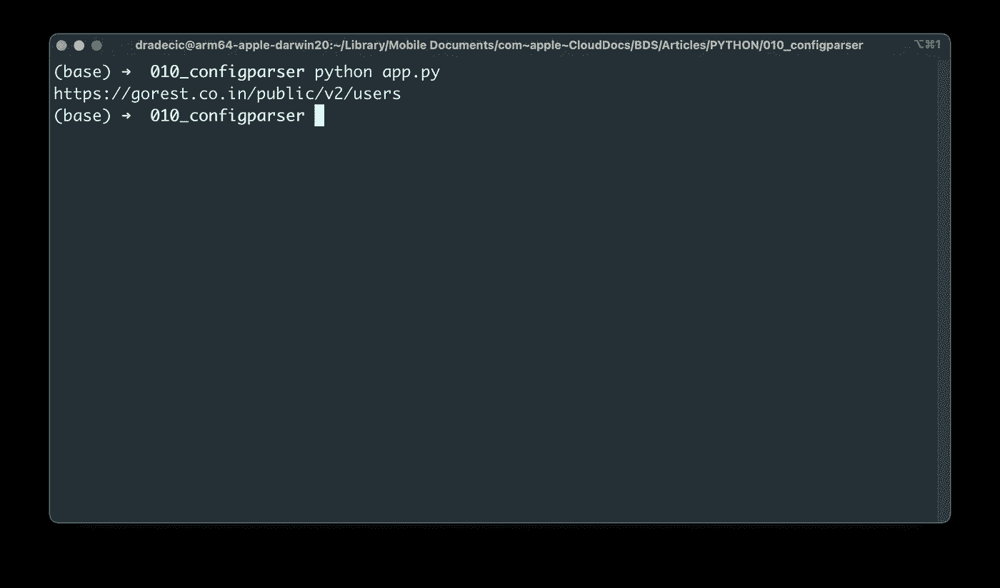
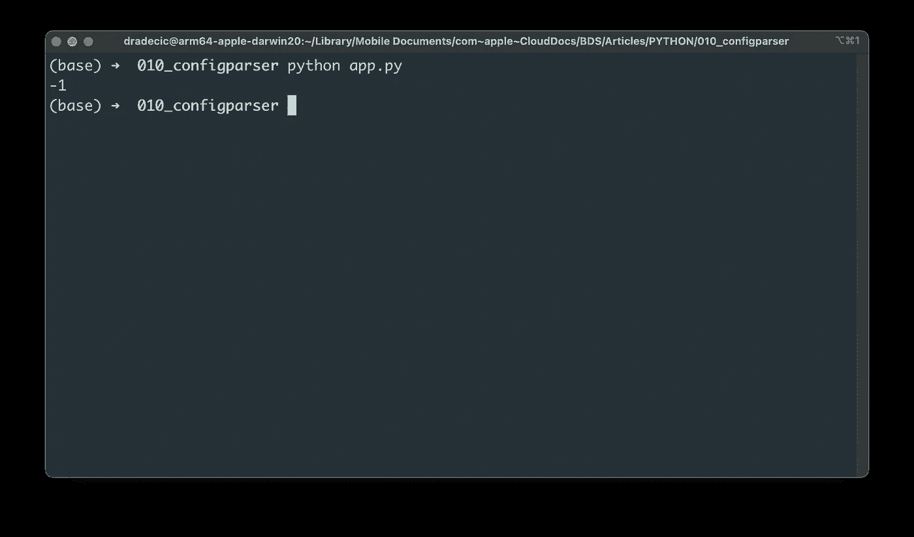
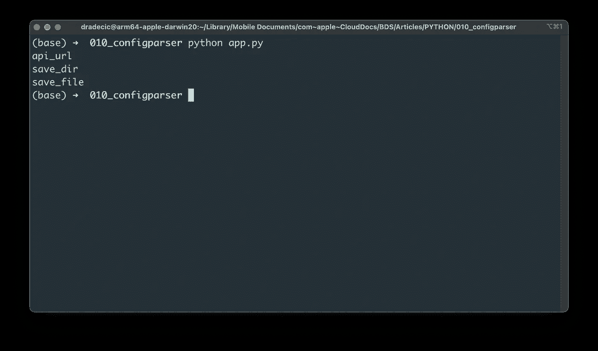
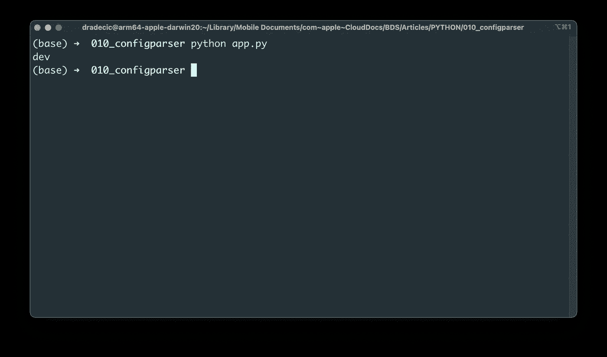
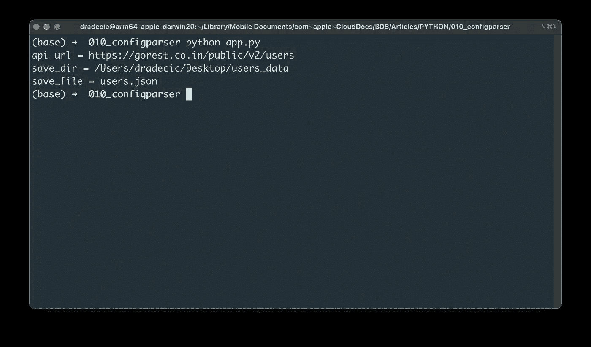
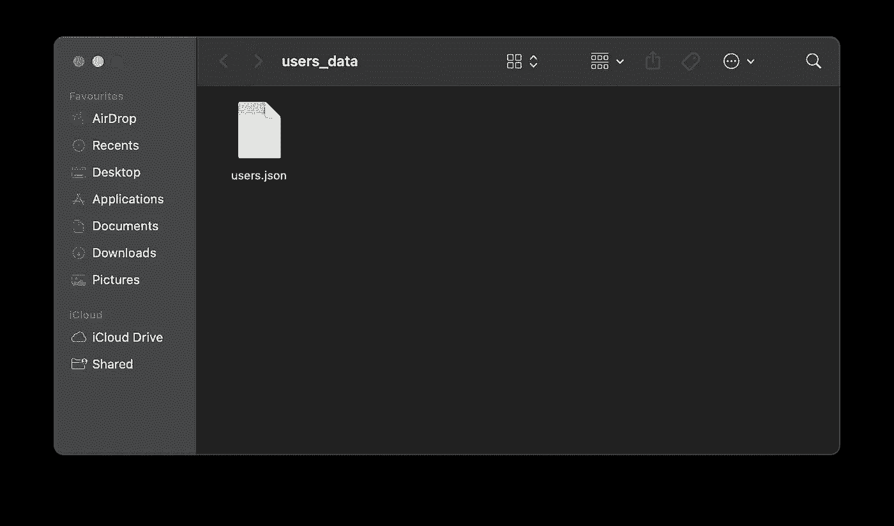

# 停止在 Python 应用程序中硬编码值-改为使用 ConfigParser

> 原文：<https://towardsdatascience.com/stop-hardcoding-values-in-python-apps-use-configparser-instead-58998fe979b>

## 硬编码的值是一个糟糕的想法。使用 configparser 读取。ini 配置文件


照片由 [Florian Olivo](https://unsplash.com/@florianolv?utm_source=medium&utm_medium=referral) 在 [Unsplash](https://unsplash.com?utm_source=medium&utm_medium=referral) 上拍摄

在 Python 应用程序中硬编码配置值是一件有趣的游戏，直到出现问题。没有人喜欢仅仅因为一个小的 API 端点 URL 变化而在数百个文件中搜索和替换值。幸运的是，有一种方法可以解决这个问题，那就是在一个单独的文件中编写应用程序配置。

今天你将学习如何在 Python 中使用`.ini`文件。我发现它们比 [JSON](https://betterdatascience.com/python-json-configuration-file/) 或 [YAML](https://betterdatascience.com/python-yaml-configuration-files/) 提供了更多的灵活性，但是比基于 Python 的配置文件稍差一些。为什么？首先是条件逻辑。

接下来，您将看到如何安装和使用带有 Python 中的`.ini`配置文件的`configparser` Python 库。

# 如何安装 ConfigParser Python 库

您将需要`configparser`模块来处理`.ini`配置文件。Python 没有附带它，所以您必须安装它。根据您使用的是 Pip 还是 Anaconda，安装命令会有所不同。以下是两者的安装命令:

Pip:

```
pip install configparser
```

蟒蛇:

```
conda install -c conda-forge -y configparser
```

这就是我们开始使用 Python 中的`.ini`文件所需要的一切。

# 如何阅读？带有 ConfigParser 的 ini 配置文件

我创建了一个包含两个文件的新文件夹:

*   `app.py` -包含今天的 Python 代码。
*   `config.ini` -包含我们不想在 Python 脚本中硬编码的配置数据。

至于`.ini`文件的内容，最好组织成段。下面你会看到两个部分有相同的键和不同的值。目标是在不同的环境中使用不同的文件保存位置。例如，在开发环境中，文件将保存到桌面，而在生产环境中，同一文件将保存在临时目录中:

```
[dev]
api_url = https://gorest.co.in/public/v2/users
save_dir = /Users/dradecic/Desktop/users_data
save_file = users.json[prod]
api_url = https://gorest.co.in/public/v2/users
save_dir = /tmp/users_data
save_file = users.json
```

**但是如何用 Python 读取这个文件呢？**`configparser`模块让这变得异常简单。只需创建一个`ConfigParser`类的新实例并读取`.ini`文件:

```
import configparser config = configparser.ConfigParser()
config.read("config.ini")
```

我们现在将尝试使用不同的方法来访问部分或单独的键。

例如，下面的代码片段向您展示了如何打印一个`config.ini`文件的所有部分:

```
print(config.sections())
```



图 1 —配置文件部分(作者提供的图片)

如果您想要访问单个元素，请记住首先访问节。Python 的常规字典符号可以:

```
print(config["dev"]["api_url"])
```



图 2 —访问单个配置元素(作者图片)

您也可以使用`get()`方法来访问单独的键:

```
print(config.get("dev", "api_url"))
```


图 3 —访问单个配置元素(2)(作者图片)

如果您对该键不存在有任何疑问，或者您想要格外小心，请在调用`get()`时指定`fallback`参数:

```
print(config.get("dev", "not_exist", fallback=-1))
```



图 4 —访问不存在的元素(作者图片)

您还可以迭代整个部分并访问其键和值:

```
for key in config["dev"]:
    print(key)
```



图 5 —在单个部分打印所有密钥(图片由作者提供)

但是现在有趣的部分来了。我们已经将`config.ini`文件分成了两个部分——dev 和 prod。默认情况下，这没有现实意义。我们能做的就是检查 Python 运行在哪个 OS 上。例如，如果代码在 macOS 上运行，我们可以假设它是一个开发环境:

```
import platformenv = "dev" if platform.system().lower() == "darwin" else "prod"
print(env)
```



图 6 —动态访问配置节(作者图片)

我们现在可以使用`env`变量来访问正确部分中的键和值。我在 Mac 上运行代码，所以打印出了`dev`部分的内容:

```
import platformenv = "dev" if platform.system().lower() == "darwin" else "prod"
for key in config[env]:
    print(f"{key} = {config[env][key]}")
```



图 7 —动态访问配置节(2)(作者图片)

这是在 Python 中处理`ini`文件的基础。接下来，您将看到在连接到远程 API 时如何使用这种类型的配置文件。

# 如何在 Python 应用程序中使用 ConfigParser 模块

我们现在将制作一个小的 Python 脚本，它连接到一个远程的 REST API 并下载 JSON 格式的数据。我们在`config.ini`文件中已经有了 URL 和路径。创建一个新的 Python 脚本，你就可以开始了。

下面的代码片段向 API 端点发出 GET 请求，并将响应保存在本地。如果目录结构不存在，它还会创建目录结构:

```
import json
import platform
import pathlib
import configparser
import requestsenv = "dev" if platform.system().lower() == "darwin" else "prod"
config = configparser.ConfigParser()
config.read("config.ini") def get_users() -> dict:
    r = requests.get(config[env]["api_url"])
    return r.text def save_users(users: dict) -> None:
    path = pathlib.Path(config[env]["save_dir"])
    if not path.exists():
        path.mkdir() with open(f"{config[env]['save_dir']}/{config[env]['save_file']}", "w") as f:
        json.dump(users, f) if __name__ == "__main__":
    users = get_users()
    save_users(users=users)
```

下面你会看到`users_data`目录的内容:



图 8 —保存的 JSON 文件(作者图片)

这就是如何将`ini`配置文件集成到 Python 项目中的方法。接下来让我们做一个简短的回顾。

# 总结。Python 中带有 ConfigParser 的 ini 配置文件

在 Python 应用程序中硬编码值总是一个糟糕的主意。在一个文件中修改几个东西很容易，但是想象一下你有上百个这样的文件。你肯定会错过一些地方，让你自己和你的同事头疼。

今天你已经学习了如何在 Python 中使用`ini`配置文件。整个设置非常简单，但它不是万能的解决方案。例如，你不能在`.ini`文件中使用编程逻辑。通过使用 Python 文件进行配置，这个缺点很容易解决。如果你想了解更多，请继续关注。

*喜欢这篇文章吗？成为* [*中等会员*](https://medium.com/@radecicdario/membership) *继续无限制学习。如果你使用下面的链接，我会收到你的一部分会员费，不需要你额外付费。*

[](https://medium.com/@radecicdario/membership) [## 通过我的推荐链接加入 Medium-Dario rade ci

### 作为一个媒体会员，你的会员费的一部分会给你阅读的作家，你可以完全接触到每一个故事…

medium.com](https://medium.com/@radecicdario/membership) 

## 推荐阅读

*   [学习数据科学先决条件(数学、统计和编程)的 5 本最佳书籍](https://betterdatascience.com/best-data-science-prerequisite-books/)
*   [2022 年学习数据科学的前 5 本书](https://betterdatascience.com/top-books-to-learn-data-science/)
*   [Python 中的 JSON 配置文件](https://betterdatascience.com/python-json-configuration-file/)

## 保持联系

*   雇用我作为一名技术作家
*   订阅 [YouTube](https://www.youtube.com/c/BetterDataScience)
*   在 [LinkedIn](https://www.linkedin.com/in/darioradecic/) 上连接

*原载于 2022 年 4 月 19 日*[*https://betterdatascience.com*](https://betterdatascience.com/python-configparser/)*。*