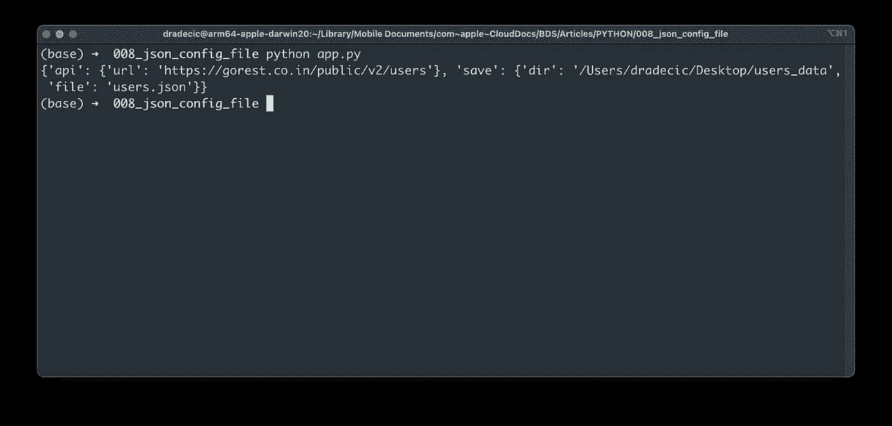
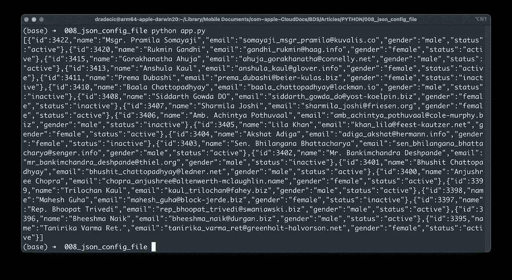
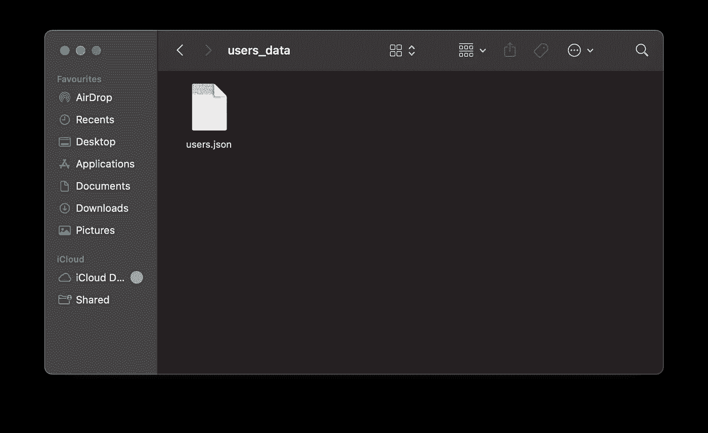

# 停止在 Python 应用程序中硬编码值-改为使用 JSON 配置文件

> 原文：<https://towardsdatascience.com/stop-hardcoding-values-in-python-apps-use-json-configuration-files-instead-cce8f15f647a>

## 硬编码 Python 应用程序配置从来都不是一个好主意。请尝试这种替代方法


[西格蒙德](https://unsplash.com/@sigmund?utm_source=medium&utm_medium=referral)在 [Unsplash](https://unsplash.com?utm_source=medium&utm_medium=referral) 上拍照

应用程序配置更改。后端数据库可以迁移，也可以完全改变。在这种情况下，您的 Python 应用程序会发生什么变化？嗯，它坏了。您必须更新多个 Python 文件中的值，才能让它再次工作。

配置文件提供了一个简单的修复方法。Python 中有多种处理配置文件的方式，JSON 就是其中之一。它可能不是最好的，至少与`ini`和`yaml`文件相比不是。尽管如此，这仍然是一个可行的方法，很容易建立，你今天将了解它的全部内容。

不想看书？请观看我的视频:

# 如何为 Python 应用程序编写 JSON 配置文件

我创建了一个包含两个文件的新文件夹:

*   `app.py` -包含今天文章的 Python 代码。
*   `config.json` -包含我们不想用 Python 硬编码的配置数据。

我们今天将与远程 [REST API](https://gorest.co.in/) 进行通信，因此对于`config.json`来说，包含 API 端点和保存 API 响应的本地路径是有意义的:

```
{
    "api": {
        "url": "https://gorest.co.in/public/v2/users"
    },
    "save": {
        "dir": "/Users/dradecic/Desktop/users_data",
        "file": "users.json"
    }
}
```

只要格式正确，你可以在`config.json`中放入任何东西。从一个对象开始，声明几个包含值对象的键。

是的，就是这么简单。接下来让我们看看如何用 Python 加载这个 JSON 配置文件。

# 如何在 Python 应用程序中使用 JSON 配置文件

用 Python 读取 JSON 文件最好使用 Python 的上下文管理器语法。要将 JSON 文件的内容解析到 Python 字典，使用`json.load()`方法:

```
import json
import pathlib
import requests

with open("config.json", "r") as f:
    config = json.load(f)

if __name__ == "__main__":
    print(config)
```

整个配置文件现已加载到内存中。我们可以通过运行`app.py`来验证它:



图 1-打印的 Python JSON 配置文件(图片由作者提供)

变量`config`现在是一个普通的 Python 字典对象。您可以用括号符号或者用`get()`方法来访问它的元素。我们今天将使用 prior，但这只是个人偏好。

我们现在将向 API 发出 GET 请求，并提供配置文件中的 URL 作为参数:

```
import json
import pathlib
import requests

with open("config.json", "r") as f:
    config = json.load(f)

def get_users() -> dict:
    r = requests.get(config["api"]["url"])
    return r.text

if __name__ == "__main__":
    print(get_users())
```

该函数返回响应的内容，在本例中是用户:



图 2 —从 REST API 获取的用户(作者图片)

我们迷你数据管道的最后一部分是在本地保存用户。我们在配置文件中已经有了目录名和文件名——唯一剩下的就是在 Python 中使用它们。

如果目录不存在，Python 的`pathlib`模块首先创建目录。之后，我们再次使用上下文管理器语法将用户转储到一个 JSON 文件:

```
import json
import pathlib
import requests

with open("config.json", "r") as f:
    config = json.load(f)

def get_users() -> dict:
    r = requests.get(config["api"]["url"])
    return r.text

def save_users(users: dict) -> None:
    path = pathlib.Path(config["save"]["dir"])
    if not path.exists():
        path.mkdir()

    with open(f"{config['save']['dir']}/{config['save']['file']}", "w") as f:
        json.dump(users, f)

if __name__ == "__main__":
    users = get_users()
    save_users(users=users)
```

运行脚本后，您将看到`users.json`文件保存在本地先前指定的位置:



图 3 —保存的 JSON 文件(作者提供的图片)

# Python 中 JSON 配置文件的概要

硬编码值从来都不是一个好主意。当然，上面的例子非常简单，但是想象一下，您有数百个 Python 文件分布在多个文件夹中。手动更新 URL 和配置将是巨大的时间浪费。

今天，您已经学习了如何在 Python 应用程序中使用 JSON 配置文件。初始设置很容易，但也有一些缺点。例如，没有好的方法将注释放在 JSON 文件中。还有，不能用编程逻辑来确定变量值。所有这些都是缺点，将在以后的文章中解决，敬请关注。

## 推荐阅读

*   [学习数据科学先决条件(数学、统计和编程)的 5 本最佳书籍](https://betterdatascience.com/best-data-science-prerequisite-books/)
*   [2022 年学习数据科学的前 5 本书](https://betterdatascience.com/top-books-to-learn-data-science/)
*   [用 Python 打印列表的 7 种方法](https://betterdatascience.com/python-list-print/)

## 保持联系

*   雇用我作为一名技术作家
*   在 YouTube[上订阅](https://www.youtube.com/c/BetterDataScience)
*   在 [LinkedIn](https://www.linkedin.com/in/darioradecic/) 上连接

*原载于 2022 年 4 月 4 日 https://betterdatascience.com*[](https://betterdatascience.com/python-json-configuration-file/)**。**