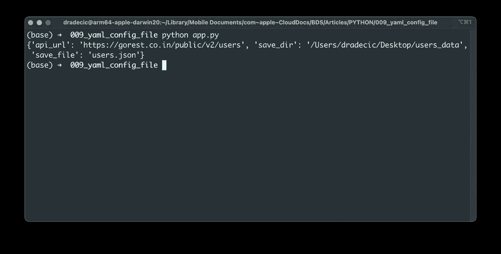
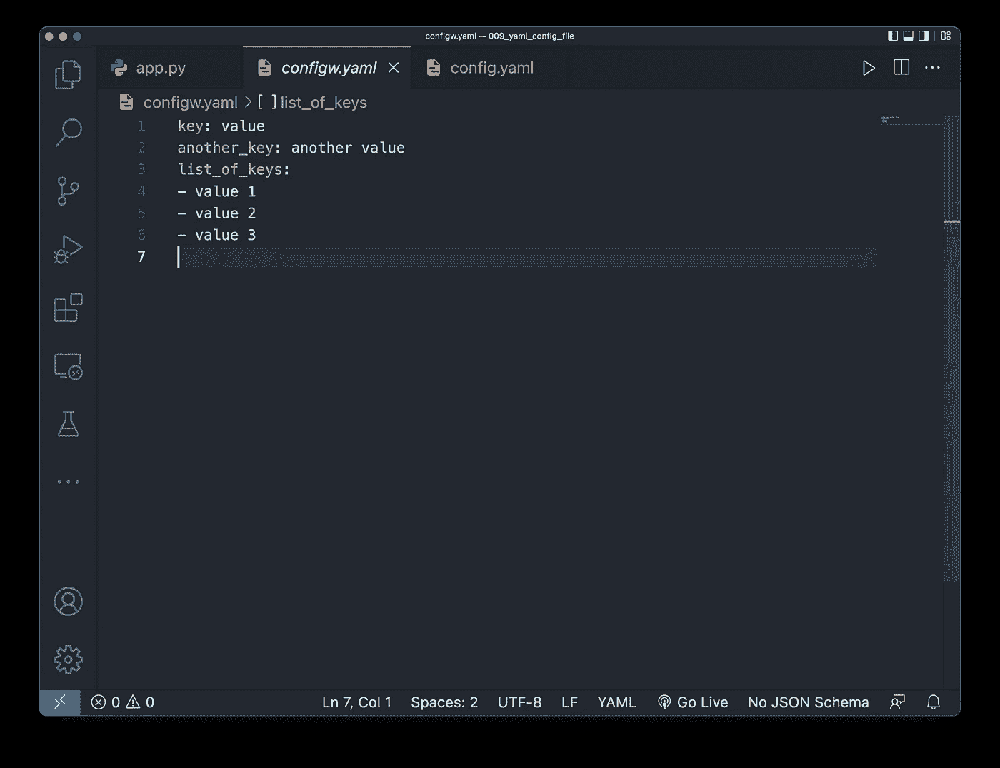
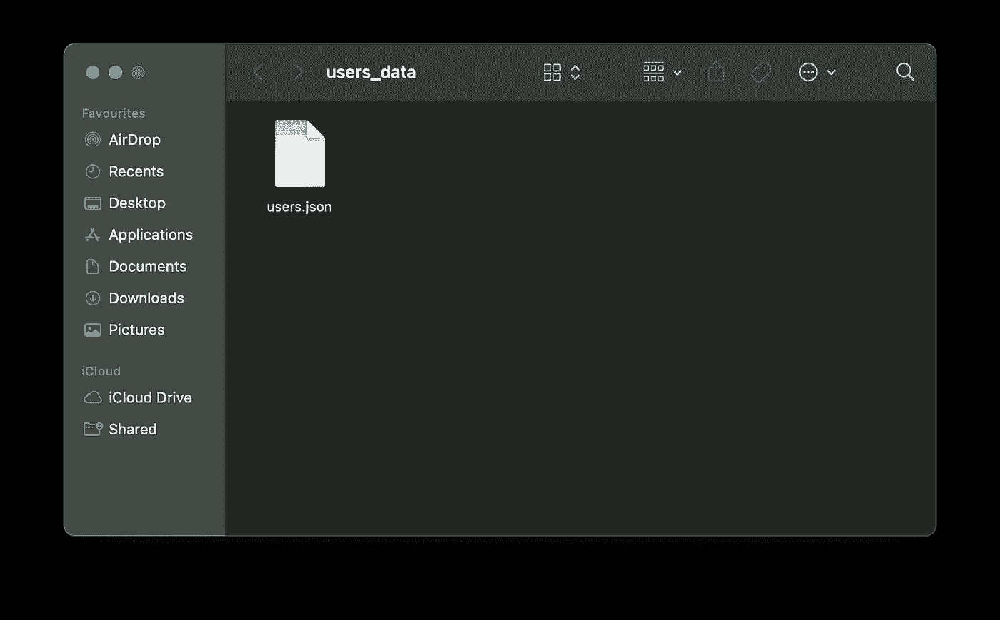

# 停止在 Python 应用程序中硬编码值-改用 YAML 配置文件

> 原文：<https://towardsdatascience.com/stop-hardcoding-values-in-python-apps-use-yaml-configuration-files-instead-4a30290a91dd>

## **硬编码配置是个糟糕的主意。考虑这个替代方案**


照片由 [Unsplash](https://unsplash.com?utm_source=medium&utm_medium=referral) 上的 [AltumCode](https://unsplash.com/@altumcode?utm_source=medium&utm_medium=referral) 拍摄

在数百个 Python 文件中搜索和替换值甚至没有您想象的那么有趣。拥有一个单一的中央配置文件使得调整 API URLs、数据库连接和其他内容变得更加容易。今天，您将了解如何使用 YAML 配置文件使您的 Python 应用程序更加健壮。

那么，*什么是 YAML* ？YAML 代表另一种标记语言。这是一种在编写配置文件时经常使用的数据序列化语言。它在许多编程语言中都很流行，因为它超级易读。其他文件格式，如 [JSON](https://betterdatascience.com/python-json-configuration-file/) ，也是人类可读的，但它们比不上 YAML 提供的简单性。

今天，您将学习如何用 Python 读写 YAML 文件，以及更多内容。但首先，让我们安装这个东西。

# 如何安装 YAML Python 库

YAML 没有附带 Python，所以我们必须安装它。根据您使用的是 Pip 还是 Anaconda，安装命令会有所不同。以下是两者的安装命令:

Pip:

```
pip install PyYAML
```

蟒蛇:

```
conda install -c conda-forge -y pyyaml
```

这就是我们开始使用 Python 处理 YAML 文件所需要的全部内容。

# 如何用 Python 读取 YAML 配置文件

我创建了一个包含两个文件的新文件夹:

*   `app.py` -包含今天的 Python 代码。
*   `config.yaml` -包含我们不想在 Python 脚本中硬编码的配置数据。

至于 YAML 文件的内容，可以把它们看作是键值对。我们今天将与远程 REST API 进行通信，因此配置文件将包含 API 端点和保存数据的本地路径:

```
api_url: https://gorest.co.in/public/v2/users
save_dir: /Users/dradecic/Desktop/users_data
save_file: users.json
```

配置文件比 JSON 可读性更好，因为我们去掉了所有的花括号和缩进。

**但是如何用 Python 读取这个文件呢？**用 Python 阅读 YAML 文件最好使用上下文管理器语法。`yaml.load()`方法将解析文件的内容，并将它们存储为 Python 字典对象:

```
import yaml with open("config.yaml", "r") as f:
    config = yaml.load(f, Loader=yaml.FullLoader)print(config)
```

您可以从 shell 中运行上面的代码—下面是您将看到的内容:



图 1 —读取 Python 中的 YAML 配置文件(图片由作者提供)

配置存储为键值对，这意味着访问值将非常容易。在我们这样做之前，让我们也探索一下如何从 Python 写 YAML 文件。

# 如何在 Python 中保存 YAML 配置文件

如果要从 Python 保存 YAML 配置文件，请用三重引号将配置数据括起来。下面的代码向您展示了如何存储两个常规的键-值对和另一个以列表作为值的键:

```
import yaml yml_config = """key: value
another_key: another value
list_of_keys:
- value 1
- value 2
- value 3
"""with open("configw.yaml", "w") as f:
    f.write(yml_config)
```

相应的 YAML 文件如下所示:



图 2 —用 Python 编写 YAML 配置文件(图片由作者提供)

从这里开始，按照上一节中的描述阅读它。

# 如何在 Python 应用程序中使用 YAML 配置文件

我们现在将制作一个小的 Python 脚本，它连接到一个远程 [REST API](https://gorest.co.in/) 并下载 JSON 格式的数据。我们在`config.yaml`文件中已经有了 URL 和路径——只要确保更新路径以匹配您的操作系统。

下面的代码片段向 API 端点发出 GET 请求，并将响应保存在本地。如果目录结构不存在，它还会创建目录结构:

```
import json
import yaml
import pathlib
import requests with open("config.yaml", "r") as f:
    config = yaml.load(f, Loader=yaml.FullLoader) def get_users() -> dict:
    r = requests.get(config["api_url"])
    return r.text def save_users(users: dict) -> None:
    path = pathlib.Path(config["save_dir"])
    if not path.exists():
        path.mkdir() with open(f"{config['save_dir']}/{config['save_file']}", "w") as f:
        json.dump(users, f) if __name__ == "__main__":
    users = get_users()
    save_users(users=users)
```

下面你会看到`users_data`目录的内容:



图 3 —保存的 JSON 文件(作者提供的图片)

这就是如何将 YAML 配置文件集成到 Python 项目中的方法。接下来让我们做一个简短的回顾。

# Python 中的 YAML 配置文件概要

硬编码值从来都不是一个好主意。当然，在一个 Python 脚本中修改几个东西是很容易的，但是想象一下你有数百个这样的脚本——这很容易变成一场噩梦，你几乎肯定会错过一些地方。

今天，您已经学习了如何在 Python 中使用 YAML 配置文件。整个设置非常简单，但它不是万能的解决方案。例如，你不能在 YAML 文件中使用编程逻辑。唯一的解决方法是在 Python 脚本中包含生成 YAML 文件的逻辑，但这并不方便。

通过使用 Python 文件进行配置，这个缺点很容易解决。如果你想了解更多，请继续关注。

*喜欢这篇文章吗？成为* [*中等会员*](https://medium.com/@radecicdario/membership) *继续无限制学习。如果你使用下面的链接，我会收到你的一部分会员费，不需要你额外付费。*

<https://medium.com/@radecicdario/membership>  

## 推荐阅读

*   [学习数据科学先决条件(数学、统计和编程)的 5 本最佳书籍](https://betterdatascience.com/best-data-science-prerequisite-books/)
*   [2022 年学习数据科学的前 5 本书](https://betterdatascience.com/top-books-to-learn-data-science/)
*   [Python 中的 JSON 配置文件](https://betterdatascience.com/python-json-configuration-file/)

## 保持联系

*   雇用我作为一名[技术作家](https://betterdatascience.com/contact/)
*   订阅 [YouTube](https://www.youtube.com/c/BetterDataScience)
*   在 [LinkedIn](https://www.linkedin.com/in/darioradecic/) 上连接

*原载于 2022 年 4 月 11 日*[*https://betterdatascience.com*](https://betterdatascience.com/python-yaml-configuration-files/)*。*