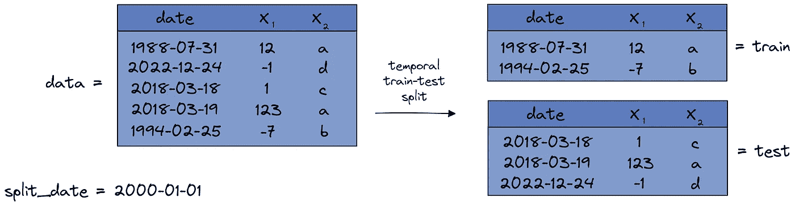
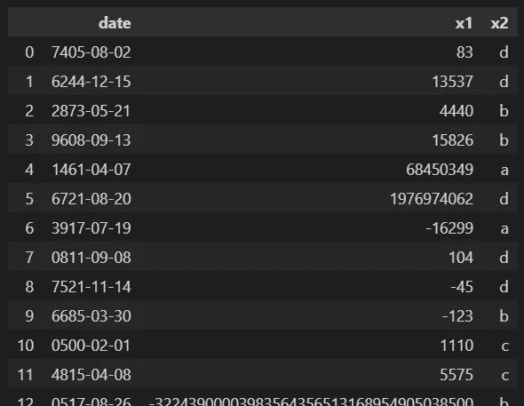
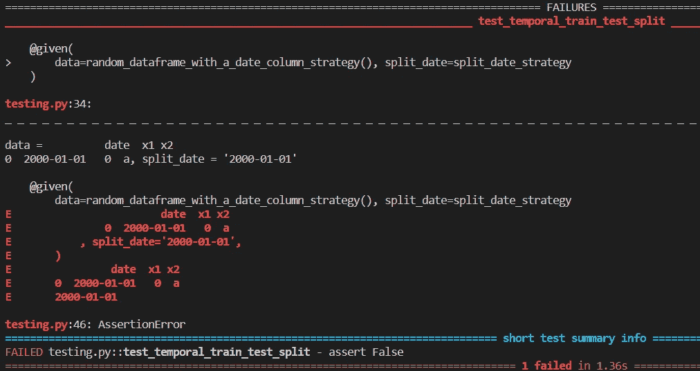
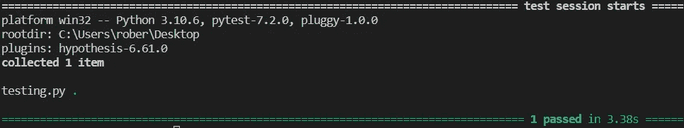

# 停止硬编码你的单元测试

> 原文：<https://towardsdatascience.com/stop-hardcoding-your-unit-tests-e6643dfd254b>

## [单元测试](https://medium.com/tag/unit-testing)

## 使用假设在 Python 中进行基于属性的测试指南


照片由[乔纳森派](https://unsplash.com/@r3dmax?utm_source=medium&utm_medium=referral)在 [Unsplash](https://unsplash.com?utm_source=medium&utm_medium=referral) 上拍摄

数据科学家的工作有很多方面:他们必须理解业务问题，知道他们的算法和统计数据，并编写记录良好和经过测试的代码，等等。这是一项艰巨的任务，考虑到你有限的时间，你经常要决定优先做什么。

从我的经验来看，编码部分通常会被忽略一点——代码在一些笔记本中被原型化，然后在某个时候，它运行*足够好*，就是这样。这也发生在我身上。我甚至能理解这一点:记录东西一点也不好玩，但是没有它，没有人(包括你自己)能理解你的代码，它可能会在将来被重写，即使你写了有史以来最好的代码。所以，即使代码文档不是本文的重点，仍然要用**文档化你的代码**！我现在比较感兴趣的是**代码测试**位。

# 代码测试

您应该始终测试您的代码，以获得信心，确信它确实做了您所期望的事情。

> 没有适当的测试，您的代码可能会做错事情，并且您的分析会给出误导性的结果。

那么，如何测试你的代码呢？很有可能你已经用 [**unittest**](https://docs.python.org/3/library/unittest.html) 或者 [**pytest**](https://docs.pytest.org/) 写过一些基本的测试。即使没有，也请继续读下去，因为我将使用一个小例子来解释它是如何工作的。然后，我们可以将这种传统的测试方法(基于实例的测试方法)与基于属性的测试方法进行比较，这是本文的重点。

作为一个运行示例，让我们使用一个**时间训练测试分割**的实现。它应该做到以下几点:鉴于…

*   熊猫数据帧`data`包含一个名为*日期*的列
*   一个字符串变量`split_date`

输出两个熊猫数据帧，

*   包含部分`data`的**列车**数据帧，其中*日期*列中的值在 T1 之前
*   **一个**测试**数据帧，包含`data`的部分，其中*日期*列中的值在 T3 之后**到来。****

****

**图片由作者提供。**

**很简单，对吧？现在，在测试该函数之前，我们必须首先实现它:**

```
def temporal_train_test_split(data, split_date):
    train = data.query("date < @split_date")
    test = data.query("date > @split_date")

    return train, test
```

> *****注:*** *代码中有错误，但我们姑且假装忽略了。***

## **基于实例的测试**

**为了测试代码，您通常会硬编码一些输入数据，对其应用函数，并用硬编码的预期输出来检查它。您可以像这样测试上图中的示例:**

```
import pandas as pd

#function we want to test
def temporal_train_test_split(data, split_date):
    train = data.query("date < @split_date")
    test = data.query("date > @split_date")

    return train, test

# testing function
def test_temporal_train_test_split():
    data = pd.DataFrame(
        {
            "date": [
                "1988-07-31",
                "2022-12-24",
                "2018-03-18",
                "2018-03-19",
                "1994-02-25",
            ],
            "x1": [12, -1, 1, 123, -7],
            "x2": ["a", "d", "c", "a", "b"],
        }
    )

    split_date = "2000-01-01"

    expected_output_train = pd.DataFrame(
        {
            "date": ["1988-07-31", "1994-02-25"],
            "x1": [12, -7],
            "x2": ["a", "b"]
        },
        index=[0, 4],
    )

    expected_output_test = pd.DataFrame(
        {
            "date": ["2022-12-24", "2018-03-18", "2018-03-19"],
            "x1": [-1, 1, 123],
            "x2": ["d", "c", "a"],
        },
        index=[1, 2, 3],
    )

    train, test = temporal_train_test_split(data, split_date)

    assert train.equals(expected_output_train)
    assert test.equals(expected_output_test)
```

**通过`pip install pytest`安装 pytest 后，将上述代码保存在`test_temporal_train_test_split.py`等文件中，并通过`pytest test_temporal_train_test_split.py`执行。pytest 随后将运行测试，并报告测试成功。很好，所以我们可以对我们的代码按预期工作更有信心了！**

**但是，您可能已经注意到，这个测试并没有涵盖这个函数可能接收的各种输入。这只是一个偶然发生的情况。或许你还会错过一些**边缘情况**，在那里你的代码可能会中断。**

**你能做的下一件最好的事情是定义更多的输入/输出对来增加一点覆盖范围，但是这真的没有意思，因为你必须硬编码许多数据帧。因为基于实例的测试是如此乏味，如果你查看测试文件，通常你最多只能看到少数硬编码的例子。**

**不要误解我的意思，即使像这样的小测试也比没有测试要好，但是我们仍然可以使用基于属性的测试做得更好。**

## **基于属性的测试**

**如果你想做基于属性的测试，首先你必须花几分钟时间想想你想从输出中看到什么属性。有时这可能很难做到，但在我们的情况下，这很容易。输出`train`和`test`应具有以下属性:**

1.  **`train`中的*日期*栏应始终小于或等于`split_date`，并且`test`中的*日期*栏应始终大于`split_date`。**
2.  **如果您连接`train`和`test`，您应该接收回输入数据帧，即没有行或列被添加或丢失，也没有单元格被更改。**

**这实际上是时间训练测试分割的本质，定义属性，我们可以直接测试它。**

```
def test_temporal_train_test_split_property():
    data = pd.DataFrame(
        {
            "date": [
                "1988-07-31",
                "2022-12-24",
                "2018-03-18",
                "2018-03-19",
                "1994-02-25",
            ],
            "x1": [12, -1, 1, 123, -7],
            "x2": ["a", "d", "c", "a", "b"],
        }
    )

    split_date = "2000-01-01"

    train, test = temporal_train_test_split(data, split_date)
    concatenated = (
        pd.concat([train, test])
        .sort_values(["date", "x1", "x2"]) # see note below
        .reset_index(drop=True)
    )
    sorted_input = data.sort_values(["date", "x1", "x2"]).reset_index(drop=True) # see note below

    assert (train["date"] <= split_date).all() # 1st property
    assert (test["date"] > split_date).all()   # 1st property
    assert concatenated.equals(sorted_input)   # 2nd property
```

> *****注意:*** *你必须对数据帧进行排序，因为将一个数据帧分割成训练和测试，再将它们放在一起可能会改变行的顺序。但即使在这种情况下，检查应该通过，顺序并不重要。***

**这已经好得多了，因为你不再需要硬编码输出。您只需要定义一些输入数据，让属性来处理其余的事情。这甚至为另一个诡计打开了大门:**

> **生成一堆随机输入，然后运行属性检查，这不是很好吗？**

**这个想法很简单，我打赌你可以用一些自定义代码来实现。然而，我更愿意向您展示一个整洁的库，它可以帮助您实现这个想法，即使您将会看到在它的顶部有一个樱桃！它被称为 [**假设**](https://hypothesis.readthedocs.io/) ，我将在文章的其余部分向您展示它是如何工作的。**

# **基于假设的类固醇性质检验**

**首先，用一个简单的`pip install hypothesis`安装这个库。在我们写测试之前，让我们先玩一会儿。假设有一点很棒，那就是产生随机数据。首先，让我们导入库:**

```
import hypothesis.strategies as st
```

## **入门指南**

**现在让我们做一个非常简单的任务:**“生成随机整数！”**。**

```
integer_strategy = st.integers()

for _ in range(5):
    print(integer_strategy.example())

# Example output:
# 26239
# -32170
# 8226
# 12448
# -25828
```

**这会给你一些随机的整数。好吧，但是 [**numpy**](https://numpy.org/) 也可以这么做，何必呢？看看另一个例子:**“生成随机整数列表！”**。**

```
integer_list_strategy = st.lists(st.integers())

for _ in range(5):
    print(integer_list_strategy.example())

# Example output: 
# [-14, -2189, 9898, 116]
# [115252802955829576656830209704323089026, 12850, -22, -23389, -37044854417799513209994526228023296414, 9033, -25431, 111, 1650017586, 2100275240795033860, 14027, 9549, 119, 32276, 3287]
# [867485840, -16288]
# [867485840, -16288]
# [23623, 18045420794467201802863702411254425247, 11413941429584508497211673000716218542, -35326783386759048949361175218368769135, 25, 18663, 85, 29311, -54]
```

**这个更有意思一点。不需要太多的努力，我们就可以生成一些随机列表，用来测试排序算法。**

**我们可以结合更多的这些*策略*来做更疯狂的事情，比如:**“生成包含随机整数和布尔的元组列表！”**。**

```
strategy = st.lists(st.tuples(st.integers(), st.booleans()))

for _ in range(5):
    print(strategy.example())

# Example output:
# [(-28942, True), (39, True), (2034980965, True), (-633849778, False), (-111, False), (-25, True), (15592, True), (-6976, False), (-29086, True), (20529, False), (-28691, True), (-6358763519719057102, False)]
# [(-83, False), (0, True), (16, False), (-21, True), (32707, True), (-45239080, True), (115, False), (567947076, True), (-7363, False)]
# [(-100, False), (-14515, True), (32539, False), (-22134, True), (-1419424594, False), (-21631, False)]
# [(3401224866052712356, True), (-663846088058567152, True), (26848, False), (71, True), (-4004, True), (-84, True), (5403, True), (31368, False)]
# [(21237, False), (-29568, True), (978088832, False), (-1095376597, True)]
```

**天空是无限的！您可以将关键字传递给所有的策略，例如，限制整数的大小或列表长度。**

```
strategy = st.lists(
    st.tuples(
        st.integers(min_value=0, max_value=5),
        st.booleans()
        ),
    min_size=2, max_size=4
    )

for _ in range(5):
    print(strategy.example())

# Example output:
# [(0, True), (0, True), (0, True), (0, True)]
# [(5, False), (3, True), (2, True), (5, True)]
# [(2, True), (4, True), (1, True), (2, False)]
# [(2, False), (2, True), (2, True), (2, True)]
# [(1, False), (5, False), (2, True)]
```

**还有更多的策略，我鼓励你阅读假设文档来了解更多的信息，但是现在让我们专注于我们的用例。**

## **用假设测试我们的代码**

**提醒一下，我们的时间训练测试分割有两个输入:**

*   **熊猫数据帧`data`包含一个名为*的日期*的列**
*   **一个字符串变量`split_date`**

**让我们首先处理生成随机日期，因为这更容易。你可能已经猜到你可以这样做:**

```
date_strategy = st.dates()

for _ in range(5):
    print(date_strategy.example())

# Example output:
# 1479-03-03
# 3285-02-06
# 0715-06-28
# 6354-02-18
# 9276-08-08
```

**这种策略会产生 Python 日期对象，但是因为我们希望我们的函数以**字符串**的形式获取日期，所以我们可以通过**

```
st.dates().map(lambda d: d.strftime("%Y-%m-%d"))
```

**数据框是一种更复杂的数据类型，但是假设让我们在这里有所了解。它提供了几种定义数据框的方法，但是我将使用`composite`装饰器向您展示最通用的一种。**

**以下代码片段**

1.  **创建随机数量的行，然后**
2.  **创建一定数量的包含日期、整数和字母 a、b、c、d 之一的行，然后**
3.  **用它制作一个熊猫数据框并输出。**

```
@st.composite
def random_dataframe_with_a_date_column_strategy(draw):
    n_rows = draw(st.integers(min_value=0, max_value=100))

    rows = [
        (
            draw(st.dates().map(lambda d: d.strftime("%Y-%m-%d"))),
            draw(st.integers()),
            draw(st.sampled_from(list("abcd"))),
        )
        for _ in range(n_rows)
    ]
    data = pd.DataFrame(rows, columns=["date", "x1", "x2"])

    return data
```

**注意`draw`在那里的不同出现。你需要这样做，因为像`range`这样的函数需要合适的整数。与任何其他策略一样，您可以**

```
random_dataframe_with_a_date_column_strategy().example()
```

**现在来接收一个随机的例子。**

****

**图片由作者提供。**

**当然，你可以制作更通用的数据框。我们只是改变了这里的行数，但是您也可以**

*   **改变列数**
*   **改变数据类型**
*   **改变列名**

**除了别的以外。但我们先来了解一下这个更具体的策略。**

**太好了，我们现在可以生成随机输入数据了！唯一剩下的事情就是以适当的方式把它输入到我们的测试函数中。幸运的是，假设使这变得非常容易。只需创建另一个名为`test_temporal_train_test_split_hypothesis.py`的文件，然后粘贴以下内容:**

```
import pandas as pd
from hypothesis import given, note
import hypothesis.strategies as st

# Function to test
def temporal_train_test_split(data, split_date):
    train = data.query("date < @split_date")
    test = data.query("date > @split_date")

    return train, test

# Strategies
split_date_strategy = st.dates().map(lambda d: d.strftime("%Y-%m-%d"))

@st.composite
def random_dataframe_with_a_date_column_strategy(draw):
    n_rows = draw(st.integers(min_value=0, max_value=100))

    rows = [
        (
            draw(st.dates().map(lambda d: d.strftime("%Y-%m-%d"))),
            draw(st.integers()),
            draw(st.sampled_from(list("abcd"))),
        )
        for _ in range(n_rows)
    ]
    data = pd.DataFrame(rows, columns=["date", "x1", "x2"])

    return data

# The actual test
@given(
    data=random_dataframe_with_a_date_column_strategy(), split_date=split_date_strategy
)
def test_temporal_train_test_split(data, split_date):
    note(data) # basically a print function if a test fails
    note(split_date) # basically a print function if a test fails

    train, test = temporal_train_test_split(data, split_date)
    concatenated = (
        pd.concat([train, test])
        .sort_values(["date", "x1", "x2"])
        .reset_index(drop=True)
    )
    sorted_input = data.sort_values(["date", "x1", "x2"]).reset_index(drop=True)

    assert (train["date"] <= split_date).all()
    assert (test["date"] > split_date).all()
    assert concatenated.equals(sorted_input)
```

**您已经知道了关于这段代码的大部分内容。首先，我们定义想要测试的函数以及随机输入的策略。然后我们可以使用来自假设的`given`装饰器进行测试。已经这样了！我们可以让它再次运行**

```
pytest test_temporal_train_test_split_hypothesis.py
```

> **默认情况下，这将创建 100 个随机输入并检查属性。**

**您可能会看到类似这样的内容:**

****

**图片由作者提供。**

**哎呀，我们的函数仍然包含一个错误！假设很好地告诉我们哪些输入产生了错误，因为我们在代码中使用了`note(data)`和`note(split_date)`。**

## **缩小示例**

**另一个值得注意的事情是，这个例子很好，很短，所以我们可以直接猜测错误可能是什么。**这绝不是巧合。**每当 Hypothesis 发现一个破坏您的代码的例子——在我们的例子中可能是一个包含 98 行的数据帧——它试图简化这个例子，这样它**仍然破坏您的代码**，但是从某种意义上说**比**小。**

**这个过程被称为**收缩**，它让人类更容易找到错误的来源。缩水通常让人感觉很自然:**

*   **缩小数字意味着让它们更接近零**
*   **缩减列表意味着让它们更短**
*   **收缩字符串意味着让它们更短**
*   **…**

**所以，让我们用错误信息来思考一下哪里出错了！**

## **修复错误**

**我们很容易看到，破坏我们代码的例子有一个`split_date`等于`data`中的日期值，这看起来真的很可疑。在这种情况下，我们的代码可能不起作用。让我们再来看一看:**

```
def temporal_train_test_split(data, split_date):
    train = data.query("date < @split_date")
    test = data.query("date > @split_date")

    return train, test
```

**是的，有道理。我们使用 **<** 和 **>** ，但是等于`split_date`的日期会发生什么情况呢？他们只是在我们的版本中被删除了。😖我们可以用一个简单的**

```
def temporal_train_test_split(data, split_date):
    train = data.query("date <= @split_date") # fixed
    test = data.query("date > @split_date")

    return train, test
```

**如果我们让它再运行一次，现在测试就通过了，太棒了！**

****

**图片由作者提供。**

**同样，我想强调的是，即使看起来像是运行了一个测试，实际上**运行了 100 个测试**。**

## **更多功能**

**您也可以使用`setting`装饰器来更改这个数字，例如:**

```
from hypothesis import settings

@given(
    data=random_dataframe_with_a_date_column_strategy(), split_date=split_date_strategy
)
@settings(max_examples=200) # number of random examples
def test_temporal_train_test_split(data, split_date):
    [...]
```

**此外，有时你想确保一些对你来说非常重要的具体例子被覆盖，你不想让它碰运气。在这种情况下，您可以像这样使用`example`装饰器:**

```
from hypothesis import example

@given(
    data=random_dataframe_with_a_date_column_strategy(), split_date=split_date_strategy
)
@example(data=pd.DataFrame(None, columns=["date", "x1", "x2"]), split_date="9999-12-31") # this example is always covered
def test_temporal_train_test_split(data, split_date):
    [...]
```

**现在你知道了基于属性的假设测试的基本知识，你可以试着在你的项目中应用它了！**

# **结论**

**测试你的代码是一项单调乏味的任务，但是你仍然必须这样做来发现可能会破坏你的结果的错误。您可以通过提供输入/输出对(示例)来测试您的代码，但是人们倾向于最多只硬编码一小部分示例。这导致覆盖范围很小，您的代码可能仍然不能处理大部分输入，或者一些可能很重要的边缘情况。**

**基于属性的测试是增加覆盖率的一种便捷方式。它测试随机输入，假设库甚至可以为您提供破坏代码的简单示例，因此修复 bug 变得更加容易。缺点是你必须想出有意义的属性。有时候这很容易，就像我们的时态训练测试分割例子一样。对数字进行排序是基于属性的测试的另一个很好的用例。你只需要检查一下**

1.  **输出中的数字按升序排列**
2.  **没有数字被添加或删除。**

****🚀尝试实现您选择的排序算法，并使用基于属性的测试来测试它！****

> **复杂性类 NP 中的每个问题实际上都是基于属性的测试的良好候选，因为验证解决方案可以有效地完成。**

**但有时可能很难弥补好的属性。有时你也只找到一些，但不是所有的定义属性。在这种情况下，您仍然可以检查您能想到的所有属性，并像在传统的基于示例的测试中一样提供一些手动示例。**

> **没有什么能阻止你同时使用这两种方法！很多时候，这甚至是一件伟大的事情。**

**我希望你今天学到了新的、有趣的、有用的东西。感谢阅读！**

****作为最后一点，如果你****

1.  ****想支持我多写点机器学习和****
2.  ****无论如何都计划获得一个中等订阅，****

****为什么不做** [**通过这个环节**](https://dr-robert-kuebler.medium.com/membership) **？这将对我帮助很大！😊****

***说白了，给你的价格不变，但大约一半的订阅费直接归我。***

**非常感谢，如果你考虑支持我的话！**

> **如有任何问题，请在 [LinkedIn](https://www.linkedin.com/in/dr-robert-k%C3%BCbler-983859150/) 上给我写信！**