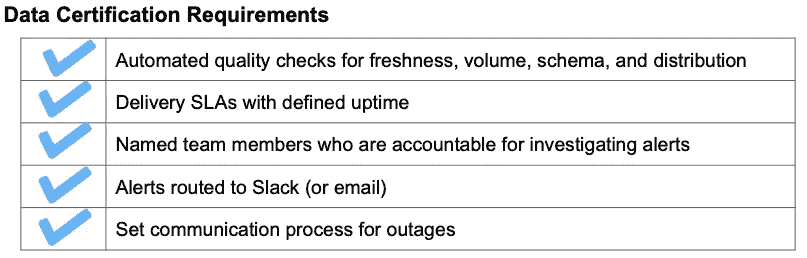
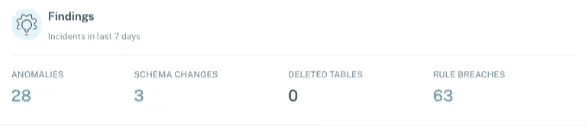
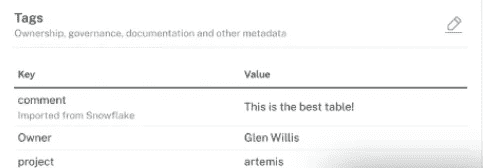
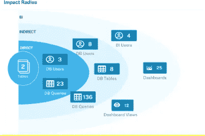
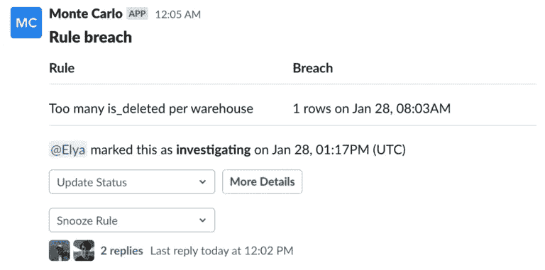

# 不要把你的数据工程师当成数据目录

> 原文：<https://towardsdatascience.com/stop-treating-your-data-engineer-like-a-data-catalog-14ed3eacf646>

## 意见

## 如何建立数据认证计划，让每个人都知道应该期待什么，应该信任什么数据。

图片由 Protasov AN on Shutterstock 提供，购买用于标准许可。

*数据信任始于通信，止于通信。这里展示了一流的数据团队如何主动认证表格，以批准其在整个组织中使用。*

跟我说:数据工程师不是数据目录。

你很难在他们的工作描述中找到“每周回复多条关于哪些表格适合用于该报告的信息”，但这种情况还是会发生。

数据分析师不是灵媒。然而，他们经常不得不凭直觉判断通过管道传输的数据是否可信。

随着数据团队被推得更快，在 [**数据网格**](https://www.montecarlodata.com/what-is-a-data-mesh-and-how-not-to-mesh-it-up/) 之间穿梭，并支持越来越多的自助式数据平台，这种错位已经出现。

*如果没有数据认证计划，数据团队通常不知道去哪里获取最佳数据。*图片由 Shutterstock 上的 Chokniti Khongchum 提供，购买后用于标准许可。

这相当于困扰知识工作者几十年的经典文档版本控制问题。从一个紧凑的平台开始演变成:

*   一百万人制作和分享临时幻灯片；
*   按摩这些幻灯片上的内容，直到它成为其原始意图的回声；和
*   创建标记为 [V6_Final_RealFinal](https://www.montecarlodata.com/how-to-solve-the-youre-using-that-table-problem/) 的副本。

同样的事情也发生在整个数据团队。每个人都在努力做正确的事情(例如，支持你的利益相关者，产生见解，传输更多数据，等等)。)，但大家也在快速行动。

> 有一天，你抬起头来，发现你有 6 个不同的模型，略有不同，但基本上做着同样的事情…没有人知道哪一个是最新的，甚至不知道该用哪个领域。

这造成了实际的下游操作问题，包括:

*   冗余“交通控制”的低效循环
*   降低[数据质量](https://www.montecarlodata.com/how-to-fix-your-data-quality-problem/)；
*   花费在解决分析师使用不当/有问题的数据所产生的问题上的时间；
*   整个组织的数据信任度较低；和
*   增加了[数据停机时间](https://www.montecarlodata.com/the-rise-of-data-downtime/)

当你不信任你的数据或者你的数据可靠性较低时，组织通常会在他们的预测中增加误差幅度。

正如 Peleton 的[最近停产](https://www.vox.com/the-goods/22895463/peloton-stock-price-bike-cost-production)所强调的，在疫情期间，当需求、供应链和整体商业环境的不确定性达到历史最高水平时，糟糕的预测可能会特别成问题。

## 更多的数据发现，更多的问题

我们[以前写过关于数据发现](https://www.montecarlodata.com/data-catalogs-are-dead-long-live-data-discovery/)的文章，这是一种实时了解分布式数据资产健康状况的新方法，也是解决方案的重要组成部分。

*数据发现提供跨不同领域的分布式实时数据洞察，同时遵守一套集中的治理标准。*图片由巴尔·摩西提供。

**数据发现**根据一组特定消费者如何接收、存储、聚合和使用数据，提供特定领域的动态数据了解。

与**数据目录**一样，治理标准和工具跨这些领域联合起来(允许更好的可访问性和互操作性)，但与数据目录不同，数据发现提供了对数据当前状态的实时了解，而不是其理想或“编目”状态。

当团队采用分布式治理方法时，这一点尤其有用，这种方法让不同的数据所有者对他们的数据产品负责，从而允许整个企业中精通数据的用户从这些产品中自助服务。

但是随着数据变得更容易访问，下游的涉众如何确定给定领域的数据团队已经服务、转换和批准了哪些数据集？

一个领域如何确定一组通用的数据质量标准、所有权和沟通过程在整个组织中得到维护？

我们已经看到一些拥有成熟数据团队的客户面临这些问题，并开始实施数据认证计划。

## 什么是数据认证？

数据认证是数据资产在满足双方就数据质量、可观察性、所有权/责任、问题解决和通信达成的[SLA](https://www.cio.com/article/274740/outsourcing-sla-definitions-and-solutions.html)或服务级别协议后，被批准在整个组织中使用的过程。

与数据质量、数据验证或数据验证的概念类似，关键流程上的数据认证层将人员、框架和技术与中心业务策略联系起来。

数据认证要求因业务需求、数据工程团队的能力和数据可用性而异，但通常包含以下特征:

*什么是数据认证？这是一家媒体公司用来认证数据集的一套标准。图片由蒙特卡洛提供。*

数据认证计划通过利用跨多个领域应用的一致方法来提高可扩展性。它们还通过在具有清晰通信线路的域之间促进更可信的信息交换来提高效率。

它是这样工作的。

# 实施数据认证计划的 6 个步骤

**第一步:建立你的数据观察能力**

实现[数据可观察性](https://www.montecarlodata.com/product/)——组织全面了解其系统中数据健康状况的能力——是数据认证流程中重要的第一步。

您不仅需要深入了解您当前的性能以设定基准，还需要一种系统的端到端方法来进行主动事件发现、警报和分类。

用于*的数据可观察性仪表板自动显示异常、模式更改、删除的表和违反规则的情况。图片由蒙特卡洛提供。*

如果管道中的任何东西破裂——它将会破裂——你将是第一个知道的人。这种领先优势，加上对数据生态系统的详细了解，将通过查明错误发生的位置来缩短检测和解决问题的时间。

了解哪些系统和数据集倾向于在下游产生最大或最频繁的问题，也有助于为编写有效的数据 SLA 的过程提供信息(步骤 4)。

此外，了解最重要的表或报告的上游依赖关系有助于数据团队了解哪些数据最值得关注。

底线是，应该密切监控表或数据集的异常(理想情况下，通过机器学习不断学习和发展)才能被认为是经过认证的。

**第二步:确定您的数据所有者**

每个经过认证的数据资产在其从接收到分析层的整个生命周期中都应该有一个负责方。

*作为数据认证计划的一部分，如何将所有者与其他标签一起分配给表格的示例。*图片由蒙特卡洛提供。

一些数据团队可能会选择实施 [RACI(负责、问责、咨询、知情)矩阵](https://www.montecarlodata.com/which-of-the-six-major-data-personas-are-you/)，其他数据团队可能会将其与预期的沟通程序和解决时间一起直接构建到特定的 SLA 中。

**第三步。了解什么是“好”数据**

通过询问您的业务利益相关者“谁、什么、何时、何地以及为什么”，您可以理解数据质量对他们意味着什么，以及哪些数据实际上是最重要的。

这将使您能够制定关键绩效指标，例如:

**新鲜度:**

*   数据将在每天早上 7:00 刷新(非常适合 CEO 或其他主要高管在早上 7:30 查看仪表板的情况)。
*   数据永远不会超过 X 小时。

**分布**:

*   X 列永远不会为空。
*   Y 列总是唯一的。
*   字段 X 将总是等于或大于字段 y。

**卷**:

*   表 X 的大小永远不会减少。

**模式:**

*   该表上不会删除任何字段。

**血统:**

*   填充表 X 的 100%的数据将具有映射的上游源和下游入口，并包括相关的元数据。

**数据停机时间(或可用性):**

*   [我们将数据停机时间](https://www.montecarlodata.com/data-quality-you-are-measuring-it-wrong/)定义为事故数量乘以(检测时间+解决时间)。数据宕机 SLA 的一个示例是，表 X 一年的宕机时间少于 Y 小时。
*   衡量数据宕机的每个组成部分的 SLA 更具可操作性。例如:我们将减少 X%的事故、X%的检测时间和 X%的解决时间。

**查询速度:**

*   我们在[local Optimistic 的朋友建议](https://locallyoptimistic.com/post/data-warehouse-sla-p2/):“平均查询运行时间是一个很好的起点，但是您可能需要创建一个更细微的指标(例如，X%的查询在< Y 秒内完成)。

**摄取(对保持外部合作伙伴的责任感很有帮助):**

*   数据将在每天早上 5 点之前从合作伙伴 y 处接收。

此过程还使您能够针对对业务最重要的内容配置精确的警报规则。

**第四步:为你最重要的数据集设定清晰的 SLA**

[为您的数据管道设定 SLA(服务水平协议)](https://www.montecarlodata.com/how-to-make-your-data-pipelines-more-reliable-with-slas/)是提高数据可靠性的重要一步，也是数据认证计划的关键。SLA 需要是具体的、可测量的和可实现的。

SLA 不仅描述了一致同意的服务标准，还定义了各方之间的关系。换句话说，它们概述了在正常操作期间以及出现问题时谁对什么负责。

Red Ventures 的高级数据科学家 Brandon Beidel 建议，有效的 SLA 是现实的。简单地说“任何时候都有可靠的数据”太模糊，没有用；相反，Brandon 建议，团队应该设置专注的 SLA。

> “好的 SLA 是具体而详细的。他们将描述为什么它对业务很重要，期望是什么，何时需要满足这些期望，如何满足它们，数据存储在哪里，以及谁会受到它的影响。”

Beidel 在他的 SLA 中包括了如果 SLA 没有得到满足，团队应该如何响应。

例如，“表 X 中的数据将在每天早上 7:00 刷新”将转换为“团队 Z 将确保表 X 中的数据将在每天早上 7:00 刷新”。在异常警报发出后的 2 小时内，团队将进行验证，与受影响的各方进行沟通，并开始分析问题的根本原因。在一个工作日内，将创建一个票证，并向更广泛的团队更新解决问题的进度。”

为了达到这种水平的特异性和组织性，团队应该尽早——并且经常——与利益相关者保持一致，以了解好的数据是什么样的。

这包括数据团队和企业内部。一个好的 SLA 需要了解业务如何运营以及用户如何使用数据的现实情况。

一种稍微不同的方法是区分“表 x 将在上午 7 点之前更新”的 SLA 和“我们将致力于在 99%的时间内满足此 SLA”的 SLO(服务级别目标)

无论你决定如何对待它，我都建议不要煮沸海洋。许多组织首先实施他们的数据认证计划，然后在第二波中清理旧资产。

*健壮的数据血统可以帮助数据团队理解哪些领域利用了哪些数据集。*图片由蒙特卡洛提供。

事实上，许多最好的数据团队将开始认证最关键的表和数据集:那些为业务增加最多价值、拥有最多查询活动、用户数量或依赖性的表和数据集。

一些公司还实施了不同级别的认证(青铜级、白银级、黄金级),以提供不同级别的服务和支持。

**第五步:发展你的沟通和事故管理流程**

向团队发送警报的位置和方式？如何在内部和外部传达后续步骤和进展？

虽然这看起来像是桌面上的赌注，但清晰透明的沟通对创造问责文化至关重要。

许多团队选择在 Slack、PagerDuty 或 Microsoft 团队中进行警报和事故分类讨论。这实现了快速协调，同时作为健康[事件管理工作流](https://www.montecarlodata.com/how-to-conduct-incident-management-on-your-data-pipelines/)的一部分，为更广泛的团队提供了完全的透明度。

考虑如何将重大停机传达给组织的其他成员也很重要。

例如，如果警报结果是大规模生产中断，待命工程师如何通知公司的其他人？他们在哪里发布公告，多久更新一次？

**步骤 6:确定将数据标记为已认证的机制**

此时，您已经创建了具有可衡量的目标、透明的所有权、清晰的沟通流程和强烈的问题解决期望的 SLA。您拥有工具和积极的措施来帮助您的团队取得成功。

最后一步是为您的利益相关者认证和展示批准的数据资产。

我建议分散认证过程。毕竟，认证过程旨在帮助团队变得更快、更具可扩展性。在领域级别制定集中的法规将实现这些目标，并避免产生太多的繁文缛节。

对于认证流程，数据团队将使用数据发现解决方案、自行开发的工具或其他形式的数据目录，适当地标记、搜索和利用他们的表。

**第七步:培训你的数据团队和下游消费者**

*主动预警的一个例子。当出现数据问题时，向适当的渠道发送警报是数据认证过程的关键步骤。图片由蒙特卡洛公司提供。*

当然，仅仅因为表被标记为认证的，并不保证分析师会留在界内。该团队需要接受适当程序的培训，并在必要时强制执行。

微调警报和通信的级别也很重要。

偶尔收到不需要操作的警报是有益的。例如，您可能有一个大小显著增长的表，但这是意料之中的，因为团队添加了一个新的数据源。

没有什么是坏的和需要修复的，但是让团队知道仍然是有帮助的。毕竟，对一个人来说“预期”的行为可能对团队的另一个成员来说仍然是有新闻价值的和关键的——甚至是另一个领域。

然而，警惕疲劳是真实存在的。如果团队开始忽略警报，这可能是一个信号，可以通过调整您的监视器或分叉通信渠道来优化您的方法，以更好地显示最重要的信息。

当涉及到您的数据消费者时，不要害羞！您已经建立了一个非常强大的系统来保证数据质量，以满足他们的需求。帮助他们从主观到客观地理解你的团队是如何表现的，并开始给他们一些词汇，让他们成为解决方案的一部分。

这都是关于主动沟通

数据认证可以是一个非常漂亮的过程。数据工程师将该表与数据集的所有者一起标记为已认证，并将其呈现在数据仓库中，供分析师获取并在他们的仪表板中使用。还有维奥拉。不再有(或至少大大减少)数据停机时间。

其核心是，该流程强调，如果没有适当的流程和文化，证明数据的可靠性和建立组织对数据的信任是极其困难的。技术永远不会取代良好的数据卫生，但它肯定会有所帮助。

***如果你想了解更多关于实施一个数据认证项目需要什么，*** [***联系***](https://www.linkedin.com/in/barrmoses/) ***巴尔和其余的*** [***蒙特卡洛团队***](https://www.montecarlodata.com/request-a-demo/) ***。***

[***将知更鸟***](https://www.linkedin.com/in/will-robins/) ***贡献给本文。***