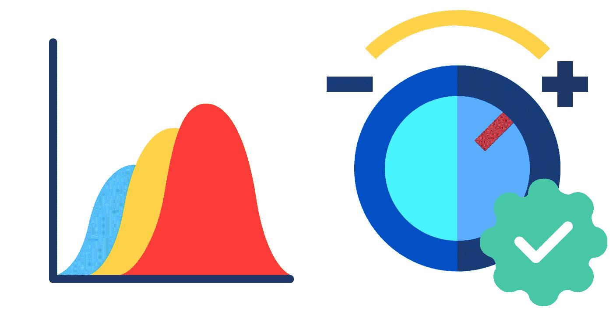
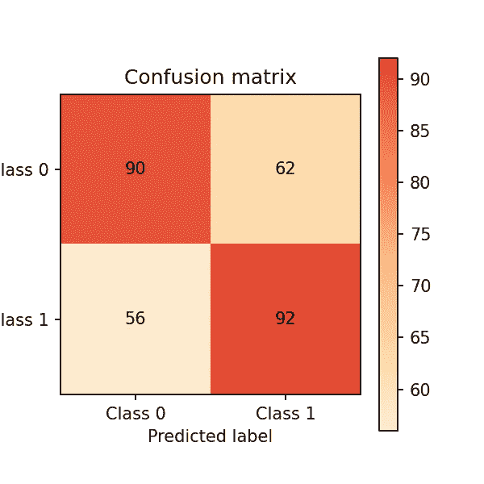
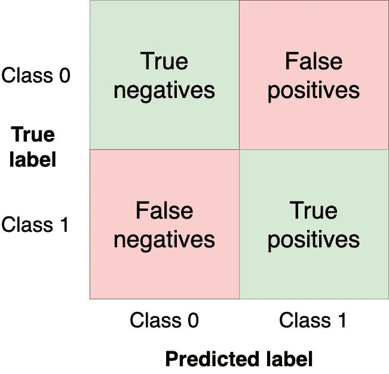
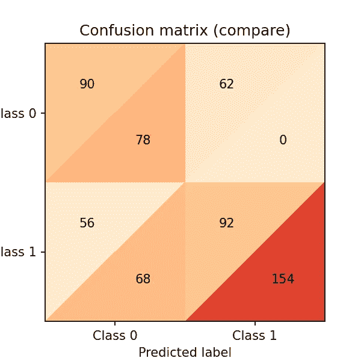
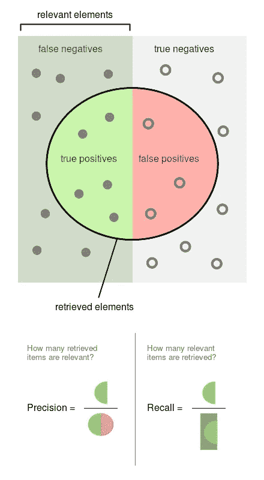
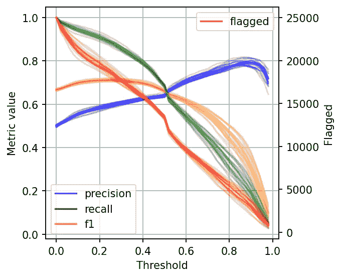
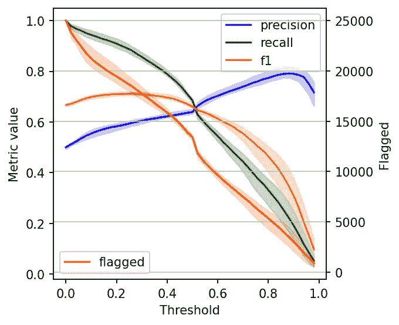

# 停止使用 0.5 作为二进制分类器的阈值

> 原文：<https://towardsdatascience.com/stop-using-0-5-as-the-threshold-for-your-binary-classifier-8d7168290d44>

## 机器学习统计学

## 了解如何为您的机器学习模型设置最佳阈值

作者图片，使用来自 flaticon.com 的图片文件

为了产生二元响应，分类器输出阈值化的实值分数。例如，逻辑回归输出一个概率(一个在`0.0`和`1.0`之间的值)；得分等于或高于`0.5`的观测值产生正的二进制输出(许多其他模型默认使用`0.5`阈值)。

然而，使用默认的`0.5`阈值是次优的。在这篇博文中，我将向您展示如何从二元分类器中选择最佳阈值。我们将使用 [Ploomber](https://github.com/ploomber/ploomber?utm_source=medium&utm_medium=blog&utm_campaign=threshold) 来并行执行我们的实验，并使用 [sklearn-evaluation](https://github.com/ploomber/sklearn-evaluation?utm_source=medium&utm_medium=blog&utm_campaign=threshold) 来生成图。

> 嗨！我叫爱德华多，我喜欢写关于数据科学的所有东西。如果您想了解我的最新内容。在 [Medium](https://medium.com/@edublancas?utm_source=medium&utm_medium=blog&utm_campaign=threshold) 或 [Twitter](https://twitter.com/edublancas?utm_source=medium&utm_medium=blog&utm_campaign=threshold) 上关注我。感谢阅读！

让我们继续学习训练逻辑回归的例子。假设我们正在开发一个内容审核系统，我们的模型应该标记帖子(图片、视频等)。)含有有害内容；然后，一个人会看一看，并决定是否内容被删除。

以下代码片段训练了我们的分类器:

现在让我们对测试集进行预测，并通过混淆矩阵评估性能:

**控制台输出(1/1):**

模型的混淆矩阵。图片作者。

混淆矩阵总结了我们的模型在四个区域的表现:

混乱矩阵区域。图片作者。

我们希望在左上角和右下角象限中获得尽可能多的观察值(从测试集中),因为这些观察值是我们的模型得到的。其他象限是模型错误。

改变我们模型的阈值将改变混淆矩阵中的值。在前面的例子中，我们使用了`clf.predict`函数，它返回一个二进制响应(即使用`0.5`作为阈值)；然而，我们可以使用`clf.predict_proba`函数来获得原始概率，并使用自定义阈值:

现在，让我们通过设置一个较低的阈值(例如，将更多帖子标记为有害)来使我们的分类器更具攻击性*并创建一个新的混淆矩阵:*

让我们比较两个矩阵。sklearn-evaluation 库让我们可以轻松地做到这一点:

**控制台输出(1/1):**

组合混淆矩阵。图片作者。

上面的三角形来自我们的`0.5`门槛，下面的来自`0.4`门槛。需要注意的几件事:

*   两个模型都在预测相同数量的观测值`0`(这是巧合)。`0.5`阈值:(`90 + 56 = 146`)。`0.4`阈值:(`78 + 68 = 146`)
*   降低阈值会导致*更多的错误否定*(从`56`到`68`
*   降低阈值是*大大增加真阳性*(从`92`到`154`

如你所见，微小的阈值变化极大地影响了混淆矩阵。然而，我们只分析了两个阈值。让我们跨所有值分析模型性能，以便更好地理解阈值动态。但在此之前，让我们定义用于模型评估的新指标。

到目前为止，我们已经用绝对数字评估了我们的模型。为了便于比较和评估，我们现在将定义两个规范化的指标(它们取值在`0.0`和`1.0`之间)。

精度是被标记的观察结果中事件的比例(即，我们的模型认为有害的帖子，它们确实是有害的)。另一方面，召回是我们的模型检索到的实际事件的比例(即，从所有有害的帖子中，我们能够检测到的比例)。

你可以在下图中看到这两个定义(来源:[维基百科](https://upload.wikimedia.org/wikipedia/commons/2/26/Precisionrecall.svg))

精度和召回图。来源:维基百科。

由于精确度和召回率都是比例，所以它们处于相同的零到一的范围内。现在让我们继续进行实验。

# 运行实验

我们将获得精度、召回率和其他几个阈值的统计数据，以便更好地理解阈值是如何影响它们的。我们还将多次重复这个实验来测量可变性。

*注意:本节中的命令是 bash 命令。在终端中执行它们，或者如果使用 Jupyter，添加* `*%%sh*` *魔法。*

为了有效地扩展我们的工作，我们将使用 [Ploomber Cloud](https://www.cloud.ploomber.io/signin.html?utm_source=medium&utm_medium=blog&utm_campaign=threshold) 来运行我们的实验。它允许我们并行运行实验，并快速检索结果。

我们[创建了一个笔记本](https://github.com/ploomber/posts/blob/master/threshold/fit.ipynb?utm_source=medium&utm_medium=blog&utm_campaign=threshold),它适合一个模型并计算几个阈值的统计数据。我们将并行执行同一个笔记本 20 次。首先，让我们下载笔记本:

**控制台输出(1/1):**

让我们执行笔记本(笔记本文件中的配置告诉 Ploomber Cloud 并行运行 20 次):

**控制台输出(1/1):**

几分钟后，我们将看到我们的 20 个实验已经完成:

**控制台输出(1/1):**

让我们下载每个实验的结果。结果存储在`.csv`文件中:

**控制台输出(1/1):**

# 可视化实验结果

我们现在将加载所有实验的结果并一次绘制出来。

左边的标尺(0 到 1)测量我们的三个指标:精确度、召回率和 F1。F1 值是精确率和召回率的调和平均值，F1 值最好的是`1.0`，最差的是`0.0`；F1 同样重视精确度和召回率，因此您可以将其视为两者之间的平衡。如果您正在处理精度和召回率都很重要的用例，最大化 F1 是一种可以帮助您优化分类器阈值的方法。

我们还包括一条红色曲线(右边的刻度),显示我们的模型标记为有害内容的案例数量。这个统计是相关的，因为在许多真实世界的用例中，我们可以干预的事件数量是有限的。

按照我们的内容审核示例，我们可能会有`X`数量的人查看我们的模型标记的帖子，并且他们可以查看的数量是有限制的。因此，考虑标记案例的数量可以帮助我们更好地选择阈值:如果我们只能查看 5000 个案例，那么每天查找 10000 个案例没有任何好处。如果我们有更多的容量，我们的模型只标记 100 个每日案例是浪费。

**控制台输出(1/1):**

差异阈值的度量。图片作者。

如你所见，当设置低阈值时，我们具有高召回率(我们检索大部分实际有害的帖子)但低精确度(有许多非有害的标记帖子)。然而，如果我们提高阈值，情况就会相反:召回率下降(我们错过了许多有害的帖子)，但精确度很高(大多数标记的帖子都是有害的)。

当选择二元分类器的阈值时，我们必须在精确度或召回率上妥协，因为没有分类器是完美的。因此，让我们来讨论如何选择合适的阈值。

# 绘图间隔

数据在右侧变得有噪声(较大的阈值)。因此，为了稍微清理一下，我们将重新创建该图，但这一次，我将绘制 2.5%、50%和 97.5%的百分位数，而不是绘制所有值。

**控制台输出(1/1):**

差异阈值的度量。图片作者。

# 选择最佳阈值

在选择阈值的时候，我们可以问自己:是检索尽可能多的有害帖子(高召回率)更重要？还是更重要的是高度确定我们标记的是有害的(高精度)？

如果两者同等重要，在这些条件下优化的一个常用方法是最大化 F-1 分数:

**控制台输出(1/1):**

然而，在许多情况下很难决定妥协什么，所以加入一些约束会有所帮助。

假设我们有十个人在审查有害帖子，他们可以一起检查五千个帖子。让我们看看我们的指标，如果我们固定我们的阈值，那么它会标记大约 5，000 个帖子:

**控制台输出(1/1):**

然而，在展示结果时，我们可能希望展示一些备选方案:在当前约束(5000 个帖子)下的模型性能，以及如果我们增加团队(例如，通过加倍规模)我们可以做得如何更好。

# 结束语

二元分类器的最佳阈值是针对业务结果进行优化并考虑流程限制的阈值。通过这篇文章中描述的过程，您可以更好地为您的用例决定最佳阈值。

如果你对这篇文章有任何疑问，欢迎在我们的 [Slack 社区](https://ploomber.io/community?utm_source=medium&utm_medium=blog&utm_campaign=threshold)中提问，该社区聚集了全球数百名数据科学家。

还有，记得报名 [Ploomber 云](https://www.cloud.ploomber.io/signin.html?utm_source=medium&utm_medium=blog&utm_campaign=threshold)！有一个免费层！它将帮助您快速扩展您的分析，而无需处理复杂的云基础架构。

# 使用的包

以下是我们写这篇文章时使用的软件包版本:

**控制台输出(1/1):**

*最初发布于*[*ploomber . io*](https://ploomber.io/blog/threshold/?utm_source=medium&utm_medium=blog&utm_campaign=threshold)*。*