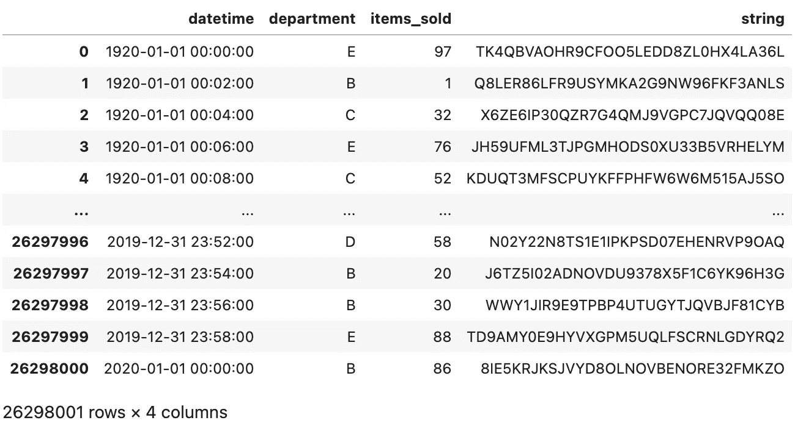
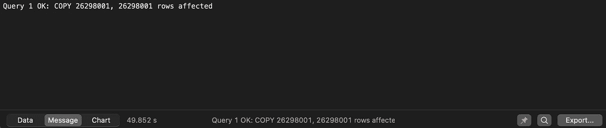
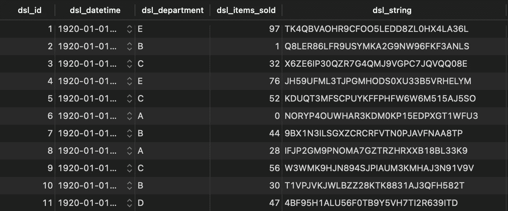
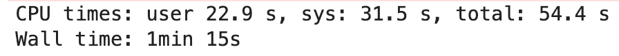
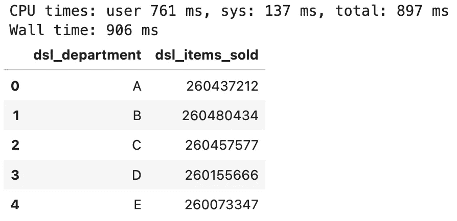
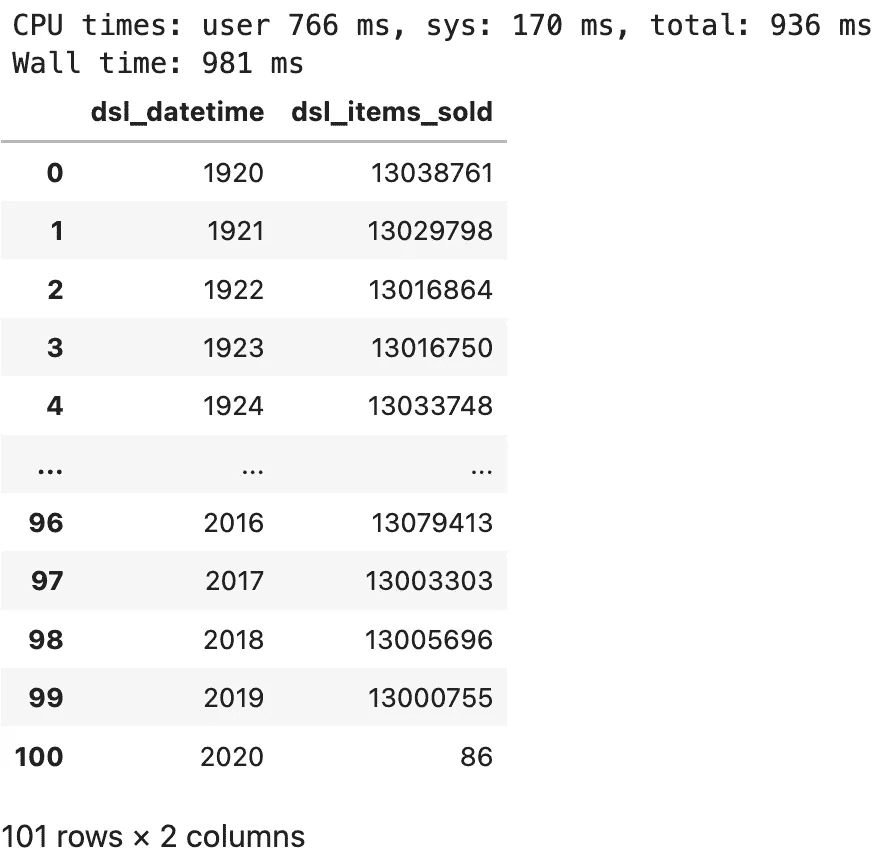
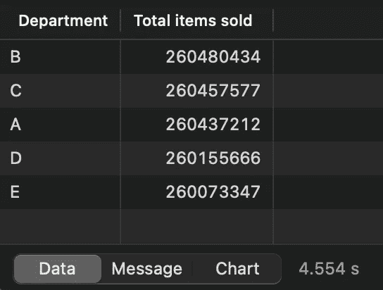
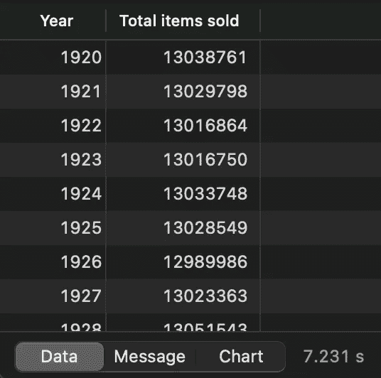
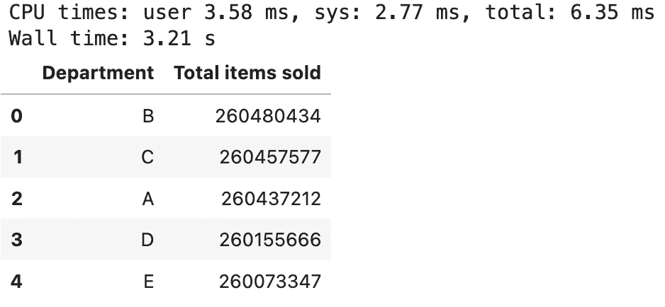
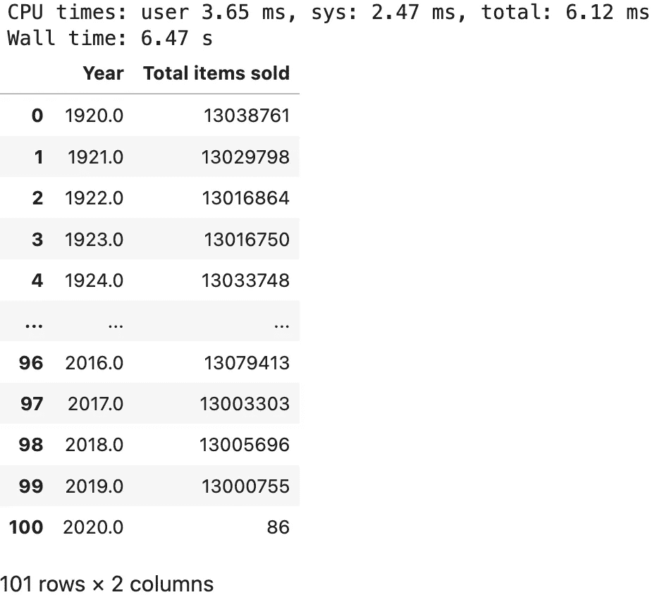

# 还在用 Python 聚合数据？以下是您应该使用 SQL 的原因

> 原文：<https://towardsdatascience.com/stop-using-python-to-aggregate-data-use-sql-instead-7781d6ea4f0c>

## 你在使用 Python 从数据库中提取原始数据吗？这可能是你的应用程序的一个巨大瓶颈。请改用 SQL。


查尔斯·德鲁维奥在 [Unsplash](https://unsplash.com?utm_source=medium&utm_medium=referral) 上的照片

数据科学的新手——包括几年前的我——也面临同样的问题。他们使用 Python 做任何事情，从收集到存储和操作数据。当然，现代编程语言可以处理一切，但这真的是最好的策略吗？不是的，你今天就会知道为什么了。

SQL 不是最性感的语言，主要是因为它似乎已经存在很久了。每个人和他们的母亲都声称他们了解 SQL，但是仅仅因为你能从一个表中取出所有的列并不意味着你是一个熟练的用户。

今天我们来看看下面的**场景**:一家公司在本地 Postgres 数据库中存储了数千万行数据。他们想知道在数据库上聚合数据比用 Python 获取所有数据并在那里进行聚合要快多少。

不想看书？我曾以视频形式报道过相同的主题:

# 使用 Python 创建合成数据集

首先，我们必须创建一个数据集。您需要安装 Numpy、Pandas 和 Psycopg2(用于 Postgres 连接)。以下是进口货:

```
import random
import string
import warnings
import psycopg2
import numpy as np
import pandas as pd
from datetime import datetimenp.random.seed = 42
warnings.filterwarnings('ignore')
```

至于数据，我们将创建一个从 1920 年到 2020 年的合成数据集，它将模拟公司不同部门的销售情况。以下是我们需要的函数:

```
def get_department() -> str:
    x = np.random.rand()
    if x < 0.2: return 'A'
    elif 0.2 <= x < 0.4: return 'B'
    elif 0.4 <= x < 0.6: return 'C'
    elif 0.6 <= x < 0.8: return 'D'
    else: return 'E'def gen_random_string(length: int = 32) -> str:
    return ''.join(random.choices(
        string.ascii_uppercase + string.digits, k=length)
    )date_range = pd.date_range(
    start=datetime(1920, 1, 1),
    end=datetime(2020, 1, 1),
    freq='120s'
)df_size = len(date_range)
```

我们可以用它们来创建数据集:

```
df = pd.DataFrame({
    'datetime': date_range,
    'department': [get_department() for x in range(df_size)],
    'items_sold': [np.random.randint(low=0, high=100) for x in range(df_size)],
    'string': [gen_random_string() for x in range(df_size)],
})
```

它看起来是这样的:



图片 1-合成的 26M 行数据集(图片由作者提供)

超过 26M 的行分布在四列中。这不是看起来最真实的表，我会给你，但它仍然是一个体面的数据量。让我们将它转储到一个 CSV 文件中:

```
df.to_csv('df.csv', index=False)
```

它需要 1，52 GB 的磁盘空间，以今天的标准来看并不算大。

# 将数据集加载到 Postgres 数据库

下一步是在 Postgres 中创建一个表并加载 CSV 文件。首先放到表上——除了其他四个列之外，它还有一个主键列。我喜欢给列名添加前缀，但您不必这样做:

```
CREATE TABLE department_sales(
	dsl_id SERIAL PRIMARY KEY,
	dsl_datetime TIMESTAMP,
	dsl_department CHAR(1),
	dsl_items_sold SMALLINT,
	dsl_string VARCHAR(32)
);
```

发出以下命令将 CSV 文件的内容复制到我们的 Postgres 表中——记住要更改路径:

```
COPY department_sales(dsl_datetime, dsl_department, dsl_items_sold, dsl_string)
FROM '/Users/dradecic/Desktop/df.csv'
DELIMITER ','
CSV HEADER;
```



图 2-数据集复制结果(作者提供的图片)

就这样——在不到 50 秒的时间内加载了超过 2600 万行。让我们运行一个`SELECT`语句，看看是否一切正常:

```
SELECT * FROM department_sales;
```



图 Postgres 数据库中的合成数据集(图片由作者提供)

确实如此——所以接下来让我们用 Python 加载数据。

# 选项 1-用 Python 加载整个表

使用 Psycopg2 中的`connect()`方法通过 Python 建立数据库连接:

```
conn = psycopg2.connect(
    user='<username>',
    password='<password>',
    host='127.0.0.1',
    port=5432,
    database='<db>'
)
```

我们现在可以通过 DBMS 发出与前面相同的`SELECT`语句:

```
%%timedf_department_sales = pd.read_sql("SELECT * FROM department_sales", conn)
```



图 4 —将 26M 行从 Postgres 加载到 Python 所需的时间(图片由作者提供)

取 26M 行用了 75 秒，这还不算太糟。这主要是因为数据库不在云中。尽管如此，如果速度是关键，75 秒可能是一段很长的等待时间。

现在让我们汇总数据。我们将按部门进行分组，并计算售出商品的总数:

```
%%timedf_pd_sales_by_department = (
    df_department_sales
        .groupby('dsl_department')
        .sum()
        .reset_index()
)[['dsl_department', 'dsl_items_sold']]df_pd_sales_by_department
```



图 5 —每个部门售出商品的汇总视图(按作者分类)

不到一秒钟，这是意料之中的。我在 [M1 Pro MacBook Pro 16"](https://betterdatascience.com/macbook-m1-pro-vs-rtx3060ti/) 上运行笔记本，速度非常快，所以结果并不令我惊讶。

我们将进行另一次汇总，这次我们将按年份分组，并计算每年售出的商品总数:

```
%%timedf_pd_sales_by_year = (
    df_department_sales
        .groupby(df_department_sales['dsl_datetime'].dt.year)
        .sum()
        .reset_index()
)[['dsl_datetime', 'dsl_items_sold']]df_pd_sales_by_year
```



图 6 —每年售出商品的汇总视图(按作者分类)

几乎相同的结果。总的来说，**我们可以将运行时间四舍五入到 77 秒**。接下来让我们检查数据库的性能。

# 选项#2 —用 Python 加载准备好的视图

处理大量数据的最佳实践是在包含查询结果的数据库中创建视图。因此，我们必须先发出几条 SQL 语句。

## 基于 Postgres 数据库中的数据聚合创建视图

这个汇总了按部门销售的商品数量:

```
CREATE OR REPLACE VIEW v_sales_by_department AS (
	SELECT 
		dsl_department AS "Department",
		SUM(dsl_items_sold) AS "Total items sold"
	FROM department_sales
	GROUP BY dsl_department
	ORDER BY 2 DESC
);
```

让我们看看它是什么样子的:

```
SELECT * FROM v_sales_by_department;
```



图 7 —每个部门视图销售的商品(按作者分类的图片)

正如所料，这与我们在 Python 中的第一个聚合操作完全相同。在这里，让我们创建第二个视图，按年汇总销售额:

```
CREATE OR REPLACE VIEW v_sales_by_year AS (
	SELECT 
		EXTRACT(YEAR FROM dsl_datetime) AS "Year",
		SUM(dsl_items_sold) AS "Total items sold"
	FROM department_sales 
	GROUP BY "Year"
);
```

只是快速检查一下:

```
SELECT * FROM v_sales_by_year;
```



图 8 —每年售出的商品视图(按作者分类)

一切看起来都很好，所以让我们用 Python 从这些视图中获取数据。

## 用 Python 加载视图中的数据

首先，让我们按部门获取销售数据:

```
%%timedf_sales_by_department = pd.read_sql("SELECT * FROM v_sales_by_department", conn)
df_sales_by_department
```



图 9 —从 Postgres 数据库中获取 v_sales_by_department(按作者排序)

三个。奇怪。秒。让我们对“按年销售”视图进行同样的操作:

```
%%timedf_sales_by_year = pd.read_sql("SELECT * FROM v_sales_by_year", conn)
df_sales_by_year
```



图 10 —从 Postgres 数据库中获取 v_sales_by_year(作者图片)

有点长，但仍在合理范围内。**我们可以将两者的运行时间四舍五入到 10 秒**。

# 判决

现在，您已经知道了——使用 Python 加载准备好的视图比动态获取整个表并进行聚合快 8 倍。请记住——本地 Postgres 数据库安装的速度要快 8 倍，如果我们将数据库迁移到云上，结果将远非如此。

如果这是您想要看到的比较，请告诉我，我很乐意在后续文章中介绍它。

这个故事的寓意是——永远利用数据库来完成繁重的工作。这些系统设计用于处理数据。Python 当然可以做到，但这不是它的主要用例。

## 了解更多信息

*   [2022 年学习数据科学的 5 本最佳书籍](https://betterdatascience.com/top-books-to-learn-data-science/)
*   [如何在本地安装阿帕奇气流](https://betterdatascience.com/apache-airflow-install/)
*   [深度学习领域谷歌 Colab vs. RTX3060Ti】](https://betterdatascience.com/google-colab-vs-rtx3060ti/)

## 保持联系

*   雇用我作为一名技术作家
*   订阅 [YouTube](https://www.youtube.com/c/BetterDataScience)
*   在 [LinkedIn](https://www.linkedin.com/in/darioradecic/) 上连接

*原载于 2022 年 2 月 17 日 https://betterdatascience.com*<https://betterdatascience.com/python-vs-sql-data-aggregation/>**。**