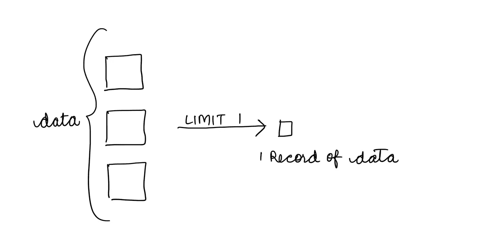
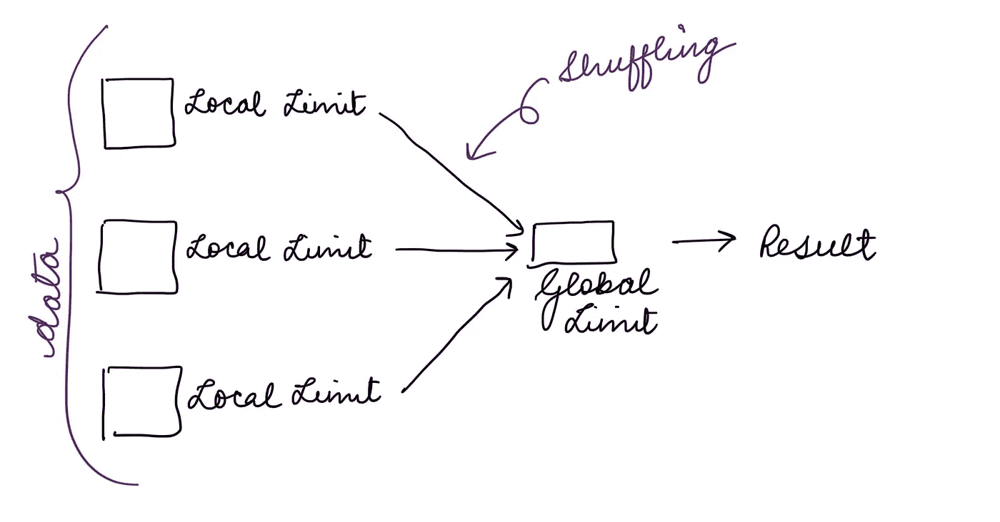
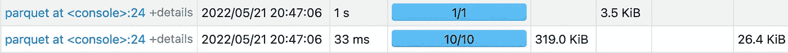
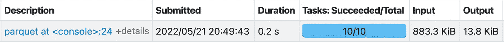

# 停止使用火花错误的限制条款

> 原文：<https://towardsdatascience.com/stop-using-the-limit-clause-wrong-with-spark-646e328774f5>

## 了解火花极限及其在大型数据集上的性能


由[拥有的摄影](https://unsplash.com/@possessedphotography?utm_source=unsplash&utm_medium=referral&utm_content=creditCopyText)在 [Unsplash](https://unsplash.com/s/photos/limit?utm_source=unsplash&utm_medium=referral&utm_content=creditCopyText) 上拍摄的照片

如果您来自 SQL 世界，您必须熟悉 LIMIT 子句。它非常常用于查看一小块数据。但是有没有想过它是如何工作的？

Spark 还提供了通过 Dataframe 或 Spark SQL 有限地选择数据块的功能。本文旨在理解 spark 极限，以及为什么您应该小心地将它用于大型数据集。

那么，我们开始吧。

首先，limit 用于获取整个数据集的记录子集，从完整的数据集中获取 n 条记录。



分布式数据限制的简化可视化(图片由作者提供)

# 火花极限的内部

Spark 分两步执行 limit，先做`LocalLimit`，再做`GlobalLimit`。

但是它到底是什么意思呢？

现在，我们都知道在分布式数据中，数据分布在多个分区中，现在当您对此类数据运行限制时，会发生的情况是首先为每个名为`LocalLimit`的分区单独计算限制。所以对于极限 n，对于每个分区，计算 n 个记录。

这个`LocalLimit`之后是准备最终结果的`GlobalLimit`。*(听起来很混乱？不要担心，下一节将有助于您更加清晰地理解)*

让我们首先来看看 LIMIT 的查询执行计划:

```
== Physical Plan ==
Execute InsertIntoHadoopFsRelationCommand (5)
+- * GlobalLimit (4)
   +- Exchange (3)
      +- * LocalLimit (2)
         +- Scan csv  (1)
```

这个`Global limit`导致洗牌，这实际上是一个非常昂贵的操作。(如果你不知道为什么洗牌不好，就做[读](https://umbertogriffo.gitbook.io/apache-spark-best-practices-and-tuning/rdd/avoiding_shuffle_less_stage-_more_fast))。



作者图片

这是 Spark UI 的`Stages`视图，在测试数据集上运行`LIMIT`。



作者图片

如上所示，`LIMIT`分两个阶段执行，在执行`GlobalLimit`的第二阶段，只有一个任务在运行。这一个任务使得 LIMIT 成为昂贵且耗时的操作，因为洗牌正在发生并且它读取洗牌数据。

对于小数据集，这可能不明显，但对于大数据集，考虑随机读取，只运行一个任务来准备结果，即使调整应用程序也不会导致时间的显著减少。

综上所述，数据集越大，`LIMIT`越昂贵。另外，`LIMIT n`的`n`值越大，洗牌越大，所以`LIMIT`越贵。我见过`LIMIT`在给定大量内存的情况下，对一个大型数据集花费一个多小时。

嗯……那还有什么选择呢？

有趣的是，我读到过关于`Limit`的内容，你可以通过调整`spark.sql.limit.scaleUpFactor`参数让它变得更快，它只是告诉 spark 实际扫描多少分区来找到记录。([参考](https://jaceklaskowski.gitbooks.io/mastering-spark-sql/content/spark-sql-properties.html))。尽管如此，我并没有发现这个参数在时间调优上有显著的改进。

作为 LIMIT 的替代，您可以使用`TABLESAMPLE` ( [参考](https://spark.apache.org/docs/latest/sql-ref-syntax-qry-select-sampling.html))，它作为一个单独的阶段运行，显示并行性，并且比 LIMIT 更快。

`TABLESAMPLE`的查询执行计划

```
== Physical Plan ==
Execute InsertIntoHadoopFsRelationCommand (3)
+- * Sample (2)
   +- Scan csv  (1)
```

`TABLESAMPLE`的阶段



作者图片

嗯，就这些。

总而言之，`LIMIT`性能并不可怕，甚至不明显，除非你开始在大型数据集上使用它，现在我希望你知道为什么！我经历过运行缓慢，无法自己调整应用程序，所以开始深入研究它，并找到它运行缓慢的原因，所以想分享它。

希望这有所帮助！

快乐编码，
JD

参考:

[](https://stackoverflow.com/questions/54615195/spark-dataframe-limit-function-takes-too-much-time-to-show)  [](https://stackoverflow.com/questions/56301329/understanding-spark-explain-collect-vs-global-vs-local-limit)   