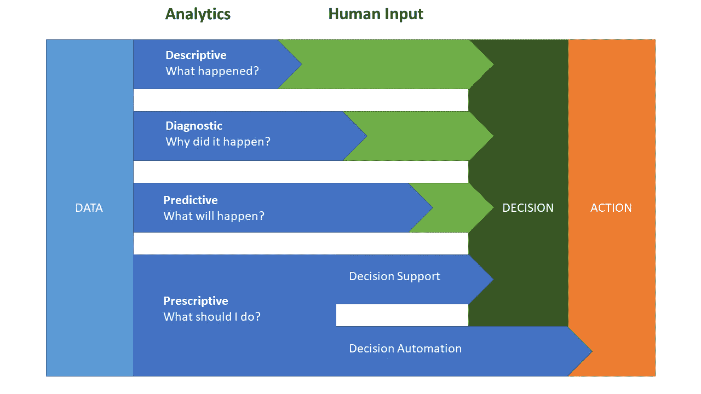
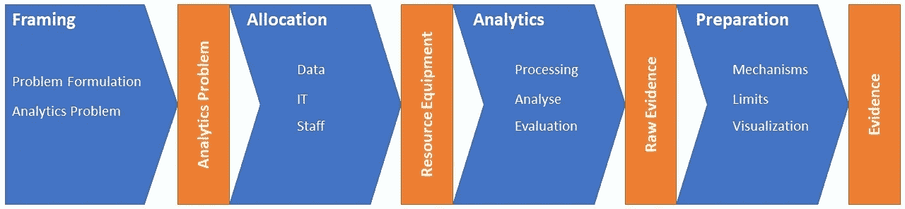

# 不要再担心您的工具，开始考虑如何实现吧！

> 原文：<https://towardsdatascience.com/stop-worrying-about-your-tools-start-thinking-about-enabling-ce1137e1cf0c>

克里斯蒂娜@ wocintechchat.com 在 [Unsplash](https://unsplash.com?utm_source=medium&utm_medium=referral) 上的照片

今天，您是否查看了您的数据科学和分析简讯、社交媒体群组和媒体博客帖子？你有没有挖掘你的数据科学泡沫，喜欢并评论一些关于最新火箭科学技术的帖子？你多久浏览一次下一个深度学习、图像处理、Python 或仪表板构建教程？

技术解决方案总是令人着迷，因此数据科学博客和出版物中有很高比例的设计模式、框架介绍和各种技术的应用示例也就不足为奇了。从读者的角度来看，它似乎很有前途:一个人可以很快理解一项新技术，并可以用它来解决工作或业余爱好项目中的具体问题。也许你会这样想:“旧的 MySQL 数据库非常不灵活，无论如何也无法扩展，有了雪花，我们可以解决很多问题，让我们的项目更加成功。”但这是真的吗？

在这篇文章中，我想分享一些发人深省的想法，以停止只考虑技术，并开始考虑如何使您的利益相关者。我将从发现失败项目的根本原因开始，并介绍授权的概念。有了这些信息，我邀请您再次思考您的“工具箱”,并提出一些想法，以便更好地为没有数据科学/分析背景的队友准备工作。请注意，这只是一个启发性的想法，不会深入到这些概念中。此外，本文还将关注分析工作负载。

# 项目失败的原因

让我们利用你的日常习惯，通读技术论文和文章，并声称你这样做是因为你想成为一名更好的分析师、数据科学家或开发人员。你希望提高工作质量，成为公司大车轮上运转良好的齿轮，这将带来成功的项目。但是你有没有问过自己为什么项目总是失败？

在他们的名著*Peopleware——生产项目和团队*【1】中，DeMarco 和 Lister 写道，15%的小型项目和 25%的大型项目失败了。霍纳引用 Gartner 高达 85%的失败率(原文如此！) [2].当被问及失败的原因时，项目成员大多会回答“政治”。DeMarco 和 Lister 将此解释为该项目的社会学。他们甚至发现，没有一个单一的技术问题可以解释他们大多数研究项目的失败。

现在问问你自己，如果很多项目因为‘政治’而失败，那你为什么还在读 Python 框架和深度学习算法的书？答案是:拓展你的技术技能要比解决你和市场部 Nicole 的心照不宣的冲突或者和你的经理 Dave 就他的冲动行为进行一些诚实的讨论容易得多。

# 什么是赋权？

虽然很多事情会出错，但更多的事情会有帮助，我发现把我的思维从技术领域转移到人际领域是非常有帮助的。如果你停止考虑工具，哪怕一分钟，问问你自己:“我怎样才能帮助 Nicole 解决她在 A/B 测试中的日常困难？”或者“我如何帮助 Dave 找到平衡的沟通水平，以便有效地与他合作？”

这些想法可以让你和其他人更有效地合作，从而提高你的项目成功率。

但是在我们谈论授权之前，我想介绍另一个概念，叫做授权。Jaffe 和 Scott [3]用三个核心因素描述了组织环境中的授权:

- **感到有责任并积极解决问题的员工**。

- **团队**一起努力提高他们的绩效和生产力。

- **旨在帮助人们实现他们想要的结果的组织**。

此外，“员工赋权涉及将决策权授予组织层级中的较低级别，为员工提供就工作相关活动做出日常决策的自主权”[4]。

突然间，公司里到处都有很多决策和行动。也就是说，你不仅仅是为你的经理或公司高层的决策者建立一个仪表板或统计模型。是你为 Nicole 的 A/B 测试开发了一个系统，这样她可以更快地决定她的广告主张，而不需要太多的统计假设测试知识。

这是使能！

然而，这不会自己发生。如上所述，作为一名员工，你必须感受到责任，并积极解决问题。这意味着你需要从你公司的许多利益相关者那里了解更多的问题，所以让我们稍微分解一下。

# 重新审视工具箱

当您想到您的技能和工具时，您可能会想到您部署 Kafka 管道或创建高级 Tableau 仪表板的能力，但是请后退一步，重新审视一下全局。

假设你没有站在利益相关者的角度思考问题。你很可能会掉进那个诱人的陷阱，在那里你试图为你的锤子找到合适的钉子。在这种情况下，你从你的工具和技能(锤子)来思考，并且很想只解决适合它们的问题(钉子)。这样你就不会尽你所能地提供帮助，也不会有一种让别人尽最大努力工作的心态。

在图 1 中，您可以看到四种类型的分析能力。虽然围绕它还有很多，特别是对数据科学家和工程师来说，但这将侧重于“数据工作”的分析部分。

图 1:四种分析能力[5]

首先要考虑的是从利益相关者的角度来思考你的实际技能。他们不太关心你在 Python 中使用线程或者你对贝叶斯统计的深刻见解。他们想要决定或采取行动，他们需要你的帮助。如果你能映射出一个类似“我的 A/B 测试怎么了？”对于像描述性分析这样的分析解决方案，这已经是工作的一半了。有了这个映射，你甚至可以找到 Nicole，告诉她她不需要问自己应该如何处理你的 A/B 测试仪表板，因为通过一点点说明性的分析，你可以自动化整个过程，她只需要不时地将她的声明和图像的新版本推入管道。

介意！你不会去想你是如何做到的，也不会去想你需要什么工具，而是去想 T2 和她需要什么。清楚这一点后，您可以继续在工具箱中找到合适的(技术)工具。

# 阐明机制和限制

如前所述，对问题的理解已经完成了一半，但现在我们需要准备答案，在这里，帮助你的利益相关者理解你的发现是至关重要的。Seiter [6]描述了他的分析过程的四个阶段:框架、分配、分析和准备(见图 2)。虽然这个过程有很多优点，但它是最后一个阶段，即准备阶段，作为与利益相关者的接口，准备阶段起着至关重要的作用。它分为三个部分:阐明机制、确定有效性范围(限制)和可视化。

图 2:业务分析过程模型。译自[6]。

阐明您的分析机制对于您和领域专家，也就是与您一起工作的涉众是至关重要的。你应该向没有数据科学背景的人解释你的模型和方法，让他们提出关键问题——甚至邀请他们这样做。对他们(和你)来说，结果从何而来应该是显而易见的。如果你让一个领域专家理解你的模型，她有机会告诉你这个模型不能代表现实。举例来说，你可以用线性回归来分析相关性，但是专家告诉你在现实生活中这是指数关系。这就是有效性极限发挥作用的地方。你的模型可能只在一个特定的范围内起作用，在这个范围内的相关性表现出几乎线性的行为，但是如果你扩大了范围，你将能够看到这种相关性的指数性质。你的专家队友刚刚帮助你成为一名更好的数据科学家。你不仅让她理解了你的模型，她也和你一起理解了。

# 两种简单的可视化方法

沟通的主要方式之一是适当的可视化，这里的使能意味着帮助你的利益相关者理解你的观点，而没有太多的阻碍，用一种他们熟悉的可视化语言。有相关书籍，所以我只指出两个关键问题。如果你对深度潜水感兴趣，我推荐“*用数据讲故事*”[7]。

最简单的策略之一是从你的想象中移除一切不支持你的故事的东西。这可以是轴、数字、文本和太多的颜色。通常一个简单的斜率图解释增长或下降行为就足够了。

另一点是，不是每个专业人士都理解每一种视觉表现形式。箱形图就是一个很好的例子。它可视化了关键的统计指标，如四分位数、四分位数间距和中位数。没有解释，这些不是每个人都能得到的。要么提供这种可视化，要么使用另一种可视化。

这里也是，从你的利益相关者的角度考虑，而不是从你的数据和分析。例如，使用对数标度或方框图可能很诱人，从技术上来说也是正确的选择，但如果观众不能理解，那就一文不值。如果你的视觉化不能传达这个故事，你应该考虑把它分开，使用描述性的和更容易理解的语言。

# 结论

我们现在以一种不太理论化和哲学化的方式浅尝了授权和使能——至少，我希望如此。我们还发现了一个关于如何思考我们的技能和工具的略微不同的观点，然后花了额外的时间来准备我们的工作。
虽然这只是关于这些主题的一点阅读，但我希望你的思维已经从技术焦点稍微转移到更多以人为中心的思想。由于人为因素，项目不断失败。因此，如果你想提高你和你的组织的成功率，继续阅读这些话题。如果你想分享你的想法或拓宽我的视角，请留下评论。我也不得不承认，这是我最早的作品之一。如果你对提高我的产出有什么建议，请不要害羞，尽管联系我。

# 文献学

[1]t .德马科和 t .李斯特(2013)。 *Peopleware:生产项目和团队*(第三版 Ausg。).新泽西州上萨德尔河:艾迪森-韦斯利。

[2]霍纳，P. (12 2019)。分析项目失败的原因及其他成功案例。*或-MS 今日，46(6)* 。(I. f .科学，Hrsg。)Linthicum。doi:http://dx . doi . org/10.1287/orms . 2019 . 06 . 13

[3]贾菲博士和斯科特博士(1991 年)。授权:成功实践指南。门洛帕克:课程技术危机。

[4]贝尔德，k .，苏，s .，，穆尼尔，R. (2018 年)。控制的授权使用、员工授权和绩效之间的关系。*人事审核*。

[5]高德纳。(21.10 2014). *Gartner 表示，高级分析是业务的重中之重*。冯[https://www . Gartner . com/en/news room/press-releases/2014-10-21-Gartner-says-advanced-analytics-is-a-top-business-priority](https://www.gartner.com/en/newsroom/press-releases/2014-10-21-gartner-says-advanced-analytics-is-a-top-business-priority)abgerufen

[6]塞特尔，M. (2019)。*商业分析:你是如何度过这段时间的？*慕尼黑:弗朗茨·瓦伦。

[7]克纳弗利奇，C. (2015 年)。用数据讲故事:商业专家数据可视化指南。新泽西州霍博肯:约翰·威利的儿子们。