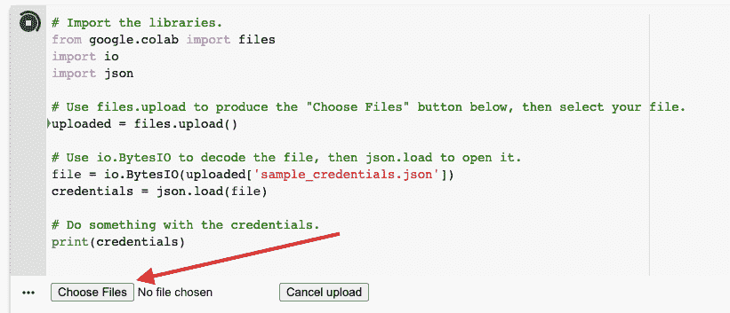

# 在 Jupyter 笔记本电脑中轻松安全地存储 API 凭证

> 原文：<https://towardsdatascience.com/store-api-credentials-easily-and-securely-in-jupyter-notebooks-50411e98e81c>

## 将您的凭证安全地存储在您自己的机器上，并通过一个对话窗口将它们放入您的笔记本中。


Georg Bommeli 在 [Unsplash](https://unsplash.com/s/photos/lock-and-key?utm_source=unsplash&utm_medium=referral&utm_content=creditCopyText) 上的照片

最近，我一直在 Jupyter 笔记本中使用 Python 创建数据管道脚本，用于存储和分析股市数据。我已经把这些脚本贴在我的 [Github 库](https://github.com/bnsheehy/Stock-Market_Data_ETL)里，通过一系列[以前在 Medium](https://bnsheehy.medium.com/) 上的文章与公众分享。

这些脚本依赖于从我的数据合作伙伴 [Intrinio](https://www.intrinio.com/) 提供的 API 中提取原始数据，然后将数据推送到我在 AWS 上的数据仓库。这些资源需要登录凭证，出于显而易见的原因，我不想与公众分享这些凭证。那么，我如何将这些凭证存储在一个单独的文件中，隐藏在我的本地驱动器上，并自动将它们导入 Python 脚本，而不暴露我的凭证文件的名称或位置呢？

这是我发现的最简单的解决方案。首先，创建一个文本或 JSON 格式的凭证文件。我更喜欢 JSON，因为它在 Python 中易于阅读和解析。JSON 格式实际上只是一个 Python 字典文件，在键和值的名称周围使用双引号，而不是单引号。这是它看起来的样子:

```
{
“data_api_username”:”johnbsmith”,
"data_api_key":"8675309JENNYjenny",
"aws_access_key":"there'sAladyWHO'SsureALLthatGLITTERSisGOLD",
"aws_secret_key":"ANDshe'sBUYINGaSTAIRWAYtoHEAVEN"
}
```

然后给它一个你能记住的名字。大多数人用的都是“credentials.json”之类的东西。但是如果你想对潜在的黑客隐藏它，你可以称它为任何东西，甚至是“myfavoritesongs.json”。

通常，您会使用 [Python 打开函数](https://www.w3schools.com/python/ref_func_open.asp)来获取这个文件。但是，您必须在代码中公开文件路径。相反，您可以使用 Python 中包含的一个名为 [Tkinter](https://wiki.python.org/moin/TkInter) 的 GUI 包。在 Tkinter 内，[文件对话框模块](https://docs.python.org/3/library/dialog.html)允许你打开一个窗口选择一个文件。

如果您从本地机器运行 Jupyter，您可以使用以下代码:

或者，如果你在 Google Colab 上运行你的 Jupyter 笔记本，这个过程略有不同，但同样简单。以下是您可以用于该平台的代码:

该模块将在 Colab 笔记本单元格内方便地生成一个“选择文件”按钮，如下所示:



使用这两种技术，您可以完全隐藏您的凭证文件以及获取它的特定路径。这将允许您共享您的 Jupyter 笔记本，而不必担心泄露您的秘密密钥。

编码快乐！

*Bryant Sheehy 在金融数据销售和业务开发领域拥有超过 15 年的经验，目前正在向数据工程和分析领域转型。你可以在* [*中*](https://bnsheehy.medium.com/) *上关注他或者在*[*LinkedIn*](https://www.linkedin.com/in/bryantsheehy/)*上联系他。*