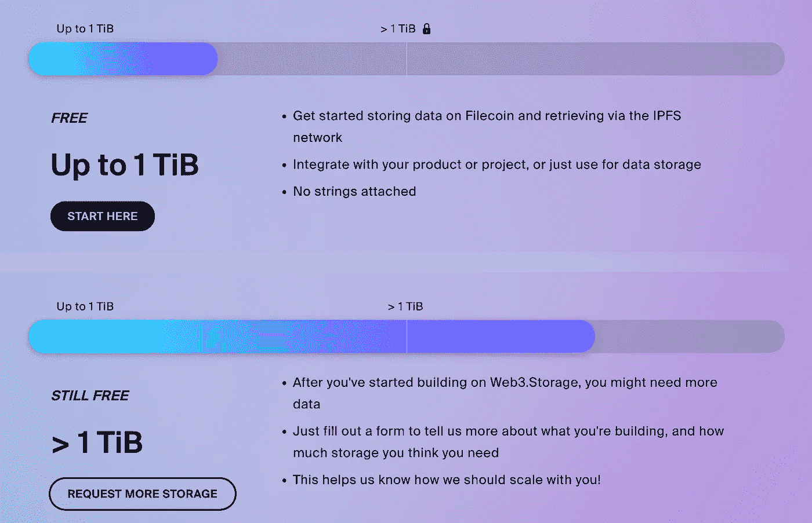
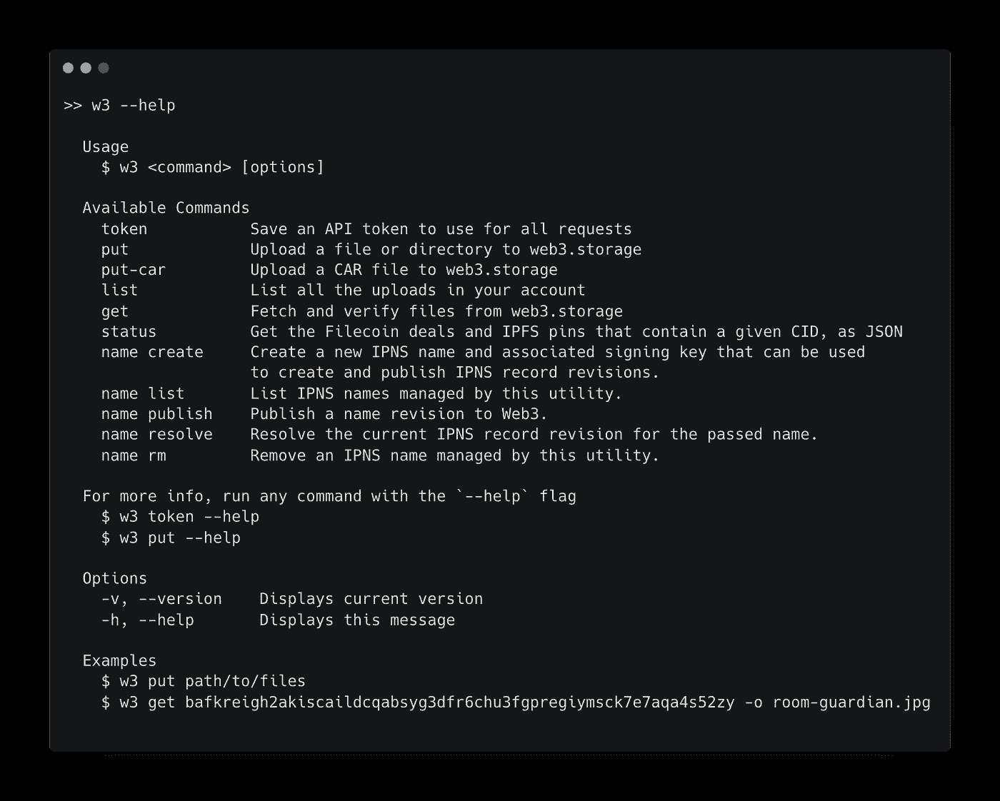
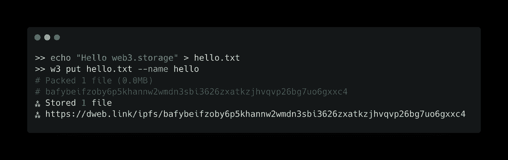

# 在 IPFS 上免费存储无限数据，并使用 Python 检索

> 原文：<https://towardsdatascience.com/store-unlimited-data-for-free-on-ipfs-and-retrieve-it-with-python-8db7297b493d>

## 如何将分散存储整合到您的工作流程中


卡特琳娜·林皮索妮“上传”(来源[https://undraw.co/illustrations](https://undraw.co/illustrations))

新兴技术，如星际文件系统([【IPFS】](https://ipfs.io)，可以促成一个更加可验证和开放的生态系统。由于 IPFS 依赖于[内容标识符](https://web3.storage/docs/concepts/content-addressing/) (CIDs)，这是内容的散列，您可以确信返回的数据是正确的。此外，IPFS 是一个开放的公共网络。因此，任何人都可以访问网络上的内容，如果他们有正确的 CID。

我特别兴奋的一个项目是 [web3.storage](https://web3.storage) ，这是一项免费服务，减少了使用分散存储的摩擦。



经许可使用的截图(来源:[https://web3.storage/pricing/](https://web3.storage/pricing/))

在这篇文章中，我将…

*   介绍 web3.storage 以及如何设置它
*   提供 Python 中 IPFS 的基本 CRUD 操作示例
*   描述我当前创建分散数据存储库的解决方案

# web3.storage 简介

> 我们今天的目标是提供一个用户友好的体验，极大地减少今天在 web3 生态系统中引入新用例的负担，同时为未来提供一个升级路径。— [Web3。存储](https://web3.storage)

Web3。存储允许用户和开发者使用由 IPFS 和 Filecoin 网络提供的分散存储。任何上传的内容都会在地理位置分散的存储提供商之间进行复制，从而确保网络的弹性。该服务还处理将您的内容固定在多个服务器上的工作。

注意你上传的内容，因为任何人都可以访问网络上的内容。但是，您可以在上传前加密内容。我的经验是，**只上传你觉得永久公开的内容。**

永久部分很重要。与基于位置的寻址(如 URL)不同，[基于内容的寻址](https://web3.storage/docs/concepts/content-addressing/)(如 CIDs)使得数据一旦上传就很难从网络中删除，因为它可能被固定在多个服务器上。

您的配额最初上限为 1tb，但可以通过提交请求免费增加。开销成本目前由协议实验室补贴，这可能会在不久的将来转换到某种形式的加密原生支付模式(例如，增加 Filecoin 以增加存储限制)。

将一切联系在一起的支柱是 IPFS，这是一种超媒体协议，旨在通过数据的内容而不是位置来寻址数据，从而使网络更具弹性。为了做到这一点，IPFS 使用 cid 而不是 URL——URL 指向托管数据的服务器。

web3.storage 还有很多东西，如果你也对这个项目感兴趣，我鼓励你探索一下[文档](https://web3.storage/docs/)——尤其是如果你是一名开发人员。

## 设置 web3.storage

> 转到 [https://web3.storage](https://web3.storage/) 创建一个帐户

详细说明见[文件](https://web3.storage/docs/#create-an-account)。

## 创建 API 令牌

从命令行使用 web3.storage 需要一个 [API 令牌](https://web3.storage/docs/#get-an-api-token)

1.  登录您的 [web3.storage 帐户](https://web3.storage/account/)
2.  点击顶部的**账户**，然后**创建 API 令牌**
3.  为您的令牌输入一个描述性名称，然后单击**创建**
4.  您可以单击 **Copy** 将新的 API 令牌复制到您的剪贴板。

不要与任何人分享你的 API 密匙，它是你的帐户专用的。您还应该在某个地方记下令牌字段，并安全地存储它。

## 安装 w3 命令行界面

`[w3](https://github.com/web3-storage/web3.storage/tree/main/packages/w3#readme)` [命令行界面](https://github.com/web3-storage/web3.storage/tree/main/packages/w3#readme) (CLI)是基于节点的工具，用于从终端使用 web3.storage

在 Mac 上，你可以通过[自制](https://brew.sh/)轻松安装`node`，这也是安装节点包管理器(`npm`)。

```
brew install node
```

使用`npm`安装`[w3](https://github.com/web3-storage/web3.storage/tree/main/packages/w3#readme)`命令行界面。

```
npm install -g @web3-storage/w3
```

运行以下命令将`w3`连接到 web3.storage。

```
w3 token
```

系统将提示您输入之前创建的 API 令牌。

下面显示了有关每个可用命令的信息。

```
w3 --help
```



作者图片(使用[https://carbon.now.sh/](https://carbon.now.sh/)创建)

**上传和下载命令**

*   `w3 put /path/to/file`(这是我们上传内容到 web3.storage 的方式)
*   `w3 get CID`(这是我们如何从特定的 CID 下载内容)

**在 web3.storage 上列出您的文件**

```
w3 list
```

## 使用 put 的示例

首先，创建一个包含消息的文本文件。

```
echo "Hello web3.storage" > hello.txt
```

现在让我们使用`put`命令将文件推送到 IPFS。

```
w3 put hello.txt --name hello
```

> `*hello*`将是出现在 web3.storage 中的名称，使用`w3 list`进行验证

CID 和一个[公共网关链接](https://web3.storage/docs/how-tos/retrieve/#using-an-ipfs-http-gateway)被输出。



作者图片(使用[https://carbon.now.sh/](https://carbon.now.sh/)创建)

如果您完全按照上述步骤操作，那么您的 CID 应该与我的一致。CID 是唯一标识内容的散列。

使用下面的链接通过公共网关查看邮件。

```
[https://dweb.link/ipfs/bafybeifzoby6p5khannw2wmdn3sbi3626zxatkzjhvqvp26bg7uo6gxxc4](https://dweb.link/ipfs/bafybeifzoby6p5khannw2wmdn3sbi3626zxatkzjhvqvp26bg7uo6gxxc4)
```

> **注意:**如果您的信息不同，链接也会不同

# 使用 Python 检索内容

将来，web3.storage 有望与 S3 兼容，这意味着我们可以访问存储在那里的数据，就像我们访问 S3 桶中的数据一样。

现在，我们可以使用 HTTP 请求将数据读入 Python。然而，像`pandas`这样的库允许我们直接从网关 URL 读取 CSV 文件。另外，`ipfsspec`允许我们用`xarray`从 IPFS 读取`zarr`数据存储。

在接下来的几节中，我将演示如何阅读这些内容

## 阅读 JSON

下面是一个读取存储在 IPFS 上的`.json`文件的例子。

## 读取 CSV 文件

如果您有一个 CSV 文件，您可以将它直接读入一个`pandas`数据帧。

# 扎尔和 IPFS

Zarr 格式是一种新的存储格式，它使得大型数据集可以轻松地被分布式计算访问，这是对常用的 NetCDF 格式的一种改进，NetCDF 是一种存储多维数据的格式。

如果你开始转向 zarr 格式，我鼓励你看看 Pangeo 的“[准备云优化数据指南](https://pangeo.io/data.html#guide-to-preparing-cloud-optimized-data)”。

NetCDF 文件仍然很常见，xarray 的函数可以很容易地将这些 NetCDF 文件转换成 zarr 数据存储。

```
import xarray as xr
ds = xr.open_dataset('/path/to/file.nc')
ds.to_zarr("./file.nc", consolidated=True)
```

`consolidated=True`创建一个“隐藏的”点文件和数据存储，使得用`xarray`从 zarr 读取数据更快。在一个简单的测试中，我发现读取整合的数据存储比未整合的快 5 倍。

**zarr(合并):** 635 毫秒

zarr(未合并): 3.19 秒

如果你想测试上面的代码，我上传了 [NOAA 最优插值 SST V2 数据集](https://psl.noaa.gov/data/gridded/data.noaa.oisst.v2.html)在合并和非合并的 zarr 格式到 IPFS。该数据集提供了从 1990 年到现在的海洋表面温度(SST)的每周平均值，空间分辨率为 1 度。

该数据的网关 URL 如下所示

```
[https://dweb.link/ipfs/bafybeicocwmfbct57lt62klus2adkoq5rlpb6dfpjt7en66vo6s2lf3qmq](https://dweb.link/ipfs/bafybeicocwmfbct57lt62klus2adkoq5rlpb6dfpjt7en66vo6s2lf3qmq)
```

## 将 Zarr 数据存储上传到 IPFS

当上传`zarr`文件到 IPFS 时，你必须确保上传“隐藏”的点文件。对于`w3`，这需要添加`--hidden`标志:

```
w3 put ./* --hidden --name filename.zarr
```

## 从 IPFS 读取 Zarr 数据存储

为了用`xarray`从 IPFS 读取 zarr 数据存储，你需要`[ipfsspec](https://github.com/fsspec/ipfsspec)`包(以及`xarray`和`zarr`)

```
conda install -c conda-forge xarray zarr
pip install ipfsspec
```

`ipfsspec`确保`xarray`能够解释 IPFS 协议。

请注意，在下面的例子中，我使用的是 IPFS 协议，而不是 HTTPS 的网关 URL。然而，在幕后，代码实际上是从网关读取的。

# 分散数据仓库

IPFS 可以用作数据仓库。但是，您需要将 CID 链接到人类可读的内容，这样才能成为一个可行的解决方案。我不知道任何关于 CID 管理的最佳实践。然而，从 NFT 数据的最佳实践中得到一些启示，我目前的方法是将 cid 和它们相关的文件名作为一对`key:value`存储在 JSON 中，然后使用一个 [NoSQL 数据库](https://www.mongodb.com/nosql-explained)，比如 [MongoDB](https://www.mongodb.com/) ，用于查询。

将内容上传到 web3.storage 后，向文件中添加一条新记录，用于标识数据集和内容的 CID。这是所需的最少信息量。

下面是一个存储为 JSON 数组的 CIDs 示例。

`[pymongo](https://www.mongodb.com/docs/drivers/pymongo/)`包使得在 Python 中使用 MongoDB 变得容易。

*   [使用 Python-PyMongo 连接到 MongoDB Atlas】](https://medium.com/analytics-vidhya/connecting-to-mongodb-atlas-with-python-pymongo-5b25dab3ac53)
*   [用真正的 Python 介绍 MongoDB 和 Python](https://realpython.com/introduction-to-mongodb-and-python/)
*   [pymongo 文档](https://www.mongodb.com/docs/drivers/pymongo/)

下面是一个将记录插入集合，然后在数据库中查询特定 CID 的示例。

## 替代方法

我一直在考虑的另一种方法是利用`w3 list`的输出，但还没有实现。

这将显示您在上传内容时提供的 CID 和名称。

想法是编写一个`awk`脚本，从输出中生成一个 JSON 文件。

这方面的一些缺点或陷阱包括:

*   处理指向目录而不是纯文件的 cid
*   忽略与您的数据库无关的 cid

我认为最大的障碍是处理目录。仅仅因为这个原因，我坚持手动更新我的数据库，特别是因为它很小并且易于管理——至少现在是这样。

# 最后的想法

IPFS 可能是一个长期存储的地方，CIDs 的功能类似于内置的版本控制。

`w3` CLI 使得将数据推送到 IPFS 变得容易，任何通用格式(JSON、CSV、Zarr)都可以从 IPFS 读入 Python。

然而，使用 IPFS 的一个挑战是 CID 管理。我当前创建分散式数据存储库的解决方案是在 MongoDB 中将 cid 及其相关文件名存储为键值对。这个解决方案有点笨拙，我愿意接受如何改进这个设置的建议。

## 将 IPFS 用于虚拟主机

IPFS 的另一个伟大的应用是托管网站。我的个人网页位于 IPFS。我想我想出了一个优雅的解决方案来管理一个分散的网站，你可以在下面的文章中了解我的解决方案。

[](https://betterprogramming.pub/modern-way-to-host-a-site-on-ipfs-7941b65d27c3) [## 在 Ipfs 上托管站点的现代方式

### 使用 web3.storage、GitHub Actions 和 IPNS

better 编程. pub](https://betterprogramming.pub/modern-way-to-host-a-site-on-ipfs-7941b65d27c3) 

## Storj:另一种分散存储选择

最后，IPFS 不是你唯一的选择。如果你想要一个 S3 兼容的对象存储，那么我建议你去看看 Storj。Storj 解决方案依赖于通过分散的网络存储加密数据的碎片，而不是复制您的数据。这是一项付费服务，但非常实惠，尤其是如果您目前正在使用 AWS。我个人在日常工作中使用 Storj。如果你有兴趣了解我如何使用 Storj，请查看下面的文章。

[](https://betterprogramming.pub/storj-decentralized-cloud-storage-my-new-favorite-cloud-object-storage-99d95ddc4e6a) [## Storj 分散式云存储:我的新宠云对象存储

### Storj 提供 150 GB 的免费存储和无缝 Python 集成

better 编程. pub](https://betterprogramming.pub/storj-decentralized-cloud-storage-my-new-favorite-cloud-object-storage-99d95ddc4e6a)