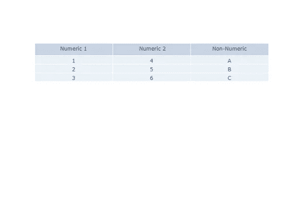
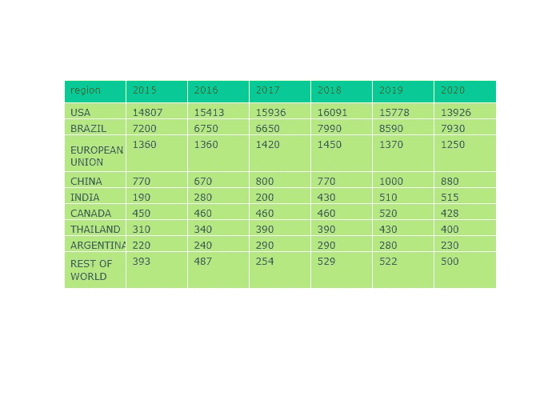
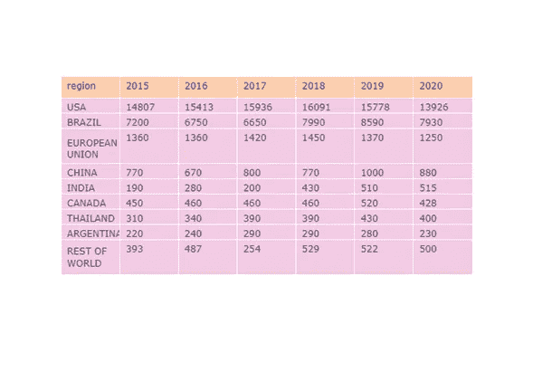
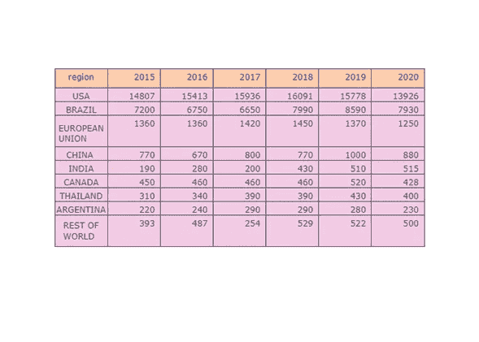
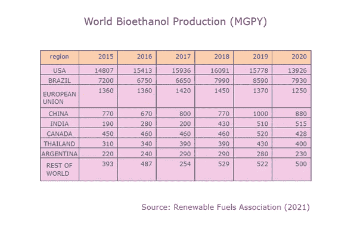
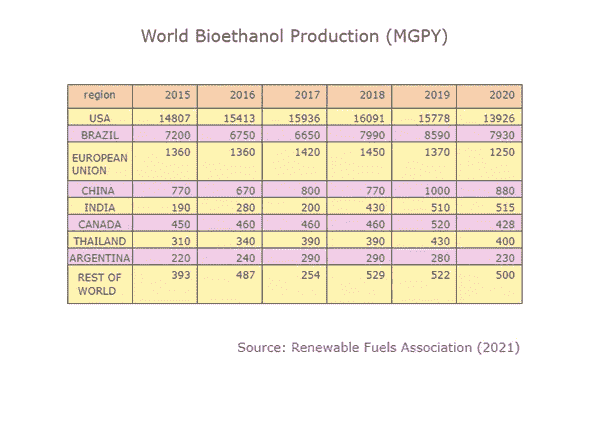

# 用桌子讲故事第 1 部分:用情节的桌子

> 原文：<https://towardsdatascience.com/storytelling-with-tables-part-1-tables-with-plotly-f1b8f77cdf4c>

## 何时使用表格以及如何创建有效的表格


[康斯坦丁·迪亚顿](https://unsplash.com/es/@kostyadyadyun?utm_source=medium&utm_medium=referral)在[号航天飞机](https://unsplash.com?utm_source=medium&utm_medium=referral)上拍摄的照片

如果您是(或想成为)数据科学家，您将需要发展几种技能，包括理解您的数据并能够适当地与您的受众沟通的能力。

当然，传达故事的最好方法是使用图表，但有时最好使用表格。

表格是“信息或数据的排列，通常以行和列的形式，或者可能以更复杂的结构。表格在种类、结构、灵活性、符号、表达和使用上有很大不同"[1]。

一个设计良好的表格应该有:1)准确简洁的标题；2)列标题；3)行标签；4)脚注；5)源线。

**使用表格方便时:**

*   您需要显示特定的值及其精确表示；
*   您需要在相对较小的区域显示许多数值；
*   您想比较或对比几个数值；
*   您想要比较或对比相关项目之间的值；
*   应包括单项值和汇总值(全部或部分)。可以显示中间值或基础值；
*   显示的值涉及多个测量单位；
*   数据应该传达定量信息，而不是趋势；
*   观众中不同的人需要或寻求不同的信息。不同的人可能会在表格的不同地方寻找他们的信息；
*   显示特定项目的存在或不存在；
*   您认为表格可能是显示数据的最准确和精确的方式。

**请记住:**

*   当您在表格中包含数值时，请始终将它们向右对齐，以便比较它们的大小。如果你对准中心或左边，视觉效果会倍增到剑柄；
*   如果使用小数，则相等小数的数量并将其放在右边；始终使用适当且有效的小数；
*   添加分隔符:逗号、句点或空格作为千位分隔符；
*   一个或两个数字不需要图表。以文本模式显示；
*   表格不一定需要单调。不同的颜色、字体、边框样式、不同的数字格式，甚至图标都可以用来(谨慎地)使阅读和数字变得更令人愉快；
*   我们阅读表格:表格与我们的语言系统互动；
*   表格比图表需要更多的处理时间。有一个明确的顺序:1。阅读；2.处理；3.反思时间。对于每个观众来说，这个序列可能是不同的。

**带图形的表格**

[**Plotly Express**](/scatter-plots-with-plotly-express-1b7f5579919b) ，一个面向对象的图形创建接口，是 **Plotly.py** 的高级包装器，包括绘制标准 2D & 3D 图表和 choropleth 地图的函数。它免费提供了许多漂亮的图表。

*导入 plotly.express 为 px*

但是，如果您想要绘制样式化的表格，建议导入一组名为 *graph objects 的类。这个模块包含了 Python 类的层次结构。例如，下面所示的*图*是一个主类。这个类有一个数据属性**和一个布局属性**。数据属性有 40 多个对象，每个对象引用一个特定类型的图形( *trace* )及其相应的参数。另一方面，布局属性从整体上指定图形的属性(标题、轴、图例、注释等。).*

*导入 plot ly . graph _ objects as go
fig = go。图()*

您可以使用表格方法在 Plotly 中创建表格。在其最基本的变体中，该过程是使用 *fig.add_trace()，go。表格*和两个参数:*表头*和*单元格*。前者，顾名思义，对应于表格的标题(第一行),而*单元格*对应于我们想要显示给观众的数值，无论是数值还是非数值。

```
import plotly.graph_objects as go
your_path = your_path
#.....................................................................
# Table 1: Basic Table

fig1 = go.Figure()
fig1.add_trace( 
    go.Table(
        header = dict(values=['Numeric 1',' Numeric 2', 'Non-Numeric']),
        cells =  dict(values=[[1,2, 3],[4, 5, 6], ['A','B','C']])
            )
             )
fig1.write_image(your_path + 'Table1.png')
fig1.show()
```



图 1:作者用 Plotly 做的。

您可以用更简洁的编码获得相同的表:

```
# Table 2: Same data, concise coding

fig2 =go.Figure(data=[go.Table(header=dict(values=['Numeric 1',' Numeric 2', 'Non-Numeric']),  
                               cells= dict(values=[[1,2,3],[4,5,6],['A','B','C']]))
                      ]
               )   
fig2.write_image(your_path + 'Table2.png')
fig2.show() 
```


图 2:作者用 Plotly 做的。

由于 Pandas 数据帧就像一个由行和列组成的表，所以用数据集中的数据绘制一个表非常简单。对于图 3 所示的表格，我们使用了**公共领域数据集**:按国家或地区划分的全球乙醇产量(百万加仑)。数据来源:可再生燃料协会(RFA)(*ethanolrfa.org/statistics/annual-ethanol-production*)。最后更新 2021 年 6 月。

```
import pandas as pd
import plotly.express as px
import plotly.graph_objects as go

df_wrld_et = pd.read_csv(your_path + 'world_ethanol.csv', 
                         index_col = False,  sep = ';', engine = 'python',
                         header = 0, skipfooter = 3) 

fig3 = go.Figure(data=[go.Table(
                 header = dict(values=list(df_wrld_et.columns),
                               fill_color=px.colors.qualitative.Plotly[2],
                               align='left'),
                 cells  = dict(values=df_wrld_et.transpose().values.tolist(),
                               fill_color=px.colors.qualitative.Plotly[7],
                               align='left'))
                       ]) 
fig3.write_image(your_path + 'Table3.png')
fig3.show()
```



图 3:作者用 Plotly 做的。

我们使用 *df_wrld_et.columns* 获取标题的表格列名，使用*df _ wrld _ et . transpose()values . to list()*获取单元格值。当然，有几种方法可以从 Pandas 数据框中选择行和列，比如使用 loc、iloc 或只选择特定的字段。关于这个主题有成千上万的教程。
我们开始通过使用 Plotly Express 模块 *px.colors.qualitative* 改变托盘来修饰我们的桌子，该模块包含内置的颜色序列，如 *Pastel2:*

```
## Table 4: color pallete Pastel2

fig4 = go.Figure(data=[go.Table(
                 header = dict(values=list(df_wrld_et.columns),
                               fill_color=px.colors.qualitative.Pastel2[1],
                               line_color='darkslategray',
                               align='left'),
                 cells  = dict(values=df_wrld_et.transpose().values.tolist(),
                               fill_color=px.colors.qualitative.Pastel2[3],
                               align='left'))
                       ]) 
fig4.write_image(your_path + 'Table4.png')
fig4.show()
```



图 4:作者用 Plotly 做的。

接下来，我们通过键入*line _ color = ' darkslategray '*来建立边框颜色，并将第一列(非数字)对齐到中心位置，同时数字列按照前面建议的方式右对齐。

```
## Table 5: align right, include border color
aligns = ['center','right', 'right','right','right', 'right', 'right']

fig5 = go.Figure(data=[go.Table(
                 header = dict(values=list(df_wrld_et.columns),
                               fill_color=px.colors.qualitative.Pastel2[1],
                               line_color='darkslategray',
                               align= aligns),
                 cells  = dict(values=df_wrld_et.transpose().values.tolist(),
                               fill_color=px.colors.qualitative.Pastel2[3],
                               line_color='darkslategray',
                               align= aligns))
                       ]) 
fig5.write_image(your_path + 'Table5.png')
fig5.show()
```



图 5:作者用 Plotly 做的。

现在比较数值就简单多了。
是时候添加一个**标题**和一个**脚注和/或一个源代码行**了，因为我们的表格必须是独立的，所以它可以被复制和粘贴。

```
aligns = ['center','right', 'right','right','right', 'right', 'right']

fig6 = go.Figure(data=[go.Table(
                 header = dict(values=list(df_wrld_et.columns),
                               fill_color=px.colors.qualitative.Pastel2[1],
                               line_color='darkslategray',
                               align= aligns),
                 cells  = dict(values=df_wrld_et.transpose().values.tolist(),
                               fill_color=px.colors.qualitative.Pastel2[3],
                               line_color='darkslategray',
                               align= aligns))
                       ]) 
fig6.update_layout(title =  "World Bioethanol Production (MGPY) ", 
                   title_font_size = 20, title_x = 0.5)               
fig6.add_annotation(x=1, y=-0.01,
                    text="Source: Renewable Fuels Association (2021)",
                    showarrow=False, 
                    font_size = 15, font_color = 'blue')    

fig6.write_image(your_path + 'Table6.png')
fig6.show()
```



图 6:作者用 Plotly 做的。

作为最后的修饰，我们交替奇数行和偶数行的背景色，如下所示:

```
rowEvenColor = px.colors.qualitative.Pastel2[3]
rowOddColor =  px.colors.qualitative.Pastel2[5]

aligns = ['center','right', 'right','right','right', 'right', 'right']

fig7 = go.Figure(data=[go.Table(
                 header = dict(values=list(df_wrld_et.columns),
                               fill_color=px.colors.qualitative.Pastel2[1],
                               line_color='darkslategray',
                               align= aligns),
                 cells  = dict(values=df_wrld_et.transpose().values.tolist(),
                               fill_color=[[rowOddColor,rowEvenColor]*7],
                               line_color='darkslategray',
                               align= aligns))
                       ]) 
fig7.update_layout(title =  "World Bioethanol Production (MGPY) ", 
                   title_font_size = 20, title_x = 0.5)               
fig7.add_annotation(x=1, y=-0.01,
                    text="Source: Renewable Fuels Association (2021)",
                    showarrow=False, 
                    font_size = 15, font_color = 'blue')    

fig7.write_image(your_path + 'Table7.png')
fig7.show()
```



图 7:作者用 Plotly 做的。

**结论**

由于两个因素，我们的信息消费呈指数级增长:1-越来越多的信息被生产出来(社交网络、移动设备等。)和 2-我们获取这些信息变得越来越容易，尤其是通过互联网和网络。

最初，我们有孤立的信息:纯数据。利用和扩展原始信息的能力与我们利用原始信息并将其转化为不仅仅是纯数据的专业知识密切相关。

数据可视化是将信息转换为数据并将其传达给适当受众的常用方式。

但是数据可视化并不是讲述故事的唯一方式。在许多情况下，表格是最好的工具，因为我们的大脑也被训练来接收和分析表格数据。

在本系列的第一篇文章中，我们定义了什么是表格，什么时候方便使用表格，以及在使用表格时需要记住哪些重要的事情。最后，我们指出了如何用 Plotly Graph 对象创建表格。

[1]:[https://en . Wikipedia . org/wiki/Table _(信息)](https://en.wikipedia.org/wiki/Table_(information))