# 深度学习模型的分布式训练:处理同步训练中的掉队者和延迟

> 原文：<https://towardsdatascience.com/stragglers-and-latency-in-synchronous-distributed-training-of-deep-learning-models-43783b0266d9>

图片来自 Unsplash

## 回顾同步分布式训练中的挑战以及针对掉队者和高延迟的最佳解决方案

# 摘要

同步分布式训练是一种通过数据并行来分布机器学习模型的训练过程的常见方式。在同步训练中，根聚合器节点将请求扇出到许多叶节点，这些叶节点在不同的输入数据切片上并行工作，并将它们的结果返回到根节点进行聚合。叶节点的延迟极大地影响了这种架构的效率，并且当缩放参数和数据点的数量时，它可以显著地增加训练时间。在这篇博客中，我将探索同步随机梯度下降(Sync-SGD)方法来分布深度学习模型的训练过程。我将把工作重点放在**掉队**和**高** **延迟**对其效率的影响上，并研究克服这些挑战的方法和技术。

# 动机和背景

近年来，我们看到了大规模深度学习项目的力量。像 GPT-3 及其开源版本 GPT-NeoX-20B 和 MT-NLG 这样的项目涉及的模型和数据集规模仅在几年前还深不可测，目前占据了最先进的水平。我们可以看到模型的复杂性、参数的数量和数据集的规模呈指数级增长。这一趋势使得大规模处理的需求超过了单台机器计算能力的增长。在多台机器之间分配机器学习工作量的需求已经提出，并导致了同步分布式训练的想法。

> N 注:*分布式训练和分布式推理是有区别的。如果机器学习服务收到大量请求，我们需要将模型分布在几台机器上以适应负载。另一方面，缩放训练是指在多台机器上训练同一个模型。*

同步随机梯度下降是一种通过数据并行来分布机器学习模型的训练过程的常见方式。在同步训练中，根聚合器节点将请求扇出到许多叶节点，这些叶节点在不同的输入数据切片上并行工作，并将它们的结果返回到根节点进行聚合。

# 随机梯度下降

在我们深入实施细节和挑战之前，让我们首先了解什么是随机梯度下降(SGD)。给定数据集 D 和带有θ参数的模型，我们希望最小化 D 中给定(x，y)对的参数化经验损失函数 L，其中 x 表示输入样本，y 表示输出。

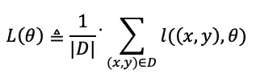

作者图片

其中 l 是模型θ的数据点(x，y)的损失。

一阶随机优化算法通过使用随机梯度迭代更新θ来优化损失函数。通常，将应用学习率来避免过度拟合或拟合不足，因此，SGD 将计算如下:

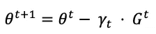

作者图片

其中ɣ是学习率或迭代步长。

随机优化算法的小批量版本计算大小为 B 的小批量上的梯度，而不是单个数据点:

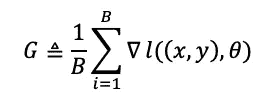

作者图片

# 同步随机梯度下降

使用分布式同步随机梯度下降(Sync-SGD ),根聚合器节点将数据分成批次，并将请求扇出到叶节点(工作机),以处理每个批次并独立计算其梯度。一旦所有机器返回结果，根聚合器节点对梯度进行平均，并将其发送回 workers 以更新模型的参数。根聚合器针对给定的历元数或基于转换条件来迭代该过程。

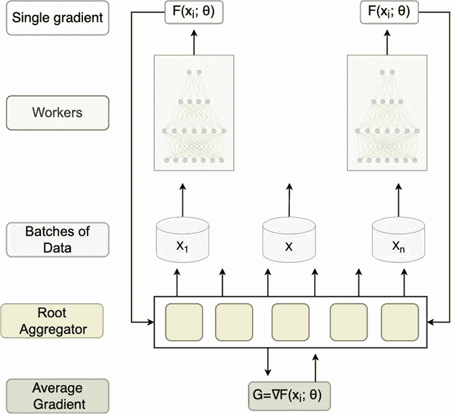

图 1:分布式同步随机梯度下降流，图片由作者提供

# 问题

理论上，将计算分布到 T 个工作机器上应该会提高 xT 的性能。然而，在现实中，性能改进很少是 xT。效率下降的原因很多，最近的研究将**掉队**和**高延迟**划分为主要根源。

# 分布式同步 SGD 中的掉队者和高延迟

**掉队者**是那些比其他工人运行速度慢得多的任务。缓慢落后可能是由于硬件故障、数据中心共享底层硬件资源的争用，甚至是其他作业的抢占。 [Rafal 等人(2017)](https://arxiv.org/abs/1604.00981) 进行了一项实验，使用 100 名工人和初始模型上的 19 个参数计算了运行 Sync-SGD 所需的时间。这些时间如图 2 所示。

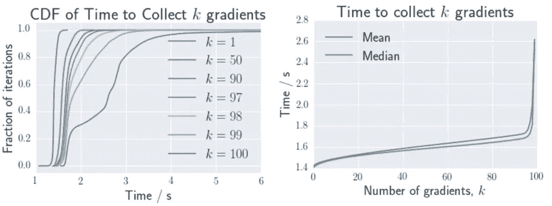

图 2:工人数量对 SYNC-SGD 培训时间的影响，[Rafal 等人(2017)](https://arxiv.org/abs/1604.00981)

**延迟**是数据通过网络到达目的地所需的时间。由于对强大计算能力的高需求及其低供应，在许多情况下，训练数据将不会与根聚合器和工作器处于相同的地理位置，这导致了高延迟。因此，我们将不得不依靠通信信道的最大带宽，这是有局限性的。例如，良好的互联网连接可以提供每秒 15 兆字节的带宽，千兆以太网连接可以提供每秒 125 兆字节的带宽。当处理大规模数据集时，这些限制可以显著减少迭代时间。

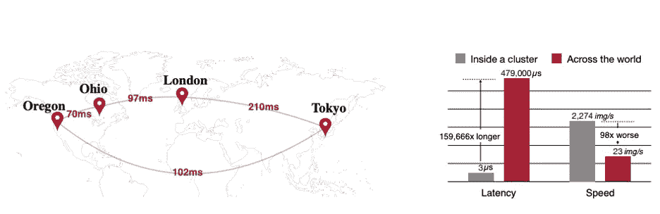

图 3:不同大陆的网络状况(左)和集群内部连接的比较(右)，[图片来自论文](https://openreview.net/pdf?id=SJeuueSYDH)

由于 Sync-SGD 算法被设计为等待直到所有工作者返回损失函数，所以它对掉队者和高延迟敏感。Sync-SGD 架构具有两个定义属性:

*   运行时间大于或等于所有工人的最大运行时间。
*   工人的运行时间具有对数正态分布[3]。

由于这些属性，随着扇出更多的工人，分布的尾部变得更长，因此平均运行时间变得最差。为了掌握工人数量对运行时间的影响，我进行了一个实验，生成了 1，000 个对数正态分布(μ=3，σ=0.1)，有 3 个样本大小(10，100，1000)，每个样本代表工人数量。

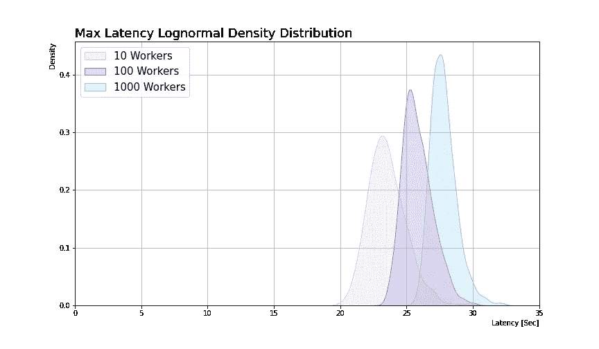

图 4:延迟对数正态密度分布，作者图片

图 4 清楚地显示，随着扇出增加，父延迟分布的平均值变高，方差变小。然而，人们会认为它会呈指数级恶化，但它只会呈对数级恶化，这可能表明在某些情况下，向更多的员工分散会更好。

# 使用 Sync-SGD 时的掉队和高延迟解决方案

对最先进的机器学习模型的“武装竞赛”导致该行业开发出需要大量计算来训练的复杂系统。当涉及到如此大的规模时，培训周期中的任何延迟都会导致整个培训过程中的重大延迟。为了满足这些高要求并减少迭代时间，来自学术界和工业界的研究人员投入了大量的时间和资源来改进和简化训练过程。我收集了针对掉队者和高延迟的 SOTA 解决方案，这些解决方案在使用 Sync-SGD 方法时可以缩短训练时间。

## 落伍者的解决方案

**掉队——错误的方法**

我最初解决这个问题的方法是丢弃掉队者的结果，并使用其他工作者的结果来计算梯度。我使用两个主要假设来支持这种方法:

*   落后者与已完成任务的比率较低-随着分散到更多的工人，落后者的数量会增加，但是，他们只容纳大约第 98 个百分位数，因此他们对平均梯度的影响相对较小。
*   从大规模数据集中减少少量数据几乎没有效果，Sync-SGD 方法用于大量数据。因此，从训练过程中去除小批量的结果对平均梯度的影响可以忽略不计。

然而，我的语调被 Rafal 等人(2017)证明是错误的。他们检查了在不使用后备工作人员的情况下丢弃掉队者的结果的影响。拥有更少的机器意味着更小的有效小批量，从而更大的梯度变化，这需要更多的迭代收敛。

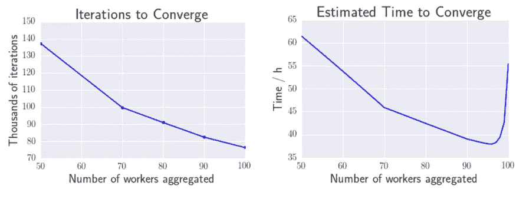

图 5:收敛的迭代次数，[Rafal 等人(2017)](https://arxiv.org/abs/1604.00981)

如图 5 所示，当减少我们聚合梯度的工人数量时，收敛所需的迭代增加了。因此，我的方法减少了每批的迭代时间，但增加了转换的次数，从而增加了总的训练时间。

**后援人员**

Rafal 等人(2017)使用其他分布式系统的技术解决了掉队问题( [MapReduce](https://www.ibm.com/topics/mapreduce#:~:text=MapReduce%20is%20a%20programming%20paradigm,tasks%20that%20Hadoop%20programs%20perform.) 、[得律阿德斯](https://www.microsoft.com/en-us/research/project/dryad/)、 [Hadoop](https://hadoop.apache.org/) 和 [Spark](https://spark.apache.org/) )。他们选择将 *b* 备份工人添加到 *N* 工人中。一旦根聚合器接收到 *N* 个输入，它就聚合它们的梯度并更新参数。最慢的 *b* 工人到达时梯度下降。从图 2 中，我们可以看到，他们的实验导致 80%的第 98 个梯度在 2s 以下到达，而只有 30%的最终梯度到达。此外，收集最后几个梯度的时间呈指数增长，导致浪费空闲资源和等待最慢梯度的时间。

作为研究的一部分，他们对在 [ImageNet 挑战数据集](https://www.image-net.org/) (Russakovsky 等人，2015)上训练的[初始模型](https://cloud.google.com/tpu/docs/inception-v3-advanced) (Szegedy 等人，2016)上的同步和[异步分布式随机梯度下降](https://arxiv.org/abs/1609.08326)算法进行了经验比较。

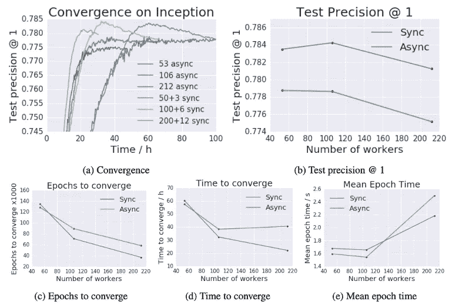

图 Rafal 等人(2017) 使用不同数量的机器在初始模型上同步-SGD 和异步-SGD 的收敛

从图 6 中，我们可以看到使用不同数量的工作人员和备份工作人员( *N+b* )对转换时间和速率有明显的影响。图 6 (b)显示，分散更多的工人并不一定能提供更好的结果。当超过约 105 个工人时，模型的精度下降约 0.3%。此外，在图 6 (c)和 6 (d)中，改善斜率随着工人数量的增加而降低，这反映在“肘”形中。

## 高延迟解决方案

**环形全减**

环全缩减是一种众所周知的用于减少高等待时间的方法。它被优步采用并合并到[“horo VOD”库中。它利用带宽最佳的通信算法，而不放松同步约束。这种方法解决了根聚合器和工作器之间的带宽限制，并试图优化它。](https://eng.uber.com/horovod/)

为了更好地理解环 All-Reduce 的工作原理，我们将从探索 All-Reduce 方法开始。All-Reduce 算法让每个工作者与所有其他工作者共享其参数，并应用归约运算(例如，和、乘、最大或最小)。All-Reduce 算法有多种实现方式。一些目标是减少带宽，而另一些则试图减少延迟。

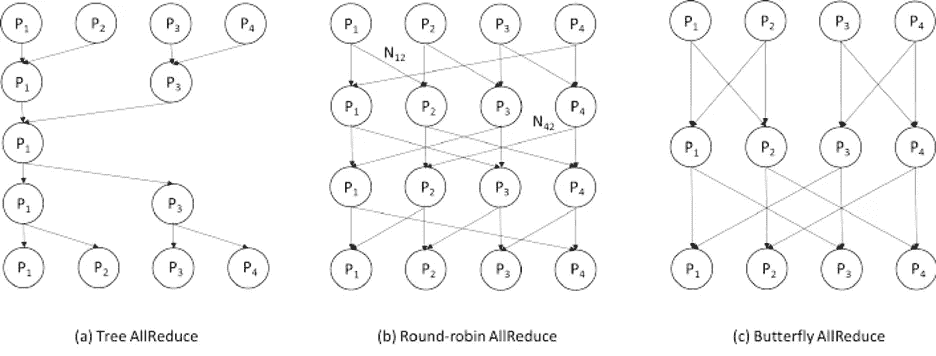

图 7: ALL-REDUCE，作者 [Huasha 等人(2013)](https://www.researchgate.net/publication/259239833_Sparse_Allreduce_Efficient_Scalable_Communication_for_Power-Law_Data)

如图 4 所示，当增加工人数量时，我们看到了延迟的长尾现象。最重要的是，当在根聚合器和工作器之间使用简单的通信方法来传输数据时，通信成本随着工作器数量的增加而线性增加。

图 8:同步分布式培训，作者图片

Ring All-Reduce 算法打开了在全对一方法中向单参数服务器发送数据所产生的瓶颈。在这种技术中，每个工人分配有两个工人；一个用来发送数据，另一个用来接收数据，然后运行以下步骤:

*   **分散-减少** —每个工作者发送和接收来自其邻居的大量数据。在第一次传输迭代完成后，工人执行简化的操作，然后再次将其发送到环中的下一个流程。当每个进程完成数据块的缩减时，此阶段结束。
*   **All-gather** —每个工作者将用新收到的值替换其值，并继续传输数据，直到每个工作者收到所有其他工作者的贡献。

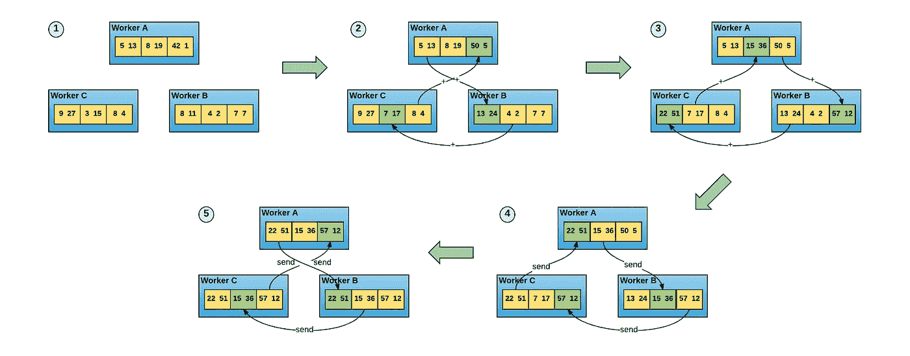

图 9:环形全缩小算法，图像由[【Horovod】](https://eng.uber.com/horovod/)

环形 All-Reduce 算法的速度与工作进程的数量无关，而是受到相邻工作进程之间最慢的通信链路的限制。环形 all-reduce 算法以与参数服务器框架相同的方式应用于 Sync-SGD 系统，但是它不是将梯度发送到单个参数服务器，而是将其发送到其邻居。

# 结论

随着数据集的大小和模型复杂性的增加，分布式培训将在 MLOps 生态系统中变得越来越常见。正如我们所见，一个培训周期的延迟会对整个培训过程产生重大影响。因此，需要完善训练过程并减少每个时期的时间。如果你有更多的想法、问题或想法，我很乐意倾听！

更多类似这样的内容，关注我[LinkedIn](https://www.linkedin.com/in/nir-barazida/)&[Twitter](https://twitter.com/barazida)。