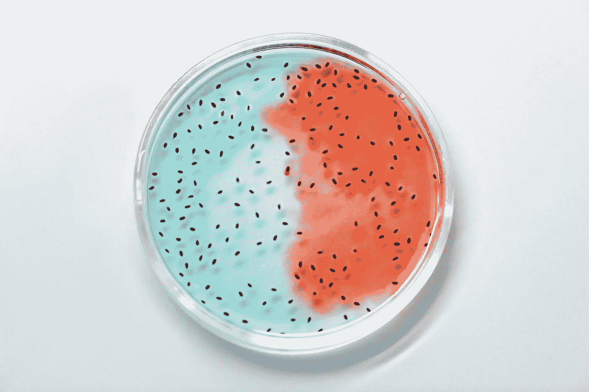
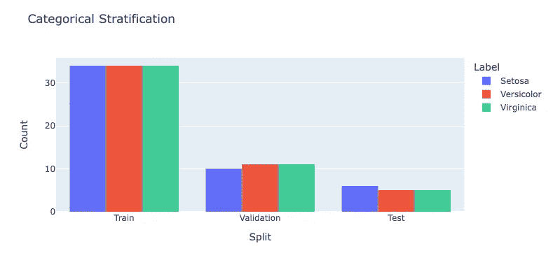
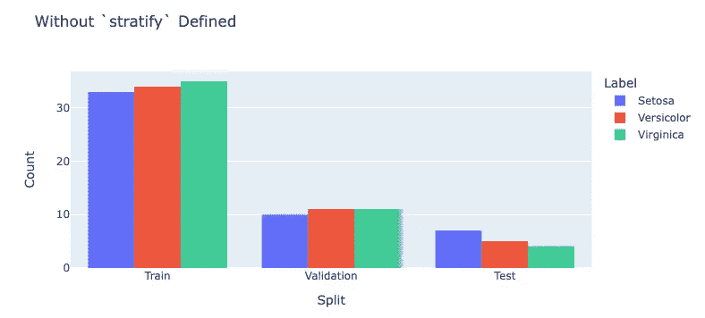
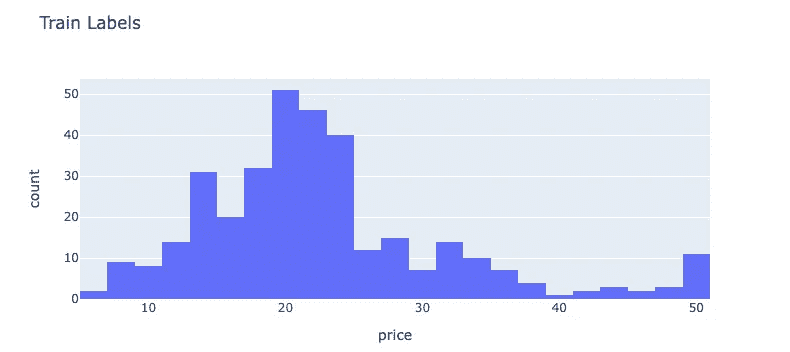
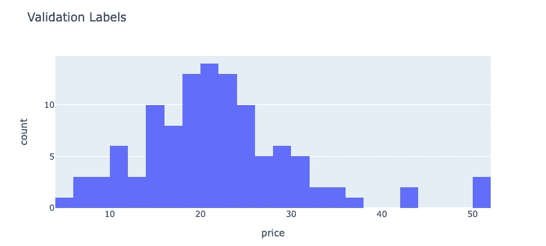
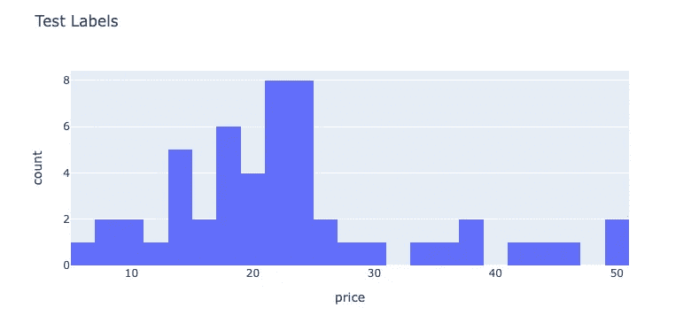
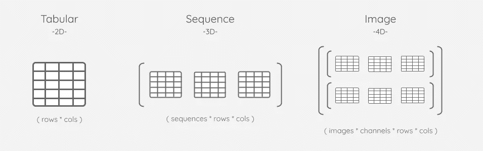

# 简单分层

> 原文：<https://towardsdatascience.com/straightforward-stratification-bb0dcfcaf9ef>

## 处理数字、无监督和多维数据



照片由[爱德华·詹纳](https://www.pexels.com/@edward-jenner)在[像素](https://www.pexels.com/photo/glass-blur-bubble-health-4033022/)上拍摄

> 用于分层的常用数据科学工具非常适合处理监督分类数据集。但是，它们不是为开箱即用地处理数值、无监督和多维数据集而设计的。这就是 [AIQC](https://github.com/aiqc/aiqc) 擅长的地方。

## 分层导致一般化

在以前的博客文章中，我们广泛地讨论了用验证和测试分割/折叠来评估模型的重要性:

*   [**评估偏差**](/evaluation-bias-are-you-inadvertently-training-on-your-entire-dataset-b3961aea8283)
*   [**识记过拟合**](https://aiqc.medium.com/memorization-isnt-learning-it-s-overfitting-b3163fe6a8b4)
*   [**数据泄露**](/data-leakage-5dfc2e0127d4)

T 预测分析的目的是训练一个可以应用于其他地方的模型——能够对模型从未见过的外部样本做出预测。为了实现这一点，模型被训练的数据*分布*必须是更广泛的*群体*的*代表*。

在本帖中，我们将介绍如何对不同类型的数据进行分层，以及在此过程中需要注意的陷阱

## 类别分层

让我们尝试对虹膜数据集进行分层。首先，我们导入数据:

```
from sklearn import datasets
iris = datasets.load_iris()
features, labels = iris['data'], iris['target']
```

然后，我们使用 *sklearn 的* `train_test_split`函数将数据分割成训练、验证和测试分割。注意`stratify`参数的使用。

```
from sklearn.model_selection import train_test_splittrain_features, eval_features, train_labels, eval_labels = **train_test_split**(
    features, labels, test_size=0.32, **stratify**=labels
)# `eval_*` is further divided into validation & test.
val_features, test_features, val_labels, test_labels = **train_test_split**(
    eval_features, eval_labels, test_size=0.32, **stratify**=eval_labels
)
```

稍微争论一下，我们就可以画出新拆分的分布图。

```
import numpy as np
_, train_counts = np.**unique**(train_labels, return_counts=True)
_, val_counts = np.**unique**(val_labels, return_counts=True)
_, test_counts = np.**unique**(test_labels, return_counts=True)from itertools import chain
counts = list(chain(train_counts,val_counts,test_counts))
labels = ['Setosa', 'Versicolor', 'Virginica']
labels = labels + labels + labels
splits = ['Train', 'Train', 'Train', 'Validation','Validation','Validation','Test','Test','Test']import pandas as pd
df = pd.**DataFrame**()
df['Count'], df['Label'], df['Split'] = counts, labels, splitsimport plotly.express as px
px.**histogram**(
    df, x='Split', y='Count', color='Label',
    barmode='group', height=400, title='Stratification'
).update_layout(yaxis_title='Count')
```



作者图片

请注意，随着我们对数据进行越来越多的划分，分布将很难保持均匀。当数据集中有一个*少数*类时，很容易在后面的子集中用完这个代表性不足的类的样本。这很容易导致少数类的零表示分离，特别是在像 10 重交叉验证这样的场景中。这种代表性不足不仅是*偏差*的来源，还会在计算绩效指标时导致错误。



作者图片

如果我们在不使用`stratify`参数的情况下运行相同的代码，那么我们会看到我们的分布变得倾斜。尽管在数据集中类被平等地表示，当我们让分层随机进行时，*测试*分裂变得偏斜。

## 数字分层

然而，当试图将`stratify`与具有许多唯一值的数字(整数或浮点数)标签一起使用时，很可能会立即遇到下面的错误:

```
from aiqc import datum
df = datum.to_pandas('houses.csv')
labels = df['price'].to_numpy()
features = df.drop(columns=['price']).to_numpy()train_features, eval_features, train_labels, eval_labels = **train_test_split**(
    features, labels, test_size=0.32, **stratify**=labels
)**"""
ValueError**: The least populated class in y has only 1 member, which is too few. The minimum number of groups for any class cannot be less than 2.
"""
```


里克·巴雷特在 [Unsplash](https://unsplash.com/photos/uwk8IS-HfJ8) 上的照片

## 垃圾箱来了

我们可以通过将唯一标签值放入*装箱范围*来减少它们的数量。然后，我们可以将它们各自的*箱号*视为*离散化的*分类数据。

首先用[熊猫分位数切割](https://pandas.pydata.org/docs/reference/api/pandas.qcut.html)分割数值数据:

```
bin_count = 5
bin_numbers = pd.**qcut**(
    x=labels, q=bin_count, labels=False, duplicates='drop'
)train_features, eval_features, train_labels, eval_labels = **train_test_split**(
    features, labels, test_size=0.32, **stratify**=bin_numbers
)# 2nd round
bin_numbers = pd.**qcut**(
    x=eval_labels, q=bin_count, labels=False, duplicates='drop'
)val_features, test_features, val_labels, test_labels = **train_test_split**(
    eval_features, eval_labels, test_size=0.32, **stratify**=bin_numbers
)
```

然后绘制它们以验证分布:

```
train_df = pd.**DataFrame**(train_labels, columns=['price'])
val_df = pd.**DataFrame**(val_labels, columns=['price'])
test_df = pd.**DataFrame**(test_labels, columns=['price'])px.**histogram**(train_df, x='price', height=400, title='Train Labels', nbins=30)
px.**histogram**(val_df, x='price', height=400, title='Validation Labels', nbins=30)
px.**histogram**(test_df, x='price', height=400, title='Test Labels', nbins=30)
```



作者图片

> 看着这些图表真的让我质疑来自广泛交叉验证(5-10 倍)的指标是如何可信的。



作者图片

## 多维和无监督数据

让我们更进一步。如果我们没有*标签*怎么办？如果我们的数据不是表格形式的呢？

下面的摄取脚本会生成一个 3D 数组。有 1000 个病人的 178 个脑电图读数。每一组阅读材料都被格式化为挑战的 2D。

```
df = datum.to_pandas('epilepsy.parquet')
features = df.drop(columns=['seizure']).to_numpy().reshape(1000, 178, 1)
```

您可能会惊讶，标签实际上并不需要执行分层。该函数不关心*分层*数组来自哪里，它只需要与我们的特征具有相同的样本顺序。但是，如果我们尝试使用 3D 要素进行分层，则会出现错误:

```
train_features, eval_features, = **train_test_split**(
    features, test_size=0.32, **stratify**=features
)"""
ValueError: Found array with dim 3\. Estimator expected <= 2.
"""
```

花点时间想一想，数组中每个样本有 178 个读数。那么它到底是通过什么来分层的呢？让我们取每组读数的中间值*作为分层数组。*

```
medians = [np.**median**(arr) for arr in features]bin_count = 5
bin_numbers = pd.**qcut**(x=medians, q=bin_count, labels=False, duplicates='drop')train_features, eval_features, = train_test_split(
    features, test_size=0.32, stratify=bin_numbers
)# 2nd round
medians = [np.**median**(arr) for arr in eval_features]bin_numbers = pd.**qcut**(
    x=medians, q=bin_count, labels=False, duplicates='drop'
)
val_features, test_features = **train_test_split**(
    eval_features, test_size=0.32, stratify=bin_numbers
)
```

## 和 AIQC 在一起更容易

如果你对这一切感到有点不知所措，可以看看 AIQC——一个端到端 MLops 的开源库。它为预处理/后处理、实验跟踪和模型评估提供了高级 API。

例如，当使用`aiqc.Pipeline`摄取数据时，从业者可以使用分层参数来*声明*他们希望如何处理他们的数据:

```
size_test       = 0.22
size_validation = 0.12
fold_count      = 5
bin_count       = 15
```

由于 AIQC 是[数据感知型](https://aiqc.readthedocs.io/en/latest/compare.html)，知道如何处理数据集的数据类型和监管。

AIQC 是本帖作者创建的一个开源库。

*别忘了 github.com/aiqc/aiqc*[](https://github.com/aiqc/aiqc)

## *摘要*

*让我们回顾一下我们所学的内容:*

*   *分层确保训练和评估数据是在更广泛的*人群*中发现的分布的*代表*，这有助于我们训练*可概括的*模型。*
*   **宁滨离散化*数值数据用作分层数组。*
*   *分层数组*不一定是标签/目标*！*
*   **汇总统计*如均值和中值帮助我们减少特征的*维度*以用作分层数组。*