# 奇怪的事情:建立 2D 和 3D 模型…用乐高积木在 R

> 原文：<https://towardsdatascience.com/stranger-things-building-2d-and-3d-models-with-lego-bricks-in-r-285538c7c7d3>

## 如何用 R 中的“brickr”包在 2D 和 3D 中模拟和可视化乐高积木

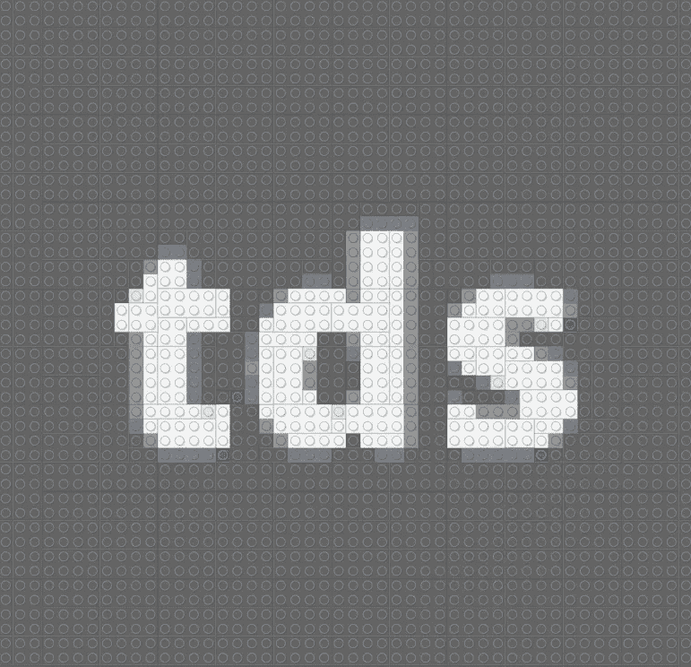

奇怪的事情:用乐高积木建造 2D 和 3D 模型？在 R-TDS 标志转换为乐高积木(图片由作者提供)

几乎每个孩子在某个时候都有一套乐高积木作为生日礼物、圣诞礼物或取得好成绩的礼物。我不知道你怎么想，但作为一个孩子，我可以花几个小时在指令之外建造奇妙的世界、生物和几乎所有创造力可以在我耳边低语的东西。

这就是为什么，唤起童年的记忆，并贡献一篇关于你仍然不知道你可以用 R 做的有用或好奇的事情的文章，我想这次向你介绍" **brickr** "，这是一个有趣而完整的包，将乐高体验带到 R 和" **tidyverse** "生态系统。这个包包括工具，将帮助您创建马赛克，甚至输出的三维模型与真正的乐高元素。

该包装分为:

*   **马赛克**:将图像变成可以用乐高积木搭建的马赛克。
*   **3D 模型:**使用“rgl”从数据表中构建乐高 3D 模型。

# 软件包安装

在 r 中创建新的脚本。首先，您必须简单地从它的存储库中安装这个包，以便以后加载这个库。

```
# INSTALL PACKAGEinstall.packages("brickr")# LOAD LIBRARIESlibrary(brickr)
library(dplyr)
```

# 建筑马赛克

镶嵌功能使用颜色和乐高积木渲染导入的 JPG 或 PNG 文件。比如你可以抓取 R 标志来加载。原图如下:


奇怪的事情:用乐高积木建造 2D 和 3D 模型？在 R-R 标识中(图片由[维基共享](https://commons.wikimedia.org/wiki/File:R_logo.svg)提供)

一些注意事项:

*   瓷砖是低分辨率的，只有 42 种颜色。
*   尽量减少背景噪音。一个好的技巧是去除图像的背景。
*   你可以用"**亮度**"和"**对比度**"参数，你也可以调整尺寸和调色板，在" **image_to_mosaic()** 函数中

```
# MOSAICS, LOAD ANY PHOTO OR IMAGEmyImage_R <- png::readPNG("R_logo.png")myImage_R %>% 
  image_to_mosaic(
    # DEFAULT SIZE IS "48x48" BRICKS
    50, 
    brightness = 1, 
    contrast = 1, 
    # SETTING BRICKS TO USE
    use_bricks = c("4x6", "2x4", "1x2", "1x1") 
  ) %>% 
  build_mosaic()ggplot2::ggsave("img/R_logo_mosaic.png", device="png")
```

结果如下，如你所见，即使不考虑砖块的数量和类型。


奇怪的事情:用乐高积木建造 2D 和 3D 模型？在 R-R 标志转换成乐高积木(图片由作者提供)

如果这还不足为奇，您还可以从获得的创建 3D 模型，添加“ **bricks_from_mosaic** ()”函数。例如:

```
# 3D FROM MOSAIC, LOAD ANY PHOTO OR IMAGEmyImage_R_3D <- png::readPNG("R_logo.png")myImage_R_3D %>% 
  image_to_mosaic() %>% 
  # CONVERT TO 3D BRICKS
  bricks_from_mosaic() %>% 
  build_bricks()
```

通过它您将获得 3D 效果，您将能够使用 RStudio 显示的查看器欣赏 3D 效果。

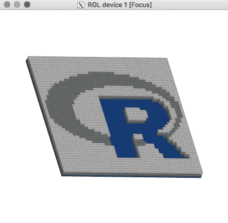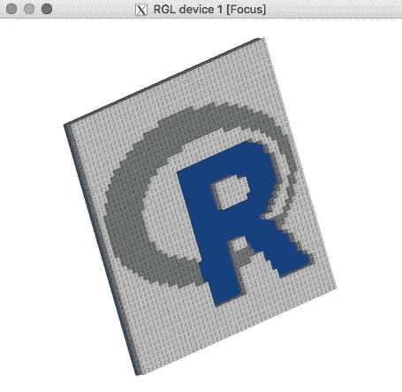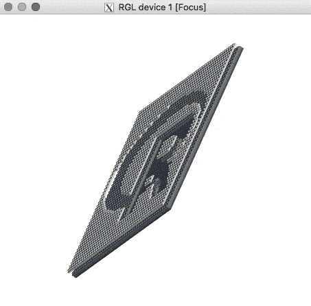

奇怪的事情:用乐高积木建造 2D 和 3D 模型？在 R-R 徽标转换为 3D 乐高积木(图片由作者提供)

# 获取说明和部件来构建您真正的乐高模型

如果以上还嫌少，现在您可以获得说明，甚至是构建您生成的任何模型的砖块列表。

您将能够使用“ **build_instructions()** ”功能将瓷砖和 3D 模型分解成更易于阅读的步骤，就像您会发现购买的任何乐高套装一样。默认情况下，它将输出 6 步，但是将一个整数值作为参数传递给函数将输出该步数。

您也可以使用" **build_pieces()** "函数来生成所需片段的图像。这些碎片将按颜色和大小分类。

```
# GET INSTRUCTIONS AND PIECES TO BUILD MODEL, LOAD ANY PHOTO OR IMAGEmyImageInstructions_R <- png::readPNG("R_logo.png") %>% 
  image_to_mosaic()myImageInstructions_R %>% 
  build_mosaic()
# GENERATING INSTRUCTIONS
myImageInstructions_R %>% 
  build_instructions(9)
# GENERATING PIECES
myImageInstructions_R %>% 
  build_pieces()
```

因此，您将首先获得一个带有说明的图，例如，构建 R 徽标:

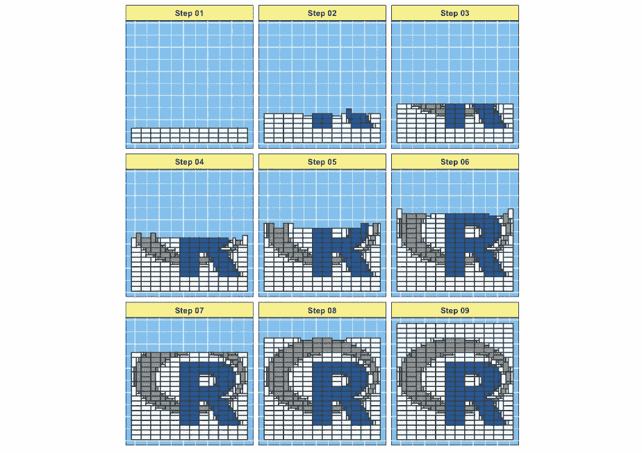

奇怪的事情:用乐高积木建造 2D 和 3D 模型？在 R-R 标识说明中，用乐高积木搭建(图片由作者提供)

然后，你会得到建议的砖块，你将需要建立 R 标志。

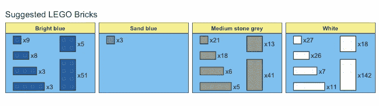

奇怪的事情:用乐高积木建造 2D 和 3D 模型？用乐高积木搭建的 R-R 标志(图片由作者提供)

# 构建 3D 模型

您可以从各种输入格式创建乐高积木的 3D 模型。“ **bricks_from_table()** ”和“ **bricks_from_excel()** ”函数将整数表转换为乐高积木的矩阵形式。对于简单模型，可以使用“ **data.frame()** ”或“ **tibble::tribble()** ”函数手工制作此表。对于更高级的模型，建议使用 MS Excel 或 CSV 文件。一些注意事项:

*   数据帧中的每个值对应一个 1x1 砖块。
*   " **Level** "告诉砌砖工将砖块放置到多高。
*   “ **x** ”值是“Level”之后的列。
*   “ **y** ”值是隐式的，对应于数据帧的行。
*   数值可以在 1 到 54 之间预先确定，每个数字对应一种不同的颜色。

例如，假设您想简单地建造一块砖，以测试上述内容:

```
# BUILD 3D BRICK FROM "bricks_from_table()" FUNCTIONdata.frame(
  Level = "A",
  x1 = 33 
) -> myBrickmyBrick %>% 
  # CONVERT INTO A BRICKR OBJECT
  bricks_from_table() %>% 
  build_bricks()
```

您将在 RGL 查看器中获得 3D 模型输出

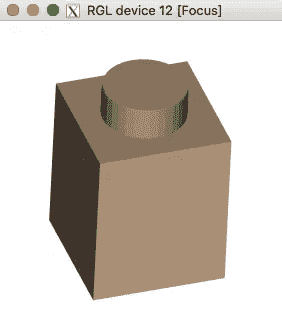

奇怪的事情:用乐高积木建造 2D 和 3D 模型？在 R 中——单块 3D 乐高积木(图片由作者提供)

通过更多地了解它是如何工作的，您可以构建更复杂的模型。例如，假设你想做一个小房子:

```
# BUILD HOUSE 3D BRICKS FROM "bricks_from_table()" FUNCTIONtibble::tribble(
  ~Level, ~x1, ~x2, ~x3, ~x4, ~x5,
  "A",   13,   13,   13,   13,   13,
  "A",   3,   0,   0,   0,   3,
  "A",   3,   0,   0,   0,   3,
  "A",   3,   3,   0,   3,   3,
  #---
  "B",   13,   13,   13,   13,   13,
  "B",   3,   0,   0,   0,   3,
  "B",   3,   0,   0,   0,   3,
  "B",   13,   13,   13,   13,   13,
  #---
  "C",   18,   18,   18,   18,   18,
  "C",   13,   13,   13,   13,   13,
  "C",   13,   13,   13,   13,   13,
  "C",   18,   18,   18,   18,   18,
  #---
  "D",   0,   0,   0,   0,   0,
  "D",   18,   18,   18,   18,   18,
  "D",   18,   18,   18,   18,   18,
  "D",   0,   0,   0,   0,   0
) -> myHousemyHouse %>% 
  bricks_from_table() %>% 
  build_bricks()
```

您将在 RGL 查看器中看到如下内容:

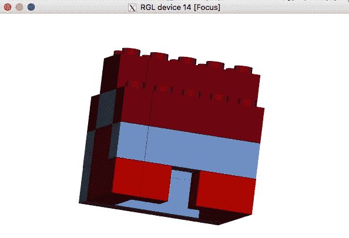

奇怪的事情:用乐高积木建造 2D 和 3D 模型？室内 3D 乐高积木(图片由作者提供)

# 编程 3D 模型

我们还有函数“ **bricks_from_coords()** ，它取一个数据帧，数据帧有整数值“ **x** ”、“ **y** ”、“ **z** ”和“ **Color** ”列，其中“x”、“y”和“z”的每一个组合都是三维空间中的一个点。颜色必须是来自“**build _ colors()”**的乐高官方颜色名称。这种格式比“bricks_from_table()”函数灵活得多，并且允许 3D 模型的编程开发。一些注意事项:

*   " **x** ":砖块从左到右的位置，数值> 0
*   " **y** ":砖块从前到后的位置，数值> 0
*   " **z** ":砖块自下而上的位置，数值> 0
*   "**颜色**":要使用的颜色的名称。
*   使用“ **tidyr::crossing()** ”为输入数据的每个组合创建一行。
*   选项" **outline_bricks = TRUE** "在砖块边缘添加黑色轮廓。
*   设置" **rgl_lit = FALSE** "禁用 rgl 的自动灯光效果。

例如，假设您想在创建更复杂的东西之前，先创建一个砖块，以了解上面的工作原理:

```
# BUILD 3D BRICK FROM "bricks_from_coords()" FUNCTIONtibble::tibble(
  x = 1, y = 1, z = 1, color = "Bright orange"
) %>% 
  bricks_from_coords() %>% 
  build_bricks()
```

然后你会看到砖块

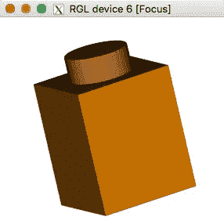

奇怪的事情:用乐高积木建造 2D 和 3D 模型？在 R 中——单块乐高积木(图片由作者提供)

一旦您对“bricks_from_coords()”函数的工作原理有了更清楚的了解，那么现在您就可以编写一个模型的构造程序，该模型的各个部分模拟了一只“唐老鸭”:

```
# BUILD 3D DONALD FROM "bricks_from_coords()" FUNCTION# X AND Y NOT INCLUDED SINCE THEY ARE CONSTANT
# "b" IS BRICK & "p" IS PLATE (1-unit)
# "mid_level" HAS 3 UNITS: 0, 1, 2tibble::tribble(
  ~z, ~mid_level,  ~piece_type, ~color,
  # ORANGE FEET
  1, 0, "b", "Bright orange", 
  # WHITE LEGS
  2, 0, "b", "White", 
  # BLUE SHIRT
  3, 0, "b", "Bright blue", 
  # ADD 2 PLATES HEIGHT
  4, 0, "p", "Bright blue", 
  4, 1, "p", "Bright blue",
  # BEAK
  4, 2, "p", "Bright orange", 
  # HEAD
  5, 0, "b", "White",
  6, 0, "p", "White",
  #CAP BRIM
  6, 1, "p", "Black", 
  # CAP
  6, 2, "p", "Bright blue" 
) -> donaldBricks# "tidyr::expand()" ADD X AND Y, WHILE DUPLICATING EACHdonaldBricks %>% 
  tidyr::expand(x=1:2, y=1:2,tidyr::nesting(z, mid_level, piece_type, color)
  ) -> myDonaldmyDonald %>% 
  bricks_from_coords() %>% 
  build_bricks(
    background_color = "#d8fdff" 
  )
```

现在，您将在 RGL 查看器中看到如下所示的 3D 图形:

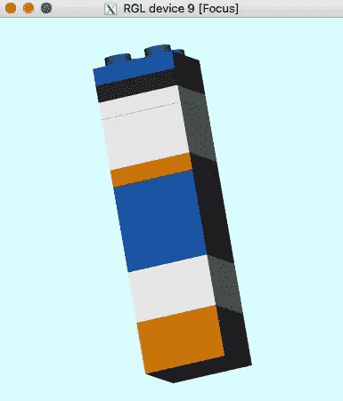

奇怪的事情:用乐高积木建造 2D 和 3D 模型？在 R —“唐老鸭”3D 乐高积木(图片由作者提供)

如你所见，多一点练习，你就可以花很多时间在你的创作上。该软件包的主要目标之一是通过易于创建的 3D 模型来激发新受众对 R 和编程的兴趣。如果你目前像我一样，致力于教育和指导，你会发现这个资源非常有用，也很有趣。

我告别分享一个由我和我女朋友的头像生成的漂亮马赛克，我喜欢它，我将打印说明，以便我们可以组装马赛克呵呵(情人节礼物的好主意)。

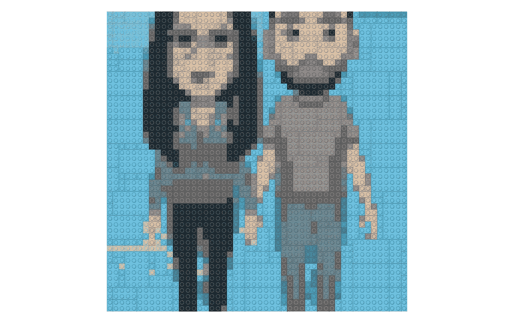

奇怪的事情:用乐高积木建造 2D 和 3D 模型？在《我和我的女友》中，图片被转换成乐高积木(图片由作者提供)

我们很快阅读。非常感谢您的善意阅读。和我的大多数文章一样，在这里你可以找到完整的代码:[](https://github.com/cosmoduende/r-lego)

**感谢你坚持到最后，祝你分析非常愉快，可以把一切都付诸实践，对结果感到惊讶，和我一样开心！**