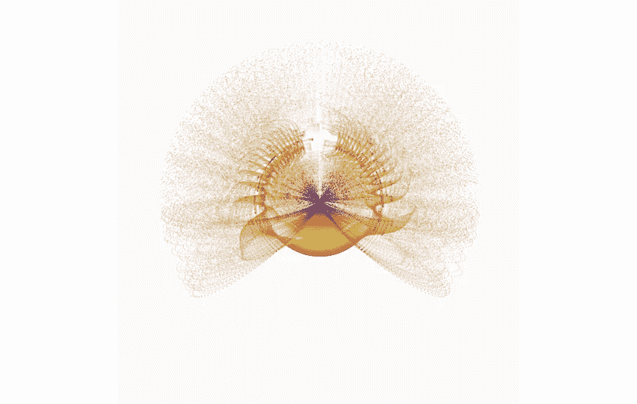
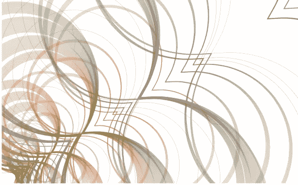
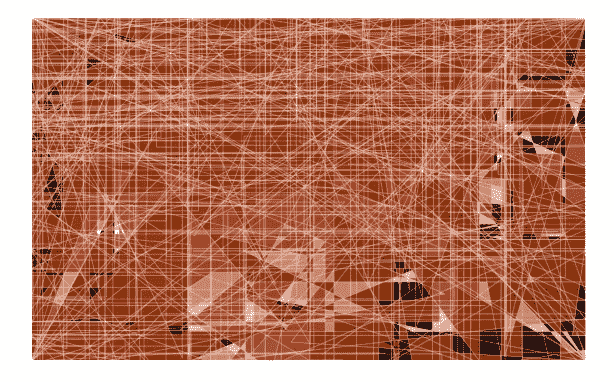
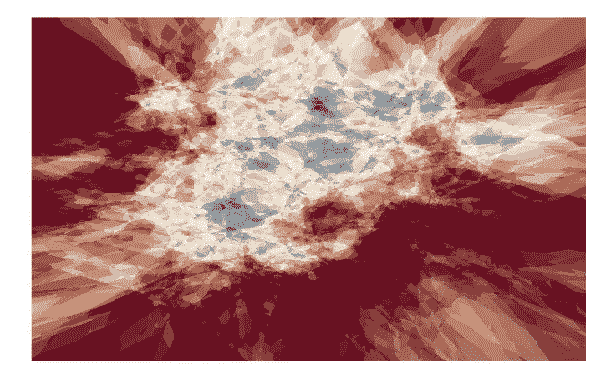
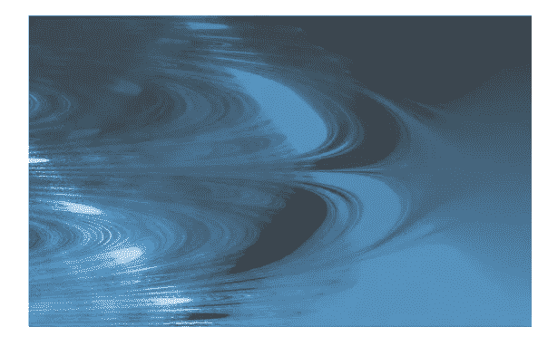

# 奇怪的东西:用 R 创造生成艺术

> 原文：<https://towardsdatascience.com/stranger-things-creating-generative-art-with-r-4f26c24ad8fb>

## 如何不花太多力气，不成为一个带着“艺术”包装的艺术家，就创造出生成性艺术



奇怪的东西:创造生成艺术…与 R？——用“aRtsy”(作者的图像)创作的生成艺术

人类的一个重要部分是创造和欣赏艺术的能力，这是我们区别于地球上其他生物的一个重要部分。以审美的方式(或相反的方式)再现现实并通过图像表达情感是其中的一部分，所有这些都有一系列非常多样的风格，从最简单的到最复杂和抽象的，有无数的技术。

> "**我梦见**我的**画，然后我画**我的**梦**。"
> ——文森特·梵高

但是，如果我们告诉我们的朋友文森特，现在计算机可以为我们做梦，并在几秒钟内简单地翻译它，会怎么样？还算艺术吗？我个人有我的疑惑，然而**【生成艺术】**的概念已经确立。这是艺术的名称，部分或全部是使用自主系统创作的，也就是说，一般来说，这个系统是非人类的，可以独立地决定一件艺术品的特征。

现在，如果我告诉你，你可以用 R 创造生成艺术，你会怎么说？这不是一个笑话，目前有一些软件包也将允许您使用这种强大的语言来创作艺术，而没有没有受过专业艺术家培训的限制。

对于这篇特别的文章，我想向您介绍**“aRtsy”**包。使用这个库提供了一个算法，它结合了随机性来创建艺术作品，并使用 **"ggplot2"** 包来可视化它们。每种算法都在一个独立的函数中实现，有自己的一组可以修改的参数。

## 软件包安装

在一个新的 R 脚本中，首先必须安装软件包并加载库。

```
# INSTALL AND LOAD LIBRARYinstall.packages("aRtsy")
library(aRtsy)
```

## 参数和注意事项

您必须非常清楚每个函数期望的主要参数的用法:

> **colors** :这是一个字符串，指定用于艺术作品的颜色。
> 
> **n** :正整数，指定要生成的随机数据点数。
> 
> **分辨率**:以每行/列像素为单位的图稿分辨率。提高分辨率会提高图稿的质量，但也会成倍增加计算时间。

还要记住，“aRtsy”与“艺术品收藏”一起工作，它有一系列预定义的功能，主要分为四类:

> 迭代集合
> 
> 几何图形系列
> 
> 受监督的收藏
> 
> 静态集合

给你一个建议，考虑到 RStudio 中某些作品的渲染时间可能会很长，建议你将作品保存到一个文件(。png 或者。jpg)。您可以使用**“save canvas()”**功能以适当的尺寸和质量保存作品。例如:

```
# TESTING SAVE ART IMAGEsaveArt <- canvas_strokes(colors = c("black", "white", "yellow", "blue"))
saveCanvas(saveArt, filename = "mySavedArt.png")
```

然后，您将在您选择的目录中找到保存为图像的创成式艺术的结果。


奇怪的东西:创造生成艺术…与 R？—使用保存在根目录中的“aRtsy”创建的生成性艺术(图片由作者提供)

## 测试迭代集合

该集合实现其状态依赖于前一状态的算法。这些算法主要使用基于网格的画布进行绘制。在这个网格中，每个点代表最终图像的一个像素。通过根据特定规则给这些点分配颜色，可以创建该集合中的图像。下面我们具体用**“canvas _ reca man()”**函数来试试。在这个函数中，算法在正数线上越来越大的后退，但是如果不能后退，就前进。

```
# TESTING RECMAN'S SEQUENCEcanvas_recaman(colors = colorPalette("klimt"), background = "white", 
               iterations = 1000, start = 50,
               increment = 10, curvature = 5,
               angle = 45, size = 0.1,
               closed = FALSE)
```

然后，您将获得如下所示的生成艺术:



奇怪的东西:创造生成艺术…与 R？—生成艺术(Recman 的序列)由“aRtsy”(作者的图像)创建

## 测试几何图形系列

这个集合主要实现绘制几何形状并对其应用随机颜色的算法。让我们具体用**“canvas _ 折线()”**函数来试试。这个函数在画布上绘制许多点，并将这些点连接成一个多边形。对所有颜色重复此操作后，所有多边形的边界都将绘制在插图的顶部。

```
# TESTING POLYLINEScanvas_polylines(colors = colorPalette("lava"), background = "white", ratio = 0.6, iterations = 600,
                 size = 0.1, resolution = 800)Now you will find that you will have as a result a generative art similar to the following:
```

你现在会发现，结果你会有一个类似于以下的生成艺术:



奇怪的东西:创造生成艺术…与 R？—用“aRtsy”(作者提供的图片)创建的生成艺术(折线)

## **测试被监督的集合**

该系列中的艺术品灵感来自机器学习任务中的决策边界图。该集合中的算法通过在二维表面(具有连续或分类响应变量)上生成随机数据点来工作，然后它们试图使用机器学习算法对其进行建模。然后，他们试图预测画布上每个像素的颜色。下面我们具体用**“canvas _ nebula()”**函数来试试。该函数使用代码生成图像，以创建 k-最近邻的噪声形式。这些艺术作品中的一些可能类似于外太空的星云。

```
# TESTING NEBULAcanvas_nebula(colors = colorPalette("tuscany2"), 
              k = 60, n = 400, resolution = 1000)
```

然后，您将得到如下结果:



奇怪的东西:创造生成艺术…与 R？—用“aRtsy”(作者图片)创建的生成艺术(星云)

## 测试静态集合

这个系列实现了静态图像，产生了很好的艺术效果。我们具体用**“canvas _ circle map()”**函数来试试。该功能实现了“Arnold tongue”的概念，这是一种通过可视化动态系统的旋转数或与之相关的另一个不变属性如何根据其两个或更多参数变化而出现的图像现象。

```
# TESTING CIRCLE MAPcanvas_circlemap(colors = colorPalette("dark2"), left = 1, 
                 right = 0, bottom = 1, top = 13,
                 iterations = 75, resolution = 1200)
```

结果，你会得到一个像下面这样的新的生成艺术:



奇怪的东西:创造生成艺术…与 R？—用“aRtsy”(作者提供的图片)创建的生成艺术(圆形地图)

您可以探索组成这个有趣包的其余功能，并体验您肯定拥有的创造性。GitHub 上的主[“aRtsy”库中记录了所有的东西。除了艺术，你想知道你能用这些知识做什么吗？NFT 的。小心，随着 NFT 的繁荣，你现在可以用几行代码和最少的努力来创建完全原创的集合。剩下的就看你的创造力了，如你所见。](https://koenderks.github.io/aRtsy/reference/index.html)

我会再写几篇关于你可能不知道你可以用 r 做的不寻常的事情的文章。非常感谢你的阅读。和我的大多数文章一样，在这里你可以找到完整的代码:【https://github.com/cosmoduende/r-generative-art】T4

感谢你坚持到最后，祝你分析非常愉快，编码也非常愉快，希望你能把一切都付诸实践，希望你对结果感到惊讶，和我一样开心！