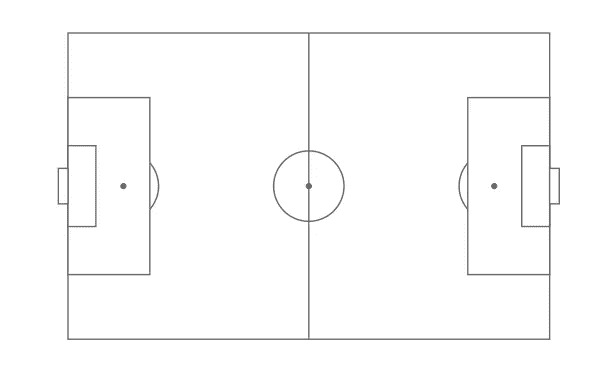
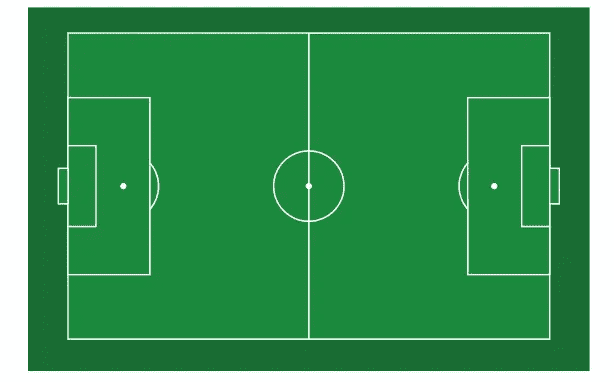
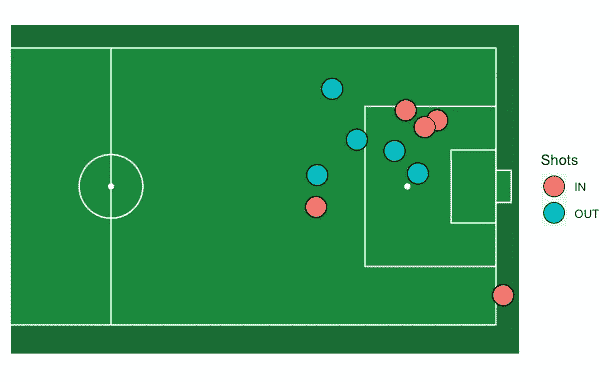
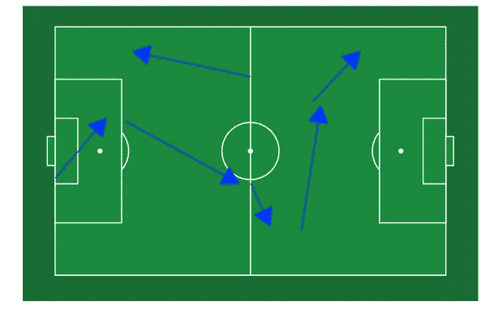
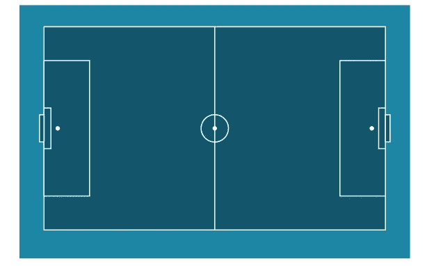

# 奇怪的事情:用足球场上的 R 可视化足球数据

> 原文：<https://towardsdatascience.com/stranger-things-visualizing-soccer-data-with-r-on-a-soccer-pitch-8fe1f6b521fe>

## 如何使用“ggsoccer”软件包分析、可视化和报告足球场上的足球数据和策略


[李中清](https://unsplash.com/@picsbyjameslee?utm_source=medium&utm_medium=referral)在 [Unsplash](https://unsplash.com?utm_source=medium&utm_medium=referral) 上拍照

足球是世界上最受欢迎的运动之一。地球上三分之一的人至少踢过一次足球。如果你属于一个像我这样的拉丁美洲国家(墨西哥)，你可能是在和你的邻居、朋友和家人一起玩耍中长大的，你在童年时拥有超过四个足球。

不久前，我遇到了一个儿时的朋友，他对足球的热爱让他走上了职业生涯。我无法想象，那个我们喜欢在附近和其他孩子一起踢足球的男孩，有一天会成为一名职业教练。

和他聊了一会儿他的职业，我想到了一个包裹。我发现自己正在开发一个应用程序，可以为他节省分析和战略规划的时间。这个包就是**“gg soccer”**也是本文的主题。“ggsoccer”提供了一些功能，使得在**“gg plot 2”**中绘制足球事件数据变得容易。因为“gg 足球”是作为 ggplot 层实现的，所以定制一个情节很容易。

## 软件包安装

在一个新的 R 脚本中，首先必须安装软件包并加载库。

```
# INSTALL AND LOAD LIBRARYinstall.packages("ggsoccer")
library(ggsoccer)
```

## 足球场

用“ggsoccer”创建足球场非常简单。加载该库，并将“**annotate _ pitch”**图层添加到 ggplot 函数中。此外，如果您想要一个空白主题，您可以使用“**theme _ pitch”**主题。

```
# BLANK SOCCER PITCHggplot() +
  annotate_pitch() +
  theme_pitch()
```

然后你会得到如下图。



奇怪的事情:在足球场上用 R…可视化足球数据？—绘制足球场，空白主题(图片由作者提供)

## 足球场颜色

默认情况下，沥青颜色是带有灰色线条的白色，但是您可以自定所有颜色。“ **colour** ”参数允许修改线条的颜色，而“ **fill** ”参数修改足球场的颜色。如果您想更改图表其余部分的颜色，请用“ **element_rect** ”修改“ **theme** ”函数的“**panel . background”**组件。

```
# SOCCER PITCH COLORggplot() +
  annotate_pitch(fill = "#1b893e", colour = "white") +
  theme_pitch() +
  theme(panel.background = element_rect(fill = "#186d33"))
```

因此，您现在将得到一个带有您定义的颜色的图。



奇怪的事情:在足球场上用 R…可视化足球数据？—绘制足球场，自定义颜色(图片由作者提供)

## 拍摄地图

您可以传递数据框来创建球门上的射门地图。请注意，足球场在两个轴上都从 0 到 100。您也可以像使用 ggplot2 绘制任何其他绘图一样，通过设置轴限制来裁剪足球场。

```
# SHOT MAPset.seed(1)
dataFrame <- data.frame(x = rnorm(10, 85, 10), 
                 y = rnorm(10, 55, 20),
                 Shots = sample(c("IN", "OUT"),
                               40, replace = TRUE))ggplot(dataFrame) +
  annotate_pitch(fill = "#1b893e", colour = "white") +
  geom_point(aes(x = x, y = y, fill = Shots), shape = 21, size = 7) +
  coord_cartesian(xlim = c(40, 100))+ 
  theme_pitch() +
  theme(panel.background = element_rect(fill = "#3ab54a"))
```

现在你会得到如下结果。



奇怪的事情:在足球场上用 R…可视化足球数据？— Plot shot 地图(图片由作者提供)

## 通行证地图

与创建拍摄地图类似，您也可以通过指定数据框中箭头的所有坐标并使用" **geom_segment"** 创建箭头来创建通过地图。

```
# PASSING MAPpassing <- data.frame(x1 = c(0, 18, 50, 63, 66),
                   x2 = c(13, 47, 55, 68, 78),
                   y1 = c(39, 62, 37, 18, 70),
                   y2 = c(63, 37, 20, 68, 90))ggplot(passing) +
  annotate_pitch(fill = "#1b893e", colour = "white") +
  geom_segment(aes(x = x1, y = y1, xend = x2, yend = y2),
               arrow = arrow(length = unit(0.3, "cm"), type = "closed")) +
  theme_pitch() +
  theme(panel.background = element_rect(fill = "#186d33"))
```

正如你将会看到的，你将会得到一个类似如下的通行证地图。



奇怪的事情:在足球场上用 R…可视化足球数据？—绘制路径图(图片由作者提供)

## 足球场尺寸

足球场的尺寸可以根据你的需要而改变。您可以为每个元素创建一个具有相应尺寸的列表，并将它们传递给“ **annotate_pitch 函数”**。

```
# SOCCER PITCH DIMENSIONSdimension <- list(length = 150, width = 60, penalty_box_length = 20,
  penalty_box_width = 40, six_yard_box_length = 3, six_yard_box_width = 12,
  penalty_spot_distance = 6, goal_width = 8, origin_x = 0, origin_y = 0)ggplot() +
  annotate_pitch(dimension = dimension, fill = "#13576c", colour = "white") +
  theme_pitch() +
  theme(panel.background = element_rect(fill = "#1f86a5"))
```

现在你可以看到足球场已经有效地改变了它的尺寸。



奇怪的事情:在足球场上用 R…可视化足球数据？—绘制足球场，自定义尺寸(图片由作者提供)

你将能够探索组成这个有趣的包的其他功能，并尝试你的创造性和你对足球的热爱。

也许我会多写几篇关于你可能不知道你可以用 r 做的不寻常的事情的文章。非常感谢你的阅读。正如在我的大多数文章中一样，你可以在这里找到完整的代码:【https://github.com/cosmoduende/r-ggsoccer】T4

我感谢你到达终点，我祝你有一个非常快乐的分析和快乐的编码，你可以将一切付诸实践，你会感到惊讶，并像我一样对结果感到高兴！