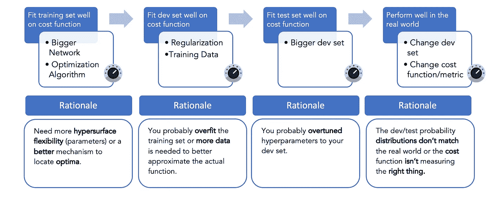
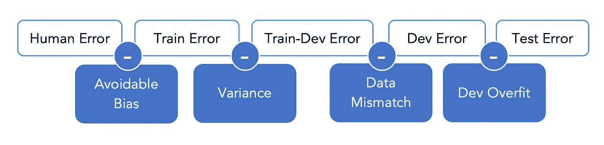
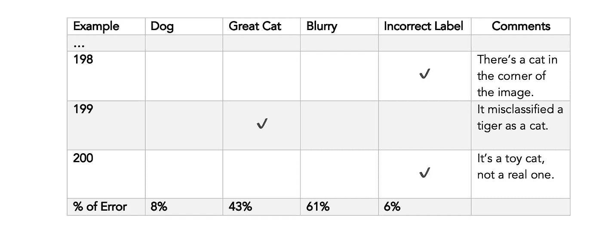
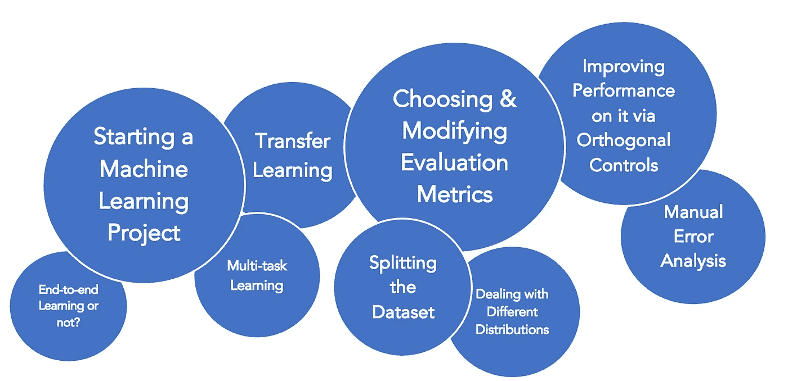

# 机器学习项目的战略管理

> 原文：<https://towardsdatascience.com/strategic-management-of-machine-learning-projects-dacefe74a08>

## 在你监管你的下一个机器学习项目之前，记住 12 条重要的指导方针

在这个故事中，我们将踏上探索 12 条准则的旅程，这些准则有效地总结了吴恩达关于**机器学习策略**的课程，即所谓的“*构建机器学习项目*”。本课程涵盖了许多信息，这些信息在从任何其他来源学习该主题时经常被忽略，但对于让您的机器学习系统尽可能高效快速地工作来说，这些信息是非常重要的。在这个故事中，我们将这些信息映射到一组指导方针，这些指导方针将帮助你在管理机器学习项目时做出正确的决定，并提前回答你在这个过程中可能会想到的许多问题。

无论你决定把这个故事看作是从这门课中学到的知识的概要，还是仅仅是课堂笔记，它都有可能成功。准备好你的咖啡、笔记本和铅笔，让我们开始行动吧。

照片由[弗雷迪·卡斯楚](https://unsplash.com/@readysetfreddy)在 [Unsplash](https://unsplash.com?utm_source=medium&utm_medium=referral) 拍摄

## 1.寻找正交控制

想象一下，你正在驾驶一辆除了标准方向盘和油门/刹车踏板之外还有两个旋钮的汽车，这两个旋钮也控制车轮的角度和速度，这样每个旋钮中的每个单位角度变化都对应于汽车转向的“a 单位”变化和汽车速度的“b 单位”,这两个旋钮中的每个都固定了一些“a”和“b”。这难道不是一个可怕的特征吗？答案是肯定的。即使代数上每一种可能的转向和速度都可以通过两个旋钮来实现。

但是这和机器学习有什么关系呢？在 ML 项目中，我们希望控制模型的能力，而不是转向和速度，以适应成本函数上的每个训练集、开发集、测试集(按此顺序)。问题是，有许多方法来控制“适应训练集”(例如)，其中一些方法可能对“适应开发集”也有影响。这样的方式是你想要避免或至少在考虑时要注意的。

**提前停止** 一种流行的正则化形式——一种防止过度拟合的预防措施，是在训练集和开发集上通过迭代不断观察模型的性能迭代，然后每当开发集的性能开始下降时停止训练模型(尽管训练集的性能仍在提高)。这种控制的问题是，它既影响模型不过度拟合的能力(在开发集上表现良好)，又影响其适当最小化成本函数的能力(在训练集上表现良好)。这就是为什么它不代表控制的正交化形式，这也是为什么你在选择它作为你的第一选择之前要三思而行。

由 Standford.edu[上的](https://stanford.edu/~shervine/teaching/cs-230/cheatsheet-deep-learning-tips-and-tricks)[阿弗森·阿米迪](https://twitter.com/afshinea)和[舍维·阿米迪](https://twitter.com/shervinea)绘制

**控制的正交化形式** 现在让我们来看看你的模型在机器学习项目中将经历的阶段，以及每个阶段的控制(旋钮)的正交化形式的典型例子

有时，您也只需要对架构或超参数的选择进行重大更改——作者的图表

## 2.设置单个数字评估指标

项目的早期步骤之一应该是设置一个数字作为模型的评估指标。它会帮助你迅速判断出你刚刚尝试的想法是比之前的更好还是更差。在简单的情况下，这个数字可能仅仅是模型的精度，但有时它可能是其他的东西或东西的组合。如果您需要复习，这里有一个各种指标的列表[最终可能会达到这个数字。](/metrics-to-evaluate-your-machine-learning-algorithm-f10ba6e38234)

问题是，当他有不止一个我们希望模型擅长的指标时，该怎么办。有几个选项可以考虑:

1-查看是否存在另一个恰当地结合了这两个指标的指标。例如，F1 分数结合了精确度和召回率。否则，如果一个模型比另一个模型有更好的精确度，但是更低的回忆，这两者对你来说都很重要，你可能会也可能不会做出正确的选择。

2-如果它们是相同的度量，但在其他维度上产生不同的值，那么平均值是一个不错的选择。例如，如果一个 cat 应用程序在每个使用它的国家对应不同的精确度，那么你可以让你的 SNEM 是他们的平均值。如果准确性在一些国家比其他国家更重要，那么你也可以考虑加权平均。

3-如果不容易在数学上结合度量标准(例如，时间和准确性或任何两个不同的量)，那么选择其中一个作为优化度量标准，让其余的每个都成为令人满意的度量标准。

**优化&满意度指标** 假设你的模型具有高精度和低运行时间很重要，因为它们是不同的量，仅仅在同一个公式中添加它们是没有意义的。例如，如果你选择你的 **SNEM** 为*精度(%)-0.5 *运行时间(毫秒)*，那么这是一个坏主意，因为这就好像你说精度增加 1%相当于运行时间减少 2 毫秒，所以 70%精度的模型与 100%精度的模型一样好，但慢了 60 毫秒。

相反，您想要做的是让您的评估标准看起来像“最大精度，使运行时间少于 100 毫秒”，这相当于选择精度作为您的优化指标，选择运行时间作为您的满意度指标。一般来说，给定一组不可约的度量标准，模型需要为其做好事，您选择该组中的一个元素作为优化度量标准，其余的每个元素作为令人满意的度量标准(由一些不等式或表达式描述)。

亚历山大·伦敦在 [Unsplash](https://unsplash.com?utm_source=medium&utm_medium=referral) 上拍摄的照片

## 3.如果需要，修改您的指标

假设你正在训练一个模型，它将进入一个应用程序，这个应用程序从互联网上收集猫的图像，然后将它们展示给用户。在这个过程中，它将收集到的每一张图片分类为猫或非猫。为了这个论点，假设在训练之后，你发现你训练的两个模型中的一个错误地分类了许多图像，这些图像不应该出现在用户的屏幕上，而是看起来具有更高的准确性。那么这种情况下应该怎么做呢？Andrew 在讲座中建议的一个选择是回去修改指标。例如，如果它是平均误差，那么考虑把它变成加权平均，更严重地惩罚不需要类型的错误分类图像。这样，您就可以通过一个评估指标来了解两个模型中的哪一个做得更好，该指标可以捕捉到对特定类型图像的低误差和非常低的容忍度。

还记得，当我们讨论正交化时，我们提到如果您的模型在开发/测试集上表现良好，但在现实世界中表现不佳，那么根据具体情况，下一步自然是更改开发/测试集或指标。(例如，一个移动应用程序通过网络上的猫图像进行训练，但现实世界的例子来自手机，因此质量要差得多。)

还要记住，定义指标和做好指标应该是相互正交的。安德鲁用了这样一个比喻:前者相当于放置一个目标，后者相当于找出如何射击它。在你真正把它放好之前，你不应该太担心如何射击它。

艾拉·克里斯滕森在 [Unsplash](https://unsplash.com?utm_source=medium&utm_medium=referral) 上的照片

## 4.让球快速滚动

Andrew 在这里的建议是不要花太多时间试图找到完美的度量和/或开发集，快速设置一些粗略的东西来推动团队的进展，并给出关于接下来可以改进什么的见解才是正确的方法。更正式地说，你应该

1-设置开发/测试集和指标

2-快速构建初始系统

3-研究模型的偏差、方差及其误差来源，以确定后续步骤的优先级。

通常情况下，即使你后来改变了什么，那么根据目前的经验来适应新的环境也比从头开始要好。

明智地使用这个建议。这并不意味着您必须用一个粗略和现成的度量和开发集来开始项目。它敦促你不要在没有度量或开发设置的情况下运行太长时间。如果你在应用领域有丰富的经验，或者手头的问题有大量的文献可以利用，这也不太严格。在这种情况下，您在一次或几次迭代后成功的几率会高得多。

[摄谢里·西尔弗](https://unsplash.com/@sheri_silver?utm_source=medium&utm_medium=referral)在 [Unsplash](https://unsplash.com?utm_source=medium&utm_medium=referral)

## 5.放弃数据集分割的 70/30 和 60/20/20 规则。

您的开发和测试集应该尽可能的大。如果您有 100 万个示例，那么遵循 60/20/20 规则，让每个开发和测试数据都包含 20 万个示例可能是对数据的巨大浪费，而这些数据本可以用于训练集以更好地学习函数。

开发和测试集应该有多大的答案在于它们的目的。开发集的目的是在模型/超参数集之间进行选择，因此它应该足够大以允许这样做，而测试集的目的是评估模型的最终性能，因此也应该足够大以允许这样做。给定一个包含超过 100 万个示例的数据集，您可能会发现 98:1:1 的分割满足了这两个目的。另一方面，如果数据集比这个小得多，那么使用 60:20:20 规则应该就可以了，但是不要盲目地使用它。

还要注意的是，如果您不需要用一个数字来表示您的模型的最终性能，那么您可能会完全放弃测试集。在这种情况下，开发集通常被称为“测试集”。

由[卡尼·贝内迪克托娃](https://unsplash.com/@nika_benedictova?utm_source=medium&utm_medium=referral)在 [Unsplash](https://unsplash.com?utm_source=medium&utm_medium=referral) 拍摄的照片

## 6.断言您的开发和测试集来自真实世界的同一个发行版。

花费几个小时来改进您的模型，直到它在开发环境中表现良好，然后才意识到它在您的测试环境中表现糟糕，或者如果部署后来自真实世界的数据与开发和测试环境中涉及的数据非常不同，这不是很令人失望吗？

为了避免这种情况，有两种情况需要注意:

1-现实世界中的数据来自混合分布。例如，这是一个将在不同国家运行的猫分类器(因此不同品种的猫)。在这种情况下，您可以从所有这些国家随机抽取数据，然后分成开发和测试两部分，这样它们也可以来自混合分布。

2-你有一小部分数据与真实世界中预期的例子相吻合，而另一大部分不是原创的，但可能有所帮助。在这种情况下，让大部分远离开发和测试集，因为这与真实世界中预期的数据分布不匹配，并在它们上面拆分小部分(因此大部分应该进入训练集)。

## 7.当训练集具有不同分布时管理数据不匹配

我们之前讨论过开发/测试发行版应该有相同的发行版，并且应该与真实世界中的例子相匹配。理想情况下，同样的情况应该适用于训练集，但如果不这样的话，就不那么严重了。事实上，Andrew 提到深度学习模型通常对训练集的分布是鲁棒的，但它仍然可能导致所谓的数据不匹配。

假设您知道，与开发和测试集相比，您的训练集遵循不同的分布，那么在度量您的训练、开发和测试错误之后，您可能会得到类似这样的结果

按作者分类的表格

您可能会很快得出存在方差问题的结论，因为训练集具有不同分布的事实意味着某些错误可能只是由于数据不匹配造成的。你训练模型在一个特定的分布下表现良好，然后在另一个分布下测试它。

你应该做的是找出是否是这种情况，也包括一个和 dev 集一样大的 train-dev 集。该集合是通过从训练集合中随机采样数据形成的，它将为您提供一种方式来判断模型是否存在数据不匹配问题。例如，如果您认为

按作者分类的表格

那么这就是一个方差问题(现在是训练偏差和训练误差之间的区别)。同时，如果事实证明

按作者分类的表格

然后是数据不匹配问题(dev 和 train dev 误差之间的差异很大)，您必须处理它。一种方法是简单地从真实世界中为训练集收集更多的数据，如果可行的话，它也匹配正确的分布。否则:

1-手动错误分析，以了解 train 和 dev 装置之间的差异。例如，您可能会从中了解到，dev 集合中的图像更加模糊。

2-尝试使训练集更类似于开发集。一种解决方法是通过人工数据合成。所以你会尝试检查训练数据中的图像，并给它们添加雾(不是手动的)。

在进行人工数据合成时，注意不要让模型过度适应你合成新数据的方式。例如，将每个图像添加到 3 个雾的示例之一来制作新的训练集是一个坏主意。你应该尽可能多的制造雾的例子。否则，你最终得到的合成图像只是由真实世界数据形成的一小部分空间。

由[马库斯·斯皮斯克](https://unsplash.com/@markusspiske?utm_source=medium&utm_medium=referral)在 [Unsplash](https://unsplash.com?utm_source=medium&utm_medium=referral) 拍摄的照片

## 8.采取正确的步骤来提高模型的性能

让我们从给出两个重要的定义开始

**1-贝叶斯最优误差** 这表示理论上的最优性能。没有从 X 到 Y 的映射会产生低于这个数字的误差。这不是零，因为通常有些输入无法通过模型或人类给出的从 X 到 Y 的任何映射来预测。例如，如果这是一个猫分类器，那么你可以认为猫的图像太暗或太模糊，没有办法真正保证图像是一只猫。因为这样的输入只占所有可能输入的一小部分，贝叶斯最优误差通常也太小，但很可能不为零。大多数情况下，也没有办法得出一个精确的值。

**2-人类水平误差** 这被认为是贝叶斯最优误差的代理或近似。它永远不会超越它，但一个模型在人类水平上的性能可能非常接近贝叶斯最优性能。假设我们可以找到与我们的机器学习任务相关的最佳领域专家，那么如果他们在数据上的误差是%,我们称之为人类水平的误差。

一些数据科学家喜欢将人类水平的误差视为人类在数据上的平均误差。也就是说，你可以通过一些普通人运行数据来估算。在这种情况下，人为误差不再是贝叶斯最优误差的代理/近似，这就是为什么 Andrew 更喜欢第一个定义。

此外，对于一些计算机视觉应用。甚至平均人类水平的性能似乎也足够接近贝叶斯最优性能。

**现在请注意模特的表现**

1-一旦超过人类水平，将开始缓慢增长；在这一点上，人类可能不再有效地进一步帮助模型，例如通过提供标记的数据(模型现在在这方面做得更好)或执行错误分析来洞察问题。

2-应充分低于贝叶斯最优性能，以得出偏差问题的结论。安德鲁称它们之间的差异为“可避免的偏差”，通常你只能用它的近似“人类水平的误差”来估计。

3-当有大量数据和/或这不是自然的感知问题(例如，产品推荐、在线广告、贷款审批)时，可能超过人类水平的表现。

4-表示如果训练和偏差集误差之间的差异足够大，则存在方差问题，如果差异足够大，则应优先于偏差问题，反之亦然。

此时，我们也可以回顾一下我们的模型可能面临的不同类型的问题。

作者图表

我们前面已经讨论了如何处理每一个问题。

照片由[奥利·戴尔](https://unsplash.com/@olidale?utm_source=medium&utm_medium=referral)在 [Unsplash](https://unsplash.com?utm_source=medium&utm_medium=referral) 上拍摄

## 9.接受人工错误分析

您的模型在 dev 集合中的错误分类可能主要是由于特定类型的输入。手动检查开发集，看看是否值得花时间。

例如，如果您正在处理一个 cat 分类器，您可能会在准备一个如下所示的表之前，随机地对 dev 集合的一个重要部分进行采样:

按作者分类的表格

这将给你一种感觉，在改进开发集的错误方面，下一步要追求的最佳选择。

例如，在这个例子中，你可以考虑指派一个小组处理模糊的图像，另一个小组处理大猫。同样显而易见的是，有一些例子被错误地标注，但这些只会有助于进一步将误差值减少 6%。一般来说，深度学习模型对训练集中的随机错误相当鲁棒。只要不是特定类型的猫图像每次都被错误地标记(系统误差),你就不应该期望错误的标签会造成很大的误差。更不用说模型认为它正确分类的一些例子也会被错误地标记，如果你决定只纠正那些在开发集中被错误分类的例子，你就会引入偏见。

**注意事项** 您应用于开发集以改善错误的过程也应该应用于测试集，以便它们保持相同的分布。

照片由[卫莱·安德森](https://unsplash.com/@lexianderson?utm_source=medium&utm_medium=referral)在 [Unsplash](https://unsplash.com?utm_source=medium&utm_medium=referral) 拍摄

## 10.先考虑迁移学习

假设你想训练模型 A 去做任务 A，并且存在模型 B 去做任务 B，其中

1-模型 B 采用相同类型的输入(音频，图像，..)

2-模型 B 之前已经被训练过，并且对于任务 B 工作得很好

3-深度学习框架允许您导入模型 B 及其预训练的权重，或者您可以手动完成

那么在修改输出层之后，模型 A 的良好开端是模型 B 本身，使得输出是任务 A 的输出。丢弃最后一层意味着新的输出层将与新的权重矩阵相关联。保持所有层，除了一个冻结(没有反投影)，并重新训练模型，使层收敛到新的权重。这样会让整个模型为你的任务 a 量身定做。

**现在你可能会想:**

除了被替换的顶层/最后一层，我们必须冻结所有层吗？
不可以，一般情况下，你只保持前 L-T 层冻结，其中 T 取决于你拥有的数据量，T≥1。如果你有很多数据，那么你可以设置 T=L，这相当于重新训练整个网络(从预训练的权重开始作为初始化)。这就是所谓的“微调”。另一方面，如果您有少量数据，那么您可能会保持 T=1(仅输出图层),或者如果您认为手头的数据量不是那么少，则将其设置为一个较大的值。

这种方法总是有效吗？
它之所以能够经常工作，是因为早期的层倾向于学习低级特征(例如图像的边缘),并且因为输入是相同的类型，它可能也需要学习这样的特征。通过迁移学习，该模型简单地利用了这些已经被学习的事实，并且集中于学习与通常未冻结的后面层绑定的高级特征。

照片由[费利佩·迪亚斯](https://unsplash.com/@felipediascreator?utm_source=medium&utm_medium=referral)在 [Unsplash](https://unsplash.com?utm_source=medium&utm_medium=referral) 拍摄

## 11.留意多任务学习

假设你想训练模型 A，B，C 去做任务 A，B，C 等等

1-三个模型采用相同的输入

2-你对每一个的数据量都很相似

3-三个任务可以受益于共享的低级特征(即，它们有些相关)

然后，它可以节省时间和资源，而不是建立模型 X，它比它们中的任何一个都大，并且每个分类任务都有一个输出节点，然后将问题视为多标签分类(通常)。这种模型将在结合 A、B、c 的数据的基础上进行训练。

杰森·登特在 [Unsplash](https://unsplash.com?utm_source=medium&utm_medium=referral) 上拍摄的照片

## 12.在特征工程和端到端学习之间做出选择

在 CNN 出现之前，像图像分类这样的任务需要大量的图像处理来提取有效概括图像的特征，以便当这些特征被输入到 FFNN 时，模型能够学习如何在两个类别之间进行分类。

但是现在我们有了 CNN，他们可以端到端地完成提取特征和分类的全部任务。这也适用于 NLP 和语音识别等其他应用，并且是最近几年深度学习的趋势。

端到端学习的问题是需要大量数据(以便从中获得足够的洞察力)，但反过来不需要领域知识或手工设计功能。所以总而言之:

按作者分类的表格

还有一个中间地带。有时，您可以将一个端到端的模型一分为二，并在中间引入一个手工设计的组件，该组件提取一些特性或进行一些处理，以使整个系统变得更好。例如，你可能会发现，当发现图像中有人时，在开始面部识别任务之前，有一个手工设计的组件裁剪到人的面部，这种模型比完全端到端的系统更好地实现了面部识别系统。

万岁！你已经完成了故事的结尾。为了总结一切，这里有一个图表，它结合了我们在这个故事中讨论的所有主题，您可能需要在下次从事机器学习项目时考虑这些主题。花几秒钟来确认你现在对所有这些有了更多的了解！

作者图表

我们的故事到此结束。如果你喜欢它，并希望看到更多这样的故事，那么不要忘记给它一些掌声:)。下次见，再见。