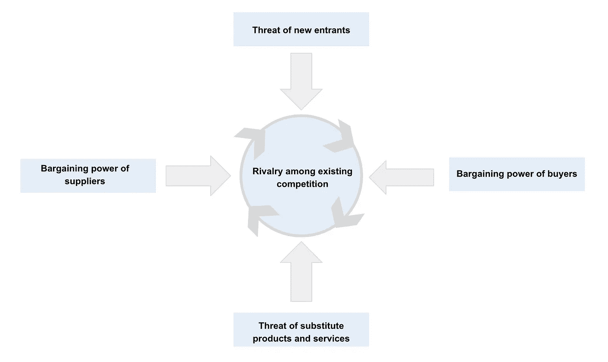

# 数据科学家战略速成班

> 原文：<https://towardsdatascience.com/strategy-crash-course-for-data-scientists-5fcdaf0ea24b>

## 作为一名数据科学家(或有抱负的数据科学家)，你为什么要学习战略管理？

数据科学涵盖了广泛的技术主题。**你的大部分注意力应该放在技术领域**；然而，学习战略管理和发展战略思维将为你提供竞争优势。

数据和数据科学能力是许多公司的战略资产，充分利用数据的能力需要战略知识。许多公司(除了大科技和其他先进公司)仍在努力制定他们的数据战略和数据科学能力。学习战略将帮助你将数据科学、机器学习或其他人工智能应用与公司的战略联系起来。它允许您将洞察从数据转化为公司或特定产品的可操作战略计划。

获得战略知识的另一个好处是能够选择要解决的商业问题。它有助于你反思权衡和优先考虑问题。

> “战略的本质是选择不做什么。没有权衡，就没有选择的必要，也就没有战略的必要。”—迈克·E·波特

除了有价值的数据科学技能之外，带来推动公司战略方向的能力无疑会让你成为公司的宝贵资产。

**快速提示:**战略管理是一个庞大的课题，有许多概念和框架。在这篇文章中，我谈到了我在战略管理课上学到的一些概念和框架，这些概念和框架有助于我进行更具战略性的思考。如果我想在另一篇文章中更深入地研究什么，请在评论中留下任何反馈。

**我们开始吧！:)**

图片来源:[亚历山大·米尔斯](https://unsplash.com/@alexandermils)在 [Unsplash](https://unsplash.com/photos/aASWYaw-3HI)

# 什么是战略？

战略是帮助公司获得可持续竞争优势的一系列活动。战略需要权衡，它是关于创造一个有价值和差异化的位置。公司创造价值的活动应该相互加强，形成反馈回路。

## **战略的高层驱动者**

定义和推动战略的第一步是审视公司的使命、愿景、价值观和目标。

*   **使命:**一个公司的使命宣言就是公司希望达到的目标。它定义了一个公司所处的行业，理想情况下应该定义它的战略。
*   **愿景:**愿景宣言是公司未来希望达到的目标。这是一个令人振奋的声明。
*   价值观:公司的价值观是公司的核心信念。它有助于建立公司的文化。
*   **宗旨:**宗旨宣言是公司存在的理由。

## **不同层次的策略**

还有不同层次的策略。下面，我将简要描述不同的级别:

1.  **公司层面战略:**公司战略处于最高层面。这一层次的战略本质上是试图回答这样一个问题:“我们应该在哪里竞争？”这一层次的重点是全公司范围的，与进入市场、与其他公司整合、多样化等相关。
2.  **业务层面战略:**下一个层面的战略发生在业务层面，是关于如何为公司创造竞争优势。这就是竞争发生的地方，被问到的问题是“我们应该如何竞争？”
3.  **职能层面战略:**最后，职能层面战略是关于一个公司为提高效率，实现契合而采取的活动。

# 外部分析

外部分析包括行业分析和宏观环境因素。对竞争结构、行业动态和宏观经济因素的良好理解将使您能够确定机会并为威胁做好准备。

## 经济学

经济学基础知识有助于理解不同战略变量之间的关系，如客户的支付意愿、定价和成本。理解经济学有助于各种重要的决策，例如目标市场、获得竞争优势的方式以及公司的组织结构等等。虽然这不是对经济学的深入探究，但了解一些基础知识是有帮助的，如价格弹性、固定成本与边际成本、供给与需求等。

## 波特的五种力量

迈克·E·波特的行业竞争力框架有助于在行业层面分析盈利能力、机会和威胁。

*   **新进入者的威胁:**新的竞争者自然进入有利可图的市场，限制了行业利润潜力。低进入壁垒会导致各种问题，如缺乏规模经济，低转换成本，低客户忠诚度。
*   **买方的议价能力:**买方的议价能力高可能导致对更低价格、更高质量产品或更好服务的需求。
*   **供应商的议价能力:**供应商的高议价能力可以通过高转换成本、供应商集中度的提高以及供应商提高价格或限制质量的能力来限制行业利润。
*   **替代产品和服务的威胁:**替代品让顾客很容易地更换产品。一个行业的产品有很多替代品会限制行业的盈利能力，因为转换成本很低。
*   **现有竞争对手之间的竞争:**竞争对手之间的激烈竞争会导致价格战、低行业增长率和低转换成本。

有很多关于这个框架的信息，所以我不会在本文中深入探讨。然而，这是一个很好的框架，让你了解这个行业正在发生什么。一旦发现机会或威胁，您就可以定制数据科学解决方案来应对它们。你可以在这里了解更多关于波特的五种力量[。](https://www.investopedia.com/terms/p/porter.asp)

现在让我们深入内部分析。

# 内部分析

内部分析包括查看公司的商业模式、核心竞争力、有价值的资源和价值链。还有其他框架，我将在“附加资源”一节中添加链接。

## 商业模式和核心竞争力

公司的商业模式就是公司如何赚钱。了解你所在公司的商业模式、价值主张和核心竞争力，将有助于你更好地解决直接影响收入的问题。有这么多不同种类的商业模式，了解它们真的很有趣。对于数据科学相关的商业模式的理解，我推荐这本书，[精益分析](https://leananalyticsbook.com/)。这本书描述了六种不同的商业模式原型和度量标准，应该针对每种情况进行衡量。

除了对商业模式有深刻的理解，还需要知道公司的核心竞争力(公司做得最好的是什么)。公司的核心竞争力是公司资源和能力的组合。

## 基于资源的观点

资源基础观来自 HBR 的文章[《资源上的竞争》](https://www.cbsnews.com/news/competing-on-resources/)，陈述了具有战略价值的资源的五个特征。

*   难以复制
*   慢慢贬值
*   价值由公司控制
*   不容易被替代
*   优于竞争对手

在评估公司相对于市场的资源时，记住这个框架是很好的。

## 价值链

我们将探讨的最后一个与内部分析相关的主题是公司的价值链。公司的价值链是创造产品/服务的步骤/活动。价值链包括主要活动和次要活动。仔细检查每项活动有助于发现降低成本或区别于竞争对手的机会。作为一名数据科学家，了解公司价值链的不同方面将有助于确定需要优化和改进的领域。您可以在此了解有关价值链[的更多信息。](https://online.hbs.edu/blog/post/what-is-value-chain-analysis#:~:text=Understanding%20the%20Value%20Chain,sales%2C%20and%20everything%20in%20between.)

在制定公司的当前战略时，会评估外部和内部因素。对外部和内部正在发生的事情有一个坚实的理解将允许你获得领域的专业技能和知识，以进行更有针对性的分析。当你进入数据科学领域时，业务知识是你应该在工作中学习的东西。分析行业和公司将帮助你以结构化的方式获得知识。

最后，在提出建议之前，您还应该权衡做出特定决定的利弊。作为一名金融行业的数据科学家，我注意到，对正在发生的事情有一个很好的理解，并能够根据见解推荐可行的步骤，也有助于获得业务利益相关方的信任。

虽然这篇文章并没有囊括所有的战略框架和概念，但是它是一个开始更具战略性地思考的好方法。如果你想了解更多关于战略管理的知识，我在下面提供了一些额外的资源。

## 额外资源

*   [策略:回归基础(Youtube 讲座)](https://www.youtube.com/watch?v=gR8WN6AeeBM&t=123s)
*   [产业生命周期](https://corporatefinanceinstitute.com/resources/knowledge/strategy/industry-life-cycle/)
*   [战略管理——含义和重要概念](https://www.managementstudyguide.com/strategic-management.htm)
*   [商业模式](https://www.investopedia.com/terms/b/businessmodel.asp)