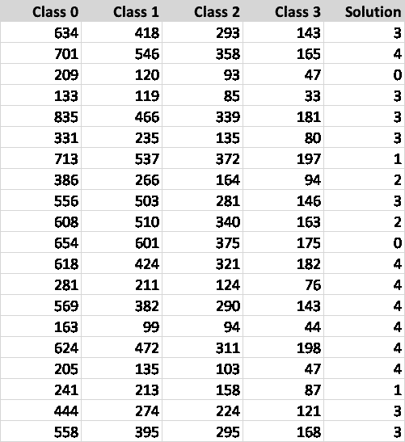
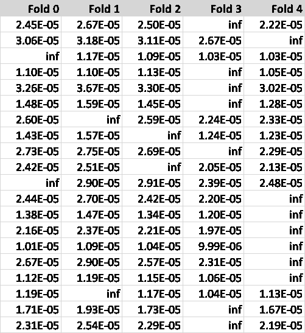

# 分组数据集上的分层 K-Fold 交叉验证

> 原文：<https://towardsdatascience.com/stratified-k-fold-cross-validation-on-grouped-datasets-b3bca8f0f53e>

## 本文解释了如何使用优化对分组数据集执行分层 K-Fold 交叉验证

尼古拉斯·孔德在 [Unsplash](https://unsplash.com?utm_source=medium&utm_medium=referral) 上的照片

交叉验证是一种常见的重采样技术，用于从数据集中获取更多里程。该过程包括从原始数据集中提取重复的独立样本，并将它们拟合到所需的模型。交叉验证有助于模型选择，因为它提供了比[保持方法](https://en.wikipedia.org/wiki/Cross-validation_(statistics)#Holdout_method)更好的泛化性能估计。重采样过程可确保我们从整个数据集的多样性中获益，尤其是当数据集的大小处于较小范围时。

最流行的交叉验证方法之一是将整个数据集平均分成 *K* 组或折叠。它被恰当地命名为“ [K 倍交叉验证](https://en.wikipedia.org/wiki/Cross-validation_(statistics))”

# k 倍交叉验证

为了使用 K-Fold 交叉验证，我们将源数据集分成 K 个分区。我们用 *K-1* 作为训练集，剩下的一个进行验证。该过程运行 *K* 次，在最后，我们取 *K* 个学习指标的平均值。自然地，验证数据集在每个周期循环，我们在 *K* 次运行中平均模型性能指标。下面的图 1 提供了该流程如何工作的示意图。

**图 1** —上图描绘了五重交叉验证的过程。拟合模型时，每一行都代表训练数据集(蓝色)和验证数据集(橙色)之间的拆分。我们通常通过运行的平均值来估计最终的性能指标。(图片来源:作者)

我们可以将这一过程扩展到分层数据集的情况。在这些数据集中，我们可能希望在每个文件夹中保持相同比例的类，这样学习过程就不会出现偏差。这里，我们可以考虑分类目标的类型以及训练数据本身的任何底层类别。如果我们取一个人类样本，有理由期望所有的褶皱应该具有相同的人口分布(想想直方图年龄等级)。您可以在 [Scikit-Learn](https://scikit-learn.org/stable/modules/generated/sklearn.model_selection.StratifiedKFold.html) Python 包中找到对分层 K-Fold 交叉验证的支持。

这篇文章是[上一篇](/stratified-splitting-of-grouped-datasets-using-optimization-bdc12fb6e691)的后续，在那篇文章中，我设计了一种方法，使用离散优化将*分组的*数据集分层划分为训练和验证数据集。我邀请你把它作为对这里介绍的材料的介绍来阅读，在这里我把这个概念扩展到了 [K 倍交叉验证](https://en.wikipedia.org/wiki/Cross-validation_%28statistics%29)。

  

# 分组数据集

分组数据集有一个额外的结构层，即客观分组标准。每个数据组都作为一个逻辑单元运行，我们不能将它们分割开来。

更具体地说，让我们想象一个预测性维护用例，其中数据集由为每件设备获取的远程信息处理数据的时间序列组成。当开发一个模型来预测即将发生的故障时，您可以选择不在褶皱中分割设备的每个时间序列，而是将它们完整地保留在褶皱中。这种方法的优点是避免了潜在的泄漏问题，但使拆分过程有点困难。

在前面提到的文章中，我处理了一个简单的二进制分割。这里的挑战是将这一过程推广到 K 倍分裂。在继续之前，请注意 [Scikit-Learn](https://scikit-learn.org/stable/index.html) Python 包通过 [StratifiedGroupKFold](https://scikit-learn.org/stable/modules/generated/sklearn.model_selection.StratifiedGroupKFold.html) 函数提供了对该特性的支持。尽管如此，根据文档，这个函数执行一个贪婪的赋值。我们可以利用优化算法更进一步。和上一篇文章一样，这是离散优化的一个典型例子。我们必须选择群体，以确保在褶皱中平均分割，并保证所有阶层的分层。具体来说，我们必须保证每个折叠都有大约 20%的原始数据用于五次交叉验证。每个折叠还必须具有与原始数据集大致相同的分层。

我们可以把这个问题看作是上一篇文章的概括，看作是双重交叉验证。我们必须做的第一个改变是对解决方案模型的简单修改。在二进制数组中， *true* 值表示验证项， *false* 表示训练，我们使用一个包含每个组的折叠指数的整数数组。第二个变化在于搜索空间表示。

# 问题模型

数据集的 K 路分割的问题模型与我在上一篇文章中提出的问题模型非常相似。这里，我没有使用布尔数组来表示解决方案，而是使用了一个整数数组，其中包含每个组被分配到的索引。**下图 2** 显示了典型问题模型*样本*和建议的解决方案。我从一个有 500 个组的大型数据集中抽取了这个样本。

**图 2** —我们将问题建模为一个数组，其中每行包含组计数，列反映类计数。解决方案模型是一个包含折叠指数的简单整数数组。上表是一个 500 组问题的示例。(图片来源:作者)

问题模型反映在前四列，对应于类计数。每行代表一个组，计数按类细分。水平求和产生组计数，而列求和产生类计数。请注意，解决方案列包含针对 5 重问题的 0 到 4 之间的每个组的建议指数。

解决这个优化问题需要找到一个兼顾折叠和类别比例的分割。我们使用成本函数来衡量解决方案的适用性。

# 成本函数

成本函数衡量解决方案与最佳方案的差距，最佳方案是在每个折叠中具有相同的类别比例，保证群组保持在一起，并且折叠具有所需的大小。对于一个 5 折的问题，每个折应该包含 20%的总数据点。**下图 3** 展示了成本函数的实现。

**图 3** —上面的函数实现了单个解决方案的成本计算器。(图片来源:作者)

成本函数遍历所有折叠，计算每个折叠的比例与目标之间的差异(第 16 行)。然后，它遍历 fold 的类，并计算它们的比例和现有类比例之间的差异(第 20 行)。最终成本是所有这些平方差的总和，完美的解决方案应该是零成本。

我们可以使用具有成本函数的专用数据结构来搜索最佳分区。

# 搜索空间

寻找这个问题的最佳解决方案包括在搜索空间中迭代。这里，我们将搜索空间实现为矩阵，问题的折叠作为列，组作为行，直接对应于问题矩阵的行。搜索空间矩阵的每一行包含当前解决方案的*无穷大*或者将解决方案移动到相应文件夹的成本。

**图 4** —上图显示了一个典型的搜索空间矩阵。(图片来源:作者)

搜索空间的构建非常简单。我们从最后生成的解决方案开始，将所有组中的*无穷大*值放置在相应的选定折叠处。我们计算所有其他折叠*的解决方案成本，就像*该特定折叠属于该解决方案一样。考虑上面的图 4 中的**，第一行和第一列的值是使用成本函数计算成本的结果，就好像解决方案包含第一组的第一个折叠一样。**

**下面的图 5** 显示了根据问题定义和最近已知的解决方案生成搜索空间的简单代码。

**图 5** —上述函数通过计算每组所有可能备选方案的成本来生成搜索空间。使用无穷大值关系到我们如何选择下一个解。(图片来源:作者)

正如您所看到的，这是一个非常简单的函数，它用相应的解决方案成本填充整个搜索空间矩阵，除了当前的解决方案，它使用 *infinity* 值(下面解释)。

# 搜索

我们现在把注意力转向搜索过程。注意，搜索空间结构有助于一个简单的搜索策略——排序。在搜索过程的每次迭代中，我们在搜索空间矩阵中寻找最小的条目，并使用其坐标(组和类)作为对当前解的以下改变。我们使用搜索空间中最小条目的坐标来更新解向量。这就是为什么最近的解决方案条目标有*无穷大*值的原因——它确保算法在搜索期间不会使用这些条目。**下图 6** 显示了实现主解决方案搜索循环的功能。

**图 6** —我们使用上面的函数寻找一个解决方案。它首先建立一个解决方案历史，并使用贪婪过程生成一个初始解决方案。搜索功能为每个循环生成一个新的空间，并使用简单的排序程序和解决方案历史来确定下一步行动。如果新解决方案的成本低于之前的最佳成本，该函数会将新解决方案记录为现任(目前为止的最佳)解决方案，并使用其成本作为最低分数。当成本低于给定值时，搜索过程结束。(图片来源:作者)

如上所述，搜索最佳解决方案的功能从生成初始候选开始。该过程使用贪婪算法来满足折叠比例要求，并使用该解决方案作为初始搜索步骤。**下面的图 7** 显示了生成初始解决方案的代码。

**图 7** —生成初始解有三个选项，如上图。默认选项使用贪婪方法来满足折叠比例限制。第二个选项使用随机分配，而最后一个选项只是将所有组分配给 fold zero。(图片来源:作者)

在生成对应于最后一个解的新搜索空间之后，搜索算法选择优化过程中的下一步。图 8 中描绘的函数显示了该过程的工作原理。

**图 8** —我们简单地通过收集搜索空间的排序索引来选择下一步。然后，选择函数遍历移动候选项，不包括生成已访问解决方案的移动候选项。(图片来源:作者)

请注意我们如何使用历史记录集来剔除已经生成的解决方案。

## 终止标准

最后，让我们看看搜索算法的终止标准。我们可以使用两个参数来控制算法的搜索范围:最小允许成本和最大重试次数。顾名思义，最小成本是解决方案成本的目标值，低于该值，搜索将停止。

每当搜索算法循环并且不能产生更好的解决方案时，它增加重试计数器。最大重试次数参数限制了算法在失败并报告最后一个最佳解决方案(现任方案)之前将执行的连续重试次数。

# 运转

您可以从配套的 [GitHub 库](https://github.com/joaofig/strat-group-split)运行本文的代码。你可以运行 [Jupyter 笔记本](https://github.com/joaofig/strat-group-split/blob/main/k-fold.ipynb)或者独立的 [Python 脚本](https://github.com/joaofig/strat-group-split/blob/main/k_fold_split.py)。最后，您将得到一个性能报告，显示优化器在匹配折叠和类比例时的表现。

# 结论

在本文中，我们讨论了一种解决将分层分组的数据集分割成 K 个文件夹的方法。我们使用了一个简单的优化算法，该算法使用了一个成本函数和一个显式搜索空间。成本函数计算任何给定解状态和最终期望状态之间的距离。优化器仅仅寻找下一个报告最小成本值并且能够爬山的配置。当现有解决方案的成本低于预设值时，或者当重试次数超过给定的最大值时，搜索终止。

# 资源

[统计学习介绍(statlearning.com)](https://www.statlearning.com/)

[使用 Scikit-Learn、Keras 和 TensorFlow 进行机器实践学习，第二版[图书](oreilly.com)](https://www.oreilly.com/library/view/hands-on-machine-learning/9781492032632/)

[机器学习工程(mlebook.com)](http://www.mlebook.com/wiki/doku.php)

[joaofig/strat-group-split:使用优化(github.com)将分组数据集分层拆分为训练集和验证集的代码](https://github.com/joaofig/strat-group-split)

joo Paulo Figueira 在葡萄牙里斯本的[TB . LX by Daimler Trucks and bus](https://tblx.io/)担任数据科学家。